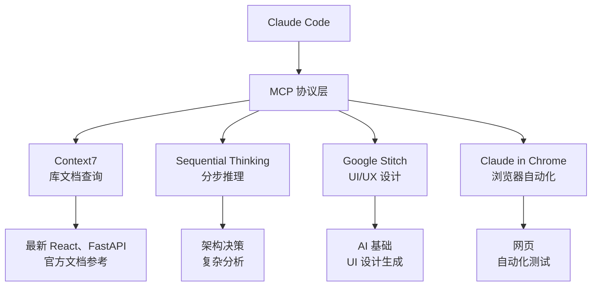
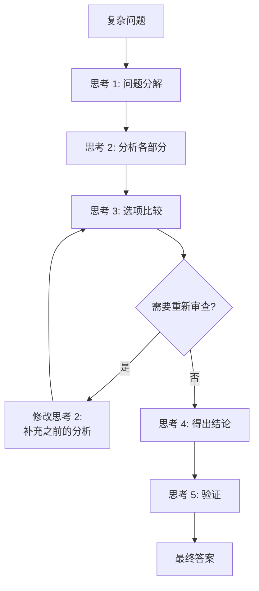

详细介绍如何在 Claude Code 中使用 MCP (Model Context Protocol) 服务器。


**一句话总结**: MCP 是 Claude Code 连接 **外部工具的 USB 端口**。使用 Context7 查询最新文档,使用 Sequential Thinking 分析复杂问题。


## MCP 是什么?

MCP (Model Context Protocol) 是将 **外部工具和服务连接到 Claude Code** 的标准协议。

Claude Code 默认具有文件读/写、终端命令等工具。通过 MCP 可以扩展这些工具集,添加库文档查询、知识图谱存储、分步推理等功能。



## MoAI 中使用的 MCP 服务器

### MCP 服务器列表

| MCP 服务器 | 用途 | 工具 | 激活方式 |
|----------|------|------|--------|
| **Context7** | 实时查询库文档 | `resolve-library-id`, `get-library-docs` | `.mcp.json` |
| **Sequential Thinking** | 分步推理、UltraThink | `sequentialthinking` | `.mcp.json` |
| **Google Stitch** | AI 基础 UI/UX 设计生成 ([详细指南](/advanced/stitch-guide)) | `generate_screen`, `extract_context` 等 | `.mcp.json` |
| **Claude in Chrome** | 浏览器自动化 | `navigate`, `screenshot` 等 | `.mcp.json` |

## Context7 使用方法

Context7 是 **实时查询库官方文档**的 MCP 服务器。

### 为什么需要?

Claude Code 的训练数据只包含特定时间点之前的信息。使用 Context7 可以实时参考 **最新版本的官方文档**,生成准确的代码。

| 情况 | 没有 Context7 | 使用 Context7 |
|------|---------------|---------------|
| React 19 新功能 | 训练数据中可能不存在 | 参考最新官方文档 |
| Next.js 16 配置 | 可能使用旧版本模式 | 应用当前版本模式 |
| FastAPI 最新 API | 可能使用旧语法 | 应用最新语法 |

### 使用方法

Context7 分 2 个阶段运行。

**第 1 阶段: 查询库 ID**

```bash
# Claude Code 内部调用
> 参考 React 的最新文档编写代码

# Context7 执行的工作
# mcp__context7__resolve-library-id("react")
# → 库 ID: /facebook/react
```

**第 2 阶段: 文档搜索**

```bash
# 搜索特定主题的文档
# mcp__context7__get-library-docs("/facebook/react", "useEffect cleanup")
# → 从 React 官方文档返回 useEffect 清理函数相关内容
```

### 实战使用场景

```bash
# 场景: Next.js 16 App Router 配置
> 使用 Next.js 16 配置项目

# Claude Code 内部运行:
# 1. 使用 Context7 查询 Next.js 最新文档
# 2. 确认 App Router 配置模式
# 3. 创建最新配置文件
# 4. 应用官方推荐设置
```

### 支持的库示例

| 分类 | 库 |
|------|-----------|
| 前端 | React, Next.js, Vue, Svelte, Angular |
| 后端 | FastAPI, Django, Express, NestJS, Spring |
| 数据库 | PostgreSQL, MongoDB, Redis, Prisma |
| 测试 | pytest, Jest, Vitest, Playwright |
| 基础设施 | Docker, Kubernetes, Terraform |
| 其他 | TypeScript, Tailwind CSS, shadcn/ui |

## Sequential Thinking (UltraThink)

Sequential Thinking 是 **分步分析复杂问题**的 MCP 服务器。

### 一般思考 vs Sequential Thinking

| 项目 | 一般思考 | Sequential Thinking |
|------|-----------|---------------------|
| 分析深度 | 表面 | 深入的分步分析 |
| 问题分解 | 简单 | 结构化分解 |
| 重新思考/修改 | 受限 | 可以修改之前的思考 |
| 分支探索 | 单一路径 | 探索多个路径 |

### UltraThink 模式

使用 `--ultrathink` 标志激活增强分析模式。

```bash
# UltraThink 模式进行架构分析
> 设计认证系统架构 --ultrathink

# Claude Code 使用 Sequential Thinking MCP:
# 1. 将问题分解为子问题
# 2. 逐步分析每个子问题
# 3. 重新审查和修改之前的结论
# 4. 得出最佳解决方案
```

### 激活条件

以下情况会自动激活 Sequential Thinking:

| 情况 | 示例 |
|------|------|
| 复杂问题分解 | "设计微服务架构" |
| 影响 3 个以上文件 | "重构整个认证系统" |
| 技术选择比较 | "JWT vs 会话认证,哪个更好?" |
| 权衡分析 | "在提升性能的同时保持可维护性?" |
| 破坏性变更审查 | "这个 API 变更对现有客户端的影响?" |

### Sequential Thinking 的步骤



## MCP 配置方法

### .mcp.json 配置

MCP 服务器在项目根目录的 `.mcp.json` 文件中配置。

```json
{
  "context7": {
    "command": "npx",
    "args": ["-y", "@anthropic/context7-mcp-server"]
  },
  "sequential-thinking": {
    "command": "npx",
    "args": ["-y", "@anthropic/sequential-thinking-mcp-server"]
  }
}
```

### settings.local.json 中激活

要个人激活特定 MCP 服务器,在 `settings.local.json` 中添加。

```json
{
  "enabledMcpjsonServers": [
    "context7"
  ]
}
```

### settings.json 中允许权限

要使用 MCP 工具,必须在 `permissions.allow` 中注册。

```json
{
  "permissions": {
    "allow": [
      "mcp__context7__resolve-library-id",
      "mcp__context7__get-library-docs",
      "mcp__sequential-thinking__*"
    ]
  }
}
```

## 实战示例

### 在 React 项目中使用 Context7 查询最新文档

```bash
# 1. 用户要求使用 React 19 的新功能
> 使用 React 19 的 use() hook 实现数据获取

# 2. Claude Code 内部运行
# a) 使用 Context7 查询 React 库 ID
#    → resolve-library-id("react") → "/facebook/react"
#
# b) 搜索 React 19 use() 相关文档
#    → get-library-docs("/facebook/react", "use hook data fetching")
#
# c) 基于最新官方文档生成代码
#    → 应用 use() hook 的正确用法
#    → 与 Suspense 边界一起使用
#    → 包含错误边界处理

# 3. 结果: 生成反映最新模式的准确代码
```

### 使用 UltraThink 进行复杂架构决策

```bash
# 需要架构决策的情况
> 分析我们的服务应该使用 JWT 还是会话认证 --ultrathink

# Sequential Thinking 执行的步骤:
# 思考 1: 整理两种方式的基本概念
# 思考 2: 分析我们服务的特性 (SPA、需要支持移动应用)
# 思考 3: 分析 JWT 优缺点
# 思考 4: 分析会话优缺点
# 思考 5: 从安全角度比较
# 思考 6: 从可扩展性角度比较
# 思考 7: 修改之前的思考 - 审查混合方式
# 思考 8: 最终结论及实现策略
```

## 相关文档

- [settings.json 指南](/advanced/settings-json) - MCP 服务器权限配置
- [技能指南](/advanced/skill-guide) - 技能与 MCP 工具的关系
- [代理指南](/advanced/agent-guide) - 代理的 MCP 工具使用
- [CLAUDE.md 指南](/advanced/claude-md-guide) - MCP 相关配置参考
- [Google Stitch 指南](/advanced/stitch-guide) - AI 基础 UI/UX 设计工具详细使用方法


**提示**: Context7 在查询最新库文档时最有用。引入新框架或升级到最新版本时激活 Context7 可以获得准确的代码。

