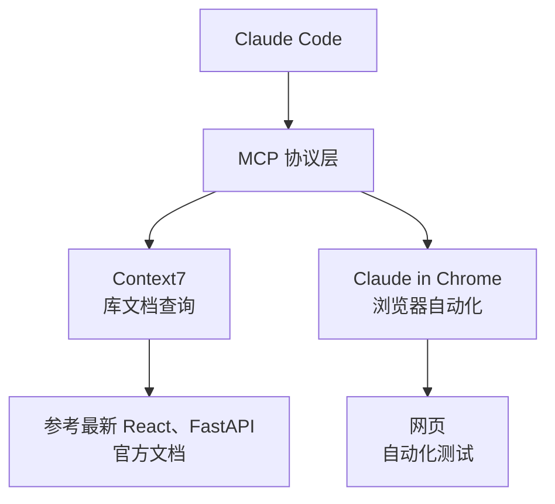

详细介绍如何使用 Claude Code 的 MCP (Model Context Protocol) 服务器。MCP 是 Harness 的工具扩展层 — 不过每连接一个服务器，工具模式 (schema) 都会占用上下文，因此"只连接必要的服务器"这一原则在这里同样是代币经济学的体现。


**一句话总结**：MCP 是给 Claude Code **连接外部工具的 USB 接口**。用 Context7 查询最新文档，用 Adaptive Thinking（通过 `--ultrathink` 关键字）分析复杂问题。


## 什么是 MCP？

MCP (Model Context Protocol) 是为 Claude Code **连接外部工具与服务** 的标准协议。

Claude Code 默认拥有文件读写、终端命令等工具。通过 MCP 可以扩展这套工具集，增加库文档查询、浏览器自动化等能力。


```mermaid
flowchart TD
    CC["Claude Code"] --> MCP_LAYER["MCP 协议层"]

    MCP_LAYER --> C7["Context7<br>库文档查询"]
    MCP_LAYER --> CHROME["Claude in Chrome<br>浏览器自动化"]

    C7 --> C7_OUT["参考最新 React、FastAPI<br>官方文档"]
    CHROME --> CHROME_OUT["网页<br>自动化测试"]
```

## MoAI 使用的 MCP 服务器

### MCP 服务器列表

| MCP 服务器 | 用途 | 工具 | 启用 |
|----------|------|------|--------|
| **Context7** | 实时查询库文档 | `resolve-library-id`, `get-library-docs` | `.mcp.json` |
| **Claude in Chrome** | 浏览器自动化 | `navigate`、`screenshot` 等 | `.mcp.json` |

## Context7 使用方法

Context7 是 **实时查询库官方文档** 的 MCP 服务器。

### 为什么需要它？

Claude Code 的训练数据只包含到某个时间点为止的信息。使用 Context7 可以实时参考 **最新版本的官方文档**，生成准确的代码。用错误的旧版模式生成代码再返工修改的往返，正是最昂贵的代币浪费。

| 情况 | 没有 Context7 | 使用 Context7 |
|------|---------------|---------------|
| React 19 新特性 | 训练数据中可能没有 | 参考最新官方文档 |
| Next.js 16 配置 | 可能使用旧版模式 | 应用当前版本模式 |
| FastAPI 最新 API | 可能使用旧版语法 | 应用最新语法 |

### 使用方法

Context7 分两步运行。

**第 1 步：查询库 ID**

```bash
# Claude Code 内部调用
> 参考 React 的最新文档来编写代码

# Context7 执行的操作
# mcp__context7__resolve-library-id("react")
# → 库 ID: /facebook/react
```

**第 2 步：搜索文档**

```bash
# 搜索特定主题的文档
# mcp__context7__get-library-docs("/facebook/react", "useEffect cleanup")
# → 从 React 官方文档返回 useEffect 清理函数相关内容
```

### 实战应用场景

```bash
# 场景: Next.js 16 App Router 配置
> 用 Next.js 16 帮我配置项目

# Claude Code 内部动作:
# 1. 用 Context7 查询 Next.js 最新文档
# 2. 确认 App Router 配置模式
# 3. 生成最新配置文件
# 4. 反映官方推荐做法
```

### 支持的库示例

| 分类 | 库 |
|------|-----------|
| 前端 | React, Next.js, Vue, Svelte, Angular |
| 后端 | FastAPI, Django, Express, NestJS, Spring |
| 数据库 | PostgreSQL, MongoDB, Redis, Prisma |
| 测试 | pytest, Jest, Vitest, Playwright |
| 基础设施 | Docker, Kubernetes, Terraform |
| 其他 | TypeScript, Tailwind CSS, shadcn/ui |

## 通过 UltraThink 使用 Adaptive Thinking

`--ultrathink` 关键字会启用 Opus 4.7+/4.8 与 Sonnet 4.6 的 **内置推理模式 Adaptive Thinking**。

与早期模型固定的 `budget_tokens` 参数不同，新模型的 Adaptive Thinking **按任务复杂度动态分配推理代币**。推理深度不由固定预算控制，而由 **effort** 参数（`xhigh`、`high`、`medium`、`low`）控制。在"计划要深、实现要省"的代币经济学分配中，这条 effort 轴就是推理深度侧的杠杆。

### 何时使用 `--ultrathink`

使用 `--ultrathink` 关键字会启用面向复杂问题的强化分析模式。

```bash
# 用 UltraThink 做架构分析
> 帮我设计认证系统架构 --ultrathink

# 在 Opus 4.7+/4.8 或 Sonnet 4.6 上:
# 1. 按任务复杂度动态分配推理代币
# 2. 从多个角度探索问题分解
# 3. 系统地评估权衡取舍
# 4. 以经过验证的推理得出最优方案
```

### 触发场景

Adaptive Thinking 适用于以下场景。

| 场景 | 示例 |
|------|------|
| 复杂问题分解 | "帮我设计微服务架构" |
| 影响 3 个以上文件 | "帮我重构整个认证系统" |
| 技术选型比较 | "JWT 与会话认证哪个更好?" |
| 权衡分析 | "如何在提升性能的同时保持可维护性?" |
| 兼容性破坏审查 | "这次 API 变更对既有客户端有什么影响?" |

### 模型兼容性

- **Opus 4.8、Opus 4.7、Sonnet 4.6**：Adaptive Thinking（动态分配推理）
- **Haiku 4.5**：不支持扩展推理（`--ultrathink` 关键字为 no-op）
- **更早的模型**：升级到当前 Claude 模型即可获得深度推理支持

## MCP 配置方法

### .mcp.json 配置

MCP 服务器在项目根目录的 `.mcp.json` 文件中配置。

```json
{
  "context7": {
    "command": "npx",
    "args": ["-y", "@anthropic/context7-mcp-server"]
  }
}
```

### 在 settings.local.json 中启用

要个人启用特定 MCP 服务器，添加到 `settings.local.json`。

```json
{
  "enabledMcpjsonServers": [
    "context7"
  ]
}
```

### 在 settings.json 中放行权限

要使用 MCP 工具，须注册到 `permissions.allow`。

```json
{
  "permissions": {
    "allow": [
      "mcp__context7__resolve-library-id",
      "mcp__context7__get-library-docs"
    ]
  }
}
```

## 实战示例

### 在 React 项目中用 Context7 参考最新文档

```bash
# 1. 用户请求使用 React 19 的新特性
> 用 React 19 的 use() Hook 实现数据获取

# 2. Claude Code 内部动作
# a) 用 Context7 查询 React 库 ID
#    → resolve-library-id("react") → "/facebook/react"
#
# b) 搜索 React 19 use() 相关文档
#    → get-library-docs("/facebook/react", "use hook data fetching")
#
# c) 基于最新官方文档生成代码
#    → 应用 use() Hook 的正确用法
#    → 与 Suspense 边界一起使用
#    → 包含错误边界处理

# 3. 结果: 生成反映最新模式的准确代码
```

### 在复杂架构决策中使用 UltraThink

```bash
# 需要架构决策的情况
> 分析一下我们服务的认证该用 JWT 还是会话 --ultrathink

# Adaptive Thinking 以动态分配的推理:
# 1. 把问题分解为子问题
# 2. 逐步分析每个子问题
# 3. 复查并修正先前结论
# 4. 得出最优方案
```

## 相关文档

- [settings.json 指南](/zh/advanced/settings-json) - MCP 服务器权限配置
- [技能指南](/zh/advanced/skill-guide) - 技能与 MCP 工具的关系
- [智能体指南](/zh/advanced/agent-guide) - 智能体对 MCP 工具的运用
- [CLAUDE.md 指南](/zh/advanced/claude-md-guide) - MCP 相关配置参考
- [Google Stitch 指南](/zh/advanced/stitch-guide) - 基于 AI 的 UI/UX 设计工具详细用法


**提示**：Context7 在参考最新库文档时最为有用。引入新框架或升级到最新版本时启用 Context7，就能得到准确的代码。

