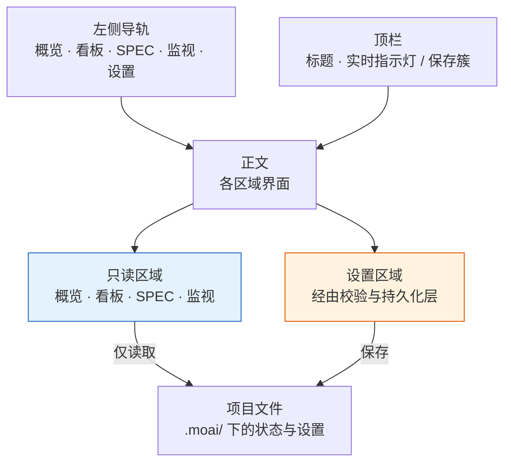

# MoAI Web Console

**MoAI Web Console** 是用 `moai web` 启动的本地运维界面。它把项目的 SPEC 目录、看板链、会话与目标、验证历史集中在一处，并且可以在同一界面里修改设置。浏览器只连接 `127.0.0.1`，既没有数据库，也没有登录。


**一句话概括:** 控制台是把四个观测区域和一个设置区域用左侧导轨组织起来的运维外壳。观测区域只读取，设置区域使用与终端向导相同的校验与持久化层。


## 运维外壳 — 左侧导轨与顶栏

界面分为三块。左侧**导轨**纵向排列五个区域，上方**顶栏**承载当前界面标题与状态，其余是**正文**。无论处在哪个区域，导轨与顶栏都停留在同一位置。

| 区域 | 路由 | 作用 |
|------|------|------|
| 概览（Overview） | `/` | 项目整体摘要 — 统计磁贴、看板链、进行中的 SPEC、注意列表、会话 |
| 看板（Kanban） | `/kanban` | 链会话看板 + SPEC 流水线四列 |
| SPEC（Specs） | `/specs` | SPEC 目录的搜索、筛选与详情，关闭欠账与 MUST-FIX drift |
| 监视（Monitor） | `/monitor` | 会话・目标・验证・史诗四个面板 |
| 设置（Settings） | `/settings` | 配置文件偏好与项目章节的编辑（九个标签页） |

顶栏右侧显示什么取决于区域。四个观测区域显示**实时指示灯**，设置区域显示**保存簇**（变更数量与保存按钮）。上下文标签（`lang` · `model` · `effort` · `dev`）只在设置区域渲染 — 因为它们的用途是在保存前用肉眼确认正在编辑的配置文件的关键取值。

导轨底部聚集了配置文件按钮、项目名称、界面语言选择器和退出按钮。按下配置文件按钮会打开一个浮层，切换、新建、重命名与删除都在这里完成。从任何界面打开的都是同一个浮层，因此整个控制台处理配置文件的入口只有一个。

## 概览 — 项目现在处于什么状态

概览以四个统计磁贴开始：**SPEC**（总数与进行中的数量）、**drift**（MUST-FIX 数量）、**session**（PID 已确认数 / 注册表登记数）、**verify**（最近一次验证结果与键数量）。

其下的**看板链条**用一行显示当前卡片在 `lead → plan → run → review → sync` 五个角色中走到了哪里。若某个角色没有会话，该处会被标记为链条停止的位置。接着是**进行中的 SPEC** 列表、**需要注意**面板（只收集 MUST-FIX drift、失败的验证、停滞的目标与空缺的角色），右侧是**会话**面板。

## 看板 — 两块看板

看板区域上下放置了两块性质不同的看板。

**链会话看板**把五个角色排列为卡片，记录每个角色的会话 id、后端、模型、推理强度、上下文使用量与最后心跳。阶段状态是从心跳**推断**出来的，因此会附带推断标记；模型、推理强度与上下文尚未被记录，因此留空 — 不去填补正是这里的纪律。

**SPEC 流水线**按 status 把 SPEC 排入四列（`draft` · `in-progress` · `implemented` · `completed`）。`superseded` · `archived` · `rejected` 不会出现在这块看板上，只能通过 SPEC 区域的筛选器查看。

## SPEC — 目录与两个警示面板

SPEC 区域顶部是搜索框与 status 筛选标签。紧接着，两个警示面板排在列表**之前**。

- **关闭欠账（Close debt）** — 实现已经落地（`implemented`）但 lifecycle 从未关闭到 `completed` 的 SPEC。数量较多时只展示最近更新的若干条，并同时写明已截断的事实与总数。
- **MUST-FIX drift** — 带有处置命令的 drift。命令**只做复制**。控制台不会在服务端执行任何命令 — 复制之后由你在自己的终端里执行。

两个面板排在列表上方的理由很简单：当目录达到数百行时，放在下方的内容会被挤到界面很靠下的位置，实际上等同于不存在。

列表由 ID、标题、status、Tier、era、更新日期与 drift 各列构成。选中某一行会在右侧展开详情面板，显示文档列表、文件路径与 drift 详情。

## 监视 — 四个观测面板

| 面板 | 读取的内容 |
|------|------------|
| 会话（Sessions） | 会话 id、SPEC、后端、心跳、工作目录 |
| 目标（Goals） | 已装载目标的条件、已进行的轮数、是否停滞、判定 |
| 验证（Verification） | 每个键的近期历史迷你图与是否通过 |
| 史诗（Epics） | `moai epic status` 计算出的各史诗进度 |

## 实时更新 — 只发信号，然后重新取回

观测区域会在文件变化时自行更新。服务端在 `GET /events` 上保持一条 SSE（Server-Sent Events — 服务端向浏览器单向推送事件的标准）流，监视 `.moai/` 之下的变化，并以 250 毫秒为单位合并后发出。

关键在于**事件不携带数据**。服务端只发送「这个区域变了」这一名称，浏览器收到信号后重新取回当前界面，只替换正文。渲染的真实只留在服务端这一处，因此界面与文件不会出现互相矛盾的状态。

| 事件 | 监视对象 |
|------|----------|
| `spec` | `.moai/specs` |
| `session` | `.moai/state` |
| `goal` | `.moai/state/goal` |
| `verify` | `.moai/state/verify` |
| `kanban` | `.moai/state/kanban` |
| `config` | `.moai/config/sections` |

只有 `config` 事件的处理方式不同。若在编辑设置的过程中界面被从底下改动，正在输入的值就会丢失，因此不做刷新，只弹出一条「配置文件已变更」的横幅。

连接断开时不会悄无声息地停止。顶栏指示灯会切换为断开状态，浏览器重连三次失败后降级为 30 秒间隔的轮询。正在轮询这一事实会持续显示在指示灯上。

## 不把不知道的事写成知道的事

控制台恪守的一条纪律体现在界面的各处。

- **会话是否活跃**只把确认进程存活的项提升为活跃。注册表里留有记录但进程可能早已结束，因此未经确认的条目标记为陈旧。
- **阶段状态**是从心跳推断出的值，并把「这是推断」这一事实一并标注。
- **未被记录的值**（各角色的模型、推理强度、上下文使用量）不用看似合理的数值填补，而是留空。
- **空列表**不会就那样空着，而是写明「没有」。否则空面板会被读作「尚未读取」。

## 设置 — 相同的检查，相同的文件

设置区域是控制台里唯一写文件的地方。控制台不设立自己的校验规则，而是调用与终端向导（`moai profile`、`moai update -c`）**相同的校验与持久化层**。这正是从任何一侧修改结果都一致的原因。

在导轨中选择设置后，其下会展开九个标签页的纵向列表。

1. **用户信息（Identity）** — 显示名称与项目级 identity 字段
2. **语言（Language）** — 对话、提交信息、代码注释与文档的语言
3. **LLM** — 权限模式、模型、推理强度
4. **第三方 LLM（3rd Party LLM）** — 按层级的 GLM 模型、按层级的推理强度、GLM API 密钥
5. **工作流（Workflow）** — 执行模式、默认模式、agentic-loop、loop-prevention
6. **Git 与工作树（Git & Worktree）** — `git_strategy.mode`、各配置文件的 `merge_method`、工作树与 branch-guard 开关
7. **审计（Audit）** — 审计模型与各后端的门禁
8. **代理（Agents）** — 各代理的配置文件与模型分配
9. **报告（Report）** — 报告格式与输出偏好

各标签页旁的数字是该标签页渲染的字段数量。存在错误的标签页会以警示标记取代数字，因此从列表本身就能看出该打开哪个标签页。

### 控件的诚实

字段会以匹配取值真实域的控件渲染。bool 字段画成两选项的单选组而非复选框 — 复选框会隐藏当前选择，成对的单选按钮则把它显露出来。`execution_mode` 或 `audit.model` 这类闭合集合使用下拉框或单选组，集合之外的值在保存时被拒绝。只有仓库路径或 API 密钥这类域确实开放的值才保留为自由文本。

### GLM 诚实徽章

推理强度在运行时的传递通道只有一个会话级环境变量，因此按层级填写的推理强度是**仅保存**的。它们会留在配置里，但运行时只读取会话级的值。第三方 LLM 标签页带有一枚标明实际生效来源的徽章，使这一事实成为明示而非暗示。

### 编辑范围

可编辑的范围由单一可信来源确定，控制台只在其中写入。`user` · `language` · `quality` · `git-convention` · `git-strategy` · `llm` 通过 typed 校验路径保存，`workflow` 与 `report` 通过保留文件内注释与行序的 seam 保存。机器与状态章节以及大型策略文件属于排除集，新的章节在被明确登记之前默认拒绝。各章节的键在 [config 章节参考](/zh/advanced/config-sections/) 中说明。

## 安全模型

**仅回环。** 控制台只绑定到 `127.0.0.1`。同一台机器上的其他账户或远程主机都无法访问。

**没有数据库。** 不额外启动 DB。读写的取值全部位于当前项目的 `.moai/` 之下。

**没有认证。** 仅回环是前提，因此没有登录或令牌层。

**不执行命令。** 观测区域拒绝 GET 以外的方法，任何界面都不会在服务端执行命令。SPEC 的 status 迁移也不由控制台完成 — 迁移的所有者是各阶段的管理代理。


仅回环是没有认证的前提。通过反向代理或 `0.0.0.0` 绑定向外暴露的配置不受支持。若需要远程查看，请用 SSH 隧道转发本地端口。


## 四语言界面

界面语言从导轨底部的选择器中选取 **English · 한국어 · 日本語 · 中文** 之一。所选语言会保留在浏览器中，下次打开时从首次渲染起即生效。它与 docs-site 的[四语言文档](/zh/resources/i18n-docs/)使用同一套语言集合，因此可以用同一种语言并排阅读界面与文档。

## 启动与停止

在项目目录中运行 `moai web` 会绑定 `127.0.0.1:3041` 并自动打开浏览器。

| 标志 | 默认值 | 行为 |
|------|--------|------|
| `--port <int>` | `3041` | 要绑定的回环端口 |
| `--no-open` | `false` | 关闭浏览器的自动打开 |
| `--no-reuse` | `false` | 不回收占用端口的陈旧 moai 实例，直接以冲突结束 |

停止方式是在终端按 `Ctrl+C`，或使用导轨底部的退出按钮。详细行为请参阅 [CLI 参考 — moai web](/zh/cli-reference/web/)。

## 相关文档

- [CLI 参考 — moai web](/zh/cli-reference/web/) — 标志与路由的细节
- [看板模式](/zh/advanced/kanban-mode/) — 控制台所绘链条的原始约定
- [config 章节参考](/zh/advanced/config-sections/) — 设置区域处理的键
- [moai epic status](/zh/cli-reference/epic/) — 监视区域史诗面板读取的产物
