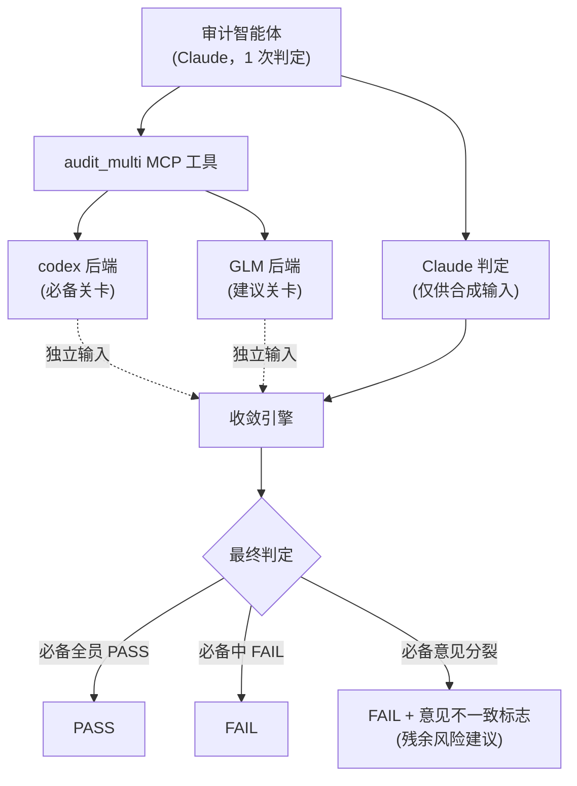
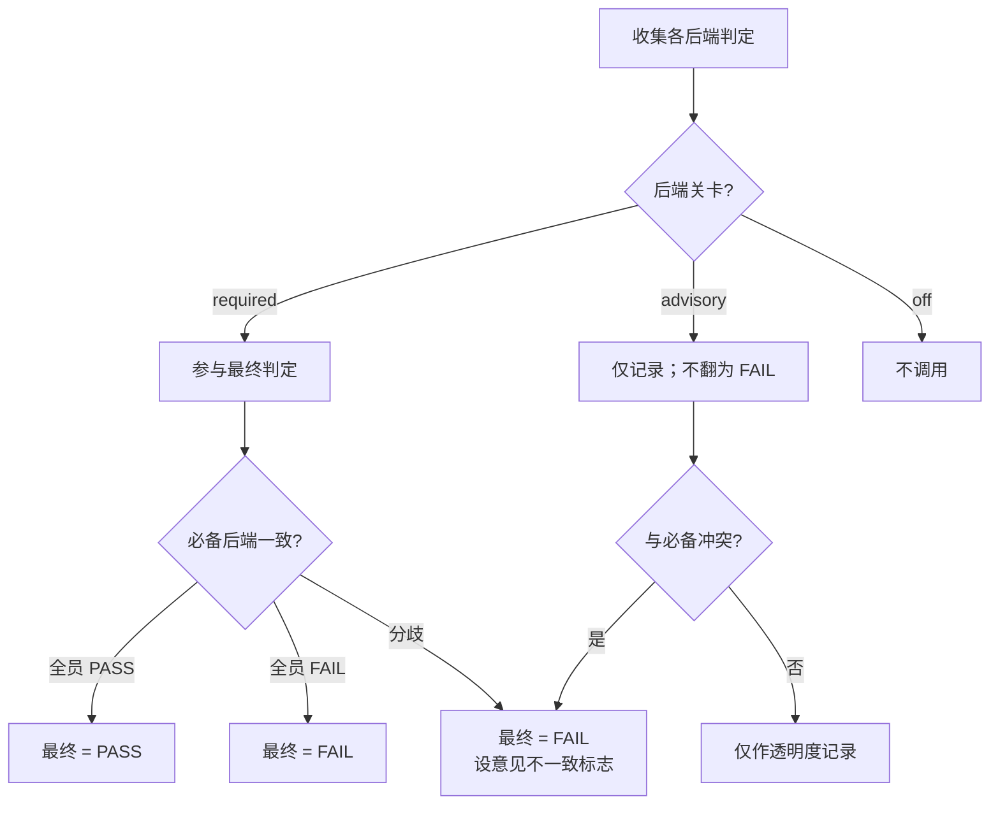




 <strong>所属价值</strong>：代理式线束 · 代理式循环工程


多模型审计收敛（multi-model audit convergence，多个 AI 模型对同一产出交叉验证、合成一份最终判定的工作）是 MoAI-ADK 用来收窄单一模型盲区的审计方式。负责审计的管理者智能体（manager agent，分别承担计划、实现、文档化、审计各阶段的智能体）所下判定，由不同系列的模型独立再审。两份判定一致则信任累加，两份判定分歧则把哪里风险大作为残余风险（residual risk，即便经过验证仍残留的不确定性）显式标出。本页讲为什么需要这种双重验证、收敛按什么规则跑、以及它如何与自主循环相遇。

## 为什么单一模型审计不够

把审计（audit，独立确认产出是否满足标准的阶段）只交给一个模型，该模型的盲区会原样渗入审计结果。某些模型擅长抓特定模式的错误却放过别的模式，某些模型在安全语境上强但对并发缺陷弱。设计报告把这点表述为"Codex 不是更聪明，而是 differently smart（以另一种方式聪明）"——是同一个脉络。训练数据与推理习性不同的模型带着不同的盲点。

问题在于盲点并非随机。一个模型漏掉的错误里有相当一部分是该模型反复漏掉的模式。所以用同一个模型再多验证一次帮助不大。换上不同系列的模型，则两个模型都漏掉的交叉盲区（correlated blind spot，两个以上模型因相同理由一起看不到的错误区域）会大幅收窄。第一个验证者没看到的，被第二个验证者抓到的概率就上去了。

多模型审计正是要在审计设计层面就处理这片交叉盲区。不是把审计多重复一次，而是一次性并行跑结构不同的视线再合拢结果。

## super-review 模式——独立的第二意见

多模型审计的设计骨干是 super-review 模式（super-review pattern，一个模型下的 1 次判定由另一个模型独立再审的双重验证结构）。分三步走。第一，会话内的 Claude 下 1 次分析。第二，codex（OpenAI 系 CLI 工具）、GLM（z.ai 的模型）等第二后端从零开始重看同一产出。第三，编排器把两份判定合成一份最终判定。

这里独立性（independence，2 次验证者不受 1 次验证者判定影响的状态）是关键。把 1 次判定先给 2 次验证者看，2 次验证者就会被那份判定牵着重复同一结论。这样一来验证了两次这点就失去意义。所以 MoAI-ADK 绝不把 Claude 的 1 次分析作为上下文传给 codex 或 GLM。Claude 的判定只在合拢阶段作输入使用，不传给第二后端。这是为了让第二意见真的是第二条意见。

图中虚线表示"各后端不看 Claude 的 1 次分析、以自己的输入下判定"的独立性。Claude 判定只进合成阶段，不混入 codex 与 GLM 的验证路径。

## 三个后端的角色分工

收敛默认处理三类后端（backend，实际执行审计的 AI 模型）。Claude 直接取审计智能体在会话内分析的 1 次判定。没有额外的模型调用，把智能体已做出的结果作为合成输入。codex 由系统调用 codex 二进制验证产出。GLM 直接调用 z.ai API 重审同一产出。

每个后端都有一项配置——审计关卡（audit_gate，决定该后端的判定如何反映到最终结果的设置）。关卡有三种。`required` 是该后端的判定左右最终判定的必备参与者。`advisory` 是判定被记录并作为残余风险上报、但不翻转最终判定的建议参与者。`off` 表示完全不调用该后端。默认配置把 Claude 与 codex 设为必备、GLM 设为建议。把两个必备后端配置成不同系列，这本身就是收窄交叉盲区的装置。

## 收敛算法——意见分歧时

收敛（convergence，把多个后端的判定合成一份最终判定的步骤）遵循既定顺序。第一，必备关卡后端全员 PASS 则最终判定为 PASS。第二，必备关卡后端任一 FAIL 则最终判定为 FAIL。第三，必备关卡之间意见分歧——一个 PASS、一个 FAIL——则最终判定跌到 FAIL，同时点亮意见不一致标志（disagreement_flag，表示必备后端之间判定分歧的标记）。这个标志连同残余风险说明一起，以建议信号出现在编排器的完成报告（Verification Matrix，完成报告的验证表）里。第四，设为建议或 off 的后端绝不把最终判定翻为 FAIL。建议后端的判定出于透明度被记录，只有与必备后端冲突时才加意见不一致标志。

这里一个重要的设计决定是：意见分歧本身不是拦截理由。不造"必备意见分歧"这个新的拦截类别。分歧按"必备中任一 FAIL 即 FAIL"这条保守基本规则以 FAIL 处理，分歧事实作为单独的建议信号上报。规则如此简单，读收敛结果的一方就能一眼看清"为什么 FAIL"。

第二张图展示后端的关卡设置通往最终判定的路径。建议后端仅在冲突时加意见不一致标志，不改判定本身。

## fail-open——缺失的后端不阻断流程

多模型审计遵循 fail-open（fail-open，非必备要素缺失时整体流程仍不阻断的设计原则）。例如把 GLM 后端设为建议关卡时，若 API 未认证或调用失败，该后端的判定按无结果处理，收敛继续在剩余的活跃后端上推进。缺一个建议后端不会让整次审计停下或以错误收尾。

但设为必备关卡的后端则不同。必备后端缺失或返回错误时，其判定按无结果处理，按收敛规则——没有必备后端的 PASS 就出不了 PASS——即必备后端的缺席被保守地偏向 FAIL。这与"设为必备就意味着押上了那份信任"的设置意图一致。

这种 fail-open 身份在自主循环里更重要。一次后端的临时错误不该让整条自主循环停下。所以缺失的后端以"无信息"的标记记录，判定由其余后端接力。

## 与自主循环相遇之处——multi-review-gate

多模型审计走两条路径使用。一是 plan-audit、sync-audit 等既有审计阶段。审计智能体调用 `moai-ref-cross-model-audit` 技能，把会话内的 Claude 判定用 codex 与 GLM 增强，把合拢结果反映到自己的审计判定里。这条路径原样遵循既有技能路由规则，所以不产生新的路由机制。

二是完全自主的目标收敛循环。用 `/moai goal` 声明完成条件、让会话在无人介入下工作到条件满足时，每个回合末运行的 Stop 钩子（Stop hook，每回合末运行的检查点）读取多模型审计结果并发出 ALLOW 或 BLOCK。这道关卡叫 multi-review-gate，带与既有 codex-review-gate 同样的自关卡（self-gate，自行判断本回合是否真需要验证的代码修改的装置）。若无代码修改或是状态报告回合，立即发 ALLOW 以防误拦截。

关键在于意见分歧不会打断自主循环。必备后端分歧时关卡保守地发 BLOCK，但仅建议后端之间的分歧绝不引向 BLOCK。建议级别的意见分歧只作为残余风险建议上报，循环继续跑。这样自主循环的不间断流程与交叉验证的安全网同时存活。

## 小结

多模型审计收敛同时成立三件事。并行跑不同系列的模型以收窄交叉盲区、用清晰的优先级规则合拢判定、把意见分歧当作建议而非拦截以守住 fail-open 身份。1 次判定不暴露给 2 次验证者以保独立性，缺失的后端以无结果处理以不阻断整体流程。而这一切在 plan-audit、sync-audit 等既有审计阶段与完全自主目标循环的同一 MCP 面上运作。不把审计多重复一次，而是再多塞一道视线——这就是多模型审计收敛的核心。
