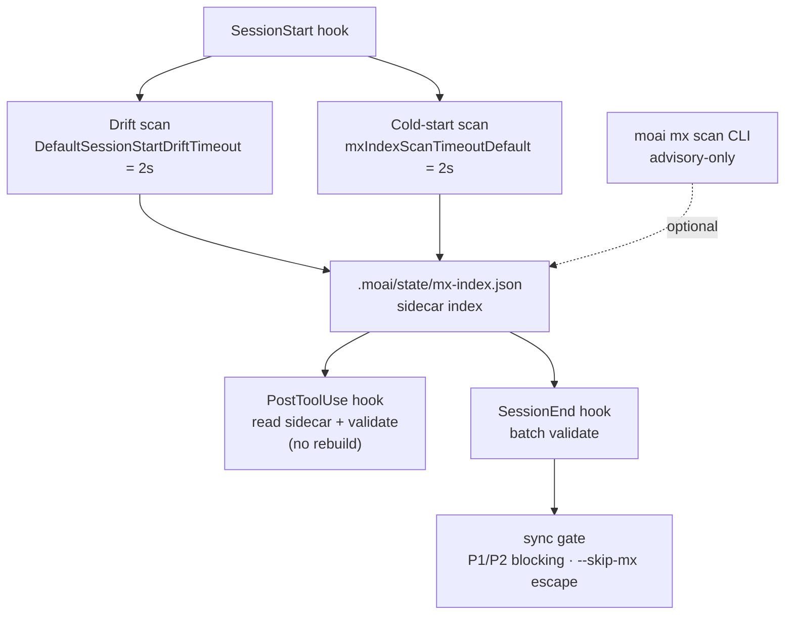

`moai mx` 扫描器读取代码库，生成与 `@MX:` 标签绑定的索引，并在多个触发点执行验证。本文从代码库层面解释隐藏在标签语法背后的四种行为 —— rotRisk 评分、LSP fan-in 引擎选择、CGO 门控的复杂度测量，以及扫描自动化的触发点。标签写法参见 [MX 标签](/zh/advanced/mx-tags)，命令形式参见 [`moai mx`](/zh/utility-commands/moai-mx)。

## rotRisk 评分

`rotRisk` 是仅存在于 `@MX:DEBT` 标签上的字段。扫描器解析 DEBT 标签时总会填入这个字段，其他标签类型没有此字段。

取值取决于是否存在 `@MX:UPGRADE` 子行。

- 没有 `@MX:UPGRADE` 时，`rotRisk` 被设为字符串 `"no-trigger"`。腐化信号不是"眼下就有危险"，而是"一笔没有升级计划的债务"。
- 跟着 `@MX:UPGRADE` 时，`rotRisk` 被初始化为空字符串，进而在 sidecar 中被省略。已被计划升级的债务不再是腐化候选。

 是否存在 `@MX:CEILING` 并非腐化判据。CEILING 只是一份"知道这个界限"的质量备忘，与腐化门控相互独立。腐化门控仅由是否存在 `@MX:UPGRADE` 决定。

`moai mx query --kind DEBT --json` 结果中显示为 `"rotRisk": "no-trigger"` 的条目，正是那些没有升级计划的债务。标签语义可在 [MX 标签 - DEBT](/zh/advanced/mx-tags#debt) 中再次确认。

## LSP fan-in 引擎

`@MX:ANCHOR` 验证是否满足 "fan_in ≥ 3" 阈值时，扫描器以两种方式统计调用次数。

- **LSP 优先**：若存在已激活的语言服务器，则调用 `textDocument/references` 收集精确的引用位置。该结果以 `"lsp"` 记入 sidecar 的 `fan_in_method` 字段。
- **textual 回退**：LSP 不可用时，回退到基于正则的 grep。sidecar 中显示为 `fan_in_method: "textual"`。

默认 non-strict 模式下，LSP 缺失时扫描器会静默回退到 textual。查询结果的 `fan_in_method` 字段公开了这一事实，因此解读结果时必须一并核对。

 要强制使用 LSP，可设置环境变量 `MOAI_MX_QUERY_STRICT=1`。此模式下 LSP 不可用时，扫描器会返回 `LSPRequiredError` 而不回退。适用于 CI 这类准确性比回退更重要的环境。

## CGO 复杂度测量

圈复杂度与 if 分支数由 tree-sitter 测量，而 tree-sitter 依赖 CGO。因此构建标签不同，行为也大不相同。

- **non-CGO 构建**：`//go:build !cgo` 桩文件对所有语言输入返回 `Result{Supported: false}`。这不是回退启发式，而是硬桩 —— non-CGO 构建下任何语言都不支持复杂度测量。
- **CGO 构建**：tree-sitter 被激活，但以下情况结果仍为 `Supported: false` —— 仅搭好脚手架的语言、超过 1 MiB（1,048,576 字节）的文件、解析错误、查询编译错误、未找到函数体。

 `Supported: false` 是静默跳过。扫描器将该文件的复杂度归类为"无法测量"并继续处理下一个文件。不会抛出错误，日志只在 `slog.Debug` 级别记录，不向上传播。

## 扫描自动化触发点

扫描器在五个触发点执行，每个触发点有不同的目的与约束。

1. **显式 CLI**：运行 `moai mx scan` 会扫描整个代码库并重建索引。advisory-only，不阻塞任何流程。
2. **SessionStart 延迟冷启动扫描**：会话开始时在后台运行。大仓库可能耗时较久，因此由 **两个不同的 2 秒上限** 保护 —— `mxIndexScanTimeoutDefault`（冷启动扫描本身的上限）和 `DefaultSessionStartDriftTimeout`（漂移检查的上限）。两者只是恰好同为 2s，并非同一个门控。失败时按 fail-open 处理。
3. **PostToolUse 验证**：文件编辑后读取 sidecar（`.moai/state/mx-index.json`）验证受影响的标签。此触发点不会重建索引。
4. **SessionEnd 批量验证**：会话结束时执行批量验证。
5. **sync 门控**：运行 `/moai sync` 时，P1（exported 函数 fan_in ≥ 3 却缺 ANCHOR）和 P2（是 goroutine 却缺 WARN）为阻塞行为，P3·P4 为 advisory。可用 `--skip-mx` 跳出。

下图展示五个触发点如何以 sidecar 索引为中心串联。图源在四个语言版本中逐字节保持一致 —— 翻译只施加于图周围的文字。

## 后续步骤

- [MX 标签](/zh/advanced/mx-tags) — 各标签类型的语法与子行
- [`moai mx`](/zh/utility-commands/moai-mx) — scan/query/validate 子命令形式
