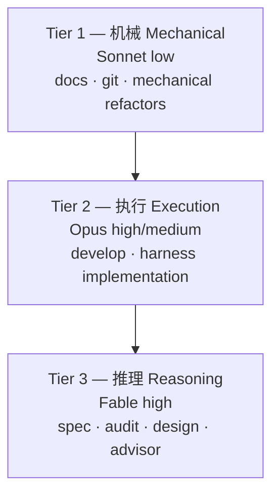

MoAI-ADK v3.0 将 Haiku 从路由模型集合中排除，以三层结构(Sonnet / Opus / Fable)分散工作。此设计基于 DeepSWE 排行榜的实测数据。本页解释为何排除 Haiku、三层如何配置，并区分设计意图与实现行为。

## 为何排除 Haiku

DeepSWE 排行榜(deepswe.datacurve.ai, 113 tasks, 2026-07-09)的核心发现是**"弱模型 + 高 effort = 可用性的敌人"**。在 max effort 下，Sonnet 5 消耗 268 步、214k 输出 token，产生过度的重试循环。

| 模型 [effort] | Pass@1 | 每任务成本 | $/已解决 | token/已解决 | 步数 |
|---|---|---|---|---|---|
| Fable 5 [max] | 70% | $21.63 | $30.9 | 170k | 88 |
| Opus 4.8 [max] | 59% | $13.22 | $22.4 | 229k | 120 |
| Sonnet 5 [max] | 54% | $26.40 | $48.9 | 396k | 268 |

 **单价反转**: Sonnet 的名义单价($3/$15)是 Opus($5/$25)的一半，但每任务成本反转: Opus $13.22 < Sonnet $26.40。因为 Sonnet 消耗 1.6 倍 token、2.2 倍步数。"用便宜模型跑就能省配额"的通念不成立。

在此数据下，将 Haiku 纳入路由会在机械性任务中造成不必要的步数浪费。因此，机械性任务分配 Sonnet low effort 以最小化步数。

## 三层定义

根据任务性质将模型和 effort 分配到 3 个层级。

### Tier 1 — 机械 (Mechanical)

 文档工作、git 操作、机械性重构不需要推理。Sonnet low effort 最小化步数。负责代理: manager-docs、manager-git。

### Tier 2 — 执行 (Execution)

 实现、线束生成在有好的计划时执行难度降低。分配 Opus high(API)或 Sonnet high(订阅)，阻断 max-effort 循环浪费。负责代理: manager-develop、builder-harness。

### Tier 3 — 推理 (Reasoning)

 规划、审计、设计、咨询是决定下游返工(= token 浪费)的阶段。将最高推理模型分配到 Fable high(API)或 Opus high(订阅)。负责代理: manager-spec、plan-auditor、sync-auditor、manager-design、super-advisor。

## DeepSWE 排行榜依据

从排行榜实测得出的四点结论:

1. **Sonnet 5 max 是 Claude 家族中性价比最差的** — 比 Opus 4.8 max 更贵($26.40 vs $13.22)且分数更低(54% vs 59%)。原因是 268 步的过度重试循环。高 effort 不等于高价值。
2. **API 性价比第一是 Opus 4.8** ($22.4/已解决)。质量第一是 Fable 5 (70%)。Fable 的溢价是每已解决 +$8.5。
3. **可用性方面: Fable(170k) < Opus(229k) < Sonnet(396k)** — 订阅周限额基于 token，所以弱模型反而消耗更多配额。
4. **步数 = 速度** — Fable 88 < Opus 120 < Sonnet 268。高层级模型在挂钟时间上也更优。

 **局限说明**: 排行榜没有 Claude 模型的 effort 变体数据(low/medium/high/xhigh — 全是 max)。因此"Sonnet xhigh vs high 质量差"无法直接验证; effort 下调是从(a) Sonnet 5 max 循环浪费实测、(b) Opus 4.8 默认 effort 为 high 的 Anthropic 官方定位、(c) effort 与输出 token 准线性的普遍特性推定的。

## 设计报告 vs 实现

 **REQ-DA-061 诚实性区分**: 本页内容必须明确区分设计阶段与实现行为。

**设计阶段** (`.moai/reports/agent-architecture-redesign-v2-20260709.html`) — v2 架构设计意图。提出三层模型策略原则和 DeepSWE 依据。

**实现行为** (SPEC-MODEL-TIER-PLANTYPE-001, CLOSED) — `ApplyTierProfile` 60 格配置文件执行实际路由。它替换代理 frontmatter 中的 model 和 effort(replace-both)以应用层级配置。详细 60 格矩阵见[plan_type 层级配置](/zh/advanced/plan-type-profiles/)页面。

读者必须能够区分设计意图(本页的 DeepSWE 依据)和实现行为(60 格 ApplyTierProfile)。

## 与线束自我进化的连接

三层架构是线束自我进化的基础。进化循环(观察 → 反思 → 提升)要发挥作用，观察阶段的路由决策必须以正确的 effort 到达正确的模型。自我进化详情见[线束自我进化](/zh/advanced/self-evolving/)页面。

## 下一步

- [plan_type 层级配置](/zh/advanced/plan-type-profiles/) — 60 格配置矩阵 (10 代理 × 3 层级 × 2 plan_type)
- [代币经济学概述](/zh/advanced/tokenomics-overview/) — 四层代币经济学结构的 Layer B 路由
