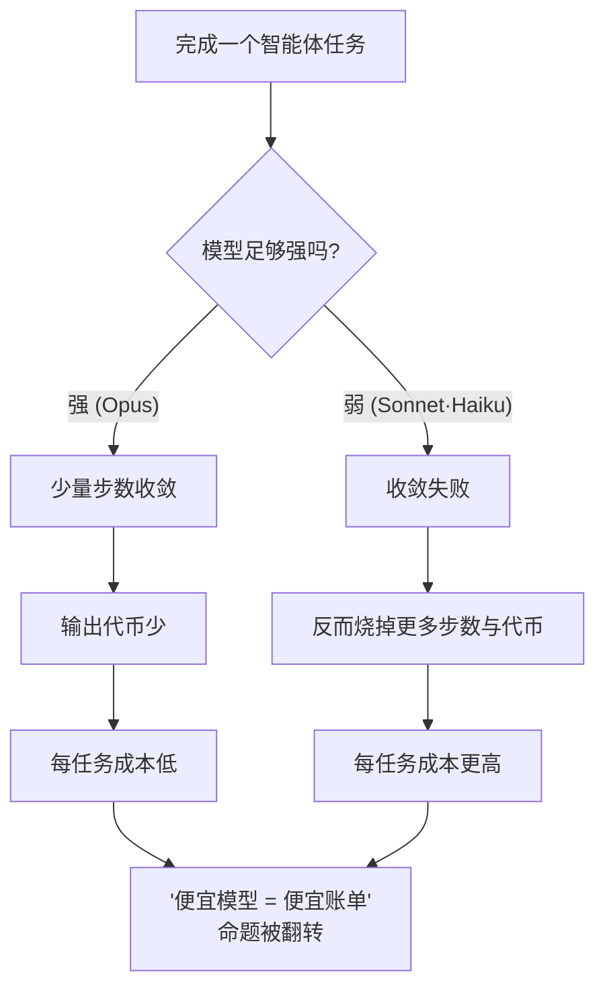
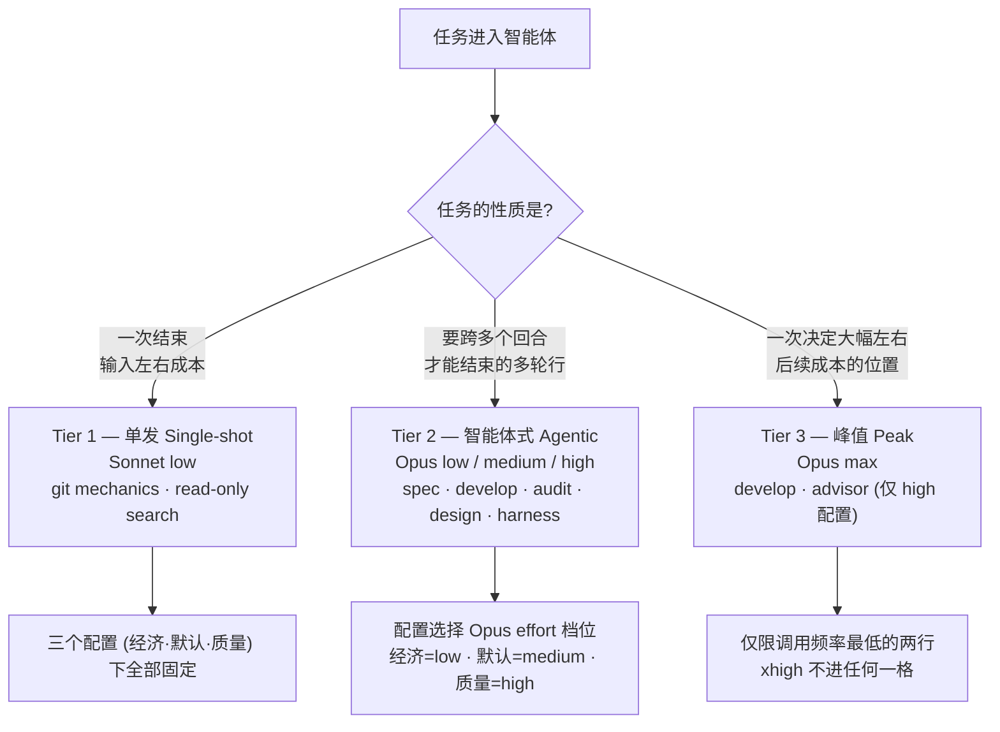

MoAI-ADK 把 Haiku 从路由模型集合中移除，并把剩下的模型按任务性质分成三档来用。这一页写得能让你讲给朋友听 —— *"把便宜模型塞进繁忙的位置看似省成本，但在长周期的任务上恰恰相反。MoAI 用数据确认了'更常用贵模型反而缩小账单'这一点，并在此基础上定下了按任务种类分三档的分配规则。"*

这里，**智能体** (agent，自主判断并工作的 AI 助手) 完成任务所用的模型与 **effort**（推理深度，决定模型为一次回答思考多深的五档 `low` → `medium` → `high` → `xhigh` → `max`）是决定成本的两根轴。本页讲为什么这两根轴这样分配、为什么干脆移除 Haiku，以及这个"级别"与自主级别是不同的概念。

## 直觉与现实分岔的地方

常见的假设是这样的："把单价便宜的模型（比如 Sonnet · Haiku）派去繁忙的位置，贵模型 (Opus) 只省着用在重要位置，总成本就会降。" 只看代币 (token，模型读写文字的计费单位) 的单价表，这个假设似乎成立。

但这个假设要成立，需要一个前提 —— *弱模型最终也能在同样的次数内完成同样的任务*。在长周期的智能体任务（多次调用工具、自行修正计划、走到头才算完成的任务）上，这个前提崩塌。弱模型收敛失败，失败多少就多转多少步、多喷多少输出代币，任务还是完不成。代币单价虽便宜，*烧掉的代币量*却大得多，每个任务的账单反而更厚。

这是整页的出发点。**决定账单的不是单价，而是完赛效率。**

## 数据怎么说 —— DeepSWE 排行榜

验证上述直觉的出处是 DeepSWE 排行榜的 **"All effort levels"** 视图（113 tasks / 91 repos / 5 languages，mini-swe-agent 线束）。由于 effort 按档分别报告，我们不是盯着一个运行点，而是能从每个模型的成本 · 得分曲线形状推导级别。

| 模型 | effort | 得分 | $/任务 | 输出代币 | 步数 |
|---|---|---|---|---|---|
| Opus 5 | low | 58% | $1.66 | 20k | 36 |
| Opus 5 | medium | 69% | $3.29 | 37k | 52 |
| Opus 5 | high | 73% | $6.08 | 64k | 73 |
| Opus 5 | xhigh | 73% | $9.07 | 92k | 89 |
| Opus 5 | max | 74% | $11.84 | 118k | 99 |
| Sonnet 5 | low | 31% | $2.19 | 36k | 77 |
| Sonnet 5 | medium | 40% | $4.08 | 57k | 108 |
| Sonnet 5 | high | 48% | $7.43 | 87k | 147 |
| Sonnet 5 | xhigh | 50% | $11.89 | 121k | 186 |
| Sonnet 5 | max | 54% | $26.40 | 214k | 268 |
| Fable 5 | high | 69% | $9.18 | 57k | 59 |
| Fable 5 | max | 70% | $21.63 | 119k | 88 |

每 MTok 原价（输入/输出）： Opus 5 $5/$25 · Sonnet 5 $2/$10（导入价，至 2026-08-31，此后 $3/$15） · Fable 5 $10/$50。

 **单价倒挂**： Sonnet 的代币单价*低于* Opus，但在所有可比位置上每任务成本反而更高 —— Opus 5 `low` 花 $1.66 拿 58%，Sonnet 5 `max` 花 $26.40 只拿 54%。"改用便宜模型就能省额度"的通念在长周期智能体工作中不成立，因为决定账单的不是单价而是完赛效率。

从数据里读出的结论有四条。

1. **Opus 5 在所有 effort 上帕累托支配 Sonnet 5。** Opus `low`（58%，$1.66）在得分与成本两轴上同时压过 Sonnet 的全部五个点，Sonnet `max`（54%，$26.40）也不例外。"繁忙的智能体派给便宜模型"这条路由命题在长周期智能体工作中被证伪。
2. **原因不是单价而是完赛效率。** Sonnet 完成同一组任务约多花 2.7 倍步数。让任务变贵的不是每代币费率，而是这些多出来的步数与输出代币。
3. **`xhigh` 在 Opus 上是纯损失。** `high` 与 `xhigh` 同为 73%，`xhigh` 成本多 49%、步数多 22%。Fable 在同样的位置也出现天花板变平。越过拐点的 effort 买到的是代币，不是分数。
4. **`medium` 是拐点。** 每得 1 分的边际成本： `low` → `medium` $0.15、`medium` → `high` $0.70（4.7 倍）、`xhigh` → `max` $2.77（18.6 倍）。默认配置把核心实现智能体锚定在 `medium`，原因正在这里。

## 为什么干脆移除 Haiku

连 Sonnet 在长周期任务上都比 Opus 贵，Haiku 比 Sonnet 更弱。把 Haiku 放进路由，能力不会增加，只是步数浪费增加 —— Sonnet 上已经观测到的完赛失败模式，在 Haiku 上只会更陡峭。

所以 MoAI 把 Haiku 从路由模型集合中完全排除（No-Haiku 策略，SPEC-AGENT-ARCH-V2-001 §D）。Haiku 在模型 enum 中仍是合法值，因此会出现在文档 · 示例 YAML 里，但不会进入实际智能体分配矩阵的任何一格。移除 Haiku 之后，降低成本的轴仍在 —— 不改模型等级，而是按档调节 effort（推理深度）。这就是三层结构的起点。

## 三档分配规则

把剩下的模型（Opus、Sonnet）与 effort 按任务性质分成三档。这里的"级别"指*按任务种类分配模型 · effort 的档位*。

### Tier 1 — 单发 (Single-shot)

 一次就能结束、成本由输入而非迭代左右的工作。让弱模型变贵的原因——多步完赛失败——在这里不出现，Sonnet 更低的输入单价成为实质变量。用 Sonnet `low` effort 把步数压到最少。负责的智能体是 `manager-git`、`Explore`，这两行在三个配置（经济 · 默认 · 质量）下全部固定。

### Tier 2 — 智能体式 (Agentic)

 计划、实现、审计、设计、线束生成、文档化、E2E —— 多轮行的全部。Opus `low` 的得分已经高于任何 effort 的 Sonnet、每任务成本更低，所以这些行全部由 Opus 承担。配置决定每行落在 Opus effort 梯队的哪一级 —— 经济列 `low`、默认列 `medium`、质量列 `high`。负责的智能体： `manager-spec`、`manager-develop`、`plan-auditor`、`sync-auditor`、`manager-design`、`builder-harness`、`manager-docs`、`e2e-tester`。

### Tier 3 — 峰值 (Peak)

 `max` effort 只用在 `high` 配置下调用频率最低的两行，即 `manager-develop` 与 `super-advisor`。因为越过 `medium` 之后每得 1 分的边际成本陡峭上升（`low` → `medium` 每分 $0.15，`medium` → `high` 每分 $0.70）。所以峰值 effort 只分配给一次决定会大幅左右后续成本的位置。`xhigh` 哪里都不用 —— 在 Opus 上得分与 `high` 相同，成本却多 49%。

## 模型级别与自主级别是两回事

本页的"级别"是关于*哪个模型以哪个推理深度分配给哪类工作*的档位。名字相似容易混淆，但 MoAI 里还有一个与它**不同**的"级别"。


**名字相同、对象不同的两个级别**
- **模型级别**（本页）—— 按任务种类决定智能体用*哪个模型 · 哪个 effort* 工作。对象是**成本 · 质量**。
- **自主级别** (`MOAI_AUTONOMY_TIER`) —— 智能体*在没有人工批准的情况下能自主行动到哪一步*的等级。对象是**权限 · 控制**。


两者正交。一个智能体用贵模型、高 effort 工作（模型级别高），不代表它能不经人工批准自主行动，反之亦然。自主级别由独立的环境变量与三档模式选择处理，详见[自主级别](/zh/advanced/autonomy-tier/)页面。

## 分开阅读设计意图与已实现的行为

 **诚实性区分**： 本页明确区分设计阶段的意图与实际实现的行为。

**设计阶段** (`.moai/reports/agent-architecture-redesign-v2-20260709.html`) —— v2 架构的设计意图。提出三层模型策略的原则与 DeepSWE 依据。

**已实现的行为** —— 实际路由由单一配置矩阵执行。活动配置（`high` / `medium` / `low`）选出矩阵的一列，解析器定下各智能体的 `{model, effort}`，在 spawn 时把 model 作为运行时参数注入。详细矩阵请看[配置矩阵](/zh/advanced/profile-matrix/)页面。

阅读侧同样要把设计意图（本页的 DeepSWE 依据）与已实现的行为（单一配置矩阵）分开看。

## 这个基准测不到的东西

 **局限声明**： 这个基准测量的是**编码**智能体。文档撰写、审计判断、SPEC（需求规格书）撰写质量未被直接测量，这些行的安排不是观测，而是建立在"与多轮智能体工作相似"的推断上。置信区间也要一起看 —— `medium`（69%±1）与 `high`（73%±2）不重叠，但 `max`（74%±4）与 `high` 重叠。这正是把 `max` 收在几乎不被调用的两格里的原因。所有默认值都可以用 `llm.agent_overrides` 按智能体逐个回退。

 **关于 Fable 5**： Fable 在编码工作上被全面压制。Fable `high`（69%，$9.18）与 Opus `medium`（69%，$3.29）得分相同，成本近 3 倍。所以没有放进任何矩阵格。它在模型 enum 中仍是合法值，GLM 后端的 Fable 槽位接线也原样保留 —— 变的只是默认值。

## 与线束自我进化的连接

三档分配是线束自我变好的循环的地基。观察 → 反思 → 晋升这条进化循环要尽到本分，观察阶段的路由决策本身就得让合适的模型以合适的 effort 进行。错误的路由会污染观察本身，被污染的观察在晋升阶段产出错误的规则。详见[线束自我进化](/zh/advanced/self-evolving/)页面。

## 下一步

- [配置矩阵](/zh/advanced/profile-matrix/) —— 单一 3 列 per-agent 配置矩阵（11 个智能体 × 3 个配置 = 33 格）
- [自主级别](/zh/advanced/autonomy-tier/) —— 与模型级别正交、以权限 · 控制为对象的自主等级
- [代币经济学概述](/zh/advanced/tokenomics-overview/) —— 四层代币经济学结构的路由层
