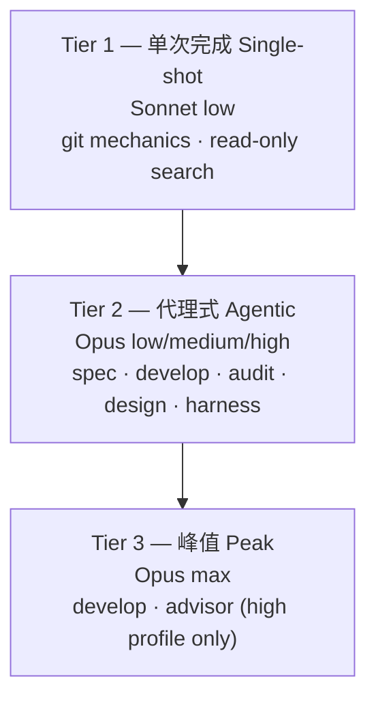

MoAI-ADK v3.0 将 Haiku 从路由模型集合中排除，以贴合任务性质的三层结构分散工作。此设计基于 DeepSWE 排行榜的实测数据。本页解释为何排除 Haiku、三层如何配置，并区分设计意图与实现行为。

## 为何排除 Haiku

DeepSWE 排行榜的核心发现是"**弱模型 + 高 effort = 可用性的敌人**"。更弱的模型并不会更便宜地完成长周期任务 — 它会花更多步数、更多输出 token，却仍无法收敛。在 `max` effort 下，Sonnet 5 在同一任务集上消耗 268 步、214k 输出 token，而 Opus 5 只用 99 步就完成。

下表数据取自排行榜的 **"All effort levels"** 视图(113 tasks / 91 repos / 5 languages，mini-swe-agent 线束)。由于 effort 是按级别报告的，三层可以从每个模型成本/得分曲线的形状推导，而不必依赖单一运行点。

| 模型 | effort | 得分 | $/任务 | 输出 token | 步数 |
|---|---|---|---|---|---|
| Opus 5 | low | 58% | $1.66 | 20k | 36 |
| Opus 5 | medium | 69% | $3.29 | 37k | 52 |
| Opus 5 | high | 73% | $6.08 | 64k | 73 |
| Opus 5 | xhigh | 73% | $9.07 | 92k | 89 |
| Opus 5 | max | 74% | $11.84 | 118k | 99 |
| Sonnet 5 | low | 31% | $2.19 | 36k | 77 |
| Sonnet 5 | medium | 40% | $4.08 | 57k | 108 |
| Sonnet 5 | high | 48% | $7.43 | 87k | 147 |
| Sonnet 5 | xhigh | 50% | $11.89 | 121k | 186 |
| Sonnet 5 | max | 54% | $26.40 | 214k | 268 |
| Fable 5 | high | 69% | $9.18 | 57k | 59 |
| Fable 5 | max | 70% | $21.63 | 119k | 88 |

每 MTok 标价(输入/输出): Opus 5 $5/$25 · Sonnet 5 $2/$10(优惠价，截至 2026-08-31，之后为 $3/$15) · Fable 5 $10/$50。

 **单价反转**: Sonnet 的单 token 价格*低于* Opus，但在每一个可比点上其每任务成本都更高 — Opus 5 在 `low` 下花 $1.66 得到 58%，而 Sonnet 5 在 `max` 下花 $26.40 只得到 54%。"用便宜模型跑就能省配额"的通念在长周期代理式工作中不成立，因为决定账单的是完成效率而非单价。

在此数据下，将 Haiku 纳入路由只会增加步数浪费而不增加能力。Sonnet 则被限定在单次完成、以输入为主的工作上 — 那里不存在多步完成失败的问题。

## 三层定义

根据任务性质将模型和 effort 分配到 3 个层级。

### Tier 1 — 单次完成 (Single-shot)

 一次通过即可完成、以输入而非迭代为主的工作。使弱模型变贵的多步完成失败在这里并不适用，因此 Sonnet 更低的输入价格才是决定性因素。Sonnet 在 `low` effort 下最小化步数。负责代理: `manager-git`、`Explore`。这两行在三个配置文件下固定不变。

### Tier 2 — 代理式 (Agentic)

 所有多轮行 — 规划、实现、审计、设计、线束生成、文档、E2E。Opus 承担全部，因为 Opus 在 `low` 下已经超过任何 effort 的 Sonnet，而每任务成本更低。配置文件决定每一行落在 Opus effort 阶梯的哪一级: 经济列为 `low`，默认列为 `medium`，质量列为 `high`。负责代理: `manager-spec`、`manager-develop`、`plan-auditor`、`sync-auditor`、`manager-design`、`builder-harness`、`manager-docs`、`e2e-tester`。

### Tier 3 — 峰值 (Peak)

 `max` effort 仅限于 `high` 配置文件下两个调用频率最低的行: `manager-develop` 与 `super-advisor`。越过 `medium` 后每分的边际成本急剧上升(`low`→`medium` 每分 $0.15，`medium`→`high` 每分 $0.70)，因此峰值 effort 只花在单个决策带来不成比例下游成本之处。`xhigh` 在任何地方都不使用 — 在 Opus 上它与 `high` 得分相同，成本却高 49%。

## DeepSWE 排行榜依据

从按 effort 分级的实测得出的四点结论:

1. **Opus 5 在每个 effort 上都帕累托压制 Sonnet 5。** Opus 在 `low`(58%、$1.66)在两个维度上都胜过 Sonnet 的全部五个点，包括 `max` 下的 Sonnet(54%、$26.40)。"把繁忙代理交给更便宜的模型"这一路由论断在长周期代理式工作中被证伪。
2. **原因是完成效率而非价格。** Sonnet 完成同一任务集大约要花 2.7× 的步数。让任务变贵的是这些额外步数与输出 token，而不是单 token 费率。
3. **`xhigh` 在 Opus 上是净亏损。** `high` 与 `xhigh` 同为 73% 得分，但 `xhigh` 成本高 49%、步数多 22%。Fable 上出现同样的平顶。越过拐点的 effort 买到的是 token，不是分数。
4. **`medium` 是拐点。** 每分边际成本: `low`→`medium` $0.15、`medium`→`high` $0.70(4.7×)、`xhigh`→`max` $2.77(18.6×)。默认配置文件正因如此将 `manager-develop` 锚定在 `medium`。

 **局限说明**: 该基准测试衡量的是**编码**代理。文档撰写、审计判断与 SPEC 撰写质量未被直接测量，因此这些行的位置基于与多轮代理式工作的相似性推断，而非观测。置信区间同样重要: `medium`(69%±1)与 `high`(73%±2)不重叠，但 `max`(74%±4)与 `high` 重叠 — 这正是 `max` 被限定在两个罕用格子的原因。每一项默认值都可通过 `llm.agent_overrides` 按代理逐一回退。

 **关于 Fable 5**: Fable 在编码维度上于每个 effort 都被压制 — Fable 在 `high`(69%、$9.18)与 Opus 在 `medium`(69%、$3.29)得分相同，却花近三倍成本 — 因此它不出现在任何矩阵格子中。它仍是 model enum 中的有效取值，并继续作为 GLM 后端的 Fable 槽位保持接线；改变的只是默认值。

## 设计报告 vs 实现

 **REQ-DA-061 诚实性区分**: 本页内容必须明确区分设计阶段与实现行为。

**设计阶段** (`.moai/reports/agent-architecture-redesign-v2-20260709.html`) — v2 架构设计意图。提出三层模型策略原则和 DeepSWE 依据。

**实现行为** — 单一配置矩阵执行实际路由。活动配置文件(`high`/`medium`/`low`)选择矩阵的一列，解析器确定每个代理的 `{model, effort}` 并在 spawn 时将 model 作为运行时参数注入。详细矩阵见[配置矩阵](/zh/advanced/profile-matrix/)页面。

读者必须能够区分设计意图(本页的 DeepSWE 依据)和实现行为(单一配置矩阵)。

## 与线束自我进化的连接

三层架构是线束自我进化的基础。进化循环(观察 → 反思 → 提升)要发挥作用，观察阶段的路由决策必须以正确的 effort 到达正确的模型。自我进化详情见[线束自我进化](/zh/advanced/self-evolving/)页面。

## 下一步

- [配置矩阵](/zh/advanced/profile-matrix/) — 单一 3 列 per-agent 配置矩阵 (11 代理 × 3 配置文件 = 33 格)
- [代币经济学概述](/zh/advanced/tokenomics-overview/) — 四层代币经济学结构的 Layer B 路由
