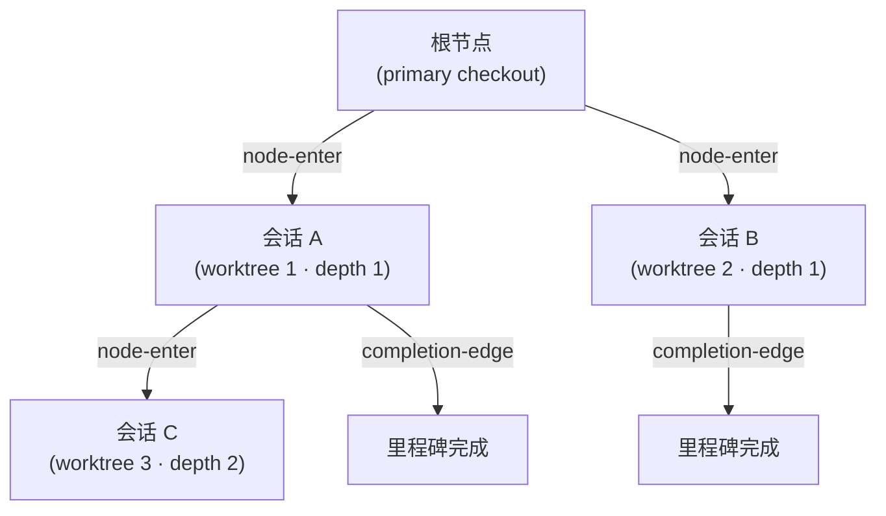

# 会话溯源链 (Origin-Trail Chain)


 <strong>所属价值</strong>：智能体循环工程 · 会话连续性


Origin-Trail Chain 是一本只追加的谱系账本，记录每个 worktree 会话是从哪里分出来的。在 worktree 里开始一个会话，就会生成一个节点；父子边记下“这个会话是从那个会话分出来的”。`/clear` 之后重新进入嵌套很深的 worktree，也能直接找回做完了哪个里程碑、下一步该做什么，不必再 grep 或翻滚动记录。

溯源链与工厂模式相互独立，不需要工厂主导会话，也不需要任何 lane。只要用 `moai cc -w <名称>` 这类方式指定了 worktree 来启动会话，它就会进入链中。本页说明链记录什么、何时记录、怎样存储，以及用来查询的 `moai chain` 命令。

## 这条链解决的问题

**深度遗忘 (depth amnesia)**：worktree 里再启动 worktree 会话，层层嵌套之后，`/clear` 后重新进入的会话会忘记“我的祖先是谁”。过去只能靠 grep 和翻滚动记录去考古。链把从根到该节点的完整 ID 路径反规范化存进 `origin_chain` 字段，一次查询就能还原谱系，无需遍历。

**断掉的交接**：子会话结束了而父会话毫不知情，父会话就会一直等一件早已完成的事。链在会话结束时写入 `completion-edge` 事件，同时记下最后完成的里程碑和下一步要恢复的工作（`resume_target`）。即使父会话已经退出或被清空，账本依然是最新的。

## 何时记录

有三处会写入账本，任何一处失败都不会阻塞会话（fail-open）。链只是辅助遥测，并不是关卡。

| 时机 | 写入方 | 做什么 |
|------|--------|--------|
| 指定 worktree 启动会话 | 启动器 (`moai cc -w <名称>`) | 追加 `node-enter` 事件，并通过环境变量 `MOAI_CHAIN_NODE_ID` 把新节点 ID 传给子进程 |
| 子会话的 SessionStart | SessionStart 钩子 | 用 `node-update` 补上会话 ID。若 `/clear` 让环境变量丢失，就从账本里找到节点并恢复，再输出谱系提示 |
| 子智能体或会话结束 | `chain-event` 钩子 (SubagentStop) | 追加父子 `completion-edge` |

只有当 `-w` 带了名称时，启动器才会创建节点。不带名称的 `-w` 由 Claude Code 自动取名，启动器无从得知路径；`-c`（继续）是重新打开已有会话，并不产生新会话，所以都不记录。

## 只追加的事件流

链保存在 `.moai/state/chain/events.jsonl`。每次写入都用 `O_APPEND` 追加一行，没有覆盖，也没有截断。内核会把并发追加串行化，因此多个会话同时写入，也不会有一行把另一行写坏。



事件流里有三类事件。

| 事件 | 写入时机 | 内容 |
|------|----------|------|
| `node-enter` | worktree 会话启动时 | 节点 ID、父节点、深度、谱系路径、worktree 路径、SPEC ID、进入时间 |
| `node-update` | 子会话 SessionStart 或里程碑更新时 | 回填会话 ID，更新里程碑与恢复目标 |
| `completion-edge` | 子智能体或会话结束时 | 父子节点、已完成的里程碑、下一个恢复目标 |

文件本身只是一份平铺的事件列表，各节点的当前状态是在读取时把事件从头重放得出的。任何地方都没有可被改写的树文件。损坏的行会被跳过，并给出警告。

## 节点的 13 个字段

节点在读取时被重建为带 13 个字段的状态视图。

| 字段 | 含义 |
|------|------|
| `node_id` | 可按时间排序的唯一 ID：十六进制毫秒时间戳加 4 字节随机数 |
| `parent_node_id` | 生成该节点的父节点，根节点为空 |
| `depth` | 嵌套深度，primary checkout 为 0，第一个 worktree 为 1 |
| `origin_chain` | 从根到该节点的 ID 路径 |
| `worktree_path` | worktree 的绝对路径 |
| `session_id` | 运行时分配的 Claude Code 会话 ID，分两步填入 |
| `spec_id` | 该节点正在处理的 SPEC |
| `milestone` | 当前里程碑标签 |
| `entered_at` | 节点创建时间 (RFC 3339) |
| `exited_at` | 会话结束时间，由心跳过期程度推出，而不是来自退出事件 |
| `last_completed_milestone` | 最近一个被标记为完成的里程碑 |
| `resume_target` | 恢复时要做的事，一行描述 |
| `resume_command` | 恢复时要执行的单条命令 |

## 路径被复用时

删除 worktree 后在同一路径重建，不同的会话就会拥有相同的 `worktree_path`。链用 `(worktree_path, session_id)` 这一对来区分。

1. **主键**：找两个值都匹配的节点。同一路径上匹配到多个时，取最新的。
2. **备用键**：会话 ID 为空，或没有节点与之匹配时，取该路径上最近进入的节点。给了会话 ID 却没有匹配项时，会记录一条警告。

`/clear` 之后要找回“这个路径当前的节点是哪个”，用的就是这条规则。

## 会话 ID 分两步填入

启动 worktree 会话的那一刻，还不知道会话 ID，因为 Claude Code 运行时要等子进程启动之后才会分配。所以工作分成两步。

1. **会话启动时**：启动器追加 `node-enter`，`session_id` 留空，并通过 `MOAI_CHAIN_NODE_ID` 把新节点 ID 交给子进程。
2. **子会话的 SessionStart**：运行时分配好会话 ID 后，用 `node-update` 填入 `session_id`。

## moai chain 命令

有五个查询命令读取账本。它们都不依赖工厂功能，也不会向用户提问。

| 命令 | 输出 |
|------|------|
| `moai chain status` | 当前节点摘要：深度、节点 ID、父节点、SPEC、里程碑、已完成里程碑、恢复目标、会话、worktree |
| `moai chain lineage` | 从根到当前节点的谱系，每个节点带路径、SPEC、里程碑、进入时间 |
| `moai chain back` | 父节点的恢复目标 (`resume target`)、恢复命令 (`resume cmd`) 和 worktree 路径 |
| `moai chain list` | 全部节点的深度、会话、状态 (`active` / `stale` / `exited`) 和 worktree |
| `moai chain prune` | 把过旧的已退出节点折叠进归档。默认只做预览，真正执行需加 `--no-dry-run` |

```bash
$ moai chain status
depth:     2
node:      0199a3f1c2b7e-9f3a21c4
parent:    0199a3f0d81a2-51be07aa
spec:      SPEC-AUTH-001
milestone: M2
resume:    从 M3 继续实现
worktree:  /path/to/.claude/worktrees/auth-m2
```

`list` 的状态要叠加会话注册表来判定：没有会话 ID、或已从注册表消失的节点为 `exited`；最后一次心跳超过 15 分钟的为 `stale`；更近的为 `active`。账本超过 30 天或超过 10MB 时，`prune` 会把已退出的旧节点折叠起来。


 账本不存在，或当前路径没有匹配的节点时，命令不会报错，而是输出一行 `no chain context` 之类的提示并正常退出。


## 局限与边界

- **仅支持单主机 v1。** 在远程路径（如 `ssh://`）上，命令只会提示不支持谱系。跨机器的谱系不在覆盖范围内。
- **只是辅助遥测。** 账本写不进去，会话照常启动。链的记录不能代替任何审批关卡。
- **只读的 CLI。** 没有启动或移动会话的命令。链告诉你该回到哪里，回去这一步由 `moai cc -w <路径>` 或在会话内进入 worktree 来完成。

## 相关文档

- [工厂模式](/zh/advanced/factory-mode)（一个主导会话加多条 lane 搬运卡片的多会话执行）
- [moai web 控制台](/zh/advanced/moai-web-console)（在浏览器里查看会话与卡片状态）
- [`moai worktree`](/zh/cli-reference/worktree)（worktree 的创建与清理）
