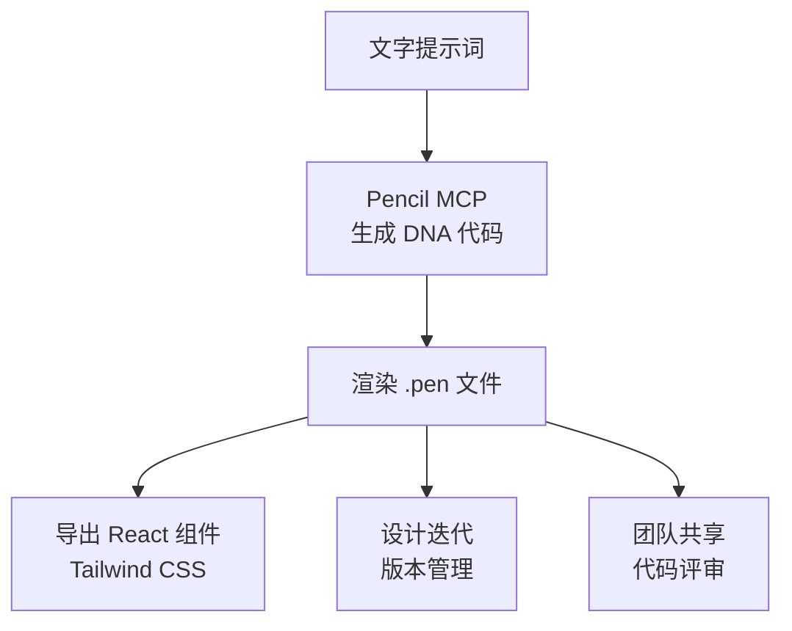
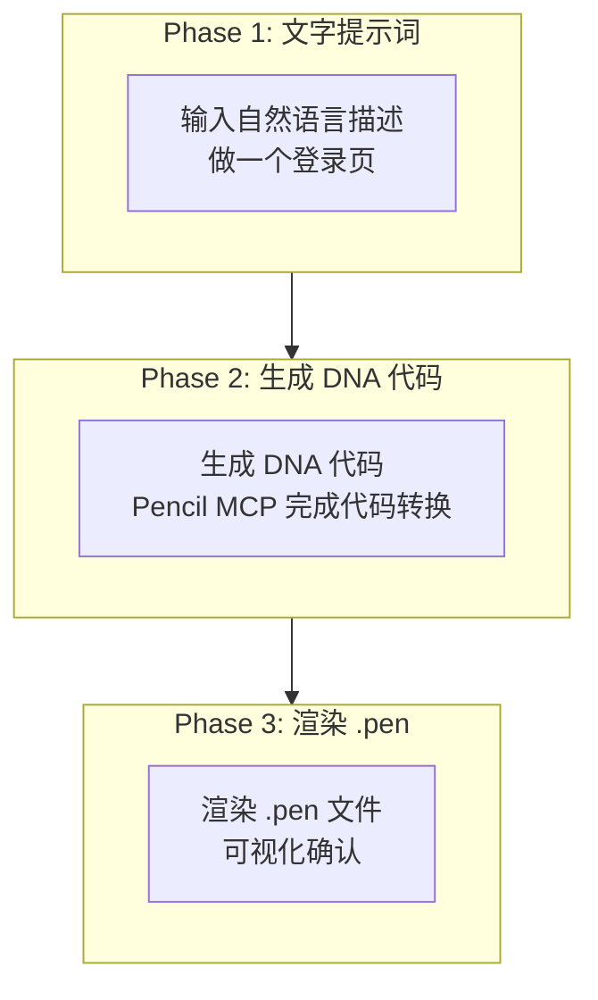
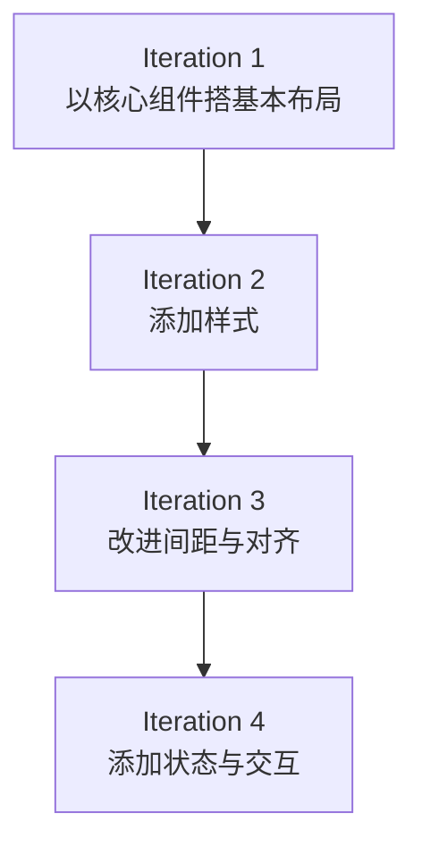
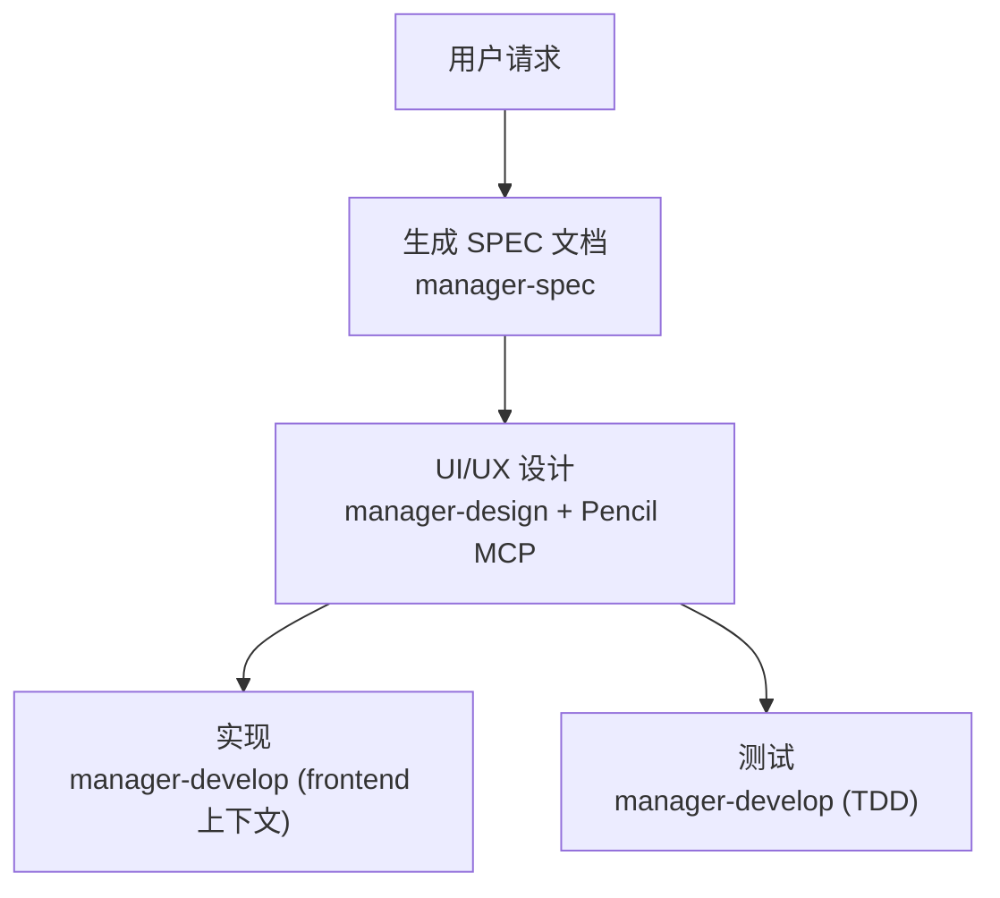

详细介绍如何利用 Pencil MCP 服务器生成基于 AI 的 UI/UX 设计。Pencil 用代码管理设计的哲学与 MoAI-ADK 的 Harness 哲学一脉相承 — 做成可版本管理、可评审、智能体可直接操作的形态。


**一句话总结**：Pencil 是 **基于代码的设计工具**。通过 MCP 服务器可以直接在 Claude Code 中生成 UI，以 .pen 文件管理，并导出为生产代码。


## 什么是 Pencil？

Pencil 是可以直接在开发环境中操作的 **基于 AI 的设计工具**。它弥合设计与代码之间的鸿沟，让开发者无需 Figma 之类的独立设计工具也能生成一致的 UI。



### 主要功能

| 功能 | 说明 |
|------|------|
| **DNA 代码** | 用声明式代码表达 UI（可版本管理） |
| **文字生成设计** | 用自然语言描述生成 UI 界面 |
| **.pen 文件** | 加密的设计文件格式 |
| **React 导出** | 生成应用了 Tailwind CSS 的生产代码 |
| **无限画布** | 支持大型设计项目 |
| **团队协作** | 基于代码的设计评审 |


Pencil 使用 **开源设计格式**，.pen 文件可以直接在代码库中管理。详情见 https://pencil.dev。


## 事前准备

使用 Pencil MCP 需要以下设置。

### 支持的 AI 助手

Pencil 通过 MCP (Model Context Protocol) 与多种 AI 工具集成。

| AI 工具 | 支持形式 | 备注 |
|---------|----------|------|
| **Claude Code** | CLI 与 IDE | 最推荐的方式 |
| **Claude Desktop** | 桌面应用 | 适合个人使用 |
| **Cursor** | AI-powered IDE | 代码库感知功能 |
| **Windsurf IDE** | Codeium | 较新的 IDE 选项 |
| **Codex CLI** | OpenAI | 基于终端的工作流 |
| **Antigravity IDE** | 专用 IDE | Pencil 专属扩展 |
| **OpenCode CLI** | CLI 环境 | 可脚本化 |

### Step 1: 安装 Pencil

安装 Pencil 应用或 IDE 扩展。

- **macOS/Windows/Linux**：下载 Pencil 桌面应用
- **VS Code/VSCode-insiders**：安装 Pencil 扩展
- **Cursor**：安装 Pencil 扩展

### Step 2: 运行 Pencil

运行 Pencil 后 MCP 服务器会自动启动。无需额外安装或配置。

```bash
# 确认 Pencil 应用是否运行中
# 若 Pencil 运行中, MCP 服务器会自动启动
```

### 安全与隐私


**仅本地的安全性**：Pencil MCP 服务器 **完全在本地运行**。设计文件不会传输到远程服务器，所有设计数据都保存在本地机器上。


| 安全特性 | 说明 |
|----------|------|
| **仅本地** | MCP 服务器只在用户机器上运行 |
| **无远程访问** | 设计文件保留在本地 |
| **私有仓库** | 源代码不公开 |
| **工具检查** | 可在 IDE 设置中查看可用工具 |

## MCP 配置

### Claude Code 配置

Pencil 运行中时，Claude Code 会自动检测 MCP 服务器。

```json
{
  "permissions": {
    "allow": [
      "mcp__pencil__*"
    ]
  }
}
```

### 确认连接

配置完成后即可在 Claude Code 中使用 Pencil 工具。

```bash
# 在 Claude Code 中执行
> 用 Pencil 生成一个登录按钮
```

## MCP 工具列表

Pencil MCP 提供多种工具。

### 主要工具

| 工具 | 用途 |
|------|------|
| `open_document` | 创建新 .pen 文件或打开既有文件 |
| `get_editor_state` | 查看当前编辑器状态、选区信息、活动文件 |
| `batch_design` | 一次性创建/修改多个设计元素 |
| `batch_get` | 一次性查询多个节点信息 |
| `get_screenshot` | 截取 .pen 文件的截图 |
| `snapshot_layout` | 分析布局结构 |
| `get_guidelines` | 查询设计指南 |
| `get_style_guide` | 查询样式指南 |
| `get_style_guide_tags` | 搜索样式指南标签 |
| `get_variables` | 读取设计变量/主题 |
| `set_variables` | 设置设计变量/主题 |
| `find_empty_space_on_canvas` | 在画布上寻找空白区域 |
| `search_all_unique_properties` | 搜索所有唯一属性 |
| `replace_all_matching_properties` | 更改所有匹配的属性 |
| `generate_image` | 用 AI 生成图片 |

### 工具选择指南

| 目的 | 使用的工具 |
|------|-------------|
| 开始新设计 | `open_document` |
| 创建组件 | `batch_design` |
| 预览设计 | `get_screenshot` |
| 导出设计 | 在 Pencil Editor 中 Export |
| 参考样式 | `get_style_guide` |
| 分析布局 | `snapshot_layout` |
| 管理变量 | `get_variables`, `set_variables` |
| 寻找空间 | `find_empty_space_on_canvas` |
| 搜索属性 | `search_all_unique_properties` |
| 批量更改 | `replace_all_matching_properties` |

## DNA 代码格式

Pencil 使用一种叫 DNA 代码的声明式格式表达 UI。

### 基本结构

```dna
// 按钮组件 DNA 代码
component Button {
  variant: primary
  size: medium
  content: "点击这里"
  onClick: handleSubmit
}
```

### 布局结构

```dna
// 登录表单布局
layout LoginForm {
  direction: column
  spacing: 16
  children: [
    Input {
      placeholder: "邮箱"
      type: email
    }
    Input {
      placeholder: "密码"
      type: password
    }
    Button {
      variant: primary
      content: "登录"
    }
  ]
}
```

### 设计代币

```dna
// 引用代币
color: primary.500
spacing: md
radius: lg

// 定义代币
tokens {
  primary.500 = #3B82F6
  md = 16px
  lg = 8px
}
```

## 设计生成工作流

用 Pencil 生成设计的 3 阶段模式。



### 实战示例：E-Commerce 卡片

```bash
# Phase 1: 用文字提示词请求设计
> 做一张商品卡片。顶部商品图片, 中间标题与价格,
# 底部购物车按钮。干净的极简风格

# Phase 2: Pencil 生成 DNA 代码
# → component ProductCard { ... }

# Phase 3: 渲染为 .pen 文件
# → open_document 后用 batch_design 生成
```


**关键**：Pencil **以代码管理设计**。.pen 文件可以用 Git 做版本管理，并整合进代码评审流程。


## 导出 React 组件

可以在 Pencil Editor 中把 .pen 文件导出为 React 组件。

### 导出配置

```typescript
// pencil.config.js
module.exports = {
  framework: 'react',
  styling: 'tailwind',
  output: './src/components/generated',
  options: {
    typescript: true,
    responsive: true,
    accessibility: true
  }
};
```

### 生成的组件示例

```typescript
export interface ButtonProps {
  variant?: 'primary' | 'secondary' | 'tertiary';
  size?: 'small' | 'medium' | 'large';
  isLoading?: boolean;
}

export const Button = ({ variant = 'primary', size = 'medium', isLoading, children, ...props }: ButtonProps) => {
  const baseStyles = 'inline-flex items-center justify-center font-medium rounded-md transition-colors';

  const variantStyles = {
    primary: 'bg-blue-600 text-white hover:bg-blue-700',
    secondary: 'bg-gray-200 text-gray-900 hover:bg-gray-300',
    tertiary: 'bg-transparent text-gray-700 hover:bg-gray-100'
  };

  const sizeStyles = {
    small: 'px-3 py-1.5 text-sm',
    medium: 'px-4 py-2 text-base',
    large: 'px-6 py-3 text-lg'
  };

  return (
    <button className={`${baseStyles} ${variantStyles[variant]} ${sizeStyles[size]}`} {...props}>
      {isLoading ? '加载中...' : children}
    </button>
  );
};
```

## 提示词编写指南

要在 Pencil 中获得好结果，结构化的提示词很重要。

### 好提示词 vs 坏提示词

| 坏提示词 | 好提示词 |
|--------------|--------------|
| "做一个漂亮的按钮" | "蓝色背景的中等尺寸基础按钮。'确认' 文字, 16px 内边距" |
| "仪表盘" | "带侧栏导航的分析仪表盘。顶部 3 张指标卡 (营收、用户、转化率)、折线图、表格" |
| "响应式" | "移动端: 纵向堆叠, 桌面端: 3 列网格" |

### 有效的提示词模板

```
生成 [组件类型]。
包含 [组件列表]。
以 [布局] 排布。
应用 [样式]。
考虑 [响应式]。
```

### 实战提示词示例

**设计生成：**

```bash
# 生成仪表盘
"做一个带侧栏与主内容区域的仪表盘"

# 生成价格表
"做一个 3 档价格表。基础、专业、企业"

# 英雄区块
"添加一个带标题与 CTA 按钮的英雄区块"
```

**设计修改：**

```bash
# 更改颜色
"把所有基础按钮改成蓝色"

# 调整尺寸
"把侧栏做窄一点"

# 添加间距
"给这些元素之间加上间距"
```

**设计系统：**

```bash
# 按钮组件
"做一个带变体的按钮组件"

# 配色
"以 #3b82f6 为基础生成配色"

# 排版
"做一套排版比例"
```

**代码集成：**

```bash
# React 代码
"为这个组件生成 React 代码"

# 导入
"从我的代码库导入 Header"

# Tailwind 配置
"根据这些变量生成 Tailwind 配置"
```


**Golden Rule**：提示词 **越具体越好**。明确指定颜色、间距、对齐与交互。


## 在 Cursor 中使用

Cursor 是基于 AI 的 IDE，与 Pencil 提供强大的集成。

### 设置

1. 在 Cursor 中安装 Pencil 扩展
2. 完成激活
3. Claude Code 认证
4. 确认 MCP 连接：Settings → Tools & MCP

### Cursor 专属功能

**内联编辑：**

- 在 Pencil 中选择元素
- 用 Cursor 的 AI 聊天修改
- 变更立即应用到 `.pen` 文件

**代码库感知：**

- Cursor 同时查看代码与设计
- 可请求组件间同步
- 自动保持一致性

### 常见问题

**"Need Cursor Pro"：**

- 部分功能可能需要 Cursor Pro 订阅
- 当前限制以 Cursor 价格表为准

**提示词面板缺失：**

- 确认激活/登录状态
- 重启 Cursor
- 在设置中确认 MCP 连接

## 在 Codex CLI 中使用

### 设置

1. **先运行 Pencil** - 启动桌面应用或 IDE 扩展
2. 在终端打开 Codex
3. 确认 MCP 连接：`/mcp`
4. **Pencil 应出现在 MCP 服务器列表中**

### 用 Codex 工作

**在终端中做设计提示：**

```bash
# 在 Codex CLI 中
> 在 design.pen 中做一个按钮组件
> 给落地页添加英雄区块
> 以蓝色为基础生成配色方案
```

**优点：**

- 命令行工作流
- 可脚本化的设计生成
- 与构建工具集成

### 已知问题

**Codex config.toml 被修改：**

- Pencil 可能修改或复制配置
- 该问题已确认并在调查中
- 首次使用前备份配置

## 高级工作流

### 自动化设计生成

**样式指南：**

```bash
# 遵循特定设计系统
"用 Material Design 原则做一个仪表盘"

"以现代极简美学设计一个落地页"

"做一个遵循 design-system.pen 设计系统的组件"
```

**批量操作：**

```bash
# 按钮变体
"给这个按钮组件做 5 种变体"

# 完整表单
"生成一个包含所有输入类型的完整表单"

# 完整落地页
"设计一个包含英雄、功能、价格、页脚的完整落地页"
```

### 设计系统管理

**强制一致性：**

```bash
# 颜色变量
"让所有按钮使用基础颜色变量"

# 排版
"把所有标题更新为使用排版比例"

# 间距
"给所有元素应用 8px 间距网格"
```

**组件库：**

```bash
# 按钮组件
"做一个包含所有变体的完整按钮组件"

# 表单输入
"生成表单输入组件 (文本、下拉、复选框、单选)"

# 卡片组件
"做一个带图片、标题、描述、操作的卡片组件"
```

### 代码-设计工作流

**导入既有应用：**

```bash
# 复现组件
"在 Pencil 中复现 src/components 里的所有组件"

# 导入设计系统
"从 Tailwind 配置导入设计系统"

# 分析代码库
"分析代码库并做出匹配的设计"
```

**同步变更：**

```bash
# React 组件
"把所有 React 组件更新为与 Pencil 设计一致"

# 配色方案
"把新配色方案同时应用到设计与代码"

# 变量同步
"在 CSS 与 Pencil 之间同步排版变量"
```

## 最佳实践

| 原则 | 说明 |
|------|------|
| **代码优先** | 以代码管理设计，便于版本管理与协作 |
| **渐进式改进** | 先生成基本布局，逐步添加细节 |
| **包含无障碍** | 总是明确 ARIA 标签、键盘导航 |
| **明确响应式** | 总是包含移动端与桌面端行为 |
| **设计系统** | 使用一致的代币与组件 |

### 渐进式改进策略

复杂界面分多次生成质量会更好。



### 有效的提示技巧

**要具体：**

- ✗ "做得更好一点"
- ✓ "把按钮内边距加到 16px 并把颜色改成蓝色"

**提供上下文：**

- ✗ "加个表单"
- ✓ "添加一个含邮箱、密码、保持登录复选框、提交按钮的登录表单"

**引用设计系统：**

- "使用既有按钮组件"
- "遵循变量中的间距比例"
- "与页头组件的样式保持一致"

### 验证

AI 改动之后需要养成亲眼确认的习惯。

1. 在画布上做视觉检查
2. 在图层面板确认结构
3. 视情况测试交互
4. 复杂布局可请求截图确认

## 问题排查

### 连接问题

**"Claude Code 未连接"：**

1. 确认 Claude Code 登录：`claude`
2. 重启 Pencil
3. 在项目目录打开终端并执行 `claude`

**MCP 服务器不出现：**

1. 确认 Pencil 在运行
2. 确认 IDE 的 MCP 设置
3. 同时重启 Pencil 与 AI 助手

### 权限问题

**"无法访问文件夹"：**

- 接受权限提示
- 确认系统文件夹权限
- 以适当权限运行 IDE/Pencil

**"权限提示不显示"：**

- 尝试在另一个 Claude Code 会话中操作
- 确认通知设置
- 确认 IDE 权限

### AI 输出问题

**"无效的 API 密钥"：**

- 重新认证 Claude Code：`claude`
- 检查冲突的认证配置
- 清理环境变量

**AI 做出意外变更：**

- 把提示词写得更具体
- 应用前请 AI 先说明
- 必要时用版本管理回滚

## 示例会话

```bash
# 1. 启动 Pencil 与 Claude Code
claude
# 2. 在 IDE 中打开 design.pen
# 3. 按 Cmd + K 开始设计

用户: "做一个现代风格的落地页英雄区块"
AI: [以标题、副标题、CTA 按钮生成英雄区块]

用户: "添加一个 3 列的功能区块"
AI: [在英雄区块下方添加功能区块]

用户: "让 CTA 按钮使用基础颜色变量"
AI: [把按钮更新为使用颜色变量]

用户: "为整个页面生成 React 代码"
AI: [导出为带 Tailwind CSS 的 React 组件]

# 4. 检查与修改
# 5. 提交到 Git
git add design.pen src/pages/landing.tsx
git commit -m "Add landing page design and implementation"
```

## 与 MoAI 一起使用

MoAI 可以与 Pencil MCP 集成实现 UI 设计自动化。在 v3.0 中，`manager-design` 智能体专门负责设计协作（D1-D5 管线）— 当操作设计工具的任务与暴露到 UI 的 SPEC 相关联时，就会投入这个智能体。



## 相关文档

- [MCP 服务器指南](/zh/advanced/mcp-servers) - MCP 协议概览
- [settings.json 指南](/zh/advanced/settings-json) - MCP 服务器权限配置
- [智能体指南](/zh/advanced/agent-guide) - MoAI 智能体系统
- [技能指南](/zh/advanced/skill-guide) - moai-design-tools 技能


**提示**：把 Pencil 用到极致的关键是 **以代码管理设计**。用 Git 管理 .pen 文件，设计的版本追踪与协作都会容易得多。

