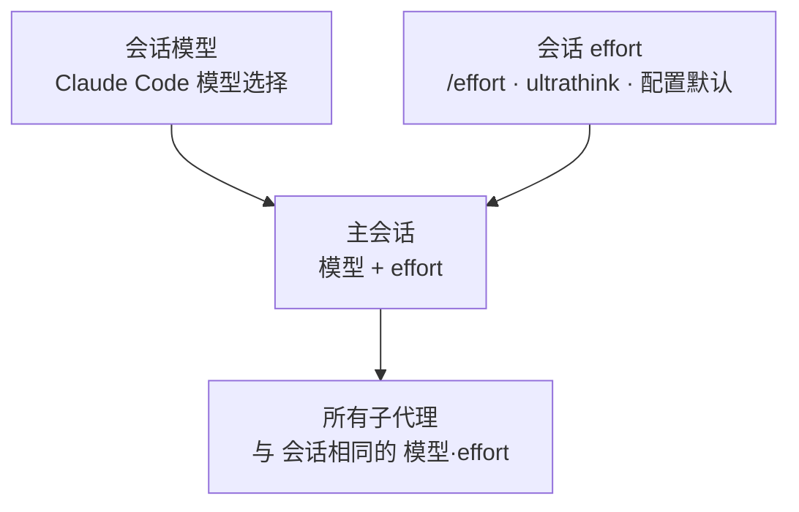

MoAI-ADK 曾经用**配置矩阵**给每个智能体分配 `{model, effort}`。以保留的 13 个智能体为行、三个质量列（`high` / `medium` / `low`）为列的 39 格表格（13 个智能体 × 3 个配置文件）曾是模型·推理深度分配的单一来源，活动配置选出一列后，该列的值应用到所有子代理生成。

这张表在 **v3.2 退役了。** 本页说明矩阵退场后接替它的是什么，以及今天的模型·推理深度如何决定。


**一句话：** 逐智能体的分配表消失了，接替它的是**会话继承**。主会话的模型与推理深度就是所有子代理的模型与推理深度。智能体定义对两者都不声明，调用时也不传。


## 矩阵解过的问题，与更好的答案

矩阵对应一个真实的问题。智能体一多，"哪个智能体用哪个模型"立刻难以招架，而这些安排逐个写进智能体文件，第二天就会过时。于是把 13 个智能体行、三个配置列收进一张表，把整件事压缩到"选一个配置"。

但在实际运行中暴露出另一个问题。实测显示，编排器调用智能体时带 model 参数的调用不足 1%。矩阵算出了值，调用却什么也没应用上 —— 而且没有任何机制会报告"什么也没应用"。收进一张表固然做到了，可应用点是空的，收集本身就失去了意义。

于是 MoAI 没有把分配做得更精细，而是取消了**分配这个行为本身**。子代理直接跟随主会话的模型与推理深度之后，就不存在会空置的应用点了 —— 会话在跑什么，本身就是分配。

## 现在的规则 —— 会话继承

> 子代理沿用主会话的模型与推理深度 —— 生成子代理时不传 `model` 也不传 `effort`，MoAI 智能体定义对两者都不作声明。

- **智能体定义文件**（`.claude/agents/moai/*.md`）的 frontmatter 既不写 model 也不写 effort。曾经分发的 `model: inherit` 字段与 effort 默认值已退役。
- **生成（spawn）**不传 model、effort 参数才是正常形态。点名一个与会话不同的 model 属于漂移，修的是"会话"，不是"调用"。
- **会话的模型**由 Claude Code 的模型选择决定；**会话的 effort** 由 `/effort` 斜杠命令、`ultrathink` 关键词或配置向导的默认值决定。

## 会话 effort 从哪里来

决定会话推理深度的路径有三条，先到者胜。

1. **会话内调节** —— `/effort low|medium|high|xhigh|max` 斜杠命令或 `ultrathink` 关键词。改了会话 effort，之后的全部子代理调用跟着走。
2. **配置向导的会话模型策略** —— `moai profile setup` 的"会话模型策略"问题决定以此配置启动的 Claude 会话的**默认推理强度回退**。`high` / `medium` / `low` 三个值原样映射为 effort，只在未单独选择推理强度时生效。不设值时保持 Claude Code 的默认启动行为。
3. **模型自身的默认值** —— 两者都未介入时，遵循模型默认 effort。Opus 5.5 默认 `medium`，其他支持 effort 的模型大多默认 `high`。

## 生成时的观测

继承成为默认之后，调用偶尔仍可能点名模型。有一个观测层盯着这件事：PreToolUse 钩子读取每次调用的声明 model，向 `.moai/logs/agent-model-audit.jsonl` 逐条追加记录，当声明与会话值不同时给出建议。拦截需要选择开启（`workflow.agent_model_guard.enabled`，默认 `false`）—— 平时是可以不用管的观测层。

## 矩阵的判断标准留在了哪里

39 格表格、解析器、`moai model profile` 访问器都已退役，但矩阵靠实测确立的**模型选择标准**并没有消失 —— 它们恰恰就是今天选择会话模型的标准。

- **支出给做判断的位置**：把深度推理集中到审计、顾问、协调这类判断密集的环节，性价比更优。
- **智能体式工作用 Opus**：长周期多轮任务上，Opus 的 `low` 得分高于任何档位的 Sonnet，而每任务成本更低。
- **No-Haiku**：把 Haiku 塞进长周期智能体任务，完赛失败带来的步数浪费反而抬高每任务成本。

这些标准背后的 DeepSWE 实测数据与三层设计意图整理在[三层智能体架构](/zh/advanced/no-haiku-3tier/)页面，成本·得分曲线的原始数值见该页排行榜一节。

## 线束专家

`/moai:harness` 创建的专家同样遵循这条规则。线束智能体定义不声明 model 与 effort，直接使用会话的模型与推理深度。按目的类别（只读抽取、机械变换、实现、审计判定等）借用 effort 的出源表属于旧矩阵的遗物，如今只作为判断标准的记录保留。

## 下一步

- [模型策略](/zh/multi-llm/model-policy/) —— 会话模型策略与 effort 回退，GLM reasoning 上限
- [三层智能体架构](/zh/advanced/no-haiku-3tier/) —— DeepSWE 排行榜依据与模型选择标准
- [代币经济学概述](/zh/advanced/tokenomics-overview/) —— 四层代币经济学结构的 B 层路由
