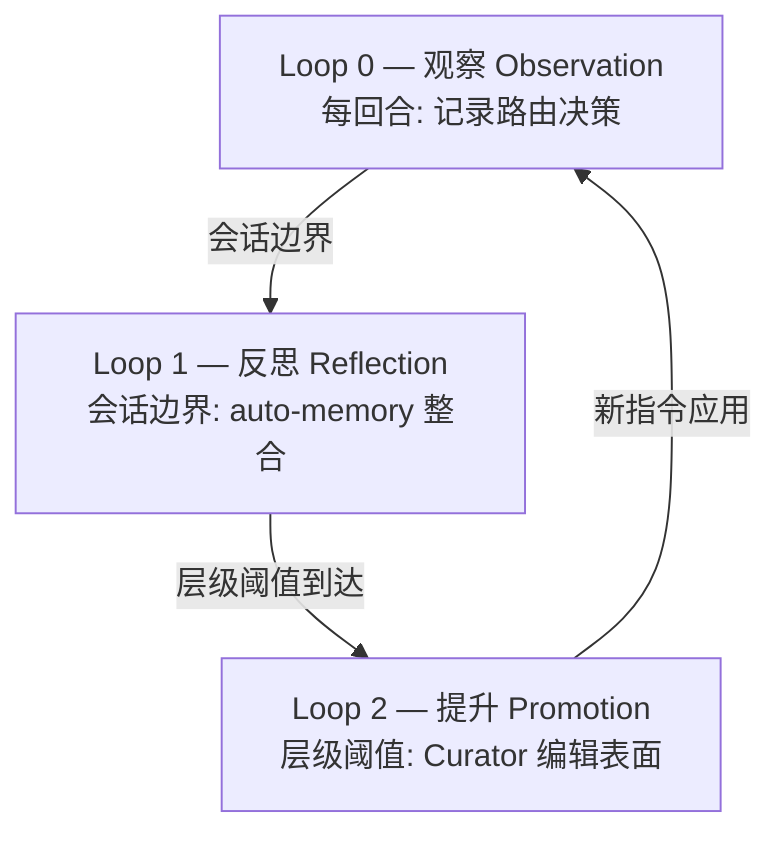

线束竞争力的核心在于自我改善设计。正如 Lilian Weng 的"Harness Engineering for Self-Improvement"(2026-07-04)所命名的，线束是围绕模型的执行/运营层，自我改善的现实路径不是权重而是这一层的改善。本页正式文档化 MoAI-ADK 的自我进化线束 — ACE 3-Loop 架构。

## 为何自我进化

根据 Weng 的框架，线束是决定 6 个轴(规划、工具、上下文、文件/记忆、评估、权限)的执行/运营层。自我改善的现实路径不是模型权重而是这一层的改善，优化目标从提示 → 结构化上下文 → 工作流 → 线束代码扩展。

MoAI-ADK 将此框架具体化为 ACE 角色模型(Generator → Reflector → Curator)和 3-Loop 结构。

## ACE 角色模型

Weng 的 ACE(Agentic Cognitive Engine)框架定义三个角色:

- **Generator** — 生成并执行轨迹(代理的实际工作执行)
- **Reflector** — 蒸馏轨迹以提取模式(从观察中导出学习信号)
- **Curator** — 以要点粒度更新指令(禁止全量重写，仅限管理块内 CRUD)

这三个角色被具体化为 3-Loop。

## 3-Loop 结构

### Loop 0 — 观察 (Observation, 每回合)

 所有路由决策以隐私保留摘要记录到 routing-ledger.jsonl。在 SPEC-HARNESS-EVOLVE-001 (CLOSED)中实现。记录字段包括路由决策、门控证据、`/moai loop` / `/goal` 收敛轨迹、子代理委派结果。

### Loop 1 — 反思 (Reflection, 会话边界)

 从观察数据中提取模式并整合到 auto-memory。层级 1-2 的观察进入临时记忆; 层级 3 以 append-only 记录在 CLAUDE.local.md 中。

### Loop 2 — 提升 (Promotion, 层级阈值)

 当观察频率达到层级阈值(1 / 3 / 5 / 10)时，Curator 更新可编辑表面。SPEC-HARNESS-EVOLVE-002 (CLOSED)实现了 Curator 编辑表面; SPEC-HARNESS-EVOLVE-003 (CLOSED)实现了生产接线(L2 Canary、L3 Contradiction、negative evidence)。

## 层级 ↔ 表面映射

4 级学习阶梯根据观察频率决定提升目标表面:

| 层级 | 阈值 | 表面 | 写入者 |
|------|------|------|--------|
| Tier 1-2 | ≥1 观察 | auto-memory (临时) | 自动 |
| Tier 3 | ≥3 观察 | CLAUDE.local.md (append-only) | 自动 |
| Tier 4 | ≥5 观察 | CLAUDE.md 管理块 (≤3K 字, ≤20 要点) | Curator |
| Tier 5 | ≥10 观察 + 用户批准 | CLAUDE.md / rules / agents | 用户批准必需 |

## 3-Zone 可编辑表面契约

为防止奖励黑客，可编辑表面严格分离到 3 个 Zone。

| Zone | 表面 | 保障措施 |
|------|------|---------|
| **Frozen** | `.claude/rules/` · `.claude/agents/moai/` · moai-* 技能 · 评估者 · 模板 · 权限表面 (settings.json · 钩子注册 · frozen-guard 本身) | L1 Frozen Guard 阻断路径。学习不能修改自己的成绩单或自己的围栏 |
| **Evolvable** | harness-* 技能 · `.claude/agents/harness/` · harness.yaml auto_detection 块 | 现有 5-layer 管道 + 模式范围验证 |
| **Learned** | CLAUDE.md 管理块 · CLAUDE.local.md Learned 部分 · routing-ledger.jsonl · lineage · negative evidence | 预算上限 + 过期修剪。详情在账本; 仅摘要常驻 |

 **权限轴 Frozen** (A1 增强): 不仅是评估者，settings.json、permission mode、钩子注册和 frozen-guard 本身也包含在 Frozen Zone 中。学习循环不能将自己的权限或安全机制作为提议对象。

## 生产接线 (EVOLVE-003)

SPEC-HARNESS-EVOLVE-003 (CLOSED)生产接线了 7 个核心要素:

1. **A1 Frozen 扩展** — 权限轴明确注册到 Frozen Zone
2. **A6 tier ↔ surface 映射** — harness.yaml auto_detection 块注册为 Tier 4 编辑表面
3. **A7 negative evidence** — 注册被拒绝/回滚的提升的模式键以抑制再提议
4. **L2 Canary** — held-out 验证(变更前后回归测试)
5. **L3 Contradiction** — 检测与现有指令矛盾的提升
6. **GLM observe-only** — GLM 会话仅观察; 提升提议生成限于 Opus/Fable 会话
7. **anti-fabrication** — 防止捏造未观察到的证据

## 路线图

 **进行中 (REQ-DA-063 诚实性说明)**: 自我进化线束的 Loop 0-2 已完成生产接线(EVOLVE-001/002/003 CLOSED)，但以下表面尚未实现:

- **EVOLVE-004** — console verbs (`/moai harness evolve/promote/demote/freeze`) — 用户从 CLI 直接控制提升/降级/冻结的动词
- **EVOLVE-005** — Recall wiring + typed parser — 2 层 Recall(常驻摘要 + 按需搜索账本)的完整接线 + harness-spec.yaml 的 typed Go 解析器

这些表面与 v5.1 MCE(Recall 本身的学习)及 v6 进化探索地平一起记载为路线图项目。以"进行中 / 路线图"而非"已实现"明示。

## 下一步

- [三层代理架构](/zh/advanced/no-haiku-3tier/) — 自我进化运作的基础模型架构
- [自主连续循环](/zh/advanced/autonomous-loops/) — `/moai loop` / `/goal` 收敛轨迹整合到 Loop 0 观察
- [代币经济学概述](/zh/advanced/tokenomics-overview/) — 自我进化与代币经济学的连接点
