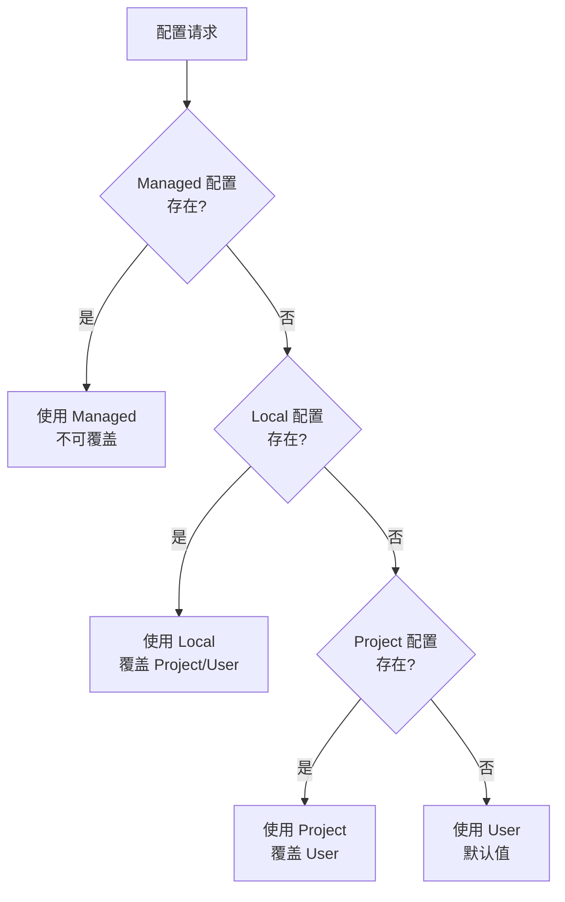
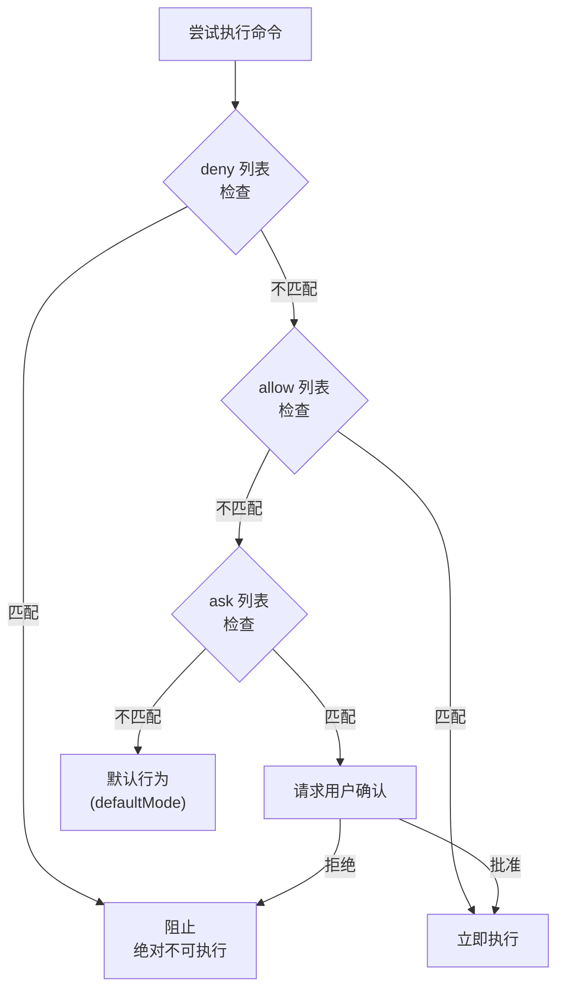

Claude Code 的设置文件体系详细介绍。


**一句话总结**: `settings.json` 是 Claude Code 的 **控制塔**。权限、环境变量、Hook、安全策略在一处管理。


## 配置范围 (Configuration Scopes)

Claude Code 使用 **范围系统** 决定配置应用的位置和共享对象。

### 4 种范围类型

| 范围 | 位置 | 影响对象 | 团队共享 | 优先级 |
|------|------|-----------|---------|----------|
| **Managed** | 系统级 `managed-settings.json` | 机器的所有用户 | ✅ (IT 部署) | 最高 |
| **User** | `~/.claude/` | 用户个人 (所有项目) | ❌ | 低 |
| **Project** | `.claude/` | 仓库的所有协作者 | ✅ (Git 追踪) | 中等 |
| **Local** | `.claude/*.local.*` | 用户 (仅此仓库) | ❌ | 高 |

### 范围优先级

当相同配置存在于多个范围时,更具体的范围优先:



**优先级:** Managed > 命令行参数 > Local > Project > User

### 各范围的用途

**Managed 范围** - 用于:
- 组织级安全策略
- 不可覆盖的合规要求
- IT/DevOps 部署的标准化配置

**User 范围** - 用于:
- 所有项目的个人设置 (主题、编辑器设置)
- 所有项目使用的工具和插件
- API 密钥和认证 (安全存储)

**Project 范围** - 用于:
- 团队共享设置 (权限、Hook、MCP 服务器)
- 团队应具有的插件
- 协作者间的工具标准化

**Local 范围** - 用于:
- 特定项目的个人覆盖
- 与团队共享前测试设置
- 对其他用户不生效的机器特定设置

## 文件位置

MoAI-ADK 使用 4 个设置文件位置。

| 文件 | 位置 | 用途 | Git 追踪 |
|------|------|------|----------|
| `managed-settings.json` | 系统级* | 托管设置 (IT 部署) | 否 |
| `settings.json` (User) | `~/.claude/settings.json` | 个人全局设置 | 否 |
| `settings.json` (Project) | `.claude/settings.json` | 团队共享设置 | 是 |
| `settings.local.json` | `.claude/settings.local.json` | 个人项目设置 | 否 |

**系统级位置:**
- macOS: `/Library/Application Support/ClaudeCode/`
- Linux/WSL: `/etc/claude-code/`
- Windows: `C:\Program Files\ClaudeCode\`


**注意**: `.claude/settings.json` 在 MoAI-ADK 更新时会被覆盖。个人设置必须写在 `settings.local.json` 或 `~/.claude/settings.json` 中。


## settings.json 是什么?

`settings.json` 是 Claude Code 的 **全局设置文件**。定义哪些命令自动允许、哪些命令阻止、执行哪些 Hook、环境变量设置为何值。

## 整体结构

```json
{
  "model": "",
  "language": "",
  "attribution": {},
  "companyAnnouncements": [],
  "autoUpdatesChannel": "",
  "spinnerTipsEnabled": true,
  "terminalProgressBarEnabled": true,
  "sandbox": {},
  "hooks": {},
  "permissions": {},
  "enabledPlugins": {},
  "extraKnownMarketplaces": {},
  "enableAllProjectMcpServers": false,
  "enabledMcpjsonServers": [],
  "disabledMcpjsonServers": [],
  "fileSuggestion": {},
  "alwaysThinkingEnabled": false,
  "maxThinkingTokens": 0,
  "statusLine": {},
  "outputStyle": "",
  "cleanupPeriodDays": 30,
  "env": {}
}
```

## 核心设置参考

### model

覆盖使用的默认模型。

```json
{
  "model": "claude-sonnet-4-5-20250929"
}
```

### language

设置 Claude 的默认响应语言。

```json
{
  "language": "korean"
}
```

支持语言: `"korean"`, `"japanese"`, `"spanish"`, `"french"` 等

### cleanupPeriodDays

启动时删除超过此期间的非活动会话。设置为 `0` 则立即删除所有会话。(默认值: 30 天)

```json
{
  "cleanupPeriodDays": 20
}
```

### autoUpdatesChannel

遵循更新的发布渠道。

```json
{
  "autoUpdatesChannel": "stable"
}
```

- `"stable"`: 大约一周前的版本,跳过主要回归
- `"latest"` (默认值): 最新发布版本

### spinnerTipsEnabled

Claude 工作时是否在转圈器中显示提示。设置为 `false` 则禁用提示。(默认值: `true`)

```json
{
  "spinnerTipsEnabled": false
}
```

### terminalProgressBarEnabled

在支持的终端(如 Windows Terminal 和 iTerm2)中启用显示进度的终端进度条。(默认值: `true`)

```json
{
  "terminalProgressBarEnabled": false
}
```

### showTurnDuration

响应后显示回合持续时间消息 (例如: "Cooked for 1m 6s")。设置为 `false` 则隐藏此消息。

```json
{
  "showTurnDuration": true
}
```

### respectGitignore

控制 `@` 文件选择器是否遵守 `.gitignore` 模式。`true`(默认值) 则与 `.gitignore` 模式匹配的文件从建议中排除。

```json
{
  "respectGitignore": false
}
```

### plansDirectory

自定义保存计划文件的位置。路径相对于项目根目录。默认值: `~/.claude/plans`

```json
{
  "plansDirectory": "./plans"
}
```

## 权限设置

管理 Claude Code 可以执行的命令权限。

### 权限结构

```json
{
  "permissions": {
    "defaultMode": "default",
    "allow": [],
    "ask": [],
    "deny": [],
    "additionalDirectories": [],
    "disableBypassPermissionsMode": "disable"
  }
}
```

### defaultMode

打开 Claude Code 时的默认权限模式。

| 值 | 说明 |
|-----|------|
| `"acceptEdits"` | 自动允许文件编辑 |
| `"allowEdits"` | 允许文件编辑 |
| `"rejectEdits"` | 拒绝文件编辑 |
| `"default"` | 默认行为 |


**参考**: 当前 MoAI-ADK 设置文件使用 `"defaultMode": "default"`。这可能是遗留值。


### allow (自动允许)

**无需用户确认即可立即执行**的命令列表。

**默认允许的命令类别:**

| 类别 | 命令示例 | 数量 |
|----------|-------------|------|
| 文件工具 | `Read`, `Write`, `Edit`, `Glob`, `Grep` | 7 个 |
| Git 命令 | `git add`, `git commit`, `git diff`, `git log` 等 | 15 个+ |
| 包管理 | `npm`, `pip`, `uv`, `npx` | 4 个 |
| 构建/测试 | `pytest`, `make`, `node`, `python` | 10 个+ |
| 代码质量 | `ruff`, `black`, `prettier`, `eslint` | 6 个+ |
| 探索工具 | `ls`, `find`, `tree`, `cat`, `head` | 10 个+ |
| GitHub CLI | `gh issue`, `gh pr`, `gh repo view` | 3 个 |
| MCP 工具 | `mcp__context7__*`, `mcp__sequential-thinking__*` | 3 个 |
| 其他 | `AskUserQuestion`, `Task`, `Skill`, `TodoWrite` | 4 个 |

**allow 格式示例:**

```json
{
  "allow": [
    "Read",                          // 仅工具名称
    "Bash(git add:*)",               // Bash + 命令模式
    "Bash(pytest:*)",                // 通配符
    "mcp__context7__resolve-library-id",  // MCP 工具
    "Bash(npm run *)",               // 空格分隔 (新格式)
    "WebFetch(domain:example.com)"   // 域名模式
  ]
}
```

### ask (确认后执行)

**请求用户确认后执行**的命令列表。

```json
{
  "ask": [
    "Bash(chmod:*)",       // 文件权限更改
    "Bash(chown:*)",       // 所有权更改
    "Bash(rm:*)",          // 文件删除
    "Bash(sudo:*)",        // 管理员权限
    "Read(./.env)",        // 读取环境变量文件
    "Read(./.env.*)"       // 读取环境变量文件
  ]
}
```

**ask 工作方式:**
1. Claude Code 尝试执行该命令
2. 向用户请求确认 "是否执行此命令?"
3. 用户批准则执行,拒绝则中断

### deny (无条件阻止)

**任何情况下都绝不执行**的命令列表。

**阻止类别:**

| 类别 | 阻止模式 | 原因 |
|----------|-----------|------|
| 敏感文件访问 | `Read(./secrets/**)`, `Write(~/.ssh/**)` | 保护安全凭证 |
| 云凭证 | `Read(~/.aws/**)`, `Read(~/.config/gcloud/**)` | 保护云账户 |
| 系统破坏 | `Bash(rm -rf /:*)`, `Bash(rm -rf ~:*)` | 系统保护 |
| 危险 Git | `Bash(git push --force:*)`, `Bash(git reset --hard:*)` | 代码保护 |
| 磁盘格式化 | `Bash(dd:*)`, `Bash(mkfs:*)`, `Bash(fdisk:*)` | 磁盘保护 |
| 系统命令 | `Bash(reboot:*)`, `Bash(shutdown:*)` | 系统稳定性 |
| 数据库删除 | `Bash(DROP DATABASE:*)`, `Bash(TRUNCATE:*)` | 数据保护 |

**deny 格式示例:**

```json
{
  "deny": [
    "Read(./secrets/**)",           // 阻止读取秘密目录
    "Write(~/.ssh/**)",             // 阻止修改 SSH 密钥
    "Bash(git push --force:*)",     // 阻止强制推送
    "Bash(rm -rf /:*)",            // 阻止删除根目录
    "Bash(DROP DATABASE:*)"        // 阻止删除数据库
  ]
}
```

### additionalDirectories

Claude 可以访问的额外工作目录。

```json
{
  "permissions": {
    "additionalDirectories": [
      "../docs/"
    ]
  }
}
```

### disableBypassPermissionsMode

防止激活 `bypassPermissions` 模式。禁用 `--dangerously-skip-permissions` 命令行标志。

```json
{
  "permissions": {
    "disableBypassPermissionsMode": "disable"
  }
}
```

## 权限规则语法 (Permission Rule Syntax)

权限规则遵循 `Tool` 或 `Tool(specifier)` 格式。

### 规则评估顺序

当多个规则与同一工具使用匹配时,规则按以下顺序评估:

1. **Deny** 规则首先检查
2. **Ask** 规则其次检查
3. **Allow** 规则最后检查

第一个匹配的规则决定操作。即 deny 规则始终优先于 allow 规则。

### 匹配工具的所有使用

要匹配工具的所有使用,仅使用工具名称而不加括号:

| 规则 | 效果 |
|------|------|
| `Bash` | 匹配 **所有** Bash 命令 |
| `WebFetch` | 匹配 **所有** 网页获取请求 |
| `Read` | 匹配 **所有** 文件读取 |

`Bash(*)` 与 `Bash` 相同,匹配所有 Bash 命令。两种语法可互换使用。

### 用于细粒度控制的指定符

在括号内添加指定符以匹配特定工具使用:

| 规则 | 效果 |
|------|------|
| `Bash(npm run build)` | 匹配精确命令 `npm run build` |
| `Read(./.env)` | 匹配读取当前目录的 `.env` 文件 |
| `WebFetch(domain:example.com)` | 匹配对 example.com 的获取请求 |

### 通配符模式

Bash 规则支持 `*` 与 glob 模式。通配符可以出现在命令的开始、中间、结束等任何位置。

```json
{
  "permissions": {
    "allow": [
      "Bash(npm run *)",
      "Bash(git commit *)",
      "Bash(git * main)",
      "Bash(* --version)",
      "Bash(* --help *)"
    ],
    "deny": [
      "Bash(git push *)"
    ]
  }
}
```

**重要:** `*` 前的空格很重要:
- `Bash(ls *)` 匹配 `ls -la` 但不匹配 `lsof`
- `Bash(ls*)` 匹配两者

**遗留语法:** `:*` 后缀语法 (例如: `Bash(npm run:*)`) 与 `*` 相同但不推荐使用。

### 域名特定模式

对于 WebFetch 等工具可以使用域名特定模式:

```json
{
  "permissions": {
    "allow": [
      "WebFetch(domain:docs.anthropic.com)",
      "WebFetch(domain:github.com)"
    ],
    "deny": [
      "WebFetch(domain:malicious-site.com)"
    ]
  }
}
```

### 权限优先级图表



**优先级:** `deny` > `ask` > `allow` > `defaultMode`

## 沙箱设置 (Sandbox Settings)

配置高级沙箱行为。沙箱在文件系统和网络中隔离 bash 命令。


**重要**: 文件系统和网络限制通过 Read、Edit、WebFetch 权限规则配置,而非通过沙箱设置。


```json
{
  "sandbox": {
    "enabled": true,
    "autoAllowBashIfSandboxed": true,
    "excludedCommands": ["docker"],
    "allowUnsandboxedCommands": false,
    "network": {
      "allowUnixSockets": [
        "/var/run/docker.sock"
      ],
      "allowLocalBinding": true,
      "httpProxyPort": 8080,
      "socksProxyPort": 8081
    },
    "enableWeakerNestedSandbox": false
  }
}
```

### 沙箱设置参考

| 键 | 说明 | 示例 |
|-----|------|------|
| `enabled` | 启用 bash 沙箱 (macOS、Linux、WSL2)。默认值: false | `true` |
| `autoAllowBashIfSandboxed` | 自动批准沙箱化的 bash 命令。默认值: true | `true` |
| `excludedCommands` | 必须在沙箱外执行的命令 | `["docker", "git"]` |
| `allowUnsandboxedCommands` | 允许命令通过 `dangerouslyDisableSandbox` 参数在沙箱外执行。默认值: true | `false` |
| `network.allowUnixSockets` | 沙箱中可访问的 Unix 套接字路径 (SSH 代理等) | `["~/.ssh/agent-socket"]` |
| `network.allowLocalBinding` | 允许绑定到 localhost 端口 (仅 macOS)。默认值: false | `true` |
| `network.httpProxyPort` | 如果有自己的代理,HTTP 代理端口 | `8080` |
| `network.socksProxyPort` | 如果有自己的代理,SOCKS5 代理端口 | `8081` |
| `enableWeakerNestedSandbox` | 为无权限 Docker 环境启用弱沙箱 (仅 Linux、WSL2)。**安全性降低**。默认值: false | `true` |

## 归属设置 (Attribution Settings)

Claude Code 为 git 提交和拉取请求添加归属。这些是单独配置的。

```json
{
  "attribution": {
    "commit": "Custom attribution text\n\nCo-Authored-By: AI <email@example.com>",
    "pr": ""
  }
}
```

### 归属设置参考

| 键 | 说明 |
|-----|------|
| `commit` | git 提交的归属 (包括预告片)。空字符串隐藏提交归属 |
| `pr` | 拉取请求描述的归属。空字符串隐藏 PR 归属 |

### 默认提交归属

```
🤖 Generated with [Claude Code](https://code.claude.com)

Co-Authored-By: Claude Sonnet 4.5 <noreply@anthropic.com>
```

### 默认 PR 归属

```
🤖 Generated with [Claude Code](https://claude.com/claude-code)
```

## Hook 设置

注册响应 Claude Code 事件的脚本。

```json
{
  "hooks": {
    "SessionStart": [
      {
        "matcher": "",
        "hooks": [
          {
            "type": "command",
            "command": "脚本路径"
          }
        ]
      }
    ],
    "PreToolUse": [
      {
        "matcher": "Write|Edit",
        "hooks": [
          {
            "type": "command",
            "command": "安全守卫脚本路径",
            "timeout": 5000
          }
        ]
      }
    ],
    "PostToolUse": [
      {
        "matcher": "Write|Edit",
        "hooks": [
          {
            "type": "command",
            "command": "格式化器脚本路径",
            "timeout": 30000
          },
          {
            "type": "command",
            "command": "语法检查器脚本路径",
            "timeout": 60000
          }
        ]
      }
    ]
  }
}
```

### Hook 事件类型

| 事件 | 说明 |
|--------|------|
| `SessionStart` | 会话开始时执行 |
| `SessionEnd` | 会话结束时执行 |
| `PreToolUse` | 工具使用前执行 |
| `PostToolUse` | 工具使用后执行 |
| `PreCompact` | 上下文压缩前执行 |


Hook 设置的详细内容请参考 [Hooks 指南](/advanced/hooks-guide)。


## 插件设置 (Plugin Settings)

插件相关设置。

```json
{
  "enabledPlugins": {
    "formatter@acme-tools": true,
    "deployer@acme-tools": true,
    "analyzer@security-plugins": false
  },
  "extraKnownMarketplaces": {
    "acme-tools": {
      "source": {
        "source": "github",
        "repo": "acme-corp/claude-plugins"
      }
    }
  }
}
```

### enabledPlugins

控制要激活的插件。格式: `"plugin-name@marketplace-name": true/false`

**范围:**
- **User settings** (`~/.claude/settings.json`): 个人插件偏好
- **Project settings** (`.claude/settings.json`): 团队共享的项目特定插件
- **Local settings** (`.claude/settings.local.json`): 机器级覆盖 (不提交)

### extraKnownMarketplaces

定义额外的市场以在仓库中可用。通常用于仓库级设置,使团队成员可以访问所需的插件源。

## MCP 设置 (MCP Settings)

MCP (Model Context Protocol) 服务器相关设置。

```json
{
  "enableAllProjectMcpServers": true,
  "enabledMcpjsonServers": ["memory", "github"],
  "disabledMcpjsonServers": ["filesystem"]
}
```

### MCP 设置参考

| 键 | 说明 | 示例 |
|-----|------|------|
| `enableAllProjectMcpServers` | 自动批准项目 `.mcp.json` 文件中定义的所有 MCP 服务器 | `true` |
| `enabledMcpjsonServers` | 要批准的特定 MCP 服务器列表 | `["memory", "github"]` |
| `disabledMcpjsonServers` | 要拒绝的特定 MCP 服务器列表 | `["filesystem"]` |
| `allowedMcpServers` | 仅在 managed-settings.json 中使用。MCP 服务器允许列表 | `[{ "serverName": "github" }]` |
| `deniedMcpServers` | 仅在 managed-settings.json 中使用。MCP 服务器拒绝列表 (优先应用) | `[{ "serverName": "filesystem" }]` |

## 文件建议设置 (File Suggestion Settings)

配置 `@` 文件路径自动完成的自定义命令。

```json
{
  "fileSuggestion": {
    "type": "command",
    "command": "~/.claude/file-suggestion.sh"
  }
}
```

内置文件建议使用快速文件系统遍历,但大型单体仓库可以从项目特定索引中受益 (例如: 预构建的文件索引或自定义工具)。

## 扩展思考设置 (Extended Thinking Settings)

扩展思考 (Extended Thinking) 相关设置。

```json
{
  "alwaysThinkingEnabled": true,
  "maxThinkingTokens": 10000
}
```

### 扩展思考设置参考

| 键 | 说明 | 示例 |
|-----|------|------|
| `alwaysThinkingEnabled` | 默认在所有会话中启用扩展思考 | `true` |
| `maxThinkingTokens` | 覆盖思考 token 预算 (默认值: 31999, 0 = 禁用) | `10000` |

也可以通过环境变量设置:
- `MAX_THINKING_TOKENS=10000`: 思考 token 限制
- `MAX_THINKING_TOKENS=0`: 禁用思考

## 公司公告 (Company Announcements)

启动时向用户显示的公告。提供多个公告时会随机循环。

```json
{
  "companyAnnouncements": [
    "Welcome to Acme Corp! Review our code guidelines at docs.acme.com",
    "Reminder: Code reviews required for all PRs",
    "New security policy in effect"
  ]
}
```

## 状态栏设置

配置显示在 Claude Code 底部的状态栏。

```json
{
  "statusLine": {
    "type": "command",
    "command": "${SHELL:-/bin/bash} -l -c 'uv run --no-sync moai-adk statusline'",
    "padding": 0,
    "refreshInterval": 300
  }
}
```

| 字段 | 说明 |
|------|------|
| `type` | `"command"` (命令执行) |
| `command` | 要执行的命令 (返回状态信息) |
| `padding` | 内边距大小 |
| `refreshInterval` | 刷新周期 (毫秒) |

## 输出样式设置

```json
{
  "outputStyle": "R2-D2"
}
```

输出样式决定 Claude Code 的响应格式。可以在 `settings.local.json` 中更改为个人偏好的样式。

## 环境变量设置

在 `env` 部分设置控制 Claude Code 行为的环境变量。

### MoAI-ADK 环境变量


**MoAI-ADK 扩展**: 此设置特定于 MoAI-ADK,不是官方 Claude Code 的一部分。


```json
{
  "env": {
    "MOAI_CONFIG_SOURCE": "sections"
  }
}
```

| 变量 | 值 | 说明 |
|------|-----|------|
| `MOAI_CONFIG_SOURCE` | `"sections"` | MoAI 配置源方式 |

### 官方 Claude Code 环境变量

```json
{
  "env": {
    "ENABLE_TOOL_SEARCH": "auto:5",
    "MAX_THINKING_TOKENS": "31999",
    "CLAUDE_CODE_FILE_READ_MAX_OUTPUT_TOKENS": "64000",
    "CLAUDE_CODE_MAX_OUTPUT_TOKENS": "32000",
    "CLAUDE_AUTOCOMPACT_PCT_OVERRIDE": "50"
  }
}
```

### 主要环境变量参考

| 变量 | 值 | 说明 |
|------|-----|------|
| `ENABLE_TOOL_SEARCH` | `"auto"`, `"auto:N"`, `"true"`, `"false"` | MCP 工具搜索控制 |
| `MAX_THINKING_TOKENS` | `0`-`31999` | 思考 token 限制 (0=禁用) |
| `CLAUDE_CODE_MAX_OUTPUT_TOKENS` | `1`-`64000` | 最大输出 token (默认值: 32000) |
| `CLAUDE_CODE_FILE_READ_MAX_OUTPUT_TOKENS` | 数字 | 文件读取最大输出 token |
| `CLAUDE_AUTOCOMPACT_PCT_OVERRIDE` | `1`-`100` | 自动压缩触发百分比 (默认值: ~95%) |
| `CLAUDE_CODE_ENABLE_TELEMETRY` | `"1"` | 启用 OpenTelemetry 数据收集 |
| `CLAUDE_CODE_DISABLE_BACKGROUND_TASKS` | `"1"` | 禁用后台任务 |
| `DISABLE_AUTOUPDATER` | `"1"` | 禁用自动更新 |
| `HTTP_PROXY` | URL | HTTP 代理服务器 |
| `HTTPS_PROXY` | URL | HTTPS 代理服务器 |


**提示**: `ENABLE_TOOL_SEARCH` 值 `"auto:5"` 在上下文使用量为 5% 时激活工具搜索。`"auto"` 为默认 10%,`"true"` 始终启用,`"false"` 始终禁用。


### 工具搜索详情

`ENABLE_TOOL_SEARCH` 控制 MCP 工具搜索:

| 值 | 说明 |
|-----|------|
| `"auto"` (默认值) | 在 10% 上下文时激活 |
| `"auto:N"` | 自定义阈值 (例如: `"auto:5"` 为 5%) |
| `"true"` | 始终激活 |
| `"false"` | 禁用 |

## settings.json vs settings.local.json

| 项目 | settings.json | settings.local.json |
|------|---------------|---------------------|
| 管理主体 | MoAI-ADK | 用户 |
| Git 追踪 | 被追踪 | .gitignore |
| 更新时 | 覆盖 | 保留 |
| 用途 | 团队共享设置 | 个人设置 |
| 优先级 | 默认值 | 覆盖 (优先) |

### settings.local.json 使用示例

```json
{
  "permissions": {
    "allow": [
      "Bash(bun:*)",     // 个人使用的工具
      "Bash(bun add:*)"
    ]
  },
  "enabledMcpjsonServers": [
    "context7"          // 个人激活的 MCP 服务器
  ],
  "outputStyle": "Mr.Alfred"  // 个人偏好的输出样式
}
```


`settings.local.json` 的设置与 `settings.json` 的设置 **合并**。相同键存在时 `settings.local.json` 优先。


## MoAI 专用设置


**MoAI-ADK 扩展**: 此部分的设置特定于 MoAI-ADK,不包含在官方 Claude Code 文档中。


### MoAI 自定义 statusLine

MoAI-ADK 提供自定义状态栏:

```json
{
  "statusLine": {
    "type": "command",
    "command": "${SHELL:-/bin/bash} -l -c 'uv run --no-sync moai-adk statusline'",
    "padding": 0,
    "refreshInterval": 300
  }
}
```

### MoAI Statusline v3 功能

MoAI-ADK statusline v3 包含以下功能：

- **RGB 渐变颜色**: 基于系统状态的动态颜色渐变
- **5H/7D 使用量监控**: 5小时和7天 API 使用量条显示
- **多行布局**: Compact（3行）、default 和 full 显示模式
- **主题**:
  - **MoAI Dark**（默认）: 带 RGB 渐变的深色主题
  - **MoAI Light**: 适用于明亮环境的浅色主题


**注意**: 以前的主题（Default、Catppuccin Mocha、Catppuccin Latte）已重命名为 MoAI Dark/MoAI Light。


statusline 主题和段落在 `.moai/config/sections/statusline.yaml` 中配置。
### MoAI 自定义 Hooks

MoAI-ADK 提供以下自定义 Hook:

```json
{
  "hooks": {
    "SessionStart": [
      {
        "matcher": "",
        "hooks": [
          {
            "type": "command",
            "command": "/bin/zsh -l -c 'uv run \"$CLAUDE_PROJECT_DIR/.claude/hooks/moai/session_start__show_project_info.py\"'"
          }
        ]
      }
    ],
    "PreCompact": [
      {
        "matcher": "",
        "hooks": [
          {
            "type": "command",
            "command": "/bin/zsh -l -c 'uv run \"$CLAUDE_PROJECT_DIR/.claude/hooks/moai/pre_compact__save_context.py\"'",
            "timeout": 5000
          }
        ]
      }
    ],
    "SessionEnd": [
      {
        "matcher": "",
        "hooks": [
          {
            "type": "command",
            "command": "/bin/zsh -l -c 'uv run \"$CLAUDE_PROJECT_DIR/.claude/hooks/moai/session_end__auto_cleanup.py\" &'"
          }
        ]
      }
    ],
    "PreToolUse": [
      {
        "matcher": "Write|Edit",
        "hooks": [
          {
            "type": "command",
            "command": "/bin/zsh -l -c 'uv run \"$CLAUDE_PROJECT_DIR/.claude/hooks/moai/pre_tool__security_guard.py\"'",
            "timeout": 5000
          }
        ]
      }
    ],
    "PostToolUse": [
      {
        "matcher": "Write|Edit",
        "hooks": [
          {
            "type": "command",
            "command": "/bin/zsh -l -c 'uv run \"$CLAUDE_PROJECT_DIR/.claude/hooks/moai/post_tool__code_formatter.py\"'",
            "timeout": 30000
          },
          {
            "type": "command",
            "command": "/bin/zsh -l -c 'uv run \"$CLAUDE_PROJECT_DIR/.claude/hooks/moai/post_tool__linter.py\"'",
            "timeout": 60000
          },
          {
            "type": "command",
            "command": "/bin/zsh -l -c 'uv run \"$CLAUDE_PROJECT_DIR/.claude/hooks/moai/post_tool__ast_grep_scan.py\"'",
            "timeout": 30000
          }
        ]
      }
    ]
  }
}
```

### MoAI 输出样式

```json
{
  "outputStyle": "Mr.Alfred"
}
```

此样式提供 Alfred AI 协调器的独特响应格式。

## 实战示例: 设置自定义

### 添加新工具允许

如果项目使用 `bun`,在 `settings.local.json` 中添加。

```json
{
  "permissions": {
    "allow": [
      "Bash(bun:*)",
      "Bash(bun add:*)",
      "Bash(bun remove:*)",
      "Bash(bun run:*)"
    ]
  }
}
```

### 激活 MCP 服务器

激活 Context7 MCP 服务器。

```json
{
  "enabledMcpjsonServers": [
    "context7"
  ]
}
```

### 激活沙箱

为安全激活沙箱并排除 Docker。

```json
{
  "sandbox": {
    "enabled": true,
    "autoAllowBashIfSandboxed": true,
    "excludedCommands": ["docker"],
    "network": {
      "allowUnixSockets": [
        "/var/run/docker.sock"
      ]
    }
  },
  "permissions": {
    "deny": [
      "Read(.envrc)",
      "Read(~/.aws/**)"
    ]
  }
}
```

### 添加自定义 Hook

注册个人 Hook。

```json
{
  "hooks": {
    "PostToolUse": [
      {
        "matcher": "Write|Edit",
        "hooks": [
          {
            "type": "command",
            "command": "python3 .claude/hooks/my-hooks/custom_check.py",
            "timeout": 10000
          }
        ]
      }
    ]
  }
}
```

### 自定义归属设置

```json
{
  "attribution": {
    "commit": "Generated with AI\n\nCo-Authored-By: AI <email@example.com>",
    "pr": ""
  }
}
```

## 相关文档

- [Claude Code 官方设置文档](https://code.claude.com/docs/en/settings) - 官方 Claude Code 设置
- [Hooks 指南](/advanced/hooks-guide) - Hook 设置详情
- [CLAUDE.md 指南](/advanced/claude-md-guide) - 项目指令设置
- [MCP 服务器使用](/advanced/mcp-servers) - MCP 服务器配置方法
- [IAM 文档](https://code.claude.com/docs/en/iam) - 权限系统概述


**提示**: 更改设置后需要重启 Claude Code 才能生效。`settings.local.json` 不被 Git 追踪,因此可以根据个人环境自由修改。

