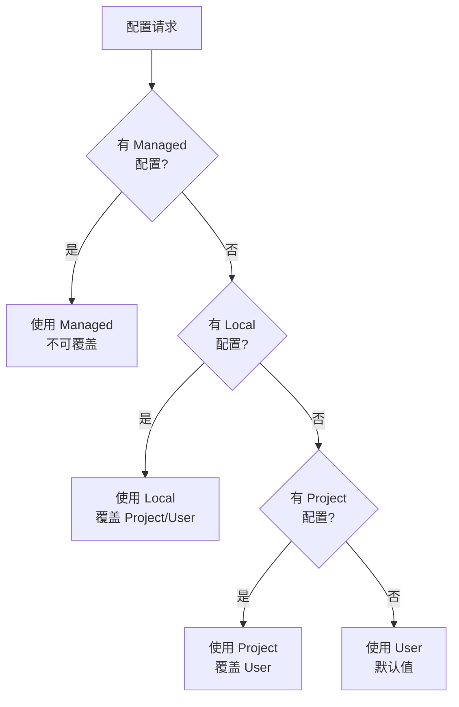
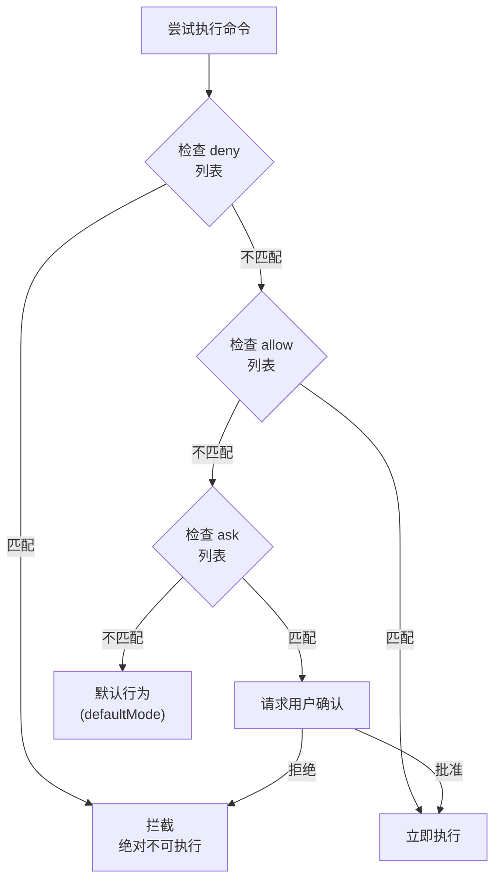

详细介绍 Claude Code 的配置文件体系。在把执行权限委托给智能体的 Harness 中，settings.json 是划定这条委托边界的文件 — 自动允许什么、什么需要询问、什么绝对拦截，全部在这里决定。


**一句话总结**：`settings.json` 是 Claude Code 的 **管制塔**。权限、环境变量、Hook、安全策略在一处集中管理。


## 配置作用域 (Configuration Scopes)

Claude Code 使用 **作用域系统** 决定配置生效的位置与共享对象。

### 4 种作用域类型

| 作用域 | 位置 | 影响对象 | 团队共享 | 优先级 |
|------|------|-----------|---------|----------|
| **Managed** | 系统级 `managed-settings.json` | 机器上的所有用户 | ✓（IT 分发） | 最高 |
| **User** | `~/.claude/` | 用户个人（所有项目） | ✗ | 低 |
| **Project** | `.claude/` | 仓库的所有协作者 | ✓（Git 跟踪） | 中 |
| **Local** | `.claude/*.local.*` | 用户（仅本仓库） | ✗ | 高 |

### 按作用域的优先级

同一配置存在于多个作用域时，更具体的作用域优先。


```mermaid
flowchart TD
    A[配置请求] --> B{有 Managed<br>配置?}
    B -->|是| C[使用 Managed<br>不可覆盖]
    B -->|否| D{有 Local<br>配置?}
    D -->|是| E[使用 Local<br>覆盖 Project/User]
    D -->|否| F{有 Project<br>配置?}
    F -->|是| G[使用 Project<br>覆盖 User]
    F -->|否| H[使用 User<br>默认值]
```

**优先级：** Managed > 命令行参数 > Local > Project > User

### 各作用域的用途

**Managed 作用域** - 用于：
- 组织范围强制适用的安全策略
- 不可被覆盖的合规要求
- IT/DevOps 分发的标准化配置

**User 作用域** - 用于：
- 想在所有项目使用的个人设置（主题、编辑器设置）
- 在所有项目使用的工具与插件
- API 密钥与认证（安全存储）

**Project 作用域** - 用于：
- 团队共享设置（权限、Hook、MCP 服务器）
- 团队应有的插件
- 协作者之间的工具标准化

**Local 作用域** - 用于：
- 特定项目的个人覆盖
- 与团队共享前测试配置
- 对其他用户不生效的按机器设置

## 文件位置

MoAI-ADK 使用 4 个配置文件位置。

| 文件 | 位置 | 用途 | Git 跟踪 |
|------|------|------|----------|
| `managed-settings.json` | 系统级* | 托管配置（IT 分发） | 否 |
| `settings.json` (User) | `~/.claude/settings.json` | 个人全局配置 | 否 |
| `settings.json` (Project) | `.claude/settings.json` | 团队共享配置 | 是 |
| `settings.local.json` | `.claude/settings.local.json` | 个人项目配置 | 否 |

**系统级位置：**
- macOS：`/Library/Application Support/ClaudeCode/`
- Linux/WSL：`/etc/claude-code/`
- Windows：`C:\Program Files\ClaudeCode\`


**注意**：`.claude/settings.json` 会在 MoAI-ADK 更新时被覆盖。个人配置务必写在 `settings.local.json` 或 `~/.claude/settings.json`。


## 什么是 settings.json？

`settings.json` 是 Claude Code 的 **全局配置文件**。它定义哪些命令自动允许、哪些命令拦截、执行哪些 Hook、设置哪些环境变量。

## 完整结构

```json
{
  "model": "",
  "language": "",
  "attribution": {},
  "companyAnnouncements": [],
  "autoUpdatesChannel": "",
  "spinnerTipsEnabled": true,
  "terminalProgressBarEnabled": true,
  "sandbox": {},
  "hooks": {},
  "permissions": {},
  "enabledPlugins": {},
  "extraKnownMarketplaces": {},
  "enableAllProjectMcpServers": false,
  "enabledMcpjsonServers": [],
  "disabledMcpjsonServers": [],
  "fileSuggestion": {},
  "alwaysThinkingEnabled": false,
  "maxThinkingTokens": 0,
  "statusLine": {},
  "outputStyle": "",
  "cleanupPeriodDays": 30,
  "env": {}
}
```

## 核心配置参考

### model

覆盖要使用的默认模型。

```json
{
  "model": "claude-sonnet-4-5-20250929"
}
```

### language

设置 Claude 的默认回复语言。

```json
{
  "language": "korean"
}
```

支持语言：`"korean"`、`"japanese"`、`"spanish"`、`"french"` 等

### cleanupPeriodDays

启动时删除比此期限更旧的非活动会话。设为 `0` 会立即删除所有会话。（默认：30 天）

```json
{
  "cleanupPeriodDays": 20
}
```

### autoUpdatesChannel

跟随更新的发布通道。

```json
{
  "autoUpdatesChannel": "stable"
}
```

- `"stable"`：约一周前的版本，跳过重大回归
- `"latest"`（默认）：最新发布

### spinnerTipsEnabled

Claude 工作时是否在 spinner 中显示提示。设为 `false` 禁用提示。（默认：`true`）

```json
{
  "spinnerTipsEnabled": false
}
```

### terminalProgressBarEnabled

在 Windows Terminal、iTerm2 等支持的终端中启用显示进度的终端进度条。（默认：`true`）

```json
{
  "terminalProgressBarEnabled": false
}
```

### showTurnDuration

在响应后显示回合耗时消息（例："Cooked for 1m 6s"）。设为 `false` 隐藏此消息。

```json
{
  "showTurnDuration": true
}
```

### respectGitignore

控制 `@` 文件选择器是否遵守 `.gitignore` 模式。为 `true`（默认）时，匹配 `.gitignore` 模式的文件会从建议中排除。

```json
{
  "respectGitignore": false
}
```

### plansDirectory

自定义计划文件的保存位置。路径相对于项目根目录。默认：`~/.claude/plans`

```json
{
  "plansDirectory": "./plans"
}
```

## 权限配置

管理 Claude Code 可执行命令的权限。权限设计的目标有两个 — 让安全的命令无需确认地流转、不打断智能体循环；让危险的命令在任何情况下都无法通过。

### 权限结构

```json
{
  "permissions": {
    "defaultMode": "default",
    "allow": [],
    "ask": [],
    "deny": [],
    "additionalDirectories": [],
    "disableBypassPermissionsMode": "disable"
  }
}
```

### defaultMode

打开 Claude Code 时的默认权限模式。

| 值 | 说明 |
|-----|------|
| `"acceptEdits"` | 自动允许文件编辑 |
| `"allowEdits"` | 允许文件编辑 |
| `"rejectEdits"` | 拒绝文件编辑 |
| `"default"` | 默认行为 |


**备注**：当前 MoAI-ADK 配置文件使用 `"defaultMode": "default"`。这可能是遗留值。


### allow（自动允许）

无需用户确认 **立即允许执行** 的命令列表。

**默认允许的命令类别：**

| 类别 | 命令示例 | 数量 |
|----------|-------------|------|
| 文件工具 | `Read`, `Write`, `Edit`, `Glob`, `Grep` | 7 个 |
| Git 命令 | `git add`, `git commit`, `git diff`, `git log` 等 | 15 个以上 |
| 包管理 | `npm`, `pip`, `uv`, `npx` | 4 个 |
| 构建/测试 | `pytest`, `make`, `node`, `python` | 10 个以上 |
| 代码质量 | `ruff`, `black`, `prettier`, `eslint` | 6 个以上 |
| 探索工具 | `ls`, `find`, `tree`, `cat`, `head` | 10 个以上 |
| GitHub CLI | `gh issue`, `gh pr`, `gh repo view` | 2 个 |
| 其他 | `AskUserQuestion`, `Task`, `Skill`, `TodoWrite` | 4 个 |

**allow 格式示例：**

```json
{
  "allow": [
    "Read",                          // 仅工具名
    "Bash(git add:*)",               // Bash + 命令模式
    "Bash(pytest:*)",                // 通配符
    "mcp__context7__resolve-library-id",  // MCP 工具
    "WebFetch(domain:example.com)"   // 域名模式
  ]
}
```

### ask（确认后执行）

**向用户请求确认后再执行** 的命令列表。

```json
{
  "ask": [
    "Bash(chmod:*)",       // 更改文件权限
    "Bash(chown:*)",       // 更改所有权
    "Bash(rm:*)",          // 删除文件
    "Bash(sudo:*)",        // 管理员权限
    "Read(./.env)",        // 读取环境变量文件
    "Read(./.env.*)"       // 读取环境变量文件
  ]
}
```

**ask 的运作方式：**
1. Claude Code 尝试执行该命令
2. 向用户请求"要执行这条命令吗？"的确认
3. 用户批准则执行，拒绝则中止

### deny（无条件拦截）

在任何情况下都 **绝不执行** 的命令列表。

**拦截类别：**

| 类别 | 拦截模式 | 理由 |
|----------|-----------|------|
| 敏感文件访问 | `Read(./secrets/**)`, `Write(~/.ssh/**)` | 保护安全凭据 |
| 云凭据 | `Read(~/.aws/**)`, `Read(~/.config/gcloud/**)` | 保护云账号 |
| 系统破坏 | `Bash(rm -rf /:*)`, `Bash(rm -rf ~:*)` | 保护系统 |
| 危险 Git | `Bash(git push --force:*)`, `Bash(git reset --hard:*)` | 保护代码 |
| 磁盘格式化 | `Bash(dd:*)`, `Bash(mkfs:*)`, `Bash(fdisk:*)` | 保护磁盘 |
| 系统命令 | `Bash(reboot:*)`, `Bash(shutdown:*)` | 系统稳定性 |
| 删除数据库 | `Bash(DROP DATABASE:*)`, `Bash(TRUNCATE:*)` | 保护数据 |

**deny 格式示例：**

```json
{
  "deny": [
    "Read(./secrets/**)",           // 拦截读取密钥目录
    "Write(~/.ssh/**)",             // 拦截修改 SSH 密钥
    "Bash(git push --force:*)",     // 拦截强制推送
    "Bash(rm -rf /:*)",            // 拦截删除根目录
    "Bash(DROP DATABASE:*)"        // 拦截删除数据库
  ]
}
```

### additionalDirectories

Claude 可访问的额外工作目录。

```json
{
  "permissions": {
    "additionalDirectories": [
      "../docs/"
    ]
  }
}
```

### disableBypassPermissionsMode

阻止启用 `bypassPermissions` 模式。禁用 `--dangerously-skip-permissions` 命令行标志。

```json
{
  "permissions": {
    "disableBypassPermissionsMode": "disable"
  }
}
```

### disableBundledSkills

`disableBundledSkills`（布尔值，或环境变量形式）会把 Claude Code 捆绑的 skills 与工作流 — 例如 `/deep-research`、内置斜杠命令 skills — 从 discovery 中隐藏，只显示 enterprise + personal + project + plugin skills。设为 `true` 可提供一个精选的无捆绑 skill 表面。

```json
{
  "disableBundledSkills": true
}
```

`--safe-mode` CLI 标志在启动时应用同样的运行时效果（而非通过 settings）— 在锁定环境或调试某行为是否源自捆绑 skill 时很有用。MoAI-ADK 不生成 `disableBundledSkills`，也不自动传递 `--safe-mode`。两者都在此记录为可用选项。

## 权限规则语法 (Permission Rule Syntax)

权限规则遵循 `Tool` 或 `Tool(specifier)` 格式。也支持参数范围通配格式 `Tool(param:value)` — 例如 `WebFetch(domain:example.com)` 只允许对该域名的 WebFetch，`Bash(cmd:git status)` 匹配 `git status` 命令，值内部的 `*` 通配符可以扩大匹配范围（`WebFetch(domain:*.example.com)`、`Bash(cmd:git *)`）。这种参数范围格式比一般的 `Tool(specifier)` 格式提供更细粒度的控制。MoAI-ADK 目前不在自己的配置生成器中生成参数范围规则。此语法记录为需要参数级权限控制的项目的可用选项。

### 规则评估顺序

多条规则匹配同一次工具使用时，按以下顺序评估。

1. 先检查 **Deny** 规则
2. 其次检查 **Ask** 规则
3. 最后检查 **Allow** 规则

第一条匹配的规则决定行为。也就是说，deny 规则永远优先于 allow 规则。

### 匹配某工具的所有使用

要匹配某工具的所有使用，只写工具名不加括号。

| 规则 | 效果 |
|------|------|
| `Bash` | 匹配 **所有** Bash 命令 |
| `WebFetch` | 匹配 **所有** Web 获取请求 |
| `Read` | 匹配 **所有** 文件读取 |

`Bash(*)` 与 `Bash` 等价，匹配所有 Bash 命令。两种写法可以互换使用。

### 使用指定符做细粒度控制

在括号内添加指定符以匹配特定的工具使用。

| 规则 | 效果 |
|------|------|
| `Bash(npm run build)` | 匹配精确命令 `npm run build` |
| `Read(./.env)` | 匹配读取当前目录的 `.env` 文件 |
| `WebFetch(domain:example.com)` | 匹配对 example.com 的获取请求 |

### 通配符模式

Bash 规则支持带 `*` 的 glob 模式。通配符可以出现在命令的开头、中间、结尾等任意位置。

```json
{
  "permissions": {
    "allow": [
      "Bash(npm run *)",
      "Bash(git commit *)",
      "Bash(git * main)",
      "Bash(* --version)",
      "Bash(* --help *)"
    ],
    "deny": [
      "Bash(git push *)"
    ]
  }
}
```

**重要：** `*` 前的空格很关键。
- `Bash(ls *)` 匹配 `ls -la` 但不匹配 `lsof`
- `Bash(ls*)` 两者都匹配

**遗留语法：** `:*` 后缀语法（例：`Bash(npm run:*)`）与 `*` 等效但已弃用。

### 按域名的模式

对 WebFetch 等工具可以使用按域名的模式。

```json
{
  "permissions": {
    "allow": [
      "WebFetch(domain:docs.anthropic.com)",
      "WebFetch(domain:github.com)"
    ],
    "deny": [
      "WebFetch(domain:malicious-site.com)"
    ]
  }
}
```

### 权限优先级图


```mermaid
flowchart TD
    CMD["尝试执行命令"] --> CHECK_DENY{检查 deny<br>列表}

    CHECK_DENY -->|匹配| BLOCK["拦截<br>绝对不可执行"]
    CHECK_DENY -->|不匹配| CHECK_ALLOW{检查 allow<br>列表}

    CHECK_ALLOW -->|匹配| EXEC["立即执行"]
    CHECK_ALLOW -->|不匹配| CHECK_ASK{检查 ask<br>列表}

    CHECK_ASK -->|匹配| ASK["请求用户确认"]
    CHECK_ASK -->|不匹配| DEFAULT["默认行为<br>(defaultMode)"]

    ASK -->|批准| EXEC
    ASK -->|拒绝| BLOCK
```

**优先级：** `deny` > `ask` > `allow` > `defaultMode`

## 沙箱配置 (Sandbox Settings)

配置高级沙箱行为。沙箱把 bash 命令从文件系统与网络中隔离出来 — 如果说权限规则是逻辑防线，OS 沙箱就是物理防线。


**重要：** 文件系统与网络限制通过 Read、Edit、WebFetch 权限规则配置，而不是通过沙箱配置。


```json
{
  "sandbox": {
    "enabled": true,
    "autoAllowBashIfSandboxed": true,
    "excludedCommands": ["docker"],
    "allowUnsandboxedCommands": false,
    "network": {
      "allowUnixSockets": [
        "/var/run/docker.sock"
      ],
      "allowLocalBinding": true,
      "httpProxyPort": 8080,
      "socksProxyPort": 8081
    },
    "enableWeakerNestedSandbox": false
  }
}
```

### 沙箱配置参考

| 键 | 说明 | 示例 |
|-----|------|------|
| `enabled` | 启用 bash 沙箱（macOS、Linux、WSL2）。默认：false | `true` |
| `autoAllowBashIfSandboxed` | 自动批准沙箱内的 bash 命令。默认：true | `true` |
| `excludedCommands` | 须在沙箱外执行的命令 | `["docker", "git"]` |
| `allowUnsandboxedCommands` | 允许命令通过 `dangerouslyDisableSandbox` 参数在沙箱外执行。默认：true | `false` |
| `network.allowUnixSockets` | 沙箱内可访问的 Unix socket 路径（SSH 代理等） | `["~/.ssh/agent-socket"]` |
| `network.allowLocalBinding` | 允许绑定到 localhost 端口（仅 macOS）。默认：false | `true` |
| `network.httpProxyPort` | 自带代理时的 HTTP 代理端口 | `8080` |
| `network.socksProxyPort` | 自带代理时的 SOCKS5 代理端口 | `8081` |
| `enableWeakerNestedSandbox` | 为无特权 Docker 环境启用较弱沙箱（仅 Linux、WSL2）。**安全性降低**。默认：false | `true` |

## 归属配置 (Attribution Settings)

Claude Code 会在 git 提交与 Pull Request 中添加归属信息。二者分开配置。

```json
{
  "attribution": {
    "commit": "Custom attribution text\n\nCo-Authored-By: AI <email@example.com>",
    "pr": ""
  }
}
```

### 归属配置参考

| 键 | 说明 |
|-----|------|
| `commit` | git 提交的归属（含 trailer）。空字符串隐藏提交归属 |
| `pr` | Pull Request 描述的归属。空字符串隐藏 PR 归属 |

### 默认提交归属

```
🤖 Generated with [Claude Code](https://claude.com/claude-code)

Co-Authored-By: Claude Sonnet 4.5 <noreply@anthropic.com>
```

### 默认 PR 归属

```
🤖 Generated with [Claude Code](https://claude.com/claude-code)
```

## Hook 配置

注册对 Claude Code 事件做出反应的脚本。

```json
{
  "hooks": {
    "SessionStart": [
      {
        "matcher": "",
        "hooks": [
          {
            "type": "command",
            "command": "脚本路径"
          }
        ]
      }
    ],
    "PreToolUse": [
      {
        "matcher": "Write|Edit",
        "hooks": [
          {
            "type": "command",
            "command": "安全守卫脚本路径",
            "timeout": 5000
          }
        ]
      }
    ],
    "PostToolUse": [
      {
        "matcher": "Write|Edit",
        "hooks": [
          {
            "type": "command",
            "command": "格式化脚本路径",
            "timeout": 30000
          },
          {
            "type": "command",
            "command": "lint 脚本路径",
            "timeout": 60000
          }
        ]
      }
    ]
  }
}
```

### Hook 事件类型

| 事件 | 说明 |
|--------|------|
| `SessionStart` | 会话开始时执行 |
| `SessionEnd` | 会话结束时执行 |
| `PreToolUse` | 使用工具前执行 |
| `PostToolUse` | 使用工具后执行 |
| `PreCompact` | 上下文压缩前执行 |


Hook 配置的详细内容见 [Hooks 指南](/zh/advanced/hooks-guide)。


## 插件配置 (Plugin Settings)

插件相关配置。

```json
{
  "enabledPlugins": {
    "formatter@acme-tools": true,
    "deployer@acme-tools": true,
    "analyzer@security-plugins": false
  },
  "extraKnownMarketplaces": {
    "acme-tools": {
      "source": {
        "source": "github",
        "repo": "acme-corp/claude-plugins"
      }
    }
  }
}
```

### enabledPlugins

控制要启用的插件。格式：`"plugin-name@marketplace-name": true/false`

**作用域：**
- **User settings**（`~/.claude/settings.json`）：个人插件偏好
- **Project settings**（`.claude/settings.json`）：与团队共享的按项目插件
- **Local settings**（`.claude/settings.local.json`）：按机器覆盖（不提交）

### extraKnownMarketplaces

定义在仓库中可用的额外插件市场。通常用于仓库级配置，让团队成员能访问所需的插件来源。

## 文件建议配置 (File Suggestion Settings)

为 `@` 文件路径自动补全配置自定义命令。

```json
{
  "fileSuggestion": {
    "type": "command",
    "command": "~/.claude/file-suggestion.sh"
  }
}
```

内置的文件建议使用快速文件系统遍历，但大型 monorepo 可以从按项目的索引（例如预构建的文件索引或自定义工具）中获益。

## 扩展思考配置 (Extended Thinking Settings)

扩展思考 (Extended Thinking) 相关配置。推理代币也是代币 — 常开固然省事，但结合预算来调配才是代币经济学视角下的正解。

```json
{
  "alwaysThinkingEnabled": true,
  "maxThinkingTokens": 10000
}
```

### 扩展思考配置参考

| 键 | 说明 | 示例 |
|-----|------|------|
| `alwaysThinkingEnabled` | 在所有会话中默认启用扩展思考 | `true` |
| `maxThinkingTokens` | 覆盖思考代币预算（默认：31999，0 = 禁用） | `10000` |

## 公司公告 (Company Announcements)

启动时展示给用户的公告。提供多条公告时会随机轮换。

```json
{
  "companyAnnouncements": [
    "Welcome to Acme Corp! Review our code guidelines at docs.acme.com",
    "Reminder: Code reviews required for all PRs",
    "New security policy in effect"
  ]
}
```

## 状态栏配置

配置显示在 Claude Code 底部的状态栏。

```json
{
  "statusLine": {
    "type": "command",
    "command": "${SHELL:-/bin/bash} -l -c 'uv run --no-sync moai-adk statusline'",
    "padding": 0,
    "refreshInterval": 300
  }
}
```

| 字段 | 说明 |
|------|------|
| `type` | `"command"`（执行命令） |
| `command` | 要执行的命令（返回状态信息） |
| `padding` | 内边距大小 |
| `refreshInterval` | 刷新周期（毫秒） |

## 输出风格配置

```json
{
  "outputStyle": "R2-D2"
}
```

输出风格决定 Claude Code 的响应形式。可在 `settings.local.json` 中改为个人偏好的风格。

## 环境变量配置

在 `env` 部分设置控制 Claude Code 行为的环境变量。

### MoAI-ADK 环境变量


**MoAI-ADK 扩展**：此配置是 MoAI-ADK 特有的，不属于官方 Claude Code。


```json
{
  "env": {
    "MOAI_CONFIG_SOURCE": "sections"
  }
}
```

| 变量 | 值 | 说明 |
|------|-----|------|
| `MOAI_CONFIG_SOURCE` | `"sections"` | MoAI 配置来源方式 |

### 官方 Claude Code 环境变量

```json
{
  "env": {
    "ENABLE_TOOL_SEARCH": "auto:5",
    "CLAUDE_AUTOCOMPACT_PCT_OVERRIDE": "50"
  }
}
```

### 主要环境变量参考

| 变量 | 值 | 说明 |
|------|-----|------|
| `ENABLE_TOOL_SEARCH` | `"auto"`, `"auto:N"`, `"true"`, `"false"` | 控制工具搜索 |
| `CLAUDE_AUTOCOMPACT_PCT_OVERRIDE` | `1`-`100` | 自动压缩触发百分比（默认：约 95%） |
| `CLAUDE_CODE_ENABLE_TELEMETRY` | `"1"` | 启用 OpenTelemetry 数据收集 |
| `CLAUDE_CODE_DISABLE_BACKGROUND_TASKS` | `"1"` | 禁用后台任务 |
| `DISABLE_AUTOUPDATER` | `"1"` | 禁用自动更新 |
| `HTTP_PROXY` | URL | HTTP 代理服务器 |
| `HTTPS_PROXY` | URL | HTTPS 代理服务器 |


**提示**：`ENABLE_TOOL_SEARCH` 的值 `"auto:5"` 表示上下文使用量达 5% 时启用工具搜索。`"auto"` 默认 10%，`"true"` 始终开启，`"false"` 始终关闭。


### 工具搜索详解

`ENABLE_TOOL_SEARCH` 控制工具搜索。它不把全部工具模式常驻加载，而是在需要时搜索并加载，因此在 服务器较多的环境中可以大幅节省上下文。

| 值 | 说明 |
|-----|------|
| `"auto"`（默认） | 在 10% 上下文时启用 |
| `"auto:N"` | 自定义阈值（例：`"auto:5"` 为 5%） |
| `"true"` | 始终启用 |
| `"false"` | 禁用 |

## settings.json vs settings.local.json

| 项目 | settings.json | settings.local.json |
|------|---------------|---------------------|
| 管理主体 | MoAI-ADK | 用户 |
| Git 跟踪 | 跟踪 | .gitignore |
| 更新时 | 覆盖 | 保留 |
| 用途 | 团队共享配置 | 个人配置 |
| 优先级 | 默认值 | 覆盖（优先） |

### settings.local.json 使用示例

```json
{
  "permissions": {
    "allow": [
      "Bash(bun:*)",     // 个人使用的工具
      "Bash(bun add:*)"
    ]
  },
  "enabledMcpjsonServers": [
    "context7"          // 个人启用的 MCP 服务器
  ],
  "outputStyle": "Mr.Alfred"  // 个人偏好的输出风格
}
```


`settings.local.json` 的配置会 **合并** 到 `settings.json` 的配置中。存在相同键时 `settings.local.json` 优先。


### settings.local.json 权限加固 (0o600) {#settings-local-json-permission}

自 v2.20.0-rc1 起，`settings.local.json` 在创建、更新时被强制设为 **`0o600`**（仅所有者可读写）权限。以前的 `0o644` 在多用户工作站上存在 `ANTHROPIC_AUTH_TOKEN` 等敏感凭据暴露给其他本地用户的风险（CWE-732 / CWE-552）。

**自检**：

```bash
# Linux
stat -c '%a' .claude/settings.local.json
# 期望值: 600

# macOS
stat -f '%A' .claude/settings.local.json
# 期望值: 600
```

若权限不是 `600`，MoAI-ADK 会在下次会话启动时自动修正。要立即修正，执行 `chmod 0600 .claude/settings.local.json`。

详细的安全模型、威胁分析与额外检查流程见 [安全说明 — CWE-732](/zh/advanced/security-notes/#cwe-732)。

## MoAI 专属配置


**MoAI-ADK 扩展**：本节配置是 MoAI-ADK 特有的，不包含在官方 Claude Code 文档中。


### MoAI 自定义 statusLine

MoAI-ADK 提供自定义状态栏。

```json
{
  "statusLine": {
    "type": "command",
    "command": "${SHELL:-/bin/bash} -l -c 'uv run --no-sync moai-adk statusline'",
    "padding": 0,
    "refreshInterval": 300
  }
}
```

### MoAI Statusline v3 功能

MoAI-ADK statusline v3 包含以下功能。

- **RGB 渐变颜色**：随系统状态变化的动态颜色渐变
- **5H/7D 用量监控**：显示 5 小时与 7 天 API 用量条
- **多行布局**：Compact（3 行）、default、full 显示模式
- **主题**：
  - **MoAI Dark**（默认）：带 RGB 渐变的深色主题
  - **MoAI Light**：面向明亮环境的浅色主题


**备注**：旧主题（Default、Catppuccin Mocha、Catppuccin Latte）已更名为 MoAI Dark/MoAI Light。


statusline 的主题与段在 `.moai/config/sections/statusline.yaml` 中配置。

### MoAI 自定义 Hooks

MoAI-ADK 提供以下自定义 Hook。

```json
{
  "hooks": {
    "SessionStart": [
      {
        "matcher": "",
        "hooks": [
          {
            "type": "command",
            "command": "/bin/zsh -l -c 'uv run \"$CLAUDE_PROJECT_DIR/.claude/hooks/moai/session_start__show_project_info.py\"'"
          }
        ]
      }
    ],
    "PreCompact": [
      {
        "matcher": "",
        "hooks": [
          {
            "type": "command",
            "command": "/bin/zsh -l -c 'uv run \"$CLAUDE_PROJECT_DIR/.claude/hooks/moai/pre_compact__save_context.py\"'",
            "timeout": 5000
          }
        ]
      }
    ],
    "SessionEnd": [
      {
        "matcher": "",
        "hooks": [
          {
            "type": "command",
            "command": "/bin/zsh -l -c 'uv run \"$CLAUDE_PROJECT_DIR/.claude/hooks/moai/session_end__auto_cleanup.py\" &'"
          }
        ]
      }
    ],
    "PreToolUse": [
      {
        "matcher": "Write|Edit",
        "hooks": [
          {
            "type": "command",
            "command": "/bin/zsh -l -c 'uv run \"$CLAUDE_PROJECT_DIR/.claude/hooks/moai/pre_tool__security_guard.py\"'",
            "timeout": 5000
          }
        ]
      }
    ],
    "PostToolUse": [
      {
        "matcher": "Write|Edit",
        "hooks": [
          {
            "type": "command",
            "command": "/bin/zsh -l -c 'uv run \"$CLAUDE_PROJECT_DIR/.claude/hooks/moai/post_tool__code_formatter.py\"'",
            "timeout": 30000
          },
          {
            "type": "command",
            "command": "/bin/zsh -l -c 'uv run \"$CLAUDE_PROJECT_DIR/.claude/hooks/moai/post_tool__linter.py\"'",
            "timeout": 60000
          },
          {
            "type": "command",
            "command": "/bin/zsh -l -c 'uv run \"$CLAUDE_PROJECT_DIR/.claude/hooks/moai/post_tool__ast_grep_scan.py\"'",
            "timeout": 30000
          }
        ]
      }
    ]
  }
}
```

### MoAI 输出风格

```json
{
  "outputStyle": "Mr.Alfred"
}
```

该风格提供 Alfred AI 编排器专属的响应形式。

## 实战示例：定制配置

### 新增允许的工具

若项目使用 `bun`，添加到 `settings.local.json`。

```json
{
  "permissions": {
    "allow": [
      "Bash(bun:*)",
      "Bash(bun add:*)",
      "Bash(bun remove:*)",
      "Bash(bun run:*)"
    ]
  }
}
```

### 启用 MCP 服务器

启用 Context7 MCP 服务器。

```json
{
  "enabledMcpjsonServers": [
    "context7"
  ]
}
```

### 启用沙箱

为安全启用沙箱并排除 Docker。

```json
{
  "sandbox": {
    "enabled": true,
    "autoAllowBashIfSandboxed": true,
    "excludedCommands": ["docker"],
    "network": {
      "allowUnixSockets": [
        "/var/run/docker.sock"
      ]
    }
  },
  "permissions": {
    "deny": [
      "Read(.envrc)",
      "Read(~/.aws/**)"
    ]
  }
}
```

### 添加自定义 Hook

注册个人 Hook。

```json
{
  "hooks": {
    "PostToolUse": [
      {
        "matcher": "Write|Edit",
        "hooks": [
          {
            "type": "command",
            "command": "python3 .claude/hooks/my-hooks/custom_check.py",
            "timeout": 10000
          }
        ]
      }
    ]
  }
}
```

### 自定义归属配置

```json
{
  "attribution": {
    "commit": "Generated with AI\n\nCo-Authored-By: AI <email@example.com>",
    "pr": ""
  }
}
```

## v2.9.0 新增配置文件

### Harness 配置 (harness.yaml)

定义质量管线的深度级别与自动检测阈值。这是按变更规模调节验证成本的自适应质量的配置表面。

**3 级深度级别：**

| 级别 | 说明 | evaluator | 跳过的 Phase |
|------|------|-----------|---------------|
| minimal | 快速迭代（简单变更） | 停用 | 0, 0.5, 2.0, 2.5, 2.75, 2.8a, 2.9, 2.10 |
| standard | 均衡质量（大多数开发） | final-pass | 无 |
| thorough | 最高质量（关键功能） | per-sprint | 无 |

```yaml
# .moai/config/sections/harness.yaml
harness:
  default_level: standard
  auto_detection:
    minimal:
      - "file_count <= 3 AND single_domain"
      - "spec_type in [bugfix, docs, config]"
    thorough:
      - "security_keywords OR payment_keywords present"
      - "spec_priority == critical"
  levels:
    thorough:
      evaluator_profile: "strict"
```

### Constitution 配置 (constitution.yaml)

以机器可读的形式定义项目技术约束。

```yaml
# .moai/config/sections/constitution.yaml
constitution:
  approved_languages: [go, typescript, python]
  approved_frameworks: [cobra, viper, gin, react, next]
  forbidden_patterns:
    - "global mutable state"
    - "panic() in library code"
  security:
    required_checks: [input-validation, sql-injection-prevention]
    forbidden_practices: ["hardcoded credentials", "HTTP without TLS"]
```

### Evaluator Profiles (evaluator-profiles/)

提供 4 种评估者档案。

| 档案 | 说明 | Coverage | Security |
|--------|------|----------|----------|
| default | 标准怀疑式评估 | >= 85% | No Critical/High |
| strict | 强化安全/可靠性（认证/支付） | >= 90% | ANY finding = FAIL |
| lenient | 宽松评估（原型） | >= 60% | Critical only = FAIL |
| frontend | 聚焦 UI/UX | N/A | WCAG AA required |

档案文件位置：`.moai/config/evaluator-profiles/{name}.md`

## 相关文档

- [Claude Code 官方设置文档](https://code.claude.com/docs/en/settings) - 官方 Claude Code 配置
- [Hooks 指南](/zh/advanced/hooks-guide) - Hook 配置详解
- [CLAUDE.md 指南](/zh/advanced/claude-md-guide) - 项目指令配置
- [MCP 服务器应用](/zh/advanced/mcp-servers) - MCP 服务器配置方法
- [IAM 文档](https://code.claude.com/docs/en/iam) - 权限系统概览


**提示**：变更配置后需要重启 Claude Code 才会生效。`settings.local.json` 不被 Git 跟踪，可以按个人环境自由修改。

