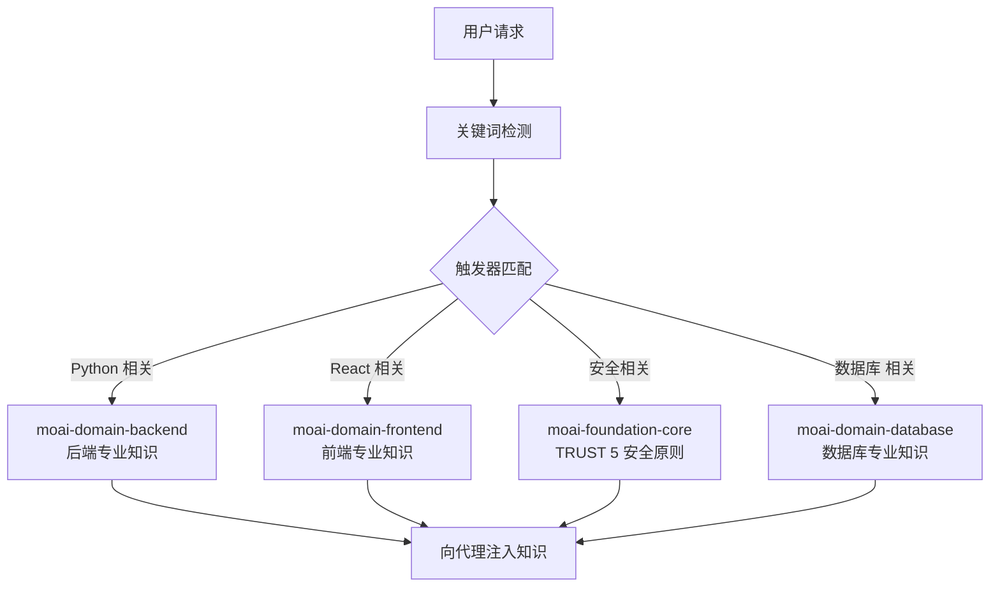
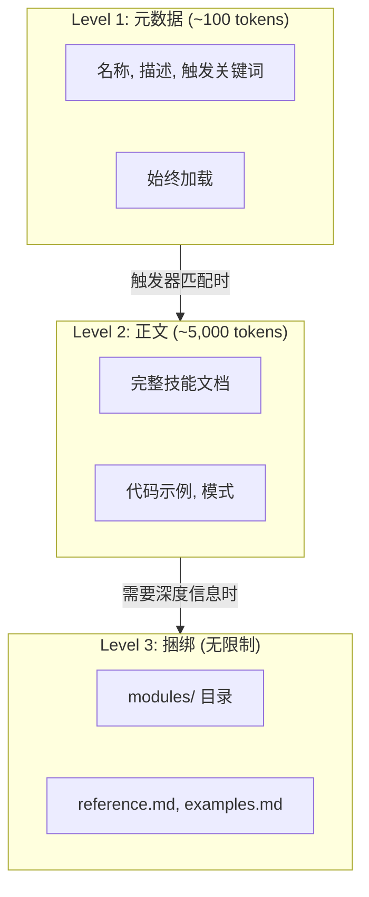
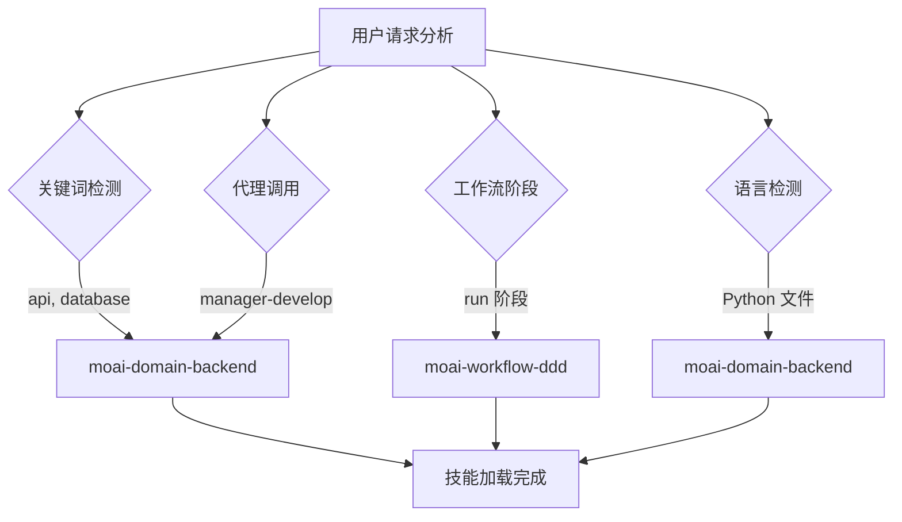
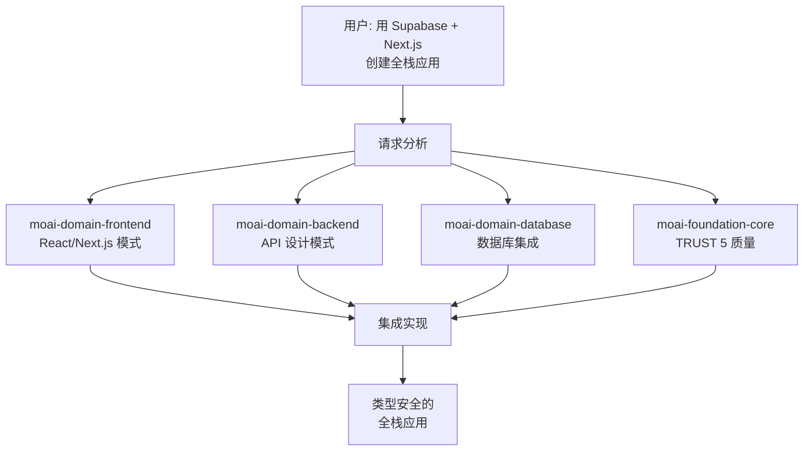

MoAI-ADK 的技能系统详细介绍。



**什么是技能?**

还记得 1999 年电影 **黑客帝国** 中的直升机驾驶场景吗? 尼奥问崔妮蒂是否
会驾驶直升机, 她给总部打电话告知直升机型号并请求发送操作手册。

<p align="center">
  <iframe
    width="720"
    height="360"
    src="https://www.youtube.com/embed/9Luu4itC-Zs"
    title="黑客帝国 直升机驾驶场景"
    frameBorder="0"
    allow="accelerometer; autoplay; clipboard-write; encrypted-media; gyroscope; picture-in-picture"
    allowFullScreen
  ></iframe>
</p>

**Claude Code 的技能** **(就是那个 **操作手册**。在需要的时候只加载
必要的知识,让 AI 能够立即像专家一样行动。



## 什么是技能?

技能是向 Claude Code 提供特定领域专业知识的 **知识模块**。

用学校来比喻, Claude Code 是学生,技能是教科书。数学课时打开数学教科
书, 科学课时打开科学教科书, 同样, Claude Code 编写 Python 代码时加载
Python 技能, 创建 React UI 时加载 Frontend 技能。



**没有技能时**: Claude Code 只用通用知识响应。**有技能时**: 应用
MoAI-ADK 的规则、模式、最佳实践来响应。

## 技能分类

MoAI-ADK 模板包含总共 **27 个 `moai-*` 技能**，分为 5 个功能类别：Foundation 4 + Workflow 8 + Domain 5 + Reference 8 + Meta/Harness 2 = 27。除此之外，还有一个独立的 `moai` umbrella 技能，用于将请求路由到专业技能。用户项目中可以额外编写 `harness-*` 自定义技能。编程语言支持通过 `rules/moai/languages/` 下的规则提供，而不是单独的技能。

### Foundation (核心哲学) - 4 个

| 技能名称                     | 描述                                             |
| ----------------------------- | ------------------------------------------------ |
| `moai-foundation-core`        | 基于 SPEC 的 TDD/DDD, TRUST 5 框架, 执行规则    |
| `moai-foundation-cc`          | Claude Code 扩展模式 (Skills, Agents, Hooks) |
| `moai-foundation-thinking`    | 结构化思维, 创意框架, 第一性原理分析            |
| `moai-foundation-quality`     | 代码质量自动验证, TRUST 5 验证          |

### Workflow (自动化工作流) - 8 个

| 技能名称                 | 描述                                     |
| ------------------------- | ---------------------------------------- |
| `moai-workflow-spec`      | SPEC 文档创建, GEARS 格式, 需求分析 |
| `moai-workflow-project`   | 项目初始化, 文档生成, 语言设置 |
| `moai-workflow-ddd`       | ANALYZE-PRESERVE-IMPROVE 周期   |
| `moai-workflow-tdd`       | RED-GREEN-REFACTOR 测试驱动开发     |
| `moai-workflow-testing`   | 测试创建, 调试, 代码审查集成 |
| `moai-workflow-worktree`  | Git worktree 基础并行开发   |
| `moai-workflow-loop`      | Ralph Engine 自主循环, LSP 联动    |
| `moai-workflow-ci-loop`   | CI 监视和自动修复循环工作流     |

### Domain (领域专业性) - 5 个

| 技能名称              | 描述                                             |
| ---------------------- | ------------------------------------------------ |
| `moai-domain-backend`  | API 设计, 微服务, 数据库集成      |
| `moai-domain-frontend` | React 19, Next.js 16, Vue 3.5, 组件架构 |
| `moai-domain-database` | PostgreSQL, MongoDB, Redis, 高级数据模式 |
| `moai-domain-html-report` | Markdown → 单一 HTML 报告渲染器 (6 种模式, 无外部依赖) |
| `moai-domain-humanize` | AI 文本拟人化, 后期编辑 (KO/EN/JA/ZH)     |

### Reference (参考) - 8 个

| 技能名称              | 描述                                             |
| ---------------------- | ------------------------------------------------ |
| `moai-ref-api-patterns`  | REST/GraphQL API 设计模式, 错误处理      |
| `moai-ref-git-workflow` | Git 工作流, 分支策略, Conventional Commits     |
| `moai-ref-owasp-checklist` | OWASP Top 10 安全模式, 输入验证 |
| `moai-ref-react-patterns` | React/Next.js 组件模式, 状态管理     |
| `moai-ref-testing-pyramid` | 测试金字塔策略, 覆盖率目标     |
| `moai-ref-llm-security` | AI/LLM 防御安全 (提示注入, OWASP LLM Top 10) |
| `moai-ref-secops` | DevSecOps/容器/API 运维防御安全 |
| `moai-ref-supply-chain` | 软件供应链防御安全 (SBOM, SLSA, Sigstore) |

### Meta/Harness (系统扩展) - 2 个

| 技能名称              | 描述                                             |
| ---------------------- | ------------------------------------------------ |
| `moai-meta-harness`  | 项目特定代理团队动态生成      |
| `moai-harness-learner` | Harness 学习子系统, 自动更新建议     |

> 27 个 `moai-*` 技能默认包含在 MoAI-ADK 模板中，每个技能都能独立加载以节省 token。用户还可以为项目编写额外的 `harness-*` 自定义技能。

## 渐进式公开系统

MoAI-ADK 的技能使用 **3 级渐进式公开** (Progressive Disclosure) 系统。
一次性加载所有技能会浪费 Token, 因此只按需逐步加载。



### 各级别的作用

| 级别    | Token   | 加载时机      | 内容                                |
| ------- | ------ | -------------- | ----------------------------------- |
| Level 1 | ~100   | 始终           | 技能名称, 描述, 触发关键词      |
| Level 2 | ~5,000 | 触发器匹配时 | 完整文档, 代码示例, 模式          |
| Level 3 | 无限制 | 按需       | modules/, reference.md, examples.md |

### Token 节省效果

- **原有方式**: 27 个技能全部加载 = 约 135,000 tokens (不可行)
- **渐进式公开**: 仅加载元数据 = 约 5,200 tokens (节省 97%)
- **按需加载**: 仅加载任务所需的 2~3 个技能 = 约 15,000 tokens 额外

## 技能触发机制

技能通过 **4 种触发条件**自动加载。



### 触发器设置示例

```yaml
# 在技能 frontmatter 中定义触发器
triggers:
  keywords: ["api", "database", "authentication"] # 关键词匹配
  agents: ["manager-spec", "manager-develop"] # 代理调用时
  phases: ["plan", "run"] # 工作流阶段
  languages: ["python", "typescript"] # 编程语言
```

**触发器优先级:**

1. **关键词** (keywords): 从用户消息中检测到关键词时立即加载
2. **代理** (agents): 调用特定代理时自动加载
3. **阶段** (phases): 根据 Plan/Run/Sync 阶段加载
4. **语言** (languages): 根据正在处理的文件的编程语言加载

## 技能使用方法

### 显式调用

可以在 Claude Code 对话中直接调用技能。

```bash
# 在 Claude Code 中调用技能
> Skill("moai-domain-backend")
> Skill("moai-domain-frontend")
> Skill("moai-ref-api-patterns")
```

### 自动加载

大多数情况下,技能通过触发机制 **自动加载**。用户无需直接调用,
对话上下文会被分析以激活适当的技能。

## 技能目录结构

技能文件位于 `.claude/skills/` 目录中。

```
.claude/skills/
├── moai-foundation-core/       # Foundation 类别
│   ├── skill.md                # 主技能文档 (500 行以下)
│   ├── modules/                # 深度文档 (无限制)
│   │   ├── trust-5-framework.md
│   │   ├── spec-first-ddd.md
│   │   └── delegation-patterns.md
│   ├── examples.md             # 实战示例
│   └── reference.md            # 外部参考链接
│
├── moai-domain-backend/        # Domain 类别
│   ├── skill.md
│   └── modules/
│       ├── api-patterns.md
│       └── microservices.md
│
└── my-skills/                  # 用户自定义技能 (更新时排除)
    └── my-custom-skill/
        └── skill.md
```


  **注意**: 带有 `moai-*` 前缀的技能在 MoAI-ADK 更新时会被覆盖。
  个人技能必须在 `.claude/skills/my-skills/` 目录中创建。


### 技能文件结构

每个技能的 `skill.md` 都遵循以下结构。

```markdown
---
name: moai-domain-backend
description: >
  后端开发专家。提供 API 设计, 微服务, 数据库集成模式。
  用于 API, Web 应用, 数据管道开发。
version: 3.0.0
category: domain
status: active
triggers:
  keywords: ["api", "database", "microservices", "authentication"]
allowed-tools: ["Read", "Grep", "Glob", "Bash", "Context7 MCP"]
---

# 后端开发专家

## Quick Reference

(快速参考 - 30 秒)

## Implementation Guide

(实现指南 - 5 分钟)

## Advanced Patterns

(高级模式 - 10 分钟以上)

## Works Well With

(关联技能/代理)
```

## 实战示例

### Python 项目中的技能自动加载

用户在 Python FastAPI 项目中工作的场景。

```bash
# 1. 用户请求 API 开发
> 用 FastAPI 创建用户认证 API

# 2. MoAI-ADK 自动检测的关键词
# "FastAPI" → moai-domain-backend 触发 (Python 模式通过 rules/moai/languages/ 提供)
# "认证"    → moai-domain-backend 触发
# "API"     → moai-domain-backend 触发

# 3. 自动加载的技能
# - moai-domain-backend (Level 2): API 设计模式, 认证策略
# - moai-foundation-core (Level 1): TRUST 5 质量标准

# 4. 代理利用技能知识进行实现
# - 应用 FastAPI 路由模式
# - 应用 JWT 认证最佳实践
# - 自动生成 pytest 测试
# - 满足 TRUST 5 质量标准
```

### 技能间协作

多个技能在一个任务中协作的过程。



## 技能范围与发现 (Skill Scope and Discovery)

### 嵌套 `.claude/skills` 加载

Claude Code 不仅在项目根目录发现 `.claude/skills/`，还在嵌套子目录中发现它（parent-walk 遍历），因此 monorepo 可以将包级本地技能放在每个包自己的 `.claude/skills/` 目录中。当你在包含自己 `.claude/skills/` 的嵌套目录中工作时，该嵌套目录中的技能会在该子树工作期间与根级技能一起加载。

### 名称冲突时的 closest-wins

当相同的技能名称沿嵌套链出现在多个 `.claude/skills/` 目录中时，**closest-directory-wins**（最近目录优先）规则解决冲突：离当前工作目录最近的 `.claude/skills/` 遮蔽更上层树中的那个。这与嵌套 `.claude/` 目录下已适用于代理、工作流和 output-styles 的优先级一致 — 最内层的 `.claude/` 获胜。有意覆盖根技能的包级本地技能必须保持相同名称；重命名会创建第二个技能而非覆盖。

### `disableBundledSkills` 开关

`disableBundledSkills` (settings.json 布尔值，或其环境变量形式) 从发现中隐藏 Claude Code 捆绑技能和工作流 — 例如 `/deep-research`、内置斜杠命令技能 — 仅保留 enterprise + personal + project + plugin 技能可见。在提供经过策划的、无捆绑的 skill 表面时使用。MoAI-ADK 不会从其自身的生成器发出此开关；它在此作为可用选项进行文档化。配套的 `--safe-mode` 启动标志文档化于 [Settings JSON 指南](/zh/advanced/settings-json#disablebundledskills)。

## 相关文档

- [代理指南](/advanced/agent-guide) - 使用技能的代理体系
- [构建者代理指南](/advanced/builder-agents) - 自定义技能创建方法
- [CLAUDE.md 指南](/advanced/claude-md-guide) - 技能配置和规则体系


  **提示**: 充分利用技能的关键是 **使用适当的关键词**。如果说"用 Python
  创建 REST API",`moai-domain-backend` 技能就会自动激活
  (Python 模式通过 `rules/moai/languages/` 提供) 以生成最佳代码。

