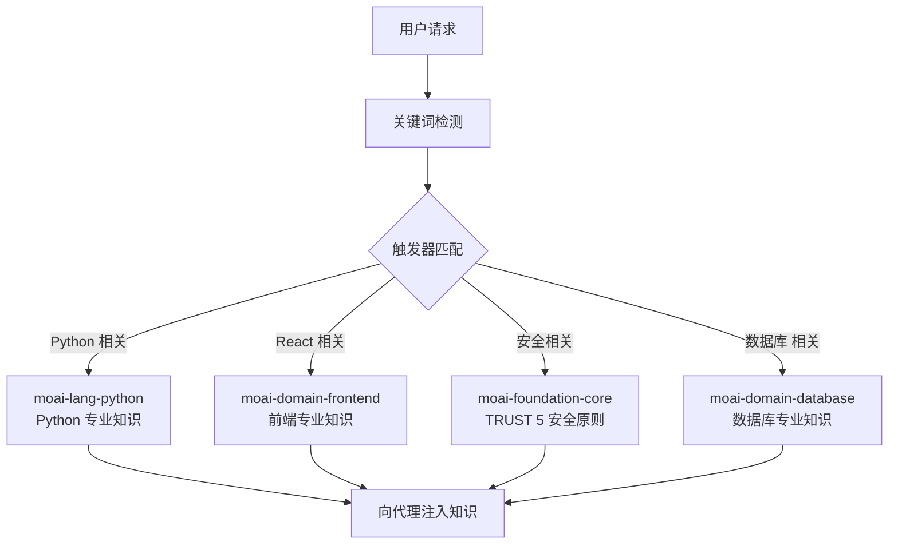
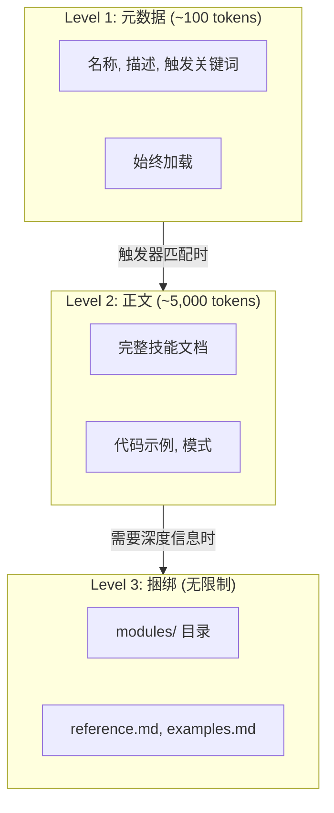
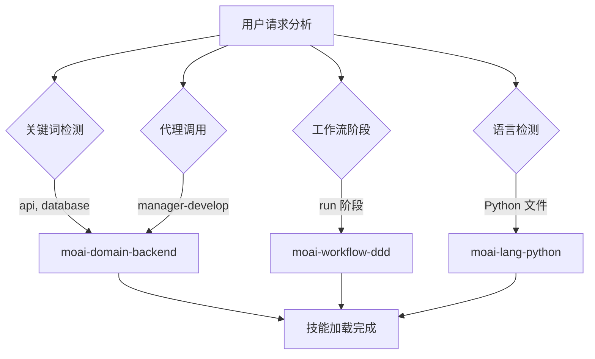
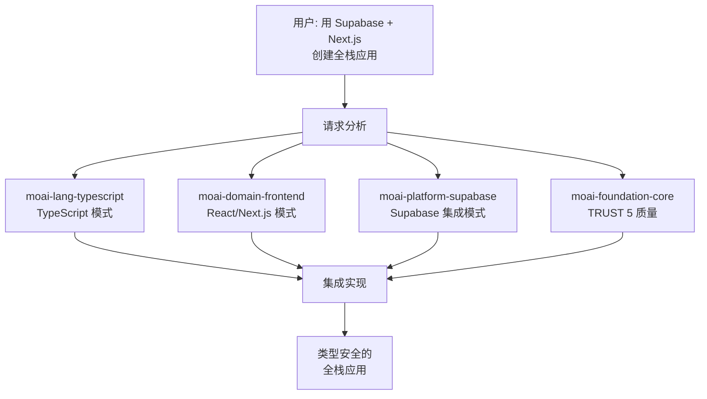

MoAI-ADK 的技能系统详细介绍。



**什么是技能?**

还记得 1999 年电影 **黑客帝国** 中的直升机驾驶场景吗? 尼奥问崔妮蒂是否
会驾驶直升机, 她给总部打电话告知直升机型号并请求发送操作手册。

<p align="center">
  <iframe
    width="720"
    height="360"
    src="https://www.youtube.com/embed/9Luu4itC-Zs"
    title="黑客帝国 直升机驾驶场景"
    frameBorder="0"
    allow="accelerometer; autoplay; clipboard-write; encrypted-media; gyroscope; picture-in-picture"
    allowFullScreen
  ></iframe>
</p>

**Claude Code 的技能** **(就是那个 **操作手册**。在需要的时候只加载
必要的知识,让 AI 能够立即像专家一样行动。



## 什么是技能?

技能是向 Claude Code 提供特定领域专业知识的 **知识模块**。

用学校来比喻, Claude Code 是学生,技能是教科书。数学课时打开数学教科
书, 科学课时打开科学教科书, 同样, Claude Code 编写 Python 代码时加载
Python 技能, 创建 React UI 时加载 Frontend 技能。



**没有技能时**: Claude Code 只用通用知识响应。**有技能时**: 应用
MoAI-ADK 的规则、模式、最佳实践来响应。

## 技能分类

MoAI-ADK 共有 **31 个技能** — moai 伞形路由器加上 30 个专业技能,分为 6 大类: Foundation(4)、Workflow(10)、Domain(8)、Reference(5)、Meta-Harness(2)、Design(1)。编程语言支持通过 `rules/moai/languages/` 下的规则提供,而不是单独的技能。

### Foundation (核心哲学) - 4 个

| 技能名称                     | 描述                                             |
| ----------------------------- | ------------------------------------------------ |
| `moai-foundation-core`        | 基于 SPEC 的 TDD/DDD, TRUST 5 框架, 执行规则    |
| `moai-foundation-cc`          | Claude Code 扩展模式 (Skills, Agents, Hooks 等) |
| `moai-foundation-thinking`    | 结构化思维, 创意框架, 第一性原理分析            |
| `moai-foundation-quality`     | 企业级代码质量管理, TRUST 5 验证          |

### Workflow (自动化工作流) - 10 个

| 技能名称                 | 描述                                     |
| ------------------------- | ---------------------------------------- |
| `moai-workflow-spec`      | SPEC 文档创建, GEARS 格式, 需求分析 |
| `moai-workflow-project`   | 项目初始化, 文档生成, 语言设置, JIT 文档加载 |
| `moai-workflow-ddd`       | 域驱动开发 ANALYZE-PRESERVE-IMPROVE 周期   |
| `moai-workflow-tdd`       | 测试驱动开发 RED-GREEN-REFACTOR 周期     |
| `moai-workflow-testing`   | 测试创建, 调试, 代码审查, 性能优化 |
| `moai-workflow-worktree`  | Git worktree 管理, 并行 SPEC 开发   |
| `moai-workflow-loop`      | Ralph Engine 自主循环, LSP 诊断    |
| `moai-workflow-ci-loop`   | CI 监视和自动修复循环     |
| `moai-workflow-gan-loop`  | GAN 循环, 迭代设计改进     |
| `moai-workflow-design`    | 设计工作流, Claude Design 集成     |

### Domain (领域专业性) - 8 个

| 技能名称              | 描述                                             |
| ---------------------- | ------------------------------------------------ |
| `moai-domain-backend`  | 后端开发, API 设计, 数据库集成      |
| `moai-domain-frontend` | 前端开发, React 19, Next.js 16, Vue 3.5 |
| `moai-domain-database` | PostgreSQL, MongoDB, Redis 数据库设计 和查询优化 |
| `moai-domain-design-handoff` | Claude Design 交接包, 设计系统 |
| `moai-domain-ideation` | 创意头脑风暴, 提案生成     |
| `moai-domain-research` | 市场和生态研究     |
| `moai-design-system` | 意图优先设计, WCAG 2.1 可访问性     |
| `moai-domain-copywriting` | 品牌对齐文案, 营销文本     |

### Reference (参考) - 5 个

| 技能名称              | 描述                                             |
| ---------------------- | ------------------------------------------------ |
| `moai-ref-api-patterns`  | REST/GraphQL API 设计模式      |
| `moai-ref-react-patterns` | React/Next.js 组件设计模式 |
| `moai-ref-git-workflow` | Git 工作流, 分支策略, 常规提交     |
| `moai-ref-owasp-checklist` | OWASP Top 10 安全检查表 |
| `moai-ref-testing-pyramid` | 测试金字塔, 覆盖率策略     |

### Meta-Harness (Harness 专业化) - 2 个

| 技能名称              | 描述                                             |
| ---------------------- | ------------------------------------------------ |
| `moai-meta-harness`  | 项目特定代理团队设计      |
| `moai-harness-learner` | Harness 学习子系统, 自适应更新     |

### Design (设计系统) - 1 个

| 技能名称              | 描述                                             |
| ---------------------- | ------------------------------------------------ |
| `moai-domain-brand-design`  | 品牌对齐设计系统, 设计令牌提取      |

## 渐进式公开系统

MoAI-ADK 的技能使用 **3 级渐进式公开** (Progressive Disclosure) 系统。
一次性加载所有技能会浪费 Token, 因此只按需逐步加载。



### 各级别的作用

| 级别    | Token   | 加载时机      | 内容                                |
| ------- | ------ | -------------- | ----------------------------------- |
| Level 1 | ~100   | 始终           | 技能名称, 描述, 触发关键词      |
| Level 2 | ~5,000 | 触发器匹配时 | 完整文档, 代码示例, 模式          |
| Level 3 | 无限制 | 按需       | modules/, reference.md, examples.md |

### Token 节省效果

- **原有方式**: 31 个技能全部加载 = 约 260,000 tokens (不可行)
- **渐进式公开**: 仅加载元数据 = 约 5,200 tokens (节省 97%)
- **按需加载**: 仅加载任务所需的 2~3 个技能 = 约 15,000 tokens 额外

## 技能触发机制

技能通过 **4 种触发条件**自动加载。



### 触发器设置示例

```yaml
# 在技能 frontmatter 中定义触发器
triggers:
  keywords: ["api", "database", "authentication"] # 关键词匹配
  agents: ["manager-spec", "manager-develop"] # 代理调用时
  phases: ["plan", "run"] # 工作流阶段
  languages: ["python", "typescript"] # 编程语言
```

**触发器优先级:**

1. **关键词** (keywords): 从用户消息中检测到关键词时立即加载
2. **代理** (agents): 调用特定代理时自动加载
3. **阶段** (phases): 根据 Plan/Run/Sync 阶段加载
4. **语言** (languages): 根据正在处理的文件的编程语言加载

## 技能使用方法

### 显式调用

可以在 Claude Code 对话中直接调用技能。

```bash
# 在 Claude Code 中调用技能
> Skill("moai-lang-python")
> Skill("moai-domain-backend")
> Skill("moai-library-mermaid")
```

### 自动加载

大多数情况下,技能通过触发机制 **自动加载**。用户无需直接调用,
对话上下文会被分析以激活适当的技能。

## 技能目录结构

技能文件位于 `.claude/skills/` 目录中。

```
.claude/skills/
├── moai-foundation-core/       # Foundation 类别
│   ├── skill.md                # 主技能文档 (500 行以下)
│   ├── modules/                # 深度文档 (无限制)
│   │   ├── trust-5-framework.md
│   │   ├── spec-first-ddd.md
│   │   └── delegation-patterns.md
│   ├── examples.md             # 实战示例
│   └── reference.md            # 外部参考链接
│
├── moai-lang-python/           # Language 类别
│   ├── skill.md
│   └── modules/
│       ├── fastapi-patterns.md
│       └── testing-pytest.md
│
└── my-skills/                  # 用户自定义技能 (更新时排除)
    └── my-custom-skill/
        └── skill.md
```


  **注意**: 带有 `moai-*` 前缀的技能在 MoAI-ADK 更新时会被覆盖。
  个人技能必须在 `.claude/skills/my-skills/` 目录中创建。


### 技能文件结构

每个技能的 `skill.md` 都遵循以下结构。

```markdown
---
name: moai-lang-python
description: >
  Python 3.13+ 开发专家。提供 FastAPI, Django, pytest 模式。
  用于 Python API, Web 应用, 数据管道开发。
version: 3.0.0
category: language
status: active
triggers:
  keywords: ["python", "fastapi", "django", "pytest"]
  languages: ["python"]
allowed-tools: ["Read", "Grep", "Glob", "Bash", "Context7 MCP"]
---

# Python 开发专家

## Quick Reference

(快速参考 - 30 秒)

## Implementation Guide

(实现指南 - 5 分钟)

## Advanced Patterns

(高级模式 - 10 分钟以上)

## Works Well With

(关联技能/代理)
```

## 实战示例

### Python 项目中的技能自动加载

用户在 Python FastAPI 项目中工作的场景。

```bash
# 1. 用户请求 API 开发
> 用 FastAPI 创建用户认证 API

# 2. MoAI-ADK 自动检测的关键词
# "FastAPI" → moai-lang-python 触发
# "认证"    → moai-domain-backend 触发
# "API"     → moai-domain-backend 触发

# 3. 自动加载的技能
# - moai-lang-python (Level 2): FastAPI 模式, pytest 测试
# - moai-domain-backend (Level 2): API 设计模式, 认证策略
# - moai-foundation-core (Level 1): TRUST 5 质量标准

# 4. 代理利用技能知识进行实现
# - 应用 FastAPI 路由模式
# - 应用 JWT 认证最佳实践
# - 自动生成 pytest 测试
# - 满足 TRUST 5 质量标准
```

### 技能间协作

多个技能在一个任务中协作的过程。



## 相关文档

- [代理指南](/advanced/agent-guide) - 使用技能的代理体系
- [构建者代理指南](/advanced/builder-agents) - 自定义技能创建方法
- [CLAUDE.md 指南](/advanced/claude-md-guide) - 技能配置和规则体系


  **提示**: 充分利用技能的关键是 **使用适当的关键词**。如果说"用 Python
  创建 REST API",`moai-lang-python` 和 `moai-domain-backend`
  技能就会自动激活以生成最佳代码。

