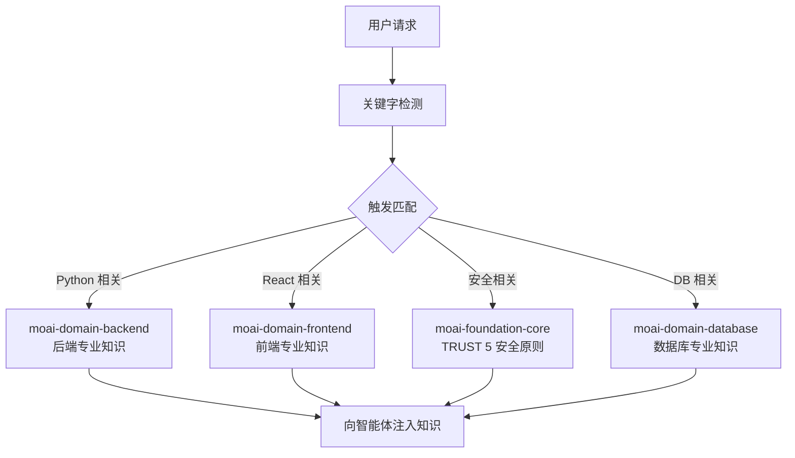
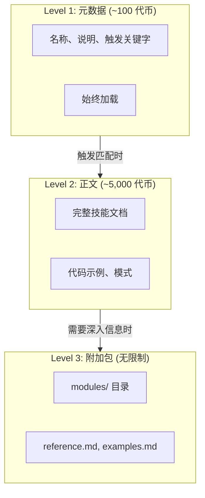
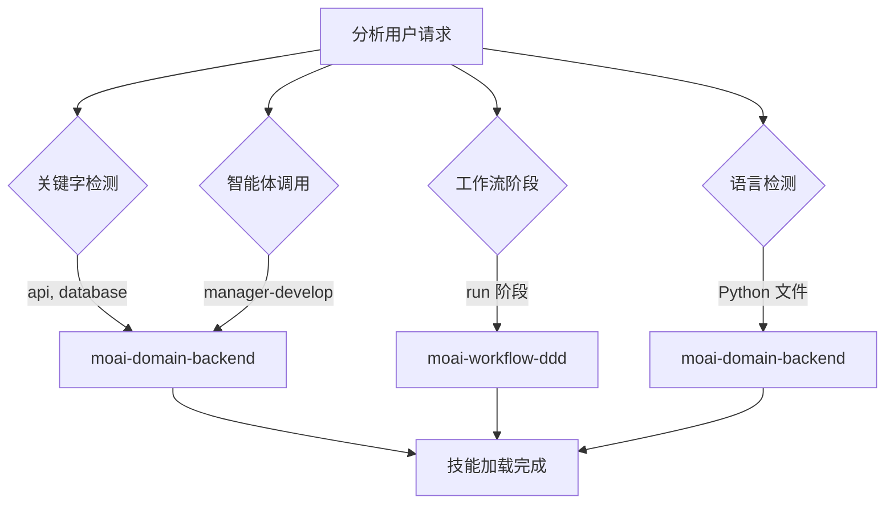
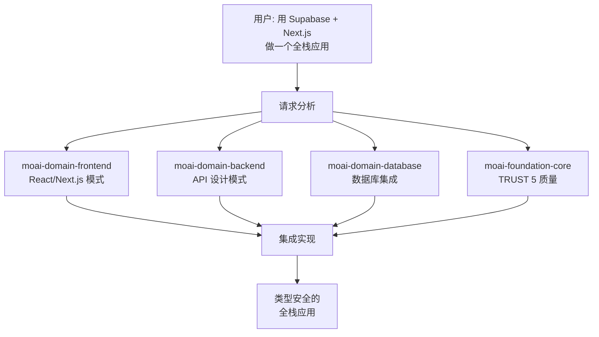

详细介绍 MoAI-ADK 的技能系统。技能是智能体 Harness 的知识层，也是"只在需要的时刻加载需要的知识"这一代币经济学最具体的落地之处。



**什么是技能？**

还记得 1999 年电影 **黑客帝国** 中的直升机驾驶场景吗？Neo 问 Trinity 会不会开直升机，Trinity 打电话给总部报出直升机型号，请求传送操作手册。

<p align="center">
  <iframe
    width="720"
    height="360"
    src="https://www.youtube.com/embed/9Luu4itC-Zs"
    title="黑客帝国直升机驾驶场景"
    frameBorder="0"
    allow="accelerometer; autoplay; clipboard-write; encrypted-media; gyroscope; picture-in-picture"
    allowFullScreen
  ></iframe>
</p>

**Claude Code 的技能** 正是那份 **操作手册**。在需要的时刻只加载需要的知识，让 AI 立刻表现得像专家。



## 什么是技能？

技能是向 Claude Code 提供特定领域专业知识的 **知识模块**。

用学校来类比，Claude Code 是学生，技能是教科书。就像数学课翻开数学课本、科学课翻开科学课本一样，Claude Code 写 Python 代码时加载 Python 技能，做 React UI 时加载 Frontend 技能。


```mermaid
flowchart TD
    USER[用户请求] --> DETECT[关键字检测]
    DETECT --> TRIGGER{触发匹配}
    TRIGGER -->|Python 相关| PY["moai-domain-backend<br>后端专业知识"]
    TRIGGER -->|React 相关| FE["moai-domain-frontend<br>前端专业知识"]
    TRIGGER -->|安全相关| SEC["moai-foundation-core<br>TRUST 5 安全原则"]
    TRIGGER -->|DB 相关| DB["moai-domain-database<br>数据库专业知识"]

    PY --> AGENT[向智能体注入知识]
    FE --> AGENT
    SEC --> AGENT
    DB --> AGENT
```

**没有技能时**：Claude Code 只能凭一般性知识作答。**有技能时**：应用 MoAI-ADK 的规则、模式与最佳实践作答。

## 技能分类

MoAI-ADK 模板共包含 **27 个 `moai-*` 技能**，分为 5 个功能类别（Foundation 4 + Workflow 8 + Domain 5 + Reference 8 + Meta/Harness 2 = 27）。此外还有 1 个把请求路由到专业技能的 `moai` umbrella 技能。在用户项目中还可以额外编写 `harness-*` 用户自定义技能。编程语言支持由 `rules/moai/languages/` 下的规则提供，不是独立技能。

这个数字也是瘦身的结果 — 技能目录在 v3 期间经历了 48 → 38 → 27 个的精炼。

### Foundation（核心哲学）- 4 个

| 技能名称                  | 说明                                                |
| -------------------------- | --------------------------------------------------- |
| `moai-foundation-core`     | 基于 SPEC 的 TDD/DDD、TRUST 5 框架、执行规则    |
| `moai-foundation-cc`       | Claude Code 扩展模式（Skills、Agents、Hooks）       |
| `moai-foundation-thinking` | 结构化思考、创意发想、第一性原理分析             |
| `moai-foundation-quality`  | 代码质量自动验证、TRUST 5 校验             |

### Workflow（自动化工作流）- 8 个

| 技能名称                | 说明                                          |
| ------------------------ | --------------------------------------------- |
| `moai-workflow-spec`     | SPEC 文档生成、GEARS 格式、需求分析     |
| `moai-workflow-project`  | 项目初始化、文档生成、语言设置         |
| `moai-workflow-ddd`      | ANALYZE-PRESERVE-IMPROVE 循环               |
| `moai-workflow-tdd`      | RED-GREEN-REFACTOR 测试驱动开发           |
| `moai-workflow-testing`  | 测试生成、调试、代码评审集成           |
| `moai-workflow-worktree` | 基于 Git worktree 的并行开发                   |
| `moai-workflow-loop`     | Ralph Engine 自主循环、LSP 联动              |
| `moai-workflow-ci-loop`  | CI 监控与自动修复循环工作流          |

### Domain（领域专业性）- 5 个

| 技能名称                   | 说明                                             |
| --------------------------- | ------------------------------------------------ |
| `moai-domain-backend`       | API 设计、微服务、数据库集成      |
| `moai-domain-frontend`      | React 19、Next.js 16、Vue 3.5、组件架构 |
| `moai-domain-database`      | PostgreSQL、MongoDB、Redis、高级数据模式     |
| `moai-domain-html-report`   | Markdown → 单文件 HTML 报告渲染器（6 种模式，无外部依赖） |
| `moai-domain-humanize`      | AI 文本人性化、润色（KO/EN/JA/ZH）    |

### Reference（最佳实践）- 8 个

| 技能名称                  | 说明                                              |
| -------------------------- | ------------------------------------------------- |
| `moai-ref-api-patterns`    | REST/GraphQL API 设计模式、错误处理             |
| `moai-ref-git-workflow`    | Git 工作流、分支策略、Conventional Commits |
| `moai-ref-owasp-checklist` | OWASP Top 10 安全模式、输入校验                 |
| `moai-ref-react-patterns`  | React/Next.js 组件模式、状态管理            |
| `moai-ref-testing-pyramid` | 测试金字塔策略、覆盖率目标               |
| `moai-ref-llm-security`    | AI/LLM 防御安全（提示词注入、OWASP LLM Top 10） |
| `moai-ref-secops`          | DevSecOps/容器/API 运营防御安全             |
| `moai-ref-supply-chain`    | 软件供应链防御安全（SBOM、SLSA、Sigstore） |

### Meta/Harness（系统扩展）- 2 个

| 技能名称              | 说明                                        |
| ---------------------- | ------------------------------------------- |
| `moai-meta-harness`    | 动态生成项目特化的智能体团队         |
| `moai-harness-learner` | Harness 学习子系统、自动更新提案 |

> 27 个 `moai-*` 技能默认包含在 MoAI-ADK 模板中，每个技能独立加载以节省代币。用户还可以额外编写按项目的 `harness-*` 用户自定义技能。

## 渐进式披露系统

MoAI-ADK 的技能使用 **3 级渐进式披露** (Progressive Disclosure) 系统。一次加载所有技能会浪费代币，因此按需分级加载。可以把它理解为上下文瘦身在技能层的实现。


```mermaid
flowchart TD
    subgraph L1["Level 1: 元数据 (~100 代币)"]
        M1["名称、说明、触发关键字"]
        M2["始终加载"]
    end

    subgraph L2["Level 2: 正文 (~5,000 代币)"]
        B1["完整技能文档"]
        B2["代码示例、模式"]
    end

    subgraph L3["Level 3: 附加包 (无限制)"]
        R1["modules/ 目录"]
        R2["reference.md, examples.md"]
    end

    L1 -->|"触发匹配时"| L2
    L2 -->|"需要深入信息时"| L3

```

### 各级别的角色

| 级别    | 代币   | 加载时机      | 内容                                |
| ------- | ------ | -------------- | ----------------------------------- |
| Level 1 | ~100   | 始终           | 技能名称、说明、触发关键字      |
| Level 2 | ~5,000 | 触发匹配时 | 完整文档、代码示例、模式          |
| Level 3 | 无限制 | 按需       | modules/、reference.md、examples.md |

### 代币节省效果

- **传统方式**：加载全部 27 个技能 = 约 135,000 代币（不可行）
- **渐进式披露**：只加载元数据 = 约 5,200 代币（节省 97%）
- **按需加载**：只加载任务所需的 2~3 个技能 = 追加约 15,000 代币

## 技能触发机制

技能由 **4 种触发条件** 自动加载。


```mermaid
flowchart TD
    REQ[分析用户请求] --> KW{关键字检测}
    REQ --> AG{智能体调用}
    REQ --> PH{工作流阶段}
    REQ --> LN{语言检测}

    KW -->|"api, database"| SKILL1[moai-domain-backend]
    AG -->|"manager-develop"| SKILL1
    PH -->|"run 阶段"| SKILL2[moai-workflow-ddd]
    LN -->|"Python 文件"| SKILL3[moai-domain-backend]

    SKILL1 --> LOAD[技能加载完成]
    SKILL2 --> LOAD
    SKILL3 --> LOAD
```

### 触发配置示例

```yaml
# 在技能 frontmatter 中定义触发
triggers:
  keywords: ["api", "database", "authentication"] # 关键字匹配
  agents: ["manager-spec", "manager-develop"] # 调用智能体时
  phases: ["plan", "run"] # 工作流阶段
  languages: ["python", "typescript"] # 编程语言
```

**触发优先级：**

1. **关键字** (keywords)：在用户消息中检测到关键字时立即加载
2. **智能体** (agents)：调用特定智能体时自动加载
3. **阶段** (phases)：按 Plan/Run/Sync 阶段加载
4. **语言** (languages)：按正在操作的文件的编程语言加载

## 技能的用法

### 显式调用

可以在 Claude Code 对话中直接调用技能。

```bash
# 在 Claude Code 中调用技能
> Skill("moai-domain-backend")
> Skill("moai-domain-frontend")
> Skill("moai-ref-api-patterns")
```

### 自动加载

大多数情况下，技能会由触发机制 **自动加载**。用户无需手动调用，系统会分析对话上下文并激活合适的技能。

## 技能目录结构

技能文件位于 `.claude/skills/` 目录。

```
.claude/skills/
├── moai-foundation-core/       # Foundation 类别
│   ├── skill.md                # 主技能文档 (500 行以内)
│   ├── modules/                # 深入文档 (无限制)
│   │   ├── trust-5-framework.md
│   │   ├── spec-first-ddd.md
│   │   └── delegation-patterns.md
│   ├── examples.md             # 实战示例
│   └── reference.md            # 外部参考链接
│
├── moai-domain-backend/        # Domain 类别
│   ├── skill.md
│   └── modules/
│       ├── api-patterns.md
│       └── microservices.md
│
└── my-skills/                  # 用户自定义技能 (更新时不受影响)
    └── my-custom-skill/
        └── skill.md
```


  **注意**：带 `moai-*` 前缀的技能在 MoAI-ADK 更新时会被覆盖。
  个人技能务必创建在 `.claude/skills/my-skills/` 目录。


### 技能命名空间

技能前缀区分 **分发主体**,`moai update` 的行为也不同。

| 前缀 | 所有权 | `moai update` 行为 |
|--------|--------|-------------------|
| `moai-*` / `moai-harness-*` | template-managed | 覆盖 (sync) |
| `hns-*` | user-owned (harness) | 保留 (禁止修改·删除) |
| (无前缀) / 其他 | user-owned (个人) | 保留 |

`hns-*` 前缀表示用户创建的 harness 技能,`moai update` 绝不覆盖或删除。不得把 `hns-*` 技能镜像到模板中(CI 守卫会检测)。


  **注意**:带 `moai-*` 前缀的技能在 MoAI-ADK 更新时会被覆盖。
  个人技能与 harness 技能请创建在 `hns-*` 前缀或无前缀的目录。


### 技能文件结构

每个技能的 `skill.md` 遵循以下结构。

```markdown
---
name: moai-domain-backend
description: >
  后端开发专家。提供 API 设计、微服务、数据库集成模式。
  开发 API、Web 应用、数据管线时使用。
version: 3.0.0
category: domain
status: active
triggers:
  keywords: ["api", "database", "microservices", "authentication"]
allowed-tools: ["Read", "Grep", "Glob", "Bash"]
---

# 后端开发专家

## Quick Reference

(快速参考 - 30 秒)

## Implementation Guide

(实现指南 - 5 分钟)

## Advanced Patterns

(高级模式 - 10 分钟以上)

## Works Well With

(相关技能/智能体)
```

## 实战示例

### 在 Python 项目中自动加载技能

用户在 Python FastAPI 项目中工作的场景。

```bash
# 1. 用户请求开发 API
> 用 FastAPI 做一个用户认证 API

# 2. MoAI-ADK 自动检测的关键字
# "FastAPI" → 触发 moai-domain-backend (Python 模式经 rules/moai/languages/ 提供)
# "认证"    → 触发 moai-domain-backend
# "API"     → 触发 moai-domain-backend

# 3. 自动加载的技能
# - moai-domain-backend (Level 2): API 设计模式、认证策略
# - moai-foundation-core (Level 1): TRUST 5 质量标准

# 4. 智能体运用技能知识进行实现
# - 应用 FastAPI 路由模式
# - 应用 JWT 认证最佳实践
# - 自动生成 pytest 测试
# - 满足 TRUST 5 质量标准
```

### 技能间协作

多个技能在同一任务中协作的过程。


```mermaid
flowchart TD
    REQ["用户: 用 Supabase + Next.js<br>做一个全栈应用"] --> ANALYZE[请求分析]

    ANALYZE --> S1["moai-domain-frontend<br>React/Next.js 模式"]
    ANALYZE --> S2["moai-domain-backend<br>API 设计模式"]
    ANALYZE --> S3["moai-domain-database<br>数据库集成"]
    ANALYZE --> S4["moai-foundation-core<br>TRUST 5 质量"]

    S1 --> IMPL[集成实现]
    S2 --> IMPL
    S3 --> IMPL
    S4 --> IMPL

    IMPL --> RESULT["类型安全的<br>全栈应用"]
```

## 技能范围与发现 (Skill Scope and Discovery)

### 嵌套 `.claude/skills` 加载

Claude Code 不仅在项目根目录，也会在嵌套的子目录（parent-walk）中发现 `.claude/skills/`。因此 monorepo 可以把各包本地的技能放在各包自己的 `.claude/skills/` 目录中。当在包含自己 `.claude/skills/` 的嵌套目录内工作时，该嵌套目录的技能会在该子树内与根级技能一起加载。

### 名称冲突时 closest-wins

当同一技能名称出现在嵌套链上的多个 `.claude/skills/` 目录中时，由 **closest-directory-wins**（最近目录优先）规则解决冲突：离当前工作目录最近的 `.claude/skills/` 会遮蔽 (shadow) 树上更高层的同名技能。这与嵌套 `.claude/` 目录下已经适用于智能体、工作流、output-styles 的先行规则一致 — 最内层的 `.claude/` 获胜。有意覆盖根技能的包本地技能必须保持同名。改名不会覆盖，而是产生第二个技能。

### `disableBundledSkills` 开关

`disableBundledSkills`（settings.json 布尔值，或环境变量形式）会把 Claude Code 捆绑的 skills 与工作流 — 例如 `/deep-research`、内置斜杠命令 skills — 从 discovery 中隐藏，只显示 enterprise + personal + project + plugin skills。需要提供一个精选的无捆绑 skill 表面时使用。MoAI-ADK 不在自己的生成器中生成此开关，此处将其记录为可用选项。配套的 `--safe-mode` 启动标志记录在 [Settings JSON 指南](/zh/advanced/settings-json#disablebundledskills)。

## 相关文档

- [智能体指南](/zh/advanced/agent-guide) - 运用技能的智能体体系
- [构建器智能体指南](/zh/advanced/builder-agents) - 自定义技能的创建方法
- [CLAUDE.md 指南](/zh/advanced/claude-md-guide) - 技能配置与规则体系


  **提示**：用好技能的核心是 **使用合适的关键字**。请求"用 Python
  做一个 REST API"时，`moai-domain-backend` 技能会自动激活
  （Python 模式经 `rules/moai/languages/` 提供），生成最优代码。

