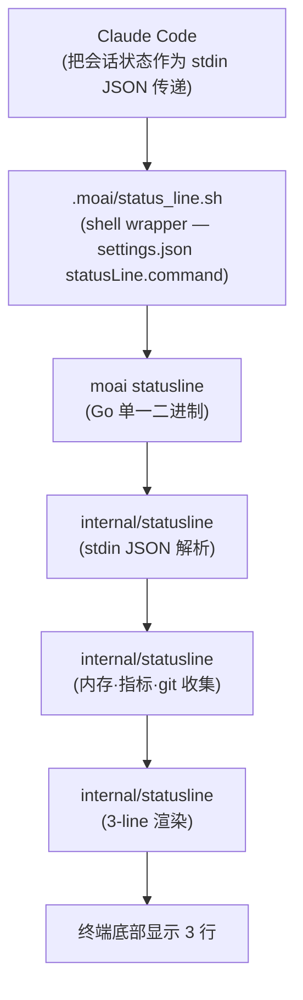
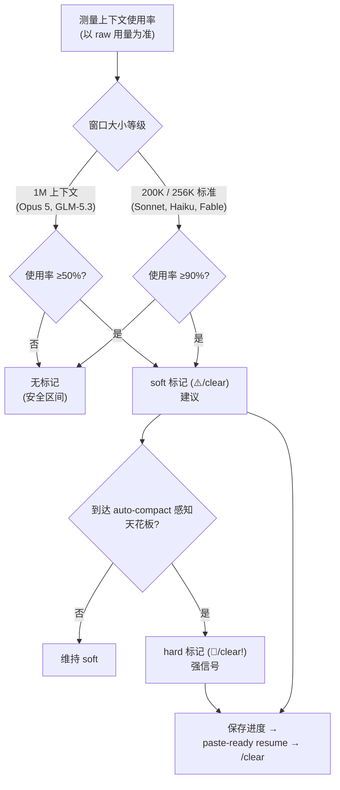

无法度量就无法掌控。智能体开发在一次会话里消耗几十万 token，快速填满上下文窗口 (context window，模型一次能记住的对话总量)，让多个智能体（自行工作的 AI 助手）并行运转，并直接影响提示缓存 (prompt cache，复用相同上下文来压低成本的技巧) 的命中与否。如果这一切在终端里看不见，就无法回答“为什么这次会话花了两倍的成本”。**定制 statusline 系统**正是从这个痛点出发的。token 经济学 (tokenomics，把 token 用得经济的方式) 始于度量，所以我们把上下文使用率、缓存命中率、rate limit 消耗率常驻显示在终端底部。

本文以入门书的深度梳理 statusline 显示什么、数据如何流动、以及上下文被填满时它给出什么信号。比起段落格式的细节，先讲清楚“为什么需要这些信息、怎么读”。

## 为什么需要状态栏

在智能体编程中决定成本与质量的变量有五个：用哪个模型、以哪个推理深度在跑、上下文窗口填了多少、rate limit 还剩多少、提示缓存是否正常生效。这五个变量彼此相连 —— 上下文满了会出现 SSE 停滞 (stream stall，流式传输停下来的现象)，缓存不命中成本立刻上涨，rate limit 见底就得停下重活。

问题在于这些变量默认看不见。Claude Code 自带的状态栏够丰富，但装不下 MoAI 工作流要处理的信息 —— 活动 SPEC（需求规格书）、当前 PR 的评审状态、交接 (handoff，把会话接续起来的操作) 建议时机。所以 MoAI 把自己的状态栏以三行立在终端底部，多会话 run 时再附上第四行，让“现在 token 是怎么花的”和“现在在哪里做什么”一眼可读。

## 一眼看懂各行

基本布局是三行，存在会话名·积压观测时，第四行（会话行）会按条件附加在最后。下面的示例是实际渲染输出的一个实例，连每个段落使用的字形 (glyph，小图形字符) 都原样搬来。

```text
🤖 Opus │ 🧠 xhigh·t │ ♻️ 87% │ 🔅 cc v2.1.212 │ 🗿 v3.1.1 │ ⏳ 4h 52m │ 💬 MoAI
🪫 CW: ███████░░░ 72% (⚠️/clear) │ 🔋 5H: █████░░░░░ 56% (46m) │ 🔋 7D: █░░░░░░░░░ 13% (May 28)
📁 moai-adk-go │ 📡 modu-ai/moai-adk | 🅱️ main ↑5 +2 │ 📫 +0 M1 ?1 │ 💌 PR #1234 (⌥approved)
🏷️ run │ 🔄 TODO: 1 / 3 │ 🔀 2 / 1
```

- **第一行 —— 会话“跑得怎么样”**: 模型、推理深度、缓存命中率、Claude Code 版本、MoAI 版本、会话时长、输出样式放进一行。让人立刻知道“这个会话是以什么配置在跑”。
- **第二行 —— 预算“还剩多少”**: 上下文窗口使用率 (CW) 和两条滚动 rate limit（5 小时·7 天）以量表条展示。这是判断“现在能不能直接跑重活”的依据。
- **第三行 —— 现在“在哪里、做什么”**: 目录、仓库与分支、git 状态、活动 SPEC 任务、以及打开中 PR 的评审状态打成一包。在以 PR 为中心的工作流里，这是最常看到的一行。
- **第四行（按条件）—— 以什么身份、积了多少**: 显示会话名 (🏷️)、智能体名 (👤)、积压现状 (🔄 `TODO: 进行中 / 待办`)、打开的 issue·PR 数 (🔀)。在看板伴随会话这类有名字的会话里自然出现；没有观测来源时对应段落会缩水，全部为空则整行省略。这里也是高亮显示会话名的位置 —— 开着多个终端、分不清哪个窗口是哪个角色时，它是第一个信号。

## 数据流动的路径

statusline 不是一个单一程序，而是一条短管道。Claude Code 在每个渲染周期把会话状态做成 JSON 传过来，MoAI 接住后加工成三行还给终端。



为什么 shell wrapper 要夹在中间？因为 Claude Code 的 `statusLine.command` 只接受一个命令字符串。于是 `.moai/status_line.sh` 充当最小化的 shell 包装去调用 `moai statusline` 二进制，重活（解析·收集·渲染）全部在编译出的 Go 二进制里快速完成。这样一来，每次渲染不必拉起多个进程，也能一次画出海量信息。

数据收集阶段还会补足 stdin 里没有的信息。git 状态直接解析本地 `git status --porcelain`，MoAI 版本从本地设置读取，活动任务从会话状态文件取得。这样即使 Claude Code 没传来的上下文，也能装进这一行里。

## 第一行 —— 会话“跑得怎么样”

第一行读的是“这个会话的设置与状态”。不只模型名，还用 Claude Code v2.1.139 起加入 stdin 的 **effort/thinking** 值显示“以哪个推理深度在跑、扩展思考 (thinking) 有没有开”。等级后面带 `·t`（如 `xhigh·t`）表示扩展思考已激活；有这个标记，就能一眼核查模型策略是否真的在生效。

其中**缓存命中率**是 token 经济学的核心指标。它等于 `cache_read` token 除以 `(cache_read + cache_creation)` —— 削减常驻加载的指引，这个数字会立刻上升；反过来，每轮新读大文件或指引树突变，它就会掉。命中率偏低时，它就是追踪“哪个变更在啃食缓存”的线索。

数据不足时不编造数值，而是安静地隐藏 (graceful degradation)。缓存创建 token 为 0、或两个值都是 0 时，命中率段落干脆不显示。这种谦逊的省略防止了“用不存在的数字给人虚假的确定”。

## 第二行 —— 预算“还剩多少”

第二行由三条量表条组成，各有含义。

- **CW（上下文窗口）**: 表示当前会话把窗口填了多少。条的颜色是从绿到黄、再到红的连续渐变，前面的电池字形在显示百分比超过 70% 时变为“弱电”标志。窗口填满时 SSE 停滞的风险加大，所以这条量表是“该什么时候换会话”的第一信号。
- **5H（5 小时滚动）**: 最近 5 小时的 rate limit 消耗率。同时显示重置时刻，告诉你“离限额恢复还要等多久”。
- **7D（7 天滚动）**: 最近 7 天的 rate limit 消耗率。帮你掂量周预算还剩多少。

对订阅制用户来说，5H/7D 两条就是实实在在的预算量表。看这两条，就能理性决定“现在直接跑重活，还是为了省成本转给 CG 模式的 GLM 工人”。CW 条满了、5H 条也高时，停下会话改用交接接续，对成本和稳定性都有利。

## 第三行 —— 现在“在哪里、做什么”

第三行把工作的上下文打成一包。目录、仓库与分支（含领先·落后差和脏文件数）、git 状态、活动 SPEC 任务、以及打开中 PR 的评审状态，都在这一行里。

仓库与分支渲染为一段合并的段落。`owner/name` 部分来自 Claude Code v2.1.145 起加入 stdin 的 `workspace.repo`，分支从本地 git 读取。仓库显示带 📡 字形，与分支之间用 ASCII 竖线 (`|`) 相连 —— 两个值合起来，“在哪个仓库的哪个分支上干活”一目了然。在 worktree（挂接的独立工作目录）里工作时，分支前会加 `[WT]` 标记，与普通检出区分开。

git 状态先用信箱字形报告工作现况 —— 📬 已暂存、📫 有修改、📪 有未跟踪文件、📭 干净 —— 后面跟着 `+暂存 M修改 ?未跟踪` 的计数。颜色和形状并用，黑白终端上也能读。

PR 段落用颜色区分评审状态。`approved` 绿色、`pending` 黄色、`changes_requested` 红色、`draft` 灰色 —— 光看颜色就能掌握等待评审的 PR 处于什么状态。MoAI 工作流里每个 SPEC 都会走 plan-PR → run-PR → sync-PR 周期，把 PR 状态常驻显示，对决定下一步有直接帮助。

## 交接标记 —— 上下文填满时

贴在 CW 条旁边的标记，是 statusline 给出的最重要建议。上下文用量超过按模型而定的阈值后，它会分两个阶段点亮。soft 阶段是“可以的话换会话”的建议，hard 阶段是“现在立刻换”的强信号。



阈值按模型等级各不相同，因为窗口越大，越早换会话对预防 SSE 停滞越有利。1M 上下文模型在装满一半 (50%) 时点亮 soft 标记，200K/256K 模型在 90% 时点亮。hard 标记是预先计入 auto-compact 动作时点的天花板。不过运行时的 auto-compact 常常先于这个天花板出手，所以 hard 阶段实际上是较少点亮的强信号。

标记点亮后，按既定顺序执行即可：把进行中的工作保存进 `progress.md`，拿到编排器生成的 paste-ready resume 消息，用 `/clear` 清空会话，再把那条消息粘进新会话接续。这个流程与会话交接规则一致。

### GLM 上下文量表校正 (Issue #653)

有一点要注意。GLM-5.3 实际上是 1M 上下文模型，但 Claude Code 不管提供方是谁，都按 Claude 槽位标准 (Opus=1M, Sonnet/Haiku=200K) 报告 `context_window_size`。于是 GLM 会话里原始观测值可能错误地显示为约 180K。MoAI 在两处把它纠正 —— 启动器用 `CLAUDE_CODE_MAX_CONTEXT_TOKENS` 环境变量向会话声明 1M 窗口，状态栏用 `internal/statusline/memory.go` 的 `ResolveGLMContextWindow` 校正观测值。`glm-5.3` 映射为 1,000,000，也可以用 `MOAI_STATUSLINE_CONTEXT_SIZE` 环境变量直接覆盖，或用 `llm.glm.context_windows` 表设置。GLM 会话里请信任 MoAI 状态栏的 CW%，而不是原始值。

## 上下文用量快照 —— 留给下一个会话

状态栏每次渲染时，还会把观测值记录到 `.moai/state/context-usage.json`。这份快照会在下一个会话开始时作为“刚才窗口填了多少”的读取依据。`raw_pct`（原始使用率）和 `stage`（none/soft/hard）是核心字段，为了区分是哪个会话写下的值，还会一并留下 `session_id`、`writer_pid`、`captured_at`。

为什么需要区分会话？当多个会话共用一个工作目录时，一个会话不能接过另一个会话的用量、误判“窗口已经满了”。所以要核对写记录的会话身份，不一致或过期的记录直接忽略，回退到原始观测值。目的是保守行事，而不是用缺失的数值制造虚假的确定。

## 设置 —— 开与关

段落开关在 `.moai/config/sections/statusline.yaml` 里配置。每行是一个段落开关。

```yaml
statusline:
  theme: catppuccin-mocha    # 配色主题
  segments:
    # 第一行
    model: true
    effort_thinking: true
    cache_hit: true
    claude_version: true
    moai_version: true
    session_time: true
    output_style: true
    # 第二行
    context: true
    usage_5h: true
    usage_7d: true
    # 第三行
    directory: true
    git_branch: true         # 仓库+分支合并
    git_status: true
    task: true
    pr: true
    worktree: false          # opt-in
    # 第四行 —— 会话行 (默认开启; 不写也会渲染)
    session: true            # 🏷️ 会话名 + 👤 智能体
    backlog: true            # 🔄 TODO: 进行中 / 待办
    github: true             # 🔀 打开的 issue / PR
```

十六个键是正式的设置 schema。表示仓库的 `owner/name` 部分作为第十七个元素在 `git_branch` 段落里一并渲染，位于 schema 之外，没有单独开关。会话行的三个键（`session`·`backlog`·`github`）独立于这套 16 键 schema，不写进设置也默认开启渲染 —— 没有观测来源（会话名、积压队列、GitHub 缓存）时对应段落安静省略。过去那些带名字的预设 (full/compact/minimal) 已废弃，想要的组合按段落逐个开关即可。

刷新周期由 `settings.json` 的 `statusLine.refreshInterval`（单位：秒，默认 10）决定。这不是状态栏设置文件，而是 Claude Code 运行时设置。周期太短 CPU 负担加大，太长则上下文使用率的变化反映滞后。一般默认值就够用。

## 故障排查

**PR 不显示时**确认三件事。Claude Code 必须是 v2.1.145 以上，stdin 才会带 `pr` 字段。用 `gh pr view` 确认当前分支有没有打开的 PR。再看设置里是否显式写了 `pr: false`。

**交接标记不显示时**多半正常。1M 模型在 50% 以下、200K/256K 模型在 90% 以下，就是还没到阈值。如果超过了阈值还不出现，确认模型的窗口大小是否正确映射（尤其 GLM 校正）。

**颜色不显示时**确认终端是否支持 ANSI 256-color、有没有设置 `NO_COLOR=1`、主题是否适配环境。

**想看实际输出时**可以把样例 stdin 用管道传入，画一次状态栏。给 `moai statusline` 命令的标准输入喂一段装着会话状态的 JSON 字符串，终端上会打出的三行就原样出现。用这个办法可以不进入渲染就检查设置变更对输出的影响。

## 用 `/cd` 切换目录 (CC 2.1.169+)

Claude Code 2.1.169 以上提供了 `/cd <path>` 命令，**保住提示缓存**的同时更换会话的工作目录。状态栏的目录显示会更新到新路径，但至今积累的推理上下文不必重攒。可以把它理解为“不开新终端会话、把缓存留下”的办法。想在会话中途不丢上下文只挪工作目录时（例如工作中途切去 worktree），这是最省事的选择。与 resume 模式的联动见[会话交接](/zh/workflow-commands/moai-sync)。

## 相关文档

- [Settings JSON](/zh/advanced/settings-json) — Claude Code `statusLine` 字段设置
