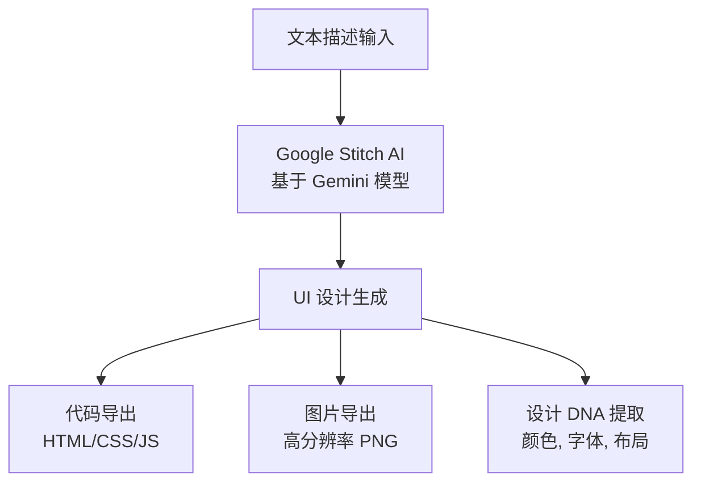
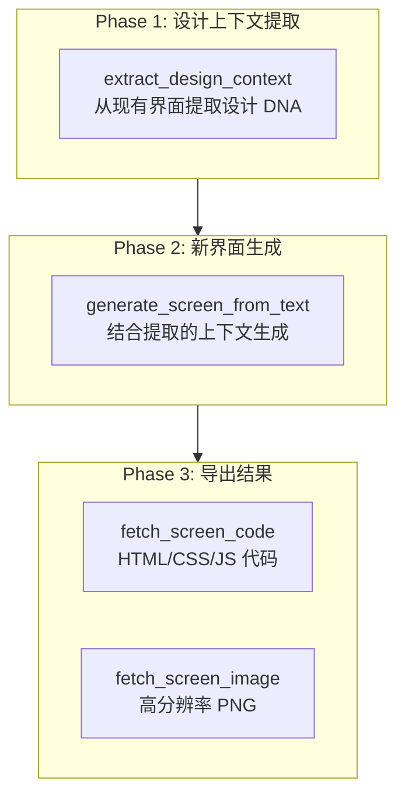
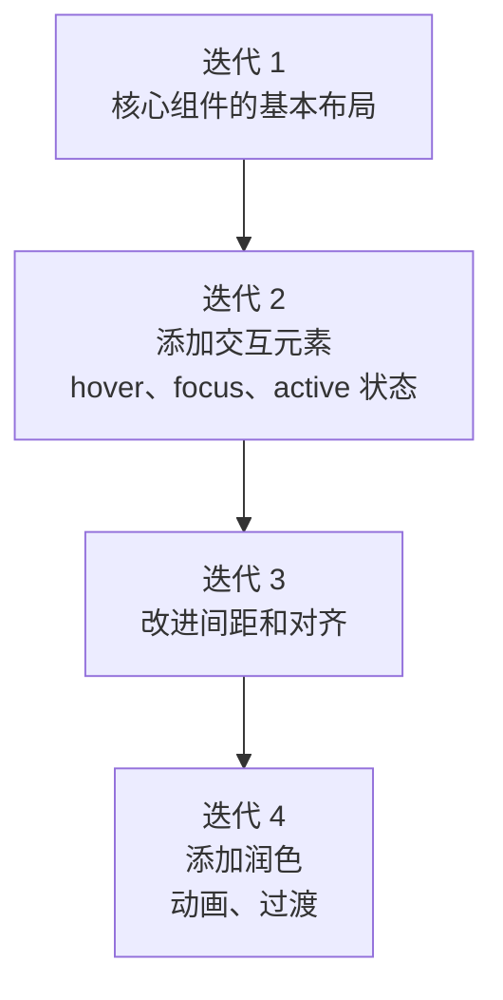

详细介绍如何使用 Google Stitch MCP 服务器生成基于 AI 的 UI/UX 设计。


**一句话总结**: Google Stitch 是 **仅通过文本描述即可生成 UI 界面的 AI 设计工具**。通过 MCP 服务器, 可以在 Claude Code 中直接生成 UI、提取设计上下文, 并导出为生产代码。


## Google Stitch 是什么?

Google Stitch 是 Google Labs 开发的基于 AI 的 UI/UX 设计生成工具。使用 Gemini AI 模型将自然语言描述转换为专业级的 UI 界面。

即使在没有设计师的开发环境中, 使用 Stitch 也能保持一致的设计系统并快速进行 UI 原型设计。



### 主要功能

| 功能 | 描述 |
|------|------|
| **AI 设计生成** | 通过文本提示生成完整的 UI 界面 |
| **设计 DNA 提取** | 从现有界面中提取颜色、字体、布局模式 |
| **代码导出** | 生成 HTML/CSS/JavaScript 生产代码 |
| **图片导出** | 下载高分辨率 PNG 截图 |
| **项目管理** | 按项目组织和管理界面 |
| **Figma 集成** | 可将生成的界面复制到 Figma |


Google Stitch 可以 **免费**使用。Standard Mode 每月可生成 350 次, Experimental Mode 每月可生成 50 次。只需要 Google 账户即可。


## 准备工作

要使用 Google Stitch MCP, 需要完成以下 4 步设置。

### Step 1: 创建 Google Cloud 项目

在 Google Cloud Console 中创建新项目或选择现有项目。

```bash
# 如果没有 gcloud CLI, 请先安装
# https://cloud.google.com/sdk/docs/install

# Google Cloud 认证
gcloud auth login

# 项目设置 (使用现有项目时)
gcloud config set project YOUR_PROJECT_ID
```

### Step 2: 启用 Stitch API

```bash
# 安装 beta 组件 (仅首次)
gcloud components install beta

# 启用 Stitch API
gcloud beta services mcp enable stitch.googleapis.com --project=YOUR_PROJECT_ID
```

### Step 3: 设置应用程序默认凭据

```bash
# 应用程序默认凭据登录
gcloud auth application-default login

# 设置配额项目
gcloud auth application-default set-quota-project YOUR_PROJECT_ID
```

### Step 4: 设置环境变量

```bash
# 添加到 .bashrc 或 .zshrc
export GOOGLE_CLOUD_PROJECT="YOUR_PROJECT_ID"
```


**Google Cloud 项目必须启用结算** (Billing)。Stitch 本身是免费的, 但 API 调用需要已设置结算的项目。此外, 项目必须被授予 `roles/serviceusage.serviceUsageConsumer` IAM 角色。


## MCP 配置

### .mcp.json 配置

在项目根目录的 `.mcp.json` 文件中添加 Stitch MCP 服务器。

```json
{
  "mcpServers": {
    "stitch": {
      "command": "${SHELL:-/bin/bash}",
      "args": ["-l", "-c", "exec npx -y stitch-mcp"],
      "env": {
        "GOOGLE_CLOUD_PROJECT": "YOUR_PROJECT_ID"
      }
    }
  }
}
```

将 `YOUR_PROJECT_ID` 替换为实际的 Google Cloud 项目 ID。

### settings.json 权限设置

要使用 MCP 工具, 必须在 `permissions.allow` 中注册。

```json
{
  "permissions": {
    "allow": [
      "mcp__stitch__*"
    ]
  }
}
```

### settings.local.json 激活

在个人环境中启用 Stitch MCP。

```json
{
  "enabledMcpjsonServers": ["stitch"]
}
```

### 验证连接

设置完成后, 在 Claude Code 中查询项目列表以验证连接。

```bash
# 在 Claude Code 中执行
> 显示 Stitch 项目列表
```

## MCP 工具列表

Stitch MCP 提供 9 个工具。

### 工具完整列表

| 工具 | 用途 |
|------|------|
| `create_project` | 创建新的 Stitch 项目 (工作区) |
| `get_project` | 查询项目详细元数据 |
| `list_projects` | 列出所有可访问的项目 |
| `list_screens` | 列出项目中的所有界面 |
| `get_screen` | 查询单个界面元数据 |
| `generate_screen_from_text` | 通过文本提示生成新的 UI 界面 |
| `fetch_screen_code` | 下载界面的 HTML/CSS/JS 代码 |
| `fetch_screen_image` | 下载界面的高分辨率截图 |
| `extract_design_context` | 提取界面的设计 DNA (颜色、字体、布局) |

### 工具选择指南

| 目的 | 使用的工具 |
|------|-------------|
| 想要生成新设计 | `generate_screen_from_text` |
| 想要分析现有设计 | `extract_design_context` |
| 想要将设计导出为代码 | `fetch_screen_code` |
| 需要设计图片 | `fetch_screen_image` |
| 想要按项目管理多个设计 | `create_project`, `list_projects` |

## Designer Flow 工作流

使用 AI 代理生成多个界面时, 最大的问题是 **设计一致性**。如果独立生成每个界面, 字体、颜色、布局会各不相同。

**Designer Flow** 是解决这个问题的 3 步模式。



### 实战示例: 电子商务应用

```bash
# Phase 1: 从现有主页提取设计上下文
> 提取主页的设计上下文
# → extract_design_context(screen_id="home-screen-001")
# → 提取颜色调色板、字体、间距模式

# Phase 2: 使用提取的上下文生成产品列表界面
> 生成产品列表页面。3 列网格, 左侧过滤器侧边栏,
#   每个卡片包含图片/标题/价格/购物车按钮
# → generate_screen_from_text(prompt=..., design_context=提取的上下文)

# Phase 3: 导出代码和图片
> 导出生成界面的代码和图片
# → fetch_screen_code(screen_id="product-listing-001")
# → fetch_screen_image(screen_id="product-listing-001")
```


**核心**: 生成新界面之前, **务必** 从现有界面执行 `extract_design_context`。这样可以保持整个项目的设计一致性。


## 提示词编写指南

要在 Stitch 中获得良好的结果, 结构化的提示词很重要。

### 5 部分提示词结构

| 顺序 | 元素 | 描述 | 示例 |
|------|------|------|------|
| 1 | **上下文** | 界面的目的和目标用户 | "电子商务产品列表页面" |
| 2 | **设计** | 整体视觉风格 | "极简现代, 亮色背景" |
| 3 | **组件** | 所需 UI 元素的完整列表 | "页眉、搜索、过滤器、卡片网格" |
| 4 | **布局** | 组件的排列方式 | "3 列网格, 左侧过滤器侧边栏" |
| 5 | **样式** | 颜色、字体、视觉属性 | "蓝色主色, Inter 字体" |

### 好的提示词 vs 坏的提示词

| 坏的提示词 | 好的提示词 |
|--------------|--------------|
| "制作一个很棒的登录页面" | "登录界面: 邮箱/密码输入, 登录按钮 (蓝色 primary), 社交登录 (Google, Apple), 忘记密码链接。居中卡片布局, 移动端垂直堆叠" |
| "制作一个仪表板" | "分析仪表板: 顶部 3 个指标卡片 (收入、用户、转化率), 下方折线图, 底部最近交易表格。侧边栏导航。移动端: 隐藏侧边栏, 卡片垂直排列" |
| "375px 宽度按钮" | "移动端全宽按钮, 大触摸区域" |

### 有效的提示词模板

```
创建一个[界面类型]。包含[组件列表]。
使用[布局类型]排列并应用[内容层级]。
包含[交互元素]和[响应式行为]。
应用[设计风格/上下文]。
```


**黄金法则**: 每个提示词只请求 **一个界面**, **一两个调整**。提示词最好保持在 **500 字以下**。对于复杂的界面, 从基本布局开始逐步改进。


## 最佳实践

| 原则 | 描述 |
|------|------|
| **一致性优先** | 生成新界面之前始终执行 `extract_design_context` 以保持设计一致性 |
| **渐进式方法** | 从基本布局开始生成, 然后通过后续提示词添加交互和细节 |
| **包含可访问性** | 始终明确指定 ARIA 标签、键盘导航、焦点指示器 |
| **明确响应式** | 始终在提示词中包含移动端和桌面端行为 |
| **语义化 HTML** | 请求使用 header、main、section、nav、footer 等语义元素 |
| **项目组织** | 将相关界面分组到同一项目中管理 |

### 渐进式改进策略

将复杂界面分多次生成可以提高质量。



## 应避免的反模式


避免以下模式可以获得更好的结果。

- **过度规范**: 使用"移动端宽度"、"大触摸区域"等相对术语, 而不是"375px 宽度"、"48px 高度按钮"等像素级指定
- **模糊提示词**: 具体指定组件列表、布局类型、内容层级, 而不是"制作一个很棒的登录页面"
- **忽略设计上下文**: 如果存在现有界面, 务必先通过 `extract_design_context` 提取后再传递
- **关注点混合**: 不要在一个提示词中混合布局变更和组件添加, 如"添加侧边栏并固定页眉"
- **过长提示词**: 超过 500 字会导致结果不稳定。只包含核心元素并逐步改进
- **未指定响应式**: Stitch 不会自动进行移动端优化。始终指定移动端/桌面端行为


## 问题排查

| 问题 | 原因 | 解决方法 |
|------|------|-----------|
| 认证错误 | ADC 设置未完成 | 重新执行 `gcloud auth application-default login` |
| API 未启用 | Stitch API 未激活 | 执行 `gcloud beta services mcp enable stitch.googleapis.com` |
| 权限被拒绝 | 未授予 IAM 角色 | 检查项目的 Owner 或 Editor 角色, 检查结算是否已启用 |
| 超出配额 | 每日/每月使用量限制 | 等待配额重置 (Standard: 每月 350 次, Experimental: 每月 50 次) |
| 生成结果不佳 | 提示词模糊 | 添加组件列表、布局类型、内容层级 |
| 一致性不足 | 未使用 design_context | 从现有界面执行 `extract_design_context` 后传递 |

### 认证问题解决

```bash
# 1. 重新认证
gcloud auth application-default login

# 2. 检查 API 启用状态
gcloud services list --enabled | grep stitch

# 3. 检查项目 ID
echo $GOOGLE_CLOUD_PROJECT

# 4. 启用 API (如果未启用)
gcloud beta services mcp enable stitch.googleapis.com --project=YOUR_PROJECT_ID
```

## 相关文档

- [MCP 服务器使用](/advanced/mcp-servers) - MCP 协议概述和其他 MCP 服务器
- [settings.json 指南](/advanced/settings-json) - MCP 服务器权限设置
- [技能指南](/advanced/skill-guide) - moai-platform-stitch 技能使用
- [代理指南](/advanced/agent-guide) - 与代理系统的集成


**提示**: 充分利用 Google Stitch 的关键是 **Designer Flow 模式**。从现有界面提取设计上下文后再生成新界面, 可以保持整个项目的设计一致性。

