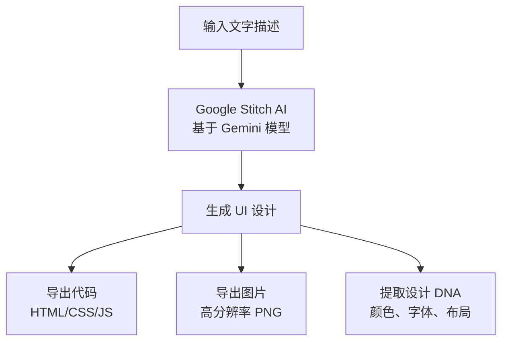
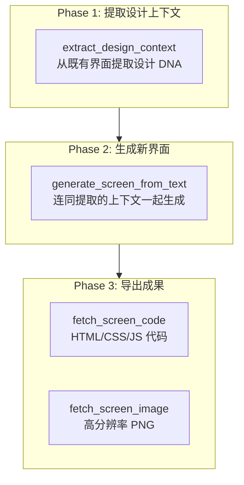
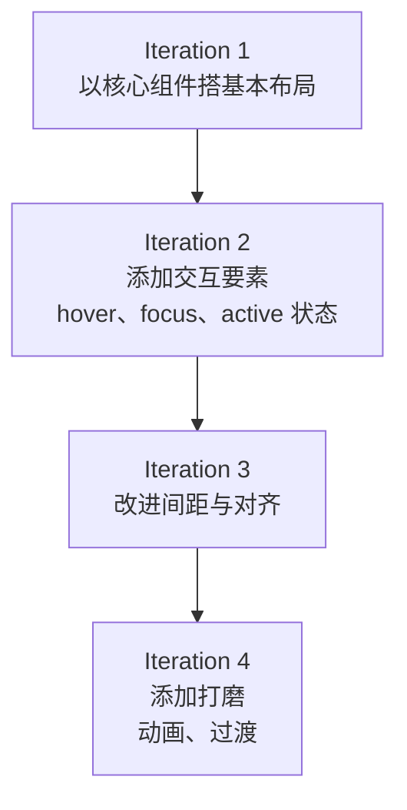

详细介绍如何利用 Google Stitch MCP 服务器生成基于 AI 的 UI/UX 设计。智能体 Harness 不止于代码 — 把设计生成工具通过 MCP 接入后，UI 原型设计也能流入同一条智能体工作流。


**一句话总结**：Google Stitch 是 **仅凭文字描述即可生成 UI 界面的 AI 设计工具**。通过 MCP 服务器，可以直接在 Claude Code 中生成 UI、提取设计上下文，并导出为生产代码。


## 什么是 Google Stitch？

Google Stitch 是 Google Labs 开发的基于 AI 的 UI/UX 设计生成工具。它使用 Gemini AI 模型把自然语言描述转换为专业水准的 UI 界面。

即使在没有设计师的开发环境中，利用 Stitch 也能在保持一致设计系统的同时快速做 UI 原型。


```mermaid
flowchart TD
    A["输入文字描述"] --> B["Google Stitch AI<br>基于 Gemini 模型"]
    B --> C["生成 UI 设计"]
    C --> D["导出代码<br>HTML/CSS/JS"]
    C --> E["导出图片<br>高分辨率 PNG"]
    C --> F["提取设计 DNA<br>颜色、字体、布局"]
```

### 主要功能

| 功能 | 说明 |
|------|------|
| **AI 设计生成** | 用文字提示词生成完整的 UI 界面 |
| **设计 DNA 提取** | 从既有界面提取颜色、字体、布局模式 |
| **代码导出** | 生成 HTML/CSS/JavaScript 生产代码 |
| **图片导出** | 下载高分辨率 PNG 截图 |
| **项目管理** | 以项目为单位组织与管理界面 |
| **Figma 联动** | 生成的设计可复制到 Figma |


Google Stitch 可以 **免费** 使用。Standard Mode 每月可生成 350 次，Experimental Mode 每月 50 次。只需一个 Google 账号。


## 事前准备

使用 Google Stitch MCP 需要完成以下 4 步设置。

### Step 1: 创建 Google Cloud 项目

在 Google Cloud Console 创建新项目或选择既有项目。

```bash
# 若没有 gcloud CLI 先安装
# https://cloud.google.com/sdk/docs/install

# Google Cloud 认证
gcloud auth login

# 设置项目 (使用既有项目时)
gcloud config set project YOUR_PROJECT_ID
```

### Step 2: 启用 Stitch API

```bash
# 安装 beta 组件 (仅首次)
gcloud components install beta

# 启用 Stitch API
gcloud beta services mcp enable stitch.googleapis.com --project=YOUR_PROJECT_ID
```

### Step 3: 设置 Application Default Credentials

```bash
# 应用默认凭据登录
gcloud auth application-default login

# 设置配额项目
gcloud auth application-default set-quota-project YOUR_PROJECT_ID
```

### Step 4: 设置环境变量

```bash
# 添加到 .bashrc 或 .zshrc
export GOOGLE_CLOUD_PROJECT="YOUR_PROJECT_ID"
```


Google Cloud 项目必须已启用 **结算** (Billing)。Stitch 本身免费，但 API 调用需要一个已配置结算的项目。此外项目须被授予 `roles/serviceusage.serviceUsageConsumer` IAM 角色。


## MCP 配置

### .mcp.json 配置

在项目根目录的 `.mcp.json` 文件中添加 Stitch MCP 服务器。

```json
{
  "mcpServers": {
    "stitch": {
      "command": "${SHELL:-/bin/bash}",
      "args": ["-l", "-c", "exec npx -y stitch-mcp"],
      "env": {
        "GOOGLE_CLOUD_PROJECT": "YOUR_PROJECT_ID"
      }
    }
  }
}
```

把 `YOUR_PROJECT_ID` 替换为实际的 Google Cloud 项目 ID。

### settings.json 权限配置

要使用 MCP 工具，须注册到 `permissions.allow`。

```json
{
  "permissions": {
    "allow": [
      "mcp__stitch__*"
    ]
  }
}
```

### settings.local.json 启用

在个人环境中启用 Stitch MCP。

```json
{
  "enabledMcpjsonServers": ["stitch"]
}
```

### 确认连接

配置完成后，在 Claude Code 中查询项目列表确认连接。

```bash
# 在 Claude Code 中执行
> 显示 Stitch 项目列表
```

## MCP 工具列表

Stitch MCP 提供 9 个工具。

### 工具完整列表

| 工具 | 用途 |
|------|------|
| `create_project` | 创建新的 Stitch 项目（工作空间） |
| `get_project` | 查询项目详细元数据 |
| `list_projects` | 列出所有可访问的项目 |
| `list_screens` | 列出项目内所有界面 |
| `get_screen` | 查询单个界面元数据 |
| `generate_screen_from_text` | 用文字提示词生成新 UI 界面 |
| `fetch_screen_code` | 下载界面的 HTML/CSS/JS 代码 |
| `fetch_screen_image` | 下载界面的高分辨率截图 |
| `extract_design_context` | 提取界面的设计 DNA（颜色、字体、布局） |

### 工具选择指南

| 目的 | 使用的工具 |
|------|-------------|
| 想生成新设计 | `generate_screen_from_text` |
| 想分析既有设计 | `extract_design_context` |
| 想把设计导出为代码 | `fetch_screen_code` |
| 需要设计图片 | `fetch_screen_image` |
| 想以项目管理多个设计 | `create_project`, `list_projects` |

## Designer Flow 工作流

用 AI 智能体生成多个界面时，最大的问题是 **设计一致性**。各界面独立生成时，字体、颜色、布局会各不相同。

**Designer Flow** 是解决这个问题的 3 阶段模式。


```mermaid
flowchart TD
    subgraph P1["Phase 1: 提取设计上下文"]
        EC["extract_design_context<br>从既有界面提取设计 DNA"]
    end

    subgraph P2["Phase 2: 生成新界面"]
        GS["generate_screen_from_text<br>连同提取的上下文一起生成"]
    end

    subgraph P3["Phase 3: 导出成果"]
        FC["fetch_screen_code<br>HTML/CSS/JS 代码"]
        FI["fetch_screen_image<br>高分辨率 PNG"]
    end

    P1 --> P2
    P2 --> P3
```

### 实战示例：E-Commerce 应用

```bash
# Phase 1: 从既有首页提取设计上下文
> 提取首页的设计上下文
# → extract_design_context(screen_id="home-screen-001")
# → 提取配色、字体、间距模式

# Phase 2: 用提取的上下文生成商品列表界面
> 生成商品列表页。3 列网格、左侧筛选侧栏,
#   每张卡片包含图片/标题/价格/加入购物车按钮
# → generate_screen_from_text(prompt=..., design_context=提取的上下文)

# Phase 3: 导出代码与图片
> 导出生成界面的代码与图片
# → fetch_screen_code(screen_id="product-listing-001")
# → fetch_screen_image(screen_id="product-listing-001")
```


**关键**：生成新界面前 **务必** 先对既有界面执行 `extract_design_context`。这样才能在整个项目中保持一致的设计。


## 提示词编写指南

要在 Stitch 中获得好结果，结构化的提示词很重要。

### 5-Part 提示词结构

| 顺序 | 要素 | 说明 | 示例 |
|------|------|------|------|
| 1 | **上下文** | 界面的目的与目标用户 | "E-commerce 商品列表页" |
| 2 | **设计** | 整体视觉风格 | "极简现代、浅色背景" |
| 3 | **组件** | 所需 UI 要素完整列表 | "页头、搜索、筛选、卡片网格" |
| 4 | **布局** | 组件排布方式 | "3 列网格、左侧筛选侧栏" |
| 5 | **样式** | 颜色、字体、视觉属性 | "蓝色主色、Inter 字体" |

### 好提示词 vs 坏提示词

| 坏提示词 | 好提示词 |
|--------------|--------------|
| "做一个漂亮的登录页" | "登录界面: 邮箱/密码输入、登录按钮 (蓝色 primary)、社交登录 (Google, Apple)、找回密码链接。居中卡片布局、移动端纵向堆叠" |
| "做一个仪表盘" | "分析仪表盘: 顶部 3 张指标卡 (营收、用户、转化率)、下方折线图、底部近期交易表格。侧栏导航。移动端: 隐藏侧栏、卡片纵向排列" |
| "375px 宽的按钮" | "移动端全宽按钮、大触控区域" |

### 有效的提示词模板

```
生成 [界面类型]。包含 [组件列表]。
以 [布局类型] 排布并应用 [内容层级]。
包含 [交互要素] 与 [响应式行为]。
应用 [设计风格/上下文]。
```


**Golden Rule**：每条提示词只请求 **一个界面**、**一两处调整**。提示词最好保持在 **500 字以内**。复杂界面从基本布局开始逐步改进。


## 最佳实践

| 原则 | 说明 |
|------|------|
| **一致性优先** | 生成新界面前总是先执行 `extract_design_context` 保持设计一致 |
| **渐进式推进** | 先生成基本布局，再用后续提示词添加交互与细节 |
| **包含无障碍** | 总是明确 ARIA 标签、键盘导航、焦点指示器 |
| **明确响应式** | 总是在提示词中包含移动端与桌面端行为 |
| **语义化 HTML** | 请求 header、main、section、nav、footer 等语义化元素 |
| **项目化组织** | 把相关界面归入同一项目管理 |

### 渐进式改进策略

复杂界面分多次生成质量会更好。每一次迭代都是一轮观察-改进循环。


```mermaid
flowchart TD
    I1["Iteration 1<br>以核心组件搭基本布局"] --> I2["Iteration 2<br>添加交互要素<br>hover、focus、active 状态"]
    I2 --> I3["Iteration 3<br>改进间距与对齐"]
    I3 --> I4["Iteration 4<br>添加打磨<br>动画、过渡"]
```

## 应避免的反模式


避开以下模式可以获得更好的结果。

- **过度规格化**：不用"375px 宽"、"48px 高按钮"这样的像素指定，改用"移动端宽度"、"大触控区域"等相对表述
- **模糊提示词**：不要说"漂亮的登录页"，而是具体列出组件列表、布局、内容层级
- **忽略设计上下文**：若有既有界面，务必先用 `extract_design_context` 提取后再传入
- **混杂关注点**：不要像"加个侧栏顺便把页头固定"那样把布局变更和组件添加混进一条提示词
- **过长提示词**：超过 500 字结果会不稳定。只包含核心要素，逐步改进
- **未指定响应式**：Stitch 不会自动做移动端优化。总是明确移动端/桌面端行为


## 问题排查

| 问题 | 原因 | 解决方法 |
|------|------|-----------|
| 认证错误 | ADC 设置未完成 | 重新执行 `gcloud auth application-default login` |
| API 未启用 | Stitch API 处于停用状态 | 执行 `gcloud beta services mcp enable stitch.googleapis.com` |
| 权限被拒 | 未授予 IAM 角色 | 确认项目有 Owner 或 Editor 角色，确认结算已启用 |
| 超出配额 | 每日/每月用量限制 | 等待配额重置（Standard: 每月 350 次，Experimental: 每月 50 次） |
| 生成结果不佳 | 提示词模糊 | 补充组件列表、布局类型、内容层级 |
| 一致性不足 | 未使用 design_context | 先对既有界面 `extract_design_context` 后传入 |

### 认证问题排查

```bash
# 1. 重新认证
gcloud auth application-default login

# 2. 确认 API 启用状态
gcloud services list --enabled | grep stitch

# 3. 确认项目 ID
echo $GOOGLE_CLOUD_PROJECT

# 4. 启用 API (若处于停用状态)
gcloud beta services mcp enable stitch.googleapis.com --project=YOUR_PROJECT_ID
```

## 相关文档

- [MCP 服务器应用](/zh/advanced/mcp-servers) - MCP 协议概览与其他 MCP 服务器
- [settings.json 指南](/zh/advanced/settings-json) - MCP 服务器权限配置
- [技能指南](/zh/advanced/skill-guide) - moai-platform-stitch 技能应用
- [智能体指南](/zh/advanced/agent-guide) - 与智能体系统的联动


**提示**：把 Google Stitch 用到极致的关键是 **Designer Flow 模式**。先从既有界面提取设计上下文再生成新界面，就能在整个项目中保持一致的设计。

