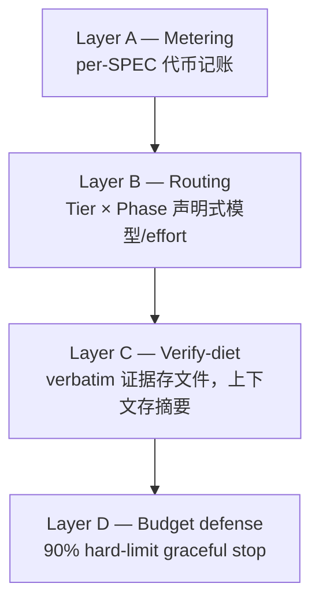

代币经济学(Token Economics)是 MoAI-ADK v3.0 的第一根支柱。即使代币单价下降，代理式开发仍然大量消耗代币，因此决定成本的不是模型价格而是代币的运用方式。本页概述代币经济学的整体架构，并链接到各子主题的深入页面。

## 为什么是代币经济学

随着多个代理运行、上下文变长、推理加深，单个会话的代币消耗急剧增加。在代币价格下降无法跟上代币使用量增长的形势下，线束如何计量、路由、节食和防御代币成为成本竞争力的核心轴线。

MoAI-ADK 的回答有三点。

1. **为每个任务分配合适的模型和推理深度** — 规划深、实现省、验证独立。
2. **节食上下文** — 最小化常驻指令，测量提示缓存命中率。
3. **系统守护预算** — 追踪代币使用，在超阈值前优雅停止。

## 三柱叙事

v3.0 的产品差异化由三根支柱组成。代币经济学是第一根，与其余两根紧密连接。

 **代币经济学** (本页) — 计量、路由、节食、防御。

 **自主连续循环** — 何时停止、何时继续。在[自主连续循环](/zh/advanced/autonomous-loops/)页面讨论。

 **代理式线束** — 哪个代理、哪个层级、如何进化。在[三层架构](/zh/advanced/no-haiku-3tier/)、[plan_type 层级配置](/zh/advanced/plan-type-profiles/)、[线束自我进化](/zh/advanced/self-evolving/)页面讨论。

## 四层代币经济学结构

代币经济学由四层组成。每层独立运作并相互补充。

### Layer A — 计量 (Metering)

 所有代理调用的代币使用量按 per-SPEC 粒度记账。`moai spec audit` 输出中的代币列和 progress.md 中的代币记账部分是本层的产出。不知道什么消耗了代币，就无法优化。

### Layer B — 路由 (Routing)

 根据工作阶段(plan / run / sync)和 SPEC 大小(Tier S / M / L)，声明式地分配模型和推理深度(effort)。需要深度推理的规划阶段分配高推理模型，机械重复多的实现阶段分配轻量模型，最大化性价比。详细的 60 格配置矩阵见 [plan_type 层级配置](/zh/advanced/plan-type-profiles/)页面。

### Layer C — 验证节食 (Verify-diet)

 将验证命令的长输出重定向到磁盘文件，上下文中只保留 exit code 和 bounded tail(最多 50 行)。这个文件重定向契约(file-redirect contract)在保持验证证据完整性的同时减少上下文消耗。详细机制见[代币预算管理与优雅停止](/zh/advanced/token-budget/)页面。

### Layer D — 预算防御 (Budget defense)

 当代理的代币使用量达到 hard-limit(默认 90%)时，执行优雅中止(graceful abort)。进度保存到 progress.md，发出可粘贴的 resume 消息(paste-ready resume)，绝不自动 `/clear`。详细步骤见[代币预算管理与优雅停止](/zh/advanced/token-budget/)页面。

## 模型层级路由

将 Layer B 路由具体化的是模型层级策略。MoAI-ADK v3.0 将 Haiku 从路由模型集合中排除，以三层结构(Sonnet / Opus / Fable)分散工作。此设计的依据和 ApplyTierProfile 实现在以下两页讨论。

- [三层代理架构](/zh/advanced/no-haiku-3tier/) — 为什么排除 Haiku、DeepSWE 排行榜依据
- [plan_type 层级配置](/zh/advanced/plan-type-profiles/) — api vs 订阅计费各自的 60 格配置矩阵

## CG 模式 (成本优化)

`moai cg` 是结合 Claude 领导者和 GLM 工作进程的混合模式。战略、规划、审计由 Claude 担当，大规模实现工作由 GLM 担当。在实现密集型任务上可实现 60-70% 的成本削减。

GLM-5.2 是 1M 上下文的单一模型，定价为输入 $2 / 输出 $8 (每 1M 代币)，自动应用 z.ai 隐式提示缓存。CG 模式和 GLM 独立会话(`moai glm`)的详情请参阅 Multi-LLM 部分。

## 已验证的事实与路线图

本页内容的实现状态明确区分如下。

 **已实现 (已发布)** — 四层结构(A/B/C/D)全部、三层模型策略(ApplyTierProfile)、CG 模式、验证节食文件重定向契约、优雅中止机制。

 **设计阶段 (路线图)** — GLM 后端 effort 叠加的 wire 有效性是需要实时 GLM 会话出站观测的实证课题。在 plan_type 层级配置页面中明确标注此区分。

## 下一步

- [代币预算管理与优雅停止](/zh/advanced/token-budget/) — Layer D 深入 (各模型阈值、paste-ready resume 结构)
- [三层代理架构](/zh/advanced/no-haiku-3tier/) — 线束架构基础
- [plan_type 层级配置](/zh/advanced/plan-type-profiles/) — 60 格配置矩阵
