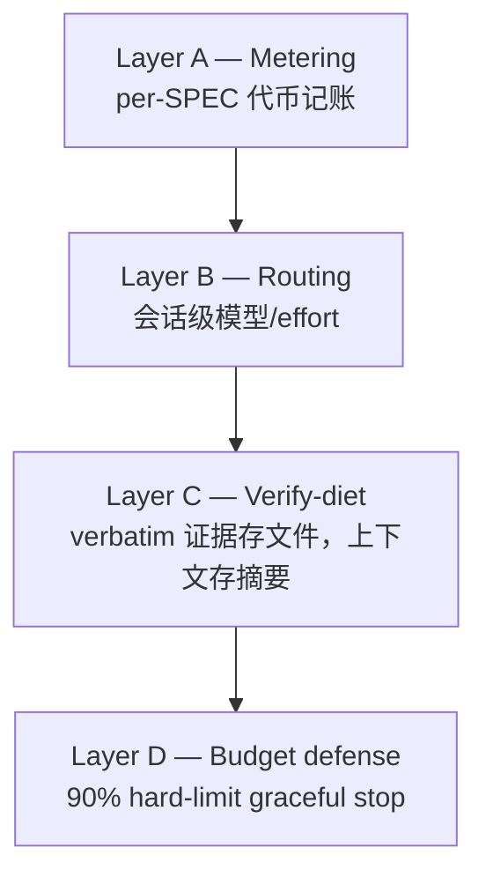
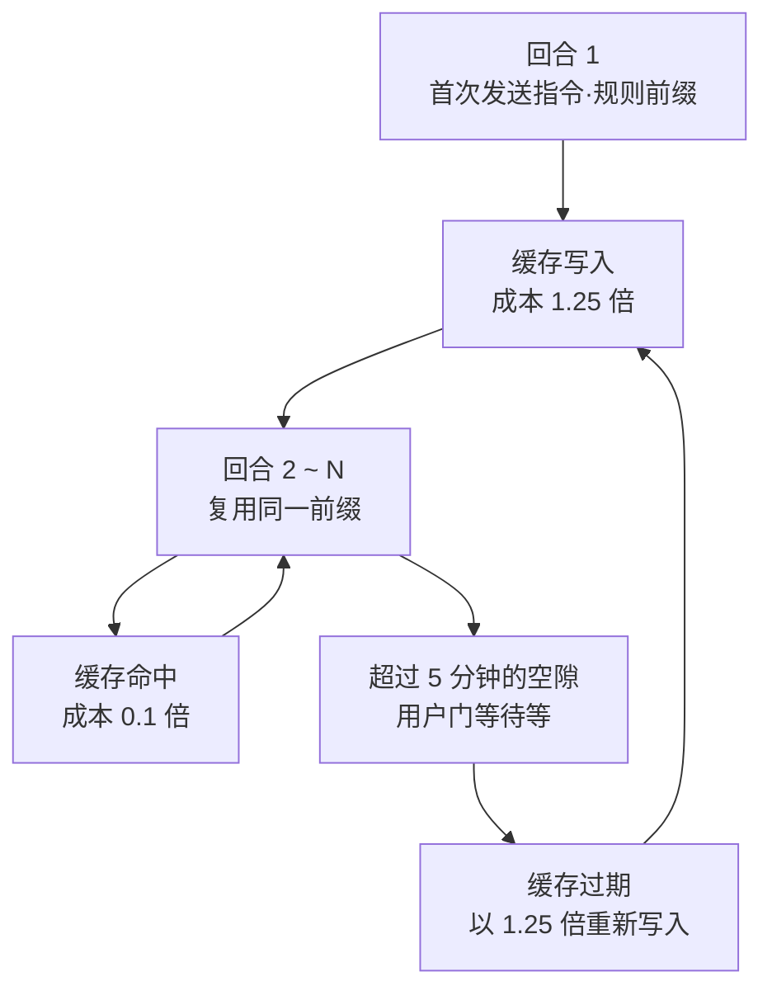

代币经济学(Token Economics)是 MoAI-ADK v3.0 的三大核心之一。即使代币单价下降，代理式开发仍然大量消耗代币，因此决定成本的不是模型价格而是代币的运用方式。本页概述代币经济学的整体架构，并链接到各子主题的深入页面。

## 为什么是代币经济学

随着多个代理运行、上下文变长、推理加深，单个会话的代币消耗急剧增加。在代币价格下降无法跟上代币使用量增长的形势下，线束如何计量、路由、节食和防御代币成为成本竞争力的核心所在。

MoAI-ADK 的回答有三点。

1. **为会话选择合适的模型和推理深度** — 主会话的模型与 effort 会原样传给所有子代理，选好一个会话就是完成了整体分配。
2. **节食上下文** — 最小化常驻指令，测量提示缓存命中率。
3. **系统守护预算** — 追踪代币使用，在超阈值前正常停止。

## 三大核心叙事

v3.0 的产品差异化由三大核心组成。代币经济学是第一个核心，与其余两个紧密连接。

 **代币经济学** (本页) — 计量、路由、节食、防御。

 **自主连续循环** — 何时停止、何时继续。在[自主连续循环](/zh/advanced/autonomous-loops/)页面讨论。

 **代理式线束** — 哪个代理、哪个配置文件、如何进化。在[三层架构](/zh/advanced/no-haiku-3tier/)、[配置矩阵](/zh/advanced/profile-matrix/)、[线束自我进化](/zh/advanced/self-evolving/)页面讨论。

## 四层代币经济学结构

代币经济学由四层组成。每层独立运作并相互补充。

```mermaid
flowchart TD
    A["Layer A — Metering<br/>per-SPEC 代币记账"]
    B["Layer B — Routing<br/>会话级模型/effort"]
    C["Layer C — Verify-diet<br/>verbatim 证据存文件，上下文存摘要"]
    D["Layer D — Budget defense<br/>90% hard-limit graceful stop"]

    A --> B
    B --> C
    C --> D
```

### Layer A — 计量 (Metering)

 所有代理调用的代币使用量按 per-SPEC 粒度记账。`moai spec audit` 输出中的代币列和 progress.md 中的代币记账部分是本层的产出。不知道什么消耗了代币，就无法优化。

### Layer B — 路由 (Routing)

 决定会话使用的模型和推理深度(effort)。v3.2 起路由的单位是**会话**而不是智能体 —— 主会话的模型与 effort 被所有子代理原样继承，会话 effort 用 `/effort`·`ultrathink` 调节，配置向导的会话模型策略决定未单独选择推理强度时的默认回退。不再需要像过去那样维护逐智能体的分配表。MoAI-ADK v3.0 将 Haiku 从路由模型集合中排除，贴合任务性质的三层结构 —— 单次完成的工作交给 Sonnet，代理式阶梯交给 Opus，更高的 effort 集中给做判断的工作（审计、顾问、协调）—— 作为选择会话模型的判断标准保留下来。设计依据与继承规则见 [三层代理架构](/zh/advanced/no-haiku-3tier/)、[配置矩阵](/zh/advanced/profile-matrix/)与[模型策略](/zh/multi-llm/model-policy/)页面。

### Layer C — 验证节食 (Verify-diet)

 将验证命令的长输出重定向到磁盘文件，上下文中只保留 exit code 和 bounded tail(最多 50 行)。这个文件重定向契约(file-redirect contract)在保持验证证据完整性的同时减少上下文消耗。节食不限于验证输出——缩短常驻指令、提高提示缓存命中率，也属于这一层。详细机制见[代币预算管理与正常停止](/zh/advanced/token-budget/)页面。

### Layer D — 预算防御 (Budget defense)

 当代理的代币使用量达到 hard-limit(默认 90%)时，执行正常中止(graceful abort)。进度保存到 progress.md，发出可粘贴的 resume 消息(paste-ready resume)，绝不自动 `/clear`。详细步骤见[代币预算管理与正常停止](/zh/advanced/token-budget/)页面。

## 提示缓存：同一段指令从第二次起更便宜

代币经济学中容易被忽视的一种成本结构是提示缓存（把之前发送过的输入暂时保存起来的功能）。Anthropic 的提示缓存按前缀匹配工作，作用对象是渲染后请求的前部（按 tools → system → messages 的顺序）。首次必须把该前缀写入缓存，付出 1.25 倍的成本；此后复用同一前缀的回合则以 0.1 倍的成本读取。这是一种能把单回合输入变得便宜近 10 倍的结构。

这里有两个陷阱。

第一，缓存的寿命是 5 分钟。但这 5 分钟不是"5 分钟后过期"，而是"只要出现超过 5 分钟的空闲间隙就过期"。在用户门等待答复的时间一旦拖长，缓存就会过期，下一回合必须以 1.25 倍重新写入整个前缀。所以问得越晚的问题，代价越大。

第二，缓存在写入期间无法读取。同时启动多个共享同一定义的代理时，同时出发的请求不会等待第一个完成缓存写入，于是每一个都以冷状态（cold）各自重新写入前缀。

```mermaid
flowchart TD
    T1["回合 1<br/>首次发送指令·规则前缀"]
    W["缓存写入<br/>成本 1.25 倍"]
    T2["回合 2 ~ N<br/>复用同一前缀"]
    H["缓存命中<br/>成本 0.1 倍"]
    GAP["超过 5 分钟的空隙<br/>用户门等待等"]
    MISS["缓存过期<br/>以 1.25 倍重新写入"]

    T1 --> W
    W --> T2
    T2 --> H
    H --> T2
    T2 --> GAP
    GAP --> MISS
    MISS --> W
```

由于这一结构，MoAI-ADK 有意识地调整执行顺序。用户门在上下文还小的时候尽早就问；并行启动多个同类代理时，先启动一个把缓存焐热，再接着启动其余的（stagger-spawn）；会话开始时加载的指令文件不在会话中途编辑，而是推迟到任务末尾。缓存不改变门控的语义。审批门照旧是必需的，缓存感知执行只是调整"何时、以什么顺序"去问这些门而已。

## 各模型上下文阈值

预算守护在何时停止，其操作阈值因模型而异。窗口越大，能承受的使用率越高；窗口越小，绝对余量本身就越少。

| 模型类别 | 窗口 | 交接阈值 | 绝对上限 |
|----------|------|----------|----------|
| Opus 5.5 (1M) | 1,000,000 代币 | 50% | ~500,000 代币 |
| GLM-5.3 (1M) | 1,000,000 代币 | 50% | ~500,000 代币 |
| Fable / Sonnet 5 (1M) | 1,000,000 代币 | 50% | ~500,000 代币 |
| Sonnet 4.5 及更早 (200K) | 200,000 代币 | 90% | ~180,000 代币 |

1M 上下文模型 (Opus 5.5、GLM-5.3) 建议在 50% 交接。窗口宽并不意味着用到最后一刻——更早折叠以保护缓存和余量才是更稳定的做法。留意 statusline 的上下文表盘 (CW%)，在接近阈值时准备 `/clear`。详细步骤与交接消息结构见[代币预算管理与正常停止](/zh/advanced/token-budget/)页面。

## CG 停用与配置迁移

`moai cg` 已停用。它会显示迁移提示并退出，不会启动 Claude 或 GLM，也不是 `moai cc` 的别名。项目中若仍有 `llm.team_mode: cg`，必须先明确选择迁移方案，才能启动会话。 [CG 停用与配置迁移](/zh/multi-llm/cg-mode/)

迁移会写入 `llm.team_mode: claude`、`llm.gateway.teammate_mode: in-process` 和 `llm.gateway.teammate_provider: inherit`。这会取消原有混合角色分配，并不会保留 Claude 领队与 GLM 队友窗格的分工。

`claude-glm` 表示 Claude 领队搭配 tmux 中的 GLM 队友。目前 TEAMMATE 集成验证尚未通过，因此不能应用或启动该方案，只能预览。安装 tmux 或设置 `verified: true` 都不能解除限制。

## 已验证的事实与路线图

本页内容的实现状态明确区分如下。

 **已实现 (已发布)** — 四层结构(A/B/C/D)全部、会话继承模型策略（会话的模型·effort 由子代理继承，会话模型策略作为 effort 回退）、验证节食文件重定向契约、正常中止机制。

 **设计阶段 (路线图)** — GLM 后端 effort 叠加的 wire 有效性是需要实时 GLM 会话出站观测的实证课题。在配置矩阵页面中明确标注此区分。

## 下一步

- [代币预算管理与正常停止](/zh/advanced/token-budget/) — Layer D 深入 (各模型阈值、paste-ready resume 结构)
- [三层代理架构](/zh/advanced/no-haiku-3tier/) — 线束架构基础
- [配置矩阵](/zh/advanced/profile-matrix/) — 矩阵退役后的位置与会话继承规则
