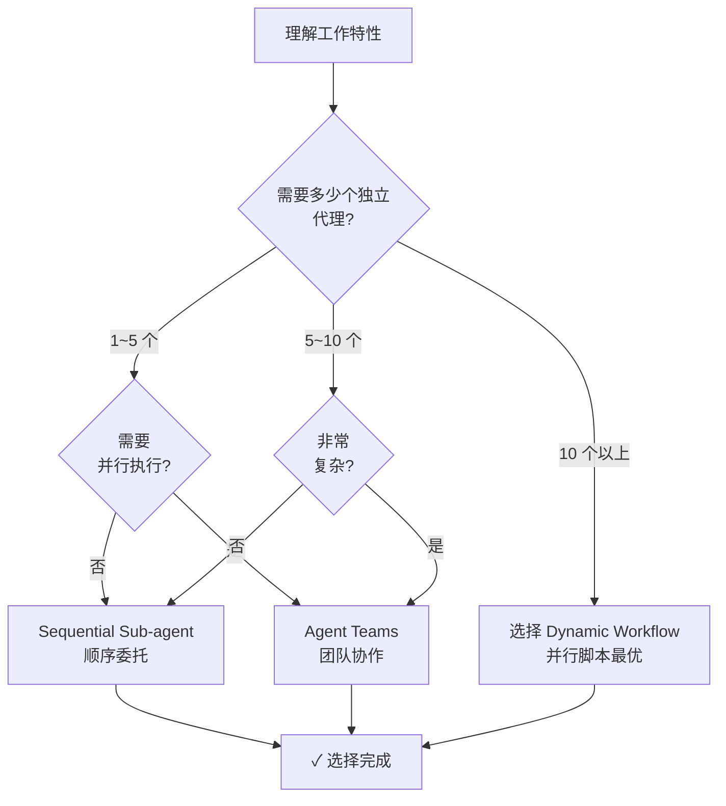

指导 Claude Code 的动态工作流原语和 MoAI-ADK 的 Ultracode 集成。


**一行总结**: 动态工作流是用 JavaScript 编写的自动化脚本，并行协调数十到数百个代理。Ultracode 通过 `/effort ultracode` 或 `ultracode` 关键字触发。


## 3 个编排原语

MoAI-ADK 提供**3 个不同的编排原语**，各优化用于不同目的。

### 1. Sequential Sub-agents（顺序委托）

MoAI 默认模式 — 每轮顺次委托一个代理。

| 特性 | 说明 |
|------|------|
| **计划位置** | Claude 的上下文（轮次间判断） |
| **中间结果** | 在 Claude 的上下文窗口累积 |
| **并行度** | 顺序执行（每轮 1 个代理） |
| **规模** | 通常 3~5 个代理 |
| **上下文成本** | 各代理结果消耗上下文 |

**使用时点**:
- 简单 1~5 个代理任务
- 以编码为中心的 run 阶段工作
- 代理间依赖多的情况

### 2. Agent Teams（团队协作）

多个团队成员通过**共享 TaskList** 协作的高级模式。

| 特性 | 说明 |
|------|------|
| **计划位置** | 共享 TaskList（团队协调） |
| **中间结果** | TaskList + 各团队成员上下文 |
| **并行度** | 3~5 名同时执行（Anthropic 推荐） |
| **规模** | 小规模团队（3~5 名） |
| **上下文成本** | 团队成员级独立上下文 |

**使用时点**:
- 多个团队成员并行工作
- 跨层依赖（后端 ↔ 前端）
- 团队成员间交接和审查必需

### 3. Dynamic Workflows（动态工作流）

用 JavaScript 编写的**自动化脚本**协调多个代理。

| 特性 | 说明 |
|------|------|
| **计划位置** | 脚本代码（声明型计划） |
| **中间结果** | 脚本变量（无上下文累积） |
| **并行度** | 最大 16 个同时（总计最多 1000 个） |
| **规模** | 非常大（数十到数百个代理） |
| **上下文成本** | 仅最终结果消耗上下文 |

**使用时点**:
- 大规模并行工作（数十到数百个代理）
- 全代码库扫描
- 大规模迁移
- 跨源验证

## 选择决策树

判断选择哪个原语的流程图。



## Ultracode 和 Dynamic Workflows

### /effort ultracode

```bash
/effort ultracode
```

为当前会话的所有 substantive 工作激活**自动工作流生成**。

**效果**:
- 推理工作量: 设置为 `xhigh`
- 激活自动工作流生成
- 为每个任务选择最优编排原语

**使用时点**:
- 非常复杂的多阶段工作
- 需要自动编排的大规模项目

### ultracode 关键字

在单个请求中触发工作流。

```bash
> 找到我们代码库中的所有 TODO 注释并分类。
> (不包含 ultracode 关键字时运行常规 sub-agent)

VS

> ultracode: 找到我们代码库中的所有 TODO 注释并分类。
> (自动生成工作流)
```

## Dynamic Workflow 结构

### 基本脚本模板

```javascript
// 工作流脚本: 代码库全体 TODO 分类
const packages = [
  "internal/auth",
  "internal/api",
  "internal/db",
  "pkg/utils"
];

const results = [];

for (const pkg of packages) {
  // 为每个包生成独立代理
  const result = await agent({
    agentType: "Explore",
    model: "haiku",
    effort: "low",
    prompt: `
      找到 ${pkg} 包中所有 TODO 注释并分类。
      格式: [文件] [行] [类别] [内容]
    `
  });
  results.push({ pkg, todos: result });
}

// 最终汇总
const summary = {
  total_packages: packages.length,
  package_summaries: results,
  grand_total_todos: results.reduce((sum, r) => sum + r.todos.length, 0)
};

return summary;
```

### 特征

| 项目 | 说明 |
|------|------|
| **代理生成** | 通过循环动态生成（`await agent({...})`） |
| **中间结果** | 保存在脚本变量（无上下文累积） |
| **并行执行** | 独立工作自动并行（最多 16 个同时） |
| **最终返回** | 仅集成结果返回当前会话 |

## MoAI 集成考虑事项

### AskUserQuestion 约束

工作流代理**无法直接与用户交互**。

```
❌ 工作流代理提出用户问题 → 不可能
✓ MoAI 编排器事先收集所有选择 → 执行工作流
```

**解决方式**:
1. MoAI 编排器调用 `AskUserQuestion`
2. 收集用户响应
3. 将响应包含在工作流输入中执行

### Implementation Kickoff Approval

工作流执行也需要用户批准，如常规 run 阶段。

```
/moai run --workflow SPEC-XXX

→ MoAI: "将使用工作流执行此 SPEC。继续吗?"
→ AskUserQuestion 批准必需
```

### 成本意识

动态工作流可能导致**高令牌消耗**。

| 工作 | 代理数 | 预期成本 |
|------|--------|---------|
| 小规模包扫描 | 5 | 低 |
| 中规模代码库 | 20 | 中等 |
| 全体代码库扫描 | 100+ | 高 |

**成本调整**:
- 模型: 使用 `haiku`（只读提取）
- 代理数: 限制范围（`packages.slice(0, 20)`）
- 并行度: 从最多 16 个手动调整

## 工作流激活和配置

### 激活条件

动态工作流仅在以下条件下执行:

1. Claude Code v2.1.154+
2. 付费计划（Pro 或 Team）
3. `/config` 中 `"disableWorkflows": false`

### 禁用

可在组织或用户级禁用:

```bash
/config
# 关闭 Dynamic workflows 切换

OR

export CLAUDE_CODE_DISABLE_WORKFLOWS=1
```

## 相关文档

- [Harness v4 Builder](/advanced/builder-agents) - 动态团队生成
- [代理指南](/advanced/agent-guide) - 代理系统概览
- [基于 SPEC 的开发](/workflow-commands/moai-plan) - 集成工作流


**提示**: 如果规模小，Sequential Sub-agents 就足够了。仅在"需要并行协调数十到数百个独立任务时"使用动态工作流。

