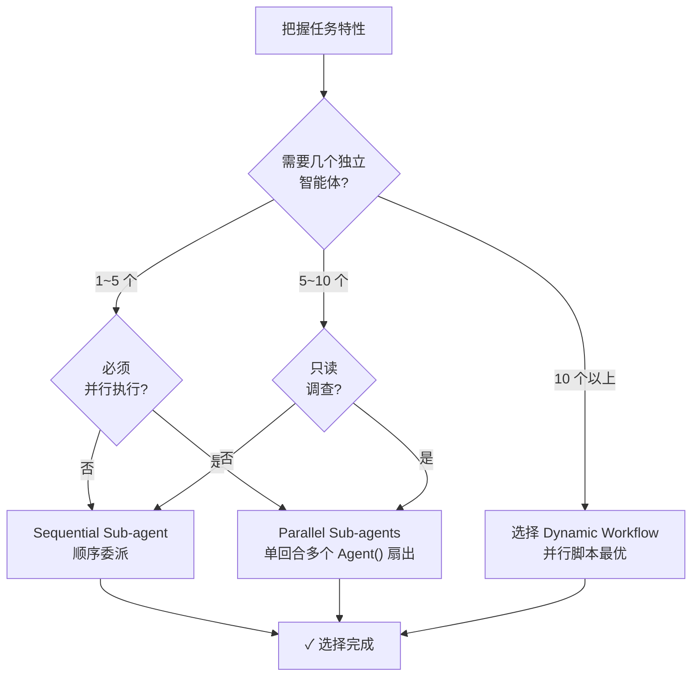

如果把 100 个智能体顺序委派下去，上下文会先崩溃。动态工作流的解法是把计划放在 **脚本变量** 而不是 Claude 的上下文中 — 中间结果留在脚本里，只有最终结果回到会话。它在支撑大规模扇出的同时抑制上下文成本，是代币经济学与循环工程交汇的地方。


**一句话总结**：动态工作流是用 JavaScript 编写的自动化脚本，可并行协调数十~数百个智能体。Ultracode 由 `/effort ultracode` 或 `ultracode` 关键字触发。


## 3 种编排原语

MoAI-ADK 提供 **3 种编排原语**，选择标准是"计划握在谁手里"。

### 1. Sequential Sub-agents（顺序委派）

MoAI 的默认模式 — 每个回合依次委派一个智能体。

| 特性 | 说明 |
|------|------|
| **计划位置** | Claude 的上下文（turn-by-turn 判断） |
| **中间结果** | 累积在 Claude 的上下文窗口中 |
| **并行度** | 顺序执行（每回合 1 个智能体） |
| **规模** | 通常 3~5 个智能体 |
| **上下文成本** | 每个智能体的结果都消耗上下文 |

**使用时机**：
- 简单的 1~5 个智能体任务
- 以编码为主的 run-phase 任务
- 智能体之间依赖较多时

### 2. Agent Teams（团队协作）— v3.0 已退役

早期版本中，这是多名成员通过 **共享 TaskList** 协作的模式。

| 特性（旧规格，仅供参考） | 说明 |
|------|------|
| **计划位置** | 共享 TaskList（团队间协调） |
| **中间结果** | TaskList + 各成员的上下文 |
| **并行度** | 3~5 名同时执行（Anthropic 推荐） |
| **规模** | 小型团队（3~5 名） |
| **上下文成本** | 每名成员独立上下文 |


在 v3.0 中，MoAI 的 Agent Teams **静态编排层已退役**。强制 `--team` 时会回退到 sub-agent 模式。多名成员并行工作、跨层依赖（后端 ↔ 前端）等场景改由并行子智能体扇出处理。原生 Claude Code teammate 运行时（`moai cg` 的 GLM pane 等）继续正常工作。


### 3. Dynamic Workflows（动态工作流）

用 JavaScript 编写的 **自动化脚本** 协调大量智能体。

| 特性 | 说明 |
|------|------|
| **计划位置** | 脚本代码（声明式计划） |
| **中间结果** | 脚本变量（不累积上下文） |
| **并行度** | 最多 16 并发（总计最多 1000） |
| **规模** | 非常大（数十~数百个智能体） |
| **上下文成本** | 只有最终结果消耗上下文 |

**使用时机**：
- 大规模并行任务（数十~数百个智能体）
- 全代码库扫描
- 大规模迁移
- 跨来源交叉验证

## 选择决策树

判断该选哪种原语的流程图。


```mermaid
flowchart TD
    START[把握任务特性] --> Q1{需要几个独立<br>智能体?}
    
    Q1 -->|1~5 个| Q2{必须<br>并行执行?}
    Q1 -->|5~10 个| Q3{只读<br>调查?}
    Q1 -->|10 个以上| WORKFLOW["选择 Dynamic Workflow<br>并行脚本最优"]
    
    Q2 -->|否| SUBAGENT["Sequential Sub-agent<br>顺序委派"]
    Q2 -->|是| PARALLEL["Parallel Sub-agents<br>单回合多个 Agent() 扇出"]
    
    Q3 -->|是| PARALLEL
    Q3 -->|否| SUBAGENT
    
    SUBAGENT --> DONE["✓ 选择完成"]
    PARALLEL --> DONE
    WORKFLOW --> DONE
```

> MoAI 的静态 Agent Teams 编排层已退役（见上方警告），并行执行改由 **并行子智能体扇出**（单回合多个 `Agent()`、只读调查范围）承担。原生 Claude Code teammate 运行时（`moai cg` 的 tmux pane）继续独立运行。

## Ultracode 与 Dynamic Workflows

### /effort ultracode

```bash
/effort ultracode
```

对当前会话中的所有实质性任务启用 **自动工作流生成**。

**效果**：
- Reasoning effort：设置为 `xhigh`
- 启用自动工作流生成
- 为每个任务选择最优编排原语

**使用时机**：
- 非常复杂的多阶段任务
- 需要自动编排的大型项目

### ultracode 关键字

若只想在单个请求（而非整个会话）中触发工作流，可以用关键字。

```bash
> 找出我们代码库中的所有 TODO 注释并分类。
> (不含 ultracode 关键字时按普通 sub-agent 执行)

VS

> ultracode: 找出我们代码库中的所有 TODO 注释并分类。
> (自动生成工作流)
```

## Dynamic Workflow 结构

### 基本脚本模板

```javascript
// 工作流脚本: 全代码库 TODO 分类
const packages = [
  "internal/auth",
  "internal/api",
  "internal/db",
  "pkg/utils"
];

const results = [];

for (const pkg of packages) {
  // 为每个包生成独立智能体
  const result = await agent({
    agentType: "Explore",
    model: "haiku",
    effort: "low",
    prompt: `
      在 ${pkg} 包中找出所有 TODO 注释并分类。
      格式: [文件] [行号] [类别] [内容]
    `
  });
  results.push({ pkg, todos: result });
}

// 最终汇总
const summary = {
  total_packages: packages.length,
  package_summaries: results,
  grand_total_todos: results.reduce((sum, r) => sum + r.todos.length, 0)
};

return summary;
```

### 特点

| 项目 | 说明 |
|------|------|
| **智能体生成** | 在循环中动态生成（`await agent({...})`） |
| **中间结果** | 存放在脚本变量（不累积上下文） |
| **并行执行** | 独立任务自动并行（最多 16 并发） |
| **最终返回** | 只有整合结果返回当前会话 |

## MoAI 集成注意事项

### AskUserQuestion 约束

工作流智能体 **不能直接与用户交互**。

```
✗ 工作流智能体向用户提问 → 不可能
✓ MoAI 编排器事先收集所有选项 → 再执行工作流
```

**解决方式**：
1. MoAI 编排器调用 `AskUserQuestion`
2. 收集用户回答
3. 把回答纳入工作流输入后执行

### Implementation Kickoff Approval

工作流执行与普通 run-phase 一样需要用户批准。并不因为是大规模扇出，人工门禁就会消失。

```
/moai run --workflow SPEC-XXX

→ MoAI: "将以工作流方式执行此 SPEC。继续吗?"
→ 必须经 AskUserQuestion 批准
```

### 成本意识

动态工作流虽然节省上下文，但 **总代币消耗可能更大**。扇出规模即成本。

| 任务 | 智能体数 | 预计成本 |
|------|-----------|---------|
| 小规模包扫描 | 5 | 低 |
| 中等规模代码库 | 20 | 中 |
| 全仓库扫描 | 100+ | 高 |

**成本调控**：
- 模型：使用 `haiku`（只读提取）
- 智能体数：限制范围（`packages.slice(0, 20)`）
- 并行度：在最多 16 的基础上手动调整

## Workflow 启用与配置

### 启用条件

动态工作流仅在满足以下条件时执行。

1. Claude Code v2.1.154+
2. 付费计划（Pro 或 Team）
3. `/config` 中 `"disableWorkflows": false`

### 禁用

可在组织或用户级别禁用。

```bash
/config
# 关闭 Dynamic workflows 开关

OR

export CLAUDE_CODE_DISABLE_WORKFLOWS=1
```

## 相关文档

- [构建器智能体与 Harness v4](/zh/advanced/builder-agents) - 动态团队生成
- [智能体指南](/zh/advanced/agent-guide) - 智能体系统概览
- [基于 SPEC 的开发](/zh/workflow-commands/moai-plan) - 集成工作流


**提示**：规模小时用 Sequential Sub-agents 就足够。动态工作流只在"需要并行协调数十~数百个独立任务"时使用 — 别忘了扇出本身就是成本。

