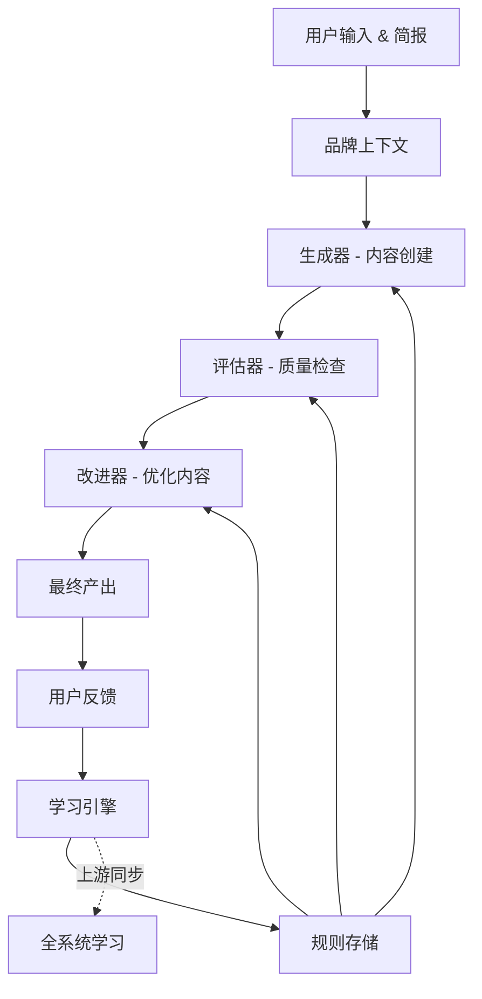

## 什么是 AI Agency？

AI Agency 是一个**随着使用而不断进化的创意生产系统**。它将 MoAI 的强大开发能力与现代创意工作流相结合，打造专注于品牌、营销和内容创建的自适应机构。

与 MoAI 的区别很简单：
- **MoAI** 是开发工具，专注于代码和系统实现
- **AI Agency** 是创意机构，专注于品牌表达和用户体验

## 核心特性

### 1. 自我进化技能
系统通过每个项目的反馈循环不断学习和改进，自动将成功的模式升级为规则。

### 2. GAN 循环（生成-评估-改进）
创意内容通过生成器和评估器的双向迭代产生，确保质量和创意性的完美平衡。

### 3. 品牌上下文系统
所有产出都基于统一的品牌定义（色彩、声调、价值观），保证整个项目的一致性。

### 4. 双区域架构
- **FROZEN 区域**：不变的品牌规则和安全边界
- **EVOLVABLE 区域**：根据用户反馈进化的规则和策略

### 5. 上游同步
项目改进自动反馈到整个 Agency 系统，所有项目都受益于集体学习。

## 管道架构

## 核心使用场景


AI Agency 特别适合这些场景：


### 落地页生成
快速创建高质量落地页，从基础框架到完整的营销文案和视觉设计。

### SaaS 网站
构建专业的 SaaS 营销网站，包括产品展示、价格表、案例研究等。

### 营销网站
生成多页面营销网站，整合品牌规则、SEO 优化和转化策略。

## MoAI vs AI Agency 对比

| 维度 | MoAI | AI Agency |
|------|------|-----------|
| **主要用途** | 代码开发 | 创意内容生产 |
| **目标输出** | 可执行代码 | 品牌网站 |
| **工作流程** | SPEC → DDD → Docs | Briefing → GAN → Publish |
| **进化方式** | 开发最佳实践 | 创意规则和策略 |
| **评估标准** | 代码质量、测试覆盖 | 品牌一致性、用户体验 |
| **集成方式** | 命令行工具 | Web 界面 + 命令行 |

## 快速开始

1. **创建品牌简报** - 定义您的品牌色彩、声调和价值观
2. **生成初稿** - AI Agency 基于简报生成首版内容
3. **评估和反馈** - 系统评估内容，您提供反馈
4. **进化改进** - 根据反馈改进内容并更新规则
5. **发布** - 将最终产出发布到您的网站或平台


**首次使用建议**：从简单项目开始（如单页落地页），让 Agency 学习您的风格后再进行复杂项目。


## 下一步

- 查看[快速开始](./getting-started)了解如何创建第一个项目
- 阅读[代理 & 技能](./agents-and-skills)了解系统架构
- 探索[自我进化系统](./self-evolution)了解学习机制
- 参考[命令参考](./command-reference)查看所有可用命令
