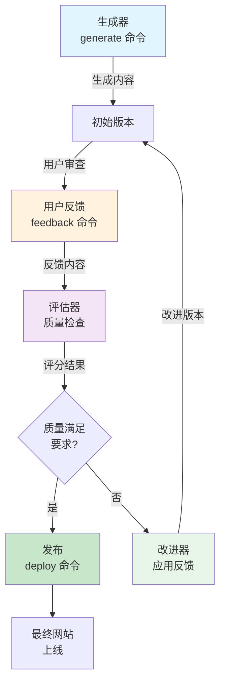

AI Agency 提供 11 个主要子命令用于管理项目的整个生命周期。所有命令都可以通过 Claude Code 的 `/moai` 前缀或终端中的 `moai agency` 调用。

## 命令快速参考表

| 命令 | 描述 | 使用场景 |
|------|------|--------|
| `generate` | 从简报生成初始内容 | 项目开始、大版本更新 |
| `feedback` | 提交反馈以改进内容 | 每次您想改进时 |
| `review` | 查看当前生成的内容 | 内容审核前反馈 |
| `diff` | 查看上个版本的差异 | 理解什么改变了 |
| `build` | 构建最终网站 | 部署前的最后一步 |
| `deploy` | 发布到生产环境 | 网站上线 |
| `preview` | 本地预览网站 | 发布前测试 |
| `rules` | 管理和查看规则库 | 审查学到的规则 |
| `stats` | 查看项目统计信息 | 监控进度和性能 |
| `reset` | 恢复到之前的版本 | 撤销不需要的更改 |
| `export` | 导出项目为独立 ZIP | 备份或共享项目 |

## 完整命令详解

### generate - 生成内容

从简报和品牌定义生成初始网站内容或大版本更新。

**基本用法**：
```bash
moai agency generate
```

**常见选项**：
```bash
# 生成特定部分（而不是整个网站）
moai agency generate --section pages

# 生成并保留现有规则
moai agency generate --preserve-rules

# 强制重新生成（忽略缓存）
moai agency generate --force

# 使用特定的生成策略
moai agency generate --strategy conservative  # 保守
moai agency generate --strategy creative      # 创意
```

**输出**：
- 生成的页面文件到 `content/pages/`
- 更新的组件到 `content/components/`
- 生成报告到 `.agency/logs/generate-{timestamp}.md`

**何时使用**：
- 第一次创建项目
- 更新简报后需要重新生成
- 需要完全重新设计时

---

### feedback - 提交改进反馈

告诉系统您想如何改进内容。系统将学习您的偏好并更新规则。

**基本用法**：
```bash
moai agency feedback
```

这会打开一个交互式界面让您：
1. 选择要反馈的内容（页面、组件等）
2. 输入反馈内容
3. 指定优先级
4. 选择是否立即应用

**快速反馈（跳过交互）**：
```bash
# 对特定页面给反馈
moai agency feedback --page home --content "标题太长，请简化"

# 对整个项目的反馈
moai agency feedback --global "需要更多的社会证明"

# 带优先级的反馈
moai agency feedback --priority high --content "修复导航栏样式"
```

**反馈最佳实践**：

```
好的反馈：
✓ "主标题应该用红色而不是蓝色，更符合紧迫性"
✓ "CTA 按钮文本太通用，需要更具体的行动词"
✓ "这个部分的字体大小对手机不友好"

不好的反馈：
✗ "我不喜欢这样"（太模糊）
✗ "改进它"（没有具体建议）
✗ "更专业"（需要具体说明如何专业）
```

**反馈类型**：
- **内容反馈**：关于文案、措辞、信息
- **设计反馈**：关于布局、颜色、字体
- **功能反馈**：关于交互、功能、结构
- **性能反馈**：关于速度、可访问性、SEO

---

### review - 审查当前内容

显示当前生成的内容，并提供质量分析。

**基本用法**：
```bash
moai agency review
```

**输出包含**：
- 所有生成页面的列表
- 每个页面的质量评分
- 任何警告或建议
- 与品牌规则的一致性检查结果

**详细审查**：
```bash
# 审查特定页面
moai agency review --page home

# 审查特定维度（内容、设计、SEO）
moai agency review --dimension content
moai agency review --dimension design

# 显示改进建议
moai agency review --suggestions
```

**输出示例**：
```
页面: home.mdx
质量评分: 82/100

✓ 品牌一致性: 95% - 优秀
△ 内容清晰度: 78% - 可改进
△ SEO 优化: 71% - 需要改进
✓ 可访问性: 92% - 优秀

建议:
1. 简化主标题（当前 18 个词，建议 < 10）
2. 添加更多 H2 子标题以改进可读性
3. 在产品功能部分添加 meta 描述
```

---

### diff - 查看版本差异

显示当前版本与上一个版本之间的差异。

**基本用法**：
```bash
moai agency diff
```

**比较特定版本**：
```bash
# 与前两个版本比较
moai agency diff --versions 2

# 与特定时间戳比较
moai agency diff --since "2024-01-15 14:30"

# 仅显示特定页面的差异
moai agency diff --page home
```

**差异详情**：
```
diff home.mdx
- 标题: "欢迎来到我们的网站"
+ 标题: "构建您的梦想项目"

设计变更:
- 背景色: #F0F0F0
+ 背景色: #FFFFFF

规则应用:
+ 新规则: headline-power-words-01 (权重 50%)
+ 新规则: cta-action-verbs-02 (权重 70%)
```

---

### build - 构建最终网站

编译并优化所有资源以生成生产就绪的网站。

**基本用法**：
```bash
moai agency build
```

**选项**：
```bash
# 启用压缩和优化
moai agency build --optimize

# 生成源映射用于调试
moai agency build --sourcemaps

# 包含分析代码
moai agency build --analytics
```

**构建输出**：
- 优化的 HTML、CSS、JavaScript 文件
- 压缩的图像
- 性能报告
- SEO 站点地图

构建通常需要 2-5 分钟。

---

### deploy - 发布到生产环境

将构建的网站部署到您的托管服务。

**基本用法**：
```bash
moai agency deploy
```

**支持的平台**：
```bash
# 部署到 Vercel（默认）
moai agency deploy

# 部署到 GitHub Pages
moai agency deploy --platform github-pages

# 部署到 Netlify
moai agency deploy --platform netlify

# 部署到自定义服务器
moai agency deploy --platform custom --url your-domain.com
```


部署前请确保：
- 运行了 `moai agency build` 成功完成
- 所有测试通过
- 在生产环境前进行了预览


**部署前清单**：
```bash
# 1. 本地预览
moai agency preview

# 2. 构建最终版本
moai agency build

# 3. 部署
moai agency deploy

# 4. 验证（部署后）
moai agency test --production
```

---

### preview - 本地预览网站

启动本地开发服务器以预览您的网站。

**基本用法**：
```bash
moai agency preview
```

**选项**：
```bash
# 在特定端口启动
moai agency preview --port 3001

# 启用热重新加载（默认启用）
moai agency preview --hot-reload

# 显示详细日志
moai agency preview --verbose
```

默认 URL：`http://localhost:3000`

**使用预览进行测试**：
- 在多个设备和浏览器中测试响应式设计
- 验证所有链接都有效
- 检查性能和加载时间
- 测试表单和交互

---

### rules - 管理规则库

查看、导出和管理系统学到的规则。

**基本用法**：
```bash
# 列出所有规则及其强度
moai agency rules list

# 查看特定规则的详情
moai agency rules show copy-rules.md

# 查看规则的反馈历史
moai agency rules history copy-rules.md
```

**规则过滤**：
```bash
# 仅显示高置信度规则（10x+）
moai agency rules list --strength high

# 仅显示今天学到的规则
moai agency rules list --today

# 显示需要人工审查的规则
moai agency rules list --pending-review
```

**规则管理**：
```bash
# 导出规则以供审计或分享
moai agency rules export --format json

# 导入规则（从另一个项目）
moai agency rules import other-project/rules.json

# 锁定特定规则（防止修改）
moai agency rules lock copy-rules.md

# 解锁规则
moai agency rules unlock copy-rules.md
```

---

### stats - 查看项目统计

查看项目的进度和性能指标。

**基本用法**：
```bash
moai agency stats
```

**输出包含**：
- 生成的页面数
- 总反馈次数
- 学到的规则数
- 质量评分趋势
- 代理性能指标

**详细统计**：
```bash
# 查看代理性能
moai agency stats --agents

# 查看反馈统计
moai agency stats --feedback

# 查看规则晋升历史
moai agency stats --evolution

# 生成完整统计报告
moai agency stats --report
```

**输出示例**：
```
项目统计: my-landing-page
─────────────────────────────

页面: 5（主页、功能、定价、博客、联系）
总反馈: 23 次
质量评分: 85/100（↑ 从初始 68）
学到的规则: 12 个

代理性能:
  文案生成: 5 次生成，平均评分 84
  设计代理: 5 次生成，平均评分 83
  SEO 优化: 8 次改进，平均评分 79

规则晋升:
  记录（1x）: 3 个
  启发式（3x）: 4 个
  规则（5x）: 3 个
  高置信度（10x+）: 2 个
```

---

### reset - 恢复到之前版本

撤销不需要的更改并恢复到之前的版本。

**基本用法**：
```bash
# 恢复到最后一个保存的版本
moai agency reset --last

# 恢复到特定版本（查看版本列表）
moai agency reset --version 3

# 恢复到特定时间戳
moai agency reset --since "2024-01-15 10:00"
```

**恢复选项**：
```bash
# 恢复内容但保持规则
moai agency reset --keep-rules

# 恢复内容和规则
moai agency reset --full

# 预览恢复前的更改
moai agency reset --preview --version 3
```


重置是不可逆的。恢复前请确保您想要撤销所有更改。


---

### export - 导出项目

将整个项目导出为独立的 ZIP 文件，用于备份或共享。

**基本用法**：
```bash
moai agency export
```

**导出选项**：
```bash
# 导出为特定格式
moai agency export --format zip      # 完整项目 ZIP
moai agency export --format html     # 静态 HTML
moai agency export --format json     # 项目元数据

# 排除某些内容
moai agency export --exclude logs    # 不包括日志
moai agency export --exclude cache   # 不包括缓存

# 导出到特定位置
moai agency export --output /path/to/exports/my-project.zip
```

**导出包含内容**：
- 所有源文件（MDX、CSS、配置）
- 生成的网站（可选）
- 规则库和反馈历史
- 项目元数据和统计

---

## GAN 循环详解

AI Agency 的核心是 GAN（生成-评估-改进）循环。理解这个循环有助于您更有效地使用系统。



### 循环中的每个阶段

**生成阶段**：系统基于您的简报和品牌定义生成内容。这是初始版本，可能不完美。

**评估阶段**：系统评估内容的质量，检查与品牌的一致性、内容清晰度、SEO 等。

**反馈阶段**：您提供改进反馈。系统学习您的偏好。

**改进阶段**：系统根据反馈应用规则并重新生成内容。

**发布阶段**：当内容满足标准时，系统将其部署到生产环境。

这个循环可能会重复多次，每次循环都会改进规则和内容。

---

## 配置文件参考

### .agency/brand.yaml

定义您的品牌基础。这是 FROZEN 区域。

```yaml
brand:
  name: "公司名称"
  tagline: "品牌口号"
  
  colors:
    primary: "#HEX"
    secondary: "#HEX"
    accent: "#HEX"
    text: "#HEX"
    background: "#HEX"
  
  typography:
    primary_font: "字体名称"
    heading_size: "24px-48px"
  
  tone:
    - 形容词 1
    - 形容词 2
  
  values:
    - "价值观 1"
    - "价值观 2"
```

### .agency/config.yaml

控制系统行为。

```yaml
agency:
  max_iterations: 3
  quality_threshold: 70
  auto_deploy: false
  
  agents:
    copy_generator:
      style: professional
      tone: friendly
```

---

## 下一步

- 阅读[自我进化系统](./self-evolution)了解规则如何进化
- 查看[代理 & 技能](./agents-and-skills)了解哪个代理做什么
- 返回[快速开始](./getting-started)开始您的第一个项目
