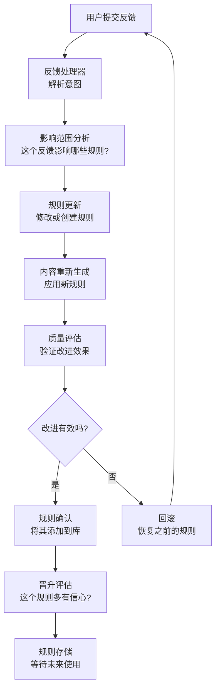
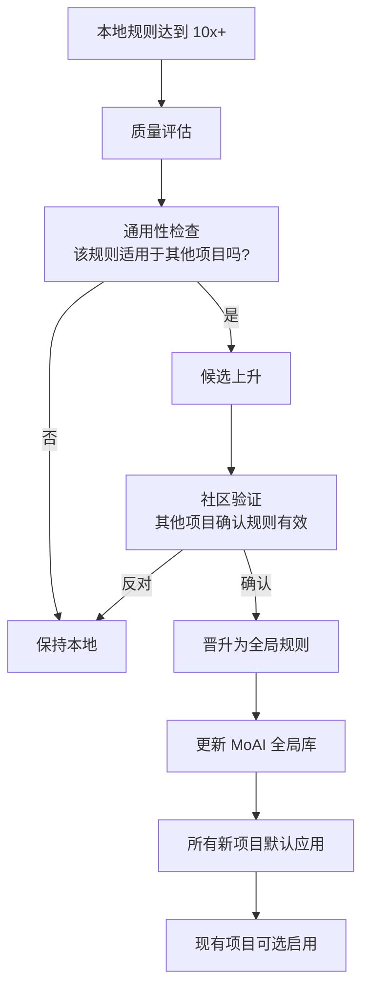

AI Agency 的核心竞争力是其自我进化能力。系统通过用户反馈不断学习，将成功的模式转变为规则，逐步提高生成内容的质量。

## 学习管道流程



## 晋升阈值与规则强度

系统根据反馈频率自动评估规则的信心度。随着反馈次数增加，规则从简单的记录逐步晋升为高置信度规则。

| 晋升级别 | 反馈次数 | 规则名称 | 应用方式 | 示例 |
|---------|--------|--------|--------|------|
| 1x | 1 次 | 记录 | 仅存储，权重 10% | "用户喜欢加粗的标题" |
| 3x | 3-4 次 | 启发式 | 建议应用，权重 50% | "对于 SaaS 落地页，调用行动效果最好" |
| 5x | 5-9 次 | 规则 | 自动应用，权重 70% | "主页 CTA 按钮应该是红色" |
| 10x+ | 10+ 次 | 高置信度规则 | 强制应用，权重 90% | "所有转化按钮应该有动画效果" |
| 100x+ | 100+ 次 | 不可变规则 | 锁定，权重 100% | "品牌色彩不变" |

## 规则示例：从反馈到规则

### 场景：按钮文本优化

#### 第一次反馈（1x）
```
用户: "这个 CTA 按钮文本太通用了，需要更具体"
系统: 
  - 记录反馈
  - 创建初始规则：button-text-specificity-01
  - 权重: 10%
```

#### 第三次反馈（3x）
```
用户: "是的，具体的行动语言确实转化更好"
系统:
  - 确认模式
  - 晋升为启发式
  - 权重: 50%
  - 可能的 CTA: "开始免费试用" 而不是 "注册"
```

#### 第五次反馈（5x）
```
用户: "这个模式对多个项目都有效"
系统:
  - 晋升为正式规则
  - 权重: 70%
  - 在所有 SaaS 项目中自动应用
  - 规则名: button-cta-action-words-strong
```

#### 第十次反馈（10x+）
```
用户: "这已经成为标准最佳实践"
系统:
  - 晋升为高置信度规则
  - 权重: 90%
  - 默认应用（除非显式覆盖）
  - 添加到全系统规则库
```

## 知识毕业协议

当规则达到 100x+ 反馈时，系统自动将其"毕业"为不可变知识。这个过程涉及：

### 毕业检查清单
- ✓ 规则在 10+ 个项目中验证有效
- ✓ 成功率超过 95%
- ✓ 没有有效的反例
- ✓ 符合品牌标准
- ✓ 无性能或可访问性问题

### 毕业后的规则
毕业的规则被锁定为不可变，成为 FROZEN 规则的一部分：

```yaml
.agency/rules/graduated-rules.md:
  [GRADUATED-001]
  Title: 具体行动词汇增加转化
  Confidence: 100x+
  Application: 强制 (权重 100%)
  Description: 所有 CTA 按钮应使用强动作词...
  Exceptions: 品牌指南明确要求时
```

## 安全 5 层架构

系统包含多层安全机制，防止不良规则对项目造成影响。

### 层 1：品牌一致性检查
每个新规则都针对 FROZEN 品牌定义进行验证。如果规则与品牌颜色、声调或价值观冲突，规则会被拒绝或修改。

### 层 2：用户验证
在应用任何权重超过 50% 的规则前，系统征求用户同意：
```
系统: "这个新规则会改变您的主页按钮样式。你同意吗?"
用户选择: 同意 / 预览 / 拒绝
```

### 层 3：反馈验证
系统检查反馈来自是否真实有效。明显的垃圾或矛盾反馈被忽略：
```
规则冲突检测:
  前: "按钮应该是红色" (权重 70%)
  后: "按钮应该是蓝色" (权重 50%)
  系统: 降低新规则的权重，要求用户明确选择
```

### 层 4：A/B 测试验证
对于高价值规则（涉及转化的规则），系统可以执行 A/B 测试验证其效果：
```
/moai agency ab-test button-style
  版本 A: 原始样式
  版本 B: 新规则应用
  结果: 版本 B 转化率 +12%
```

### 层 5：自动回滚
如果应用规则后内容质量评分下降超过 15%，系统自动回滚：
```
应用规则: layout-asymmetrical-01
质量评分: 82 → 65
系统: 回滚规则，恢复到之前版本
用户: 收到通知和原因解释
```

## 上游同步

当您的 Agency 项目创建的规则达到 10x+ 信心度时，系统可以将其同步到全局 MoAI 技能库，使所有 AI Agency 项目都受益。

### 同步流程



### 同步示例

如果您的文案规则在 5 个不同的 SaaS 项目中都表现良好，它可能被上升为全局规则，供整个 AI Agency 生态系统使用。

## 进化场景示例

### 场景 1：落地页项目

```
初始状态：
- 用户生成落地页
- 默认应用系统规则
- 质量评分: 72

反馈循环：
1. 用户: "标题应该更有吸引力"
   系统: 应用 headline-power-words 规则 (3x)
   结果: 质量评分 78

2. 用户: "CTA 按钮需要更强的紧迫性"
   系统: 学习并应用 cta-urgency-words 规则 (5x)
   结果: 质量评分 84

3. 用户: "这个配色方案太普通"
   系统: 提出大胆的配色提案 (新规则 1x)
   用户: "我喜欢！但需要调整一处"
   系统: 更新规则 (3x)
   结果: 质量评分 89

最终状态：
- 质量评分: 89 (+17 分)
- 创建 4 个新规则
- 应用了 10 个现有规则
- 总反馈: 12 次
```

### 场景 2：跨项目学习

```
项目 A (电商网站):
- 发现: 产品图片应该支持 3D 旋转
- 规则强度: 7x

项目 B (SaaS 落地页):
- 相同规则应用: 产品演示应该支持交互
- 规则强度: 5x

系统识别:
- 通用模式: "交互式产品展示提高参与度"
- 建议晋升: 从本地规则到全局规则
- 结果: 所有新项目默认应用该模式
```

## 监控进化进度

使用以下命令查看您项目的进化状态：

```bash
# 查看所有规则及其强度
moai agency rules list

# 查看特定规则的反馈历史
moai agency rules history copy-rules.md

# 查看今天学到的新规则
moai agency rules today

# 导出规则以供分析或审计
moai agency rules export
```

## 进化最佳实践


遵循这些最佳实践以最大化系统的学习效率：


1. **提供结构化反馈** - "改进 X"比"更好"提供更多信息
2. **一次关注一个维度** - 而不是同时改变多个内容
3. **确认改进** - 当系统做得对时让它知道
4. **允许实验** - 偶尔让系统尝试大胆的改变
5. **分享成功** - 分享有效的规则到全局库以帮助他人

## 下一步

- 查看[命令参考](./command-reference)了解与进化系统交互的命令
- 阅读[代理 & 技能](./agents-and-skills)了解哪些代理推动进化
- 探索[快速开始](./getting-started)开始您自己的进化之旅
