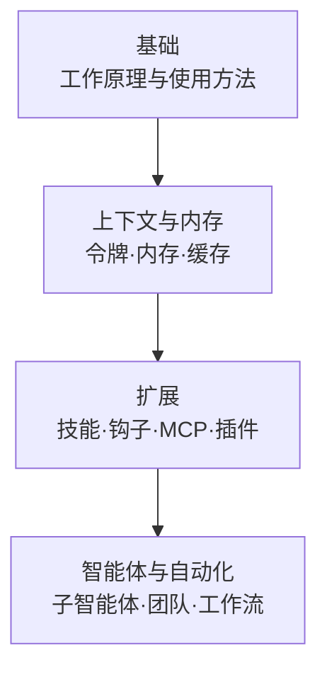

本节是从零开始理解 Anthropic 的终端 CLI Claude Code 的学习路径，面向刚接触 Claude Code 的开发者，以及希望准确把握 MoAI-ADK 运行基础的读者。

Claude Code 是一个在终端中运行的编码智能体，它读取并修改代码、执行命令，并通过与开发者的对话来完成工作。MoAI-ADK 是运行在 Claude Code 之上的编排层，在其基础上增加了基于 SPEC 的工作流和专业智能体委派。因此，要充分发挥 MoAI-ADK 的能力，首先理解作为其根基的平台 (Claude Code 本身) 至关重要。


**一句话总结**: 本节是学习作为工具 (平台) 的 Claude Code 本身的阶段。MoAI 特有的使用方法将在核心概念和进阶学习章节中继续介绍。


## 学习路径

首先在基础组中掌握 Claude Code 的工作原理，然后通过上下文与内存管理夯实长期会话的核心。之后通过扩展拓展功能，最后通过智能体与自动化迈向自主执行。

## 目录

| 文档 | 说明 |
|------|------|
| [基础](/claude-code/foundations) | Claude Code 的工作原理与基本使用方法 |
| [上下文与内存](/claude-code/context-memory) | 令牌·上下文·内存·缓存·检查点的管理 |
| [扩展](/claude-code/extensibility) | 通过技能·钩子·MCP·插件扩展功能 |
| [智能体与自动化](/claude-code/agentic) | 子智能体·团队·工作流·自主执行 |

依次完成这四个组后，你将全面理解 Claude Code 平台。在此之后，请转到 MoAI-ADK 的核心概念章节，了解如何在这一根基之上进行基于 SPEC 的开发。
