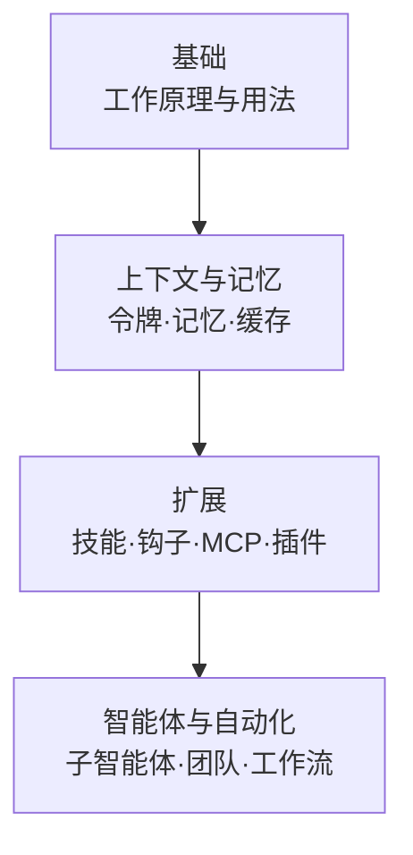

本节是从零开始理解 Anthropic 终端 CLI —— Claude Code 的学习路径。它面向刚接触 Claude Code 的开发者，以及希望准确掌握 MoAI-ADK 运行基础的读者。

Claude Code 是在终端中运行的编码智能体，它能读取和修改代码、执行命令，并通过与开发者对话完成工作。MoAI-ADK 是运行在 Claude Code 之上的编排层，其三大核心价值 —— **代币经济学** (Token Economics)、**智能体循环工程**（递归式自我学习）、**智能体挽具** (Agentic Harness) —— 全部建立在本节所讲的 Claude Code 基础机制之上。不了解上下文窗口和提示缓存就无法设计代币经济学，不了解子智能体和 `/goal` 就无法理解智能体循环，不了解技能、钩子和 MCP 就无法搭建挽具。




**一句话总结**：本节是掌握工具（平台）Claude Code 本身的阶段。MoAI-ADK 如何在这一基础上竖起三大支柱，将在核心概念与深入学习章节中继续展开。


## 学习流程

```mermaid
flowchart TD
    A[基础<br/>工作原理与用法] --> B[上下文与记忆<br/>令牌·记忆·缓存]
    B --> C[扩展<br/>技能·钩子·MCP·插件]
    C --> D[智能体与自动化<br/>子智能体·团队·工作流]
```

首先在基础组中掌握 Claude Code 的智能体循环如何运转，再通过上下文与记忆管理打好令牌经济的基本功。随后借助扩展备齐挽具的原材料，最后通过智能体与自动化迈向自主执行循环。

## 目录 —— 四组与三大支柱的对应

| 文档 | 说明 | 对应的 MoAI 支柱 |
|------|------|--------------------|
| [基础](/claude-code/foundations) | Claude Code 的工作原理与基本用法 | 三大支柱的共同基础 |
| [上下文与记忆](/claude-code/context-memory) | 令牌·上下文·记忆·缓存·检查点管理 | 代币经济学 |
| [扩展](/claude-code/extensibility) | 用技能·钩子·MCP·插件扩展功能 | 智能体挽具 |
| [智能体与自动化](/claude-code/agentic) | 子智能体·团队·工作流·自主执行 | 智能体循环工程 |

依次完成四组学习后，您将全面理解 Claude Code 平台。之后请移步 MoAI-ADK 的核心概念章节，了解 SPEC 驱动开发与令牌效率设计如何在这一基础上结合。
