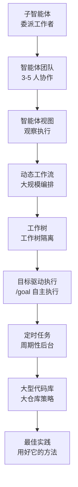

本组介绍 Claude Code 的智能体编排与自主执行。内容面向希望超越单次对话、将任务委派给多个工作者、以团队方式协作，并通过脚本展开大规模工作的开发者。

围绕子智能体、智能体团队、动态工作流这三种编排原语展开，随后依次讲解工作树隔离、目标驱动执行、定时任务、大型代码库探索，直至最佳实践。


**一句话总结**: 先选定由谁（子智能体、团队还是工作流）执行哪项任务，再借助工作树以及目标、定时、规模等策略，稳定地运营自主执行。


## 学习路径

建议先理解三种编排原语（子智能体 → 智能体团队 → 动态工作流），再借助工作树以及目标、定时、规模等策略加以扩展，最后以最佳实践收尾。

## 目录

| 文档 | 说明 |
|------|------|
| [子智能体](/claude-code/agentic/sub-agents) | 隔离上下文中的委派工作者 |
| [智能体团队](/claude-code/agentic/agent-teams) | 3-5 人团队协作 |
| [智能体视图](/claude-code/agentic/agent-view) | 执行观察界面 |
| [动态工作流](/claude-code/agentic/workflows) | 基于脚本的大规模编排 |
| [工作树](/claude-code/agentic/worktrees) | 工作树隔离 |
| [目标驱动执行 (/goal)](/claude-code/agentic/goal) | 自主执行直至满足条件 |
| [定时任务](/claude-code/agentic/scheduled-tasks) | 周期性后台执行 |
| [大型代码库](/claude-code/agentic/large-codebases) | 大仓库探索策略 |
| [最佳实践](/claude-code/agentic/best-practices) | 用好 Claude Code 的方法 |

建议先阅读 [子智能体](/claude-code/agentic/sub-agents)，掌握委派的基本单位，然后再进入下一篇文档。
