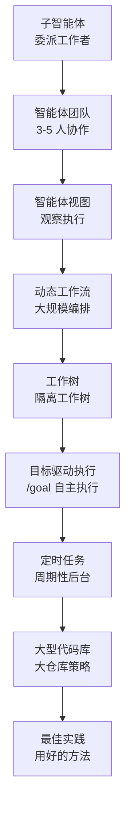

本组讲解 Claude Code 的智能体编排与自主执行。内容面向希望超越单一对话、学习委派多个工作者、以团队协作、用脚本铺开大规模工作的开发者。

围绕子智能体·智能体团队·动态工作流这三种编排原语，依次延伸到工作树隔离、目标驱动执行、定时任务、大型代码库探索与最佳实践。MoAI-ADK 所说的**智能体循环工程** —— 不让人每回合介入，而是设计循环本身，并用循环留下的观察让挽具学习 —— 正是建立在本组的这些机制（`/goal` 的条件评估循环、子智能体委派、工作流扇出）之上。


**一句话总结**：先选定某项工作由谁（子智能体·团队·工作流）执行，再用工作树与目标·定时·规模策略稳定运营自主执行循环。


## 学习流程

```mermaid
flowchart TD
    A[子智能体<br>委派工作者] --> B[智能体团队<br>3-5 人协作]
    B --> C[智能体视图<br>观察执行]
    C --> D[动态工作流<br>大规模编排]
    D --> E[工作树<br>隔离工作树]
    E --> F[目标驱动执行<br>/goal 自主执行]
    F --> G[定时任务<br>周期性后台]
    G --> H[大型代码库<br>大仓库策略]
    H --> I[最佳实践<br>用好的方法]
```

建议先理解三种编排原语（子智能体 → 智能体团队 → 动态工作流），再以工作树与目标·定时·规模策略扩展，最后以最佳实践收尾。

## 目录

| 文档 | 说明 |
|------|------|
| [子智能体](/claude-code/agentic/sub-agents) | 隔离上下文的委派工作者 |
| [智能体团队](/claude-code/agentic/agent-teams) | 3-5 人团队协作 |
| [智能体视图](/claude-code/agentic/agent-view) | 执行观察界面 |
| [动态工作流](/claude-code/agentic/workflows) | 基于脚本的大规模编排 |
| [工作树](/claude-code/agentic/worktrees) | 工作树隔离 |
| [目标驱动执行 (/goal)](/claude-code/agentic/goal) | 自主执行直至条件满足 |
| [定时任务](/claude-code/agentic/scheduled-tasks) | 周期性后台执行 |
| [大型代码库](/claude-code/agentic/large-codebases) | 大仓库探索策略 |
| [最佳实践](/claude-code/agentic/best-practices) | 用好 Claude Code 的方法 |

请先从[子智能体](/claude-code/agentic/sub-agents)读起，掌握委派的基本单元后再移步下一篇文档。
