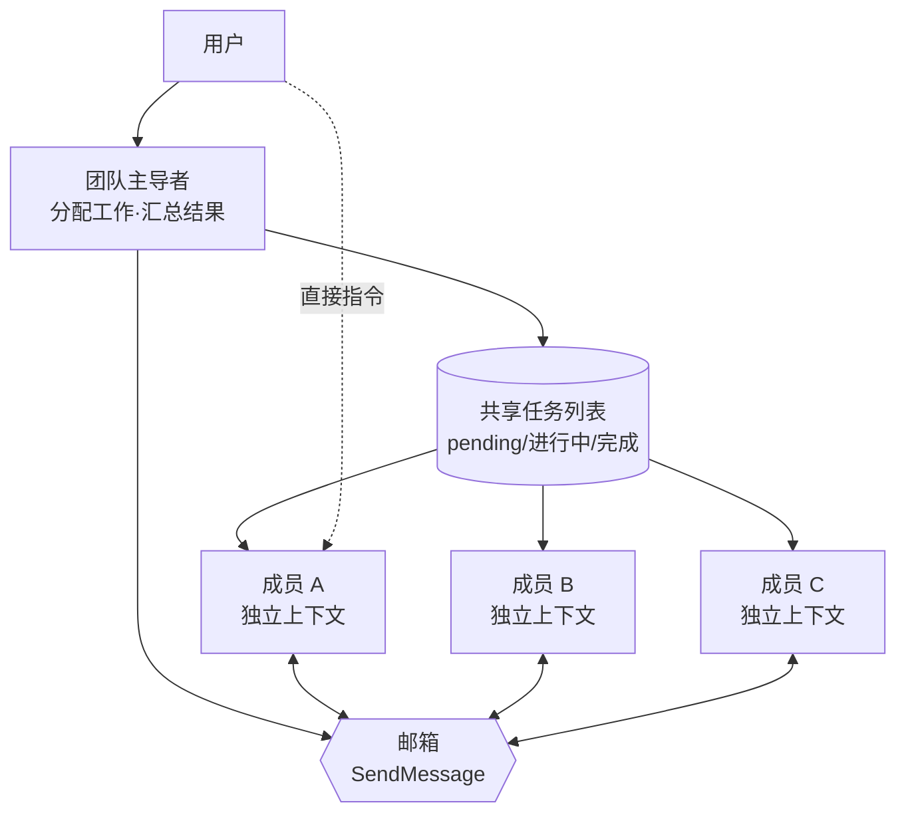

# 智能体团队

智能体团队 (Agent Teams) 是一项实验性功能，它将多个 Claude Code 会话组成一个团队，通过共享任务列表与相互消息进行协作。


**一句话总结**: 如果说子智能体是只向主导者汇报的单向工人，那么智能体团队就是彼此对话、直接领取工作、还会相互交换验证的同伴集体。


## 什么是智能体团队

智能体团队是一种协调多个 Claude Code 实例共同工作的结构。一个会话成为 **团队主导者 (team lead)**，负责分配工作并汇总结果，其余 **团队成员 (teammate)** 各自在独立的上下文窗口中工作，并彼此直接通信。

与子智能体的决定性差异在于通信方向。子智能体只向主智能体汇报结果，彼此之间无法对话；而智能体团队的成员会查看共享任务列表、自行领取工作，并在成员之间直接收发消息。用户也可以不经主导者，直接向特定成员下达指令。

智能体团队在 **并行探索** 能带来实际价值的工作中最为强大。

| 适合的工作 | 原因 |
| --- | --- |
| 调研 / 评审 | 多名成员同时调查不同侧面，并交叉验证发现 |
| 新模块 / 功能 | 每名成员拥有各自领域，无冲突地并行工作 |
| 调试竞争性假设 | 并行验证不同理论，更快收敛 |
| 跨层工作 | 将前端 / 后端 / 测试按成员分担 |

反之，顺序性工作、共同修改同一文件的工作、依赖较多的工作，由单个会话或子智能体处理更高效。智能体团队的协调成本与令牌用量都比单个会话大幅增加。

## 子智能体 vs 智能体团队

|  | 子智能体 | 智能体团队 |
| --- | --- | --- |
| **上下文** | 自身的上下文窗口，结果返回给调用方 | 自身的上下文窗口，完全独立 |
| **通信** | 仅向主智能体汇报结果 | 成员之间直接交换消息 |
| **协调** | 主智能体管理全部工作 | 基于共享任务列表的自主协调 |
| **适用场景** | 只需要结果的聚焦工作 | 需要讨论与协作的复合工作 |
| **令牌成本** | 低 (将结果摘要到主上下文) | 高 (每名成员各有独立 Claude 实例) |

当一个快速且聚焦的工人只需汇报时，选择子智能体；当成员需要共享发现、相互验证并自主协调时，选择智能体团队。

## 推荐规模：3-5 名

成员数量没有强制上限，但存在现实约束。

- **令牌成本呈线性增长**。每名成员拥有独立的上下文窗口，分别消耗令牌。
- 成员越多，**通信与协调负担** 越大，冲突的可能性也越高。
- 超过一定数量后会出现 **边际效益递减**。额外的成员并不会按比例提升工作速度。

官方指南建议在大多数工作流中从 **3-5 名** 起步。为每名成员分配 5-6 个任务 (task)，就能在不过度切换上下文的情况下让所有人保持忙碌。例如，如果有 15 个独立任务，3 名成员是不错的起点。聚焦的 3 名常常比分散的 5 名得出更好的结果。

## 协作机制

智能体团队由四个构成要素运作。

| 构成要素 | 职责 |
| --- | --- |
| **团队主导者 (team lead)** | 创建团队、生成成员并协调工作的主会话 |
| **团队成员 (teammate)** | 执行所分配任务的独立 Claude Code 实例 |
| **任务列表 (Task list)** | 成员从中领取并完成的共享任务列表 |
| **邮箱 (Mailbox)** | 负责智能体间通信的消息系统 |

### 共享任务列表与 SendMessage

任务有 `pending`、`in progress`、`completed` 三种状态，任务之间还可设置依赖关系。依赖未解除的 `pending` 任务在其前置任务完成前无法领取。当某名成员完成前置任务后，依赖它的任务会自动解锁。

工作分配以两种方式进行。

- **主导者分配**: 主导者将特定任务明确分配给特定成员。
- **自主领取 (self-claim)**: 成员完成任务后，自行领取下一个未分配且未被阻塞的任务。

任务领取使用 **文件锁 (file locking)**，以防止多名成员同时领取同一任务时产生的竞争条件。成员之间的通信通过 `SendMessage` 进行，所发消息会自动送达接收者。消息无需主导者轮询即可到达，成员完成任务并停止时也会自动通知主导者。

### 文件所有权

如果两名成员编辑同一文件就会发生覆盖。因此让每名成员 **拥有不同的文件集合** 来分割工作，是关键的最佳实践。这也是智能体团队在新模块或跨层工作等领域天然可划分的场景下表现尤其出色的原因。

### 协作结构



主导者通过任务列表分配工作，成员通过邮箱彼此直接对话，用户也可以不经主导者向单个成员下达指令。

## 启用要求 (v2.1.178+)

智能体团队是 **实验性功能，默认处于禁用状态**。它需要 Claude Code v2.1.178 或更高版本，通过将环境变量 `CLAUDE_CODE_EXPERIMENTAL_AGENT_TEAMS` 设为 `1` 来启用。可以直接在 shell 环境中指定，或在 `settings.json` 中注册。

```json
{
  "env": {
    "CLAUDE_CODE_EXPERIMENTAL_AGENT_TEAMS": "1"
  }
}
```

### v2.1.178 的变化

- **隐含团队 (Implicit Teams)**：团队创建变得更简单。主导者生成第一个成员时会自动形成团队，会话结束时自动清理。
- **TeamCreate/TeamDelete 移除**：v2.1.178 之后这两个命令已消失（不再需要手动创建或删除团队）。
- **`team_name` 接受但忽略**：Hook 载荷中仍包含 `team_name` 字段，但实际被忽略（遗留兼容性）。

启用后，只需用自然语言请求创建团队即可。Claude 会创建团队、生成成员，然后协调工作。

```text
我正在设计一个在整个代码库中追踪 TODO 注释的 CLI 工具。
请创建一个从不同视角进行探索的智能体团队。
一名负责 UX，一名负责技术架构，一名担任批评者角色。
```

## 显示模式与成员模型

智能体团队支持两种显示模式。

| 模式 | 特征 | 需求 |
|------|------|------|
| **进程内 (in-process)** | 所有成员在主终端内运行 | 无需额外配置（默认值） |
| **分屏 (split panes)** | 每名成员开启单独窗口 | tmux 或 iTerm2 需要 (v2.1.186+) |

默认值为 **in-process** (v2.1.179 起；之前是 `"auto"`)，因此任何地方都可用且无需设置。若要强制使用分屏模式：

```json
{
  "teammateMode": "in-process"
}
```

或在单个会话中用 `--teammate-mode in-process` 标志强制指定。

成员默认不继承主导者的 `/model` 选择。在提示中未指定模型时所使用的模型，在 `/config` 的 **Default teammate model** 中设置。

## 质量门 hook

使用 [hook](/claude-code/extensibility/hooks)，可以在成员完成工作，或任务被创建、完成时强制执行规则。

| hook 事件 | 触发时机 | 退出码 2 的含义 |
| --- | --- | --- |
| `TeammateIdle` | 成员即将转入空闲状态之前 | 发送反馈并保持其继续工作 |
| `TaskCreated` | 任务即将被创建时 | 阻止创建并发送反馈 |
| `TaskCompleted` | 任务即将被标记为完成时 | 阻止完成并发送反馈 |

## 需要了解的限制

由于智能体团队是实验性功能，请在了解以下限制的前提下使用。

- **不支持会话恢复**: `/resume` 与 `/rewind` 无法恢复进程内成员。恢复后请指示主导者生成新成员。
- **任务状态延迟**: 成员可能遗漏标记任务完成，导致依赖任务被阻塞。
- **一次一个团队**: 主导者只管理一个团队。创建新团队前必须先清理当前团队。
- **不可嵌套团队**: 成员无法生成自己的团队或成员。团队管理仅由主导者完成。
- **主导者固定**: 创建团队的会话在其生命周期内是主导者，且无法转移主导权。

团队清理始终通过主导者执行。工作结束后请求主导者清理，但若仍有正在运行的成员，清理会失败，因此必须先将其关闭。

## 与 MoAI CG 模式的联动

MoAI-ADK 在智能体团队之上叠加 **CG 模式 (Claude + GLM)** 来优化成本。主导者用 Claude 协调工作流，成员则通过 tmux 会话级别的环境隔离继承 GLM 环境来执行实现工作。在实现为主的 SPEC、代码生成、测试编写等令牌消耗较大的工作中，可大幅降低成本。

CG 模式的配置与运营方法在单独的文档中详述，请参考下方链接。

## 相关文档

- [动态工作流](/claude-code/agentic/workflows)
- [CG 模式 (Claude + GLM)](/multi-llm/cg-mode)

## 参考资料

- [Claude Code Docs — Orchestrate teams of Claude Code sessions](https://code.claude.com/docs/en/agent-teams)


如果你是初次使用智能体团队，请从不写代码的工作开始。PR 评审、库调研、缺陷排查这类边界清晰的工作，能让你在没有并行实现协调负担的情况下立即体会到并行探索的价值。

