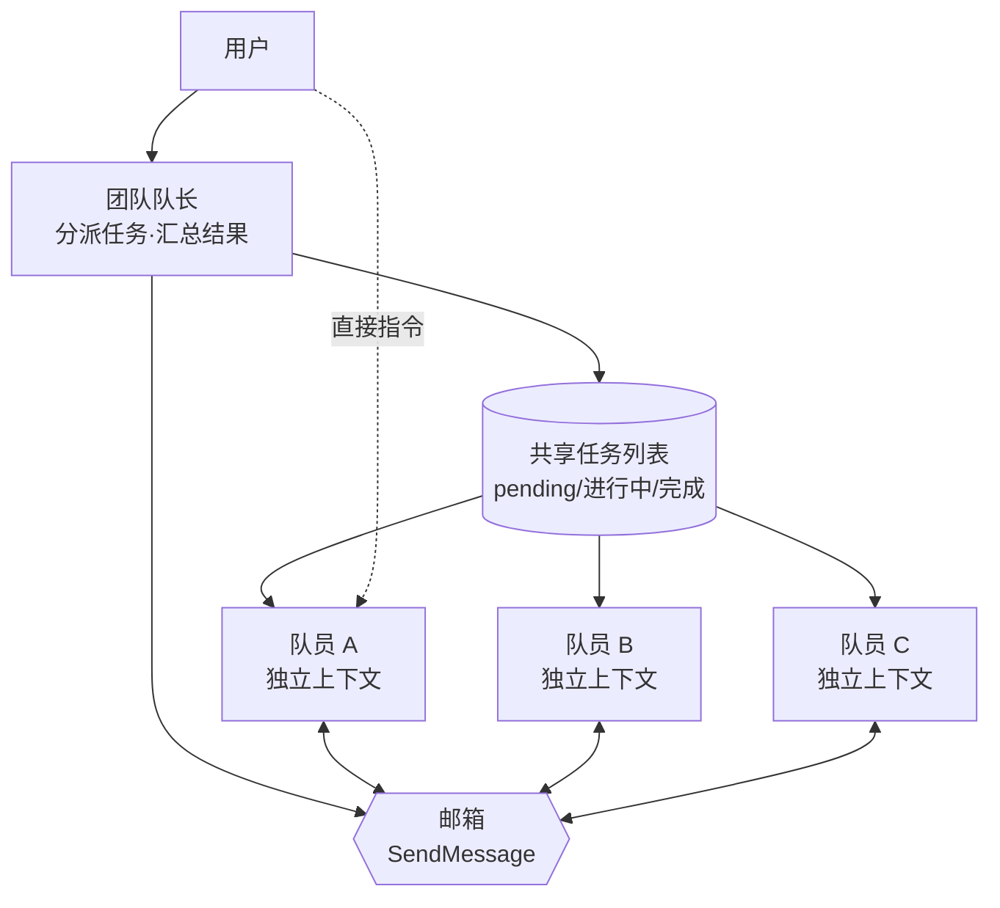

# 智能体团队

智能体团队 (Agent Teams) 是把多个 Claude Code 会话组成一个团队、通过共享任务列表与相互消息协作的实验性功能。



**一句话总结**：如果说子智能体是只向队长汇报的单向帮手，那么智能体团队就是互相对话、主动认领任务、彼此交叉验证的同事群体。


## 什么是智能体团队

智能体团队是协调多个 Claude Code 实例共同工作的结构。一个会话担任**团队队长** (team lead)，负责分派任务并汇总结果，其余**队员** (teammate) 各自在独立的上下文窗口中工作并可直接相互通信。

与子智能体的决定性差别在于通信方向。子智能体只能向主智能体汇报结果、彼此不能对话；而智能体团队的队员可以查看共享任务列表、自行认领任务，队员之间还能直接互发消息。用户也可以不经队长直接向特定队员下达指令。

智能体团队在**并行探索**能带来实质价值的工作中最为强大。

| 适合的工作 | 原因 |
| --- | --- |
| 调研 / 评审 | 多名队员同时调查不同侧面并交叉验证发现 |
| 新模块 / 新功能 | 每名队员拥有独立领域，无冲突地并行工作 |
| 竞争假设调试 | 并行验证不同理论，更快收敛 |
| 跨层工作 | 前端 / 后端 / 测试按队员分工 |

反之，顺序性工作、需要共同修改同一文件的工作、依赖繁多的工作，用单一会话或子智能体更高效。智能体团队的协调成本与令牌用量都比单一会话大幅增加。

## 子智能体 vs 智能体团队

|  | 子智能体 | 智能体团队 |
| --- | --- | --- |
| **上下文** | 自有上下文窗口，结果返回给调用者 | 自有上下文窗口，完全独立 |
| **通信** | 只向主智能体汇报结果 | 队员之间直接互发消息 |
| **协调** | 主智能体管理全部工作 | 基于共享任务列表的自主协调 |
| **适合的用途** | 只需要结果的聚焦工作 | 需要讨论与协作的复合工作 |
| **令牌成本** | 低（结果摘要进主上下文） | 高（每名队员是独立的 Claude 实例） |

若快速聚焦的帮手只需汇报，选子智能体；若队员需要共享发现、互相验证、自主协调，选智能体团队。

## 推荐规模：3-5 人

队员数量没有强制上限，但存在现实约束。

- **令牌成本线性增长**。每名队员拥有独立上下文窗口，各自消耗令牌。
- 队员越多，**通信与协调负担**越重，冲突可能性也越大。
- 超过一定人数会出现**收益递减**，新增队员并不能按比例提高工作速度。

官方指南建议大多数工作流从 **3-5 人**起步。为每名队员分配 5-6 个任务 (task)，就能在没有过度上下文切换的情况下让所有人保持忙碌。例如有 15 个相互独立的任务，3 人是不错的起点。聚焦的 3 人往往比分散的 5 人做出更好的结果。

## 协作机制

智能体团队靠四个组成部分运转。

| 组成部分 | 角色 |
| --- | --- |
| **团队队长** (team lead) | 创建团队、孵化队员、协调工作的主会话 |
| **队员** (teammate) | 执行被分配任务的独立 Claude Code 实例 |
| **任务列表** (Task list) | 队员认领与完成的共享任务列表 |
| **邮箱** (Mailbox) | 负责智能体间通信的消息系统 |

### 共享任务列表与 SendMessage

任务有 `pending`、`in progress`、`completed` 三种状态，还可设置任务间依赖。依赖未解除的 `pending` 任务在前置任务完成之前不能被认领。当某名队员完成前置任务后，依赖它的任务会自动解锁。

任务分配以两种方式进行。

- **队长指派**：队长把特定任务显式分配给特定队员。
- **自主认领** (self-claim)：队员完成一项任务后，自行认领下一个未被分配且未被阻塞的任务。

任务认领使用**文件锁** (file locking)，防止多名队员同时抢占同一任务时的竞态条件。队员间通信通过 `SendMessage` 完成，发送的消息自动送达接收者。消息到达无需队长轮询，队员完成工作停下时也会自动通知队长。

### 文件所有权

两名队员编辑同一个文件会发生覆盖。因此把工作拆分成让每名队员**拥有互不相同的文件集合**，是核心的最佳实践。这也是新模块或跨层工作这类领域自然可分的场景下智能体团队表现特别好的原因。

### 协作结构


```mermaid
flowchart TD
    User[用户] --> Lead[团队队长<br/>分派任务·汇总结果]
    Lead --> TaskList[(共享任务列表<br/>pending/进行中/完成)]
    Lead --> Mailbox{{邮箱<br/>SendMessage}}
    TaskList --> T1[队员 A<br/>独立上下文]
    TaskList --> T2[队员 B<br/>独立上下文]
    TaskList --> T3[队员 C<br/>独立上下文]
    T1 <--> Mailbox
    T2 <--> Mailbox
    T3 <--> Mailbox
    User -.直接指令.-> T1
```

队长通过任务列表分派工作，队员通过邮箱直接对话，用户也可以不经队长向个别队员下指令。

## 启用要求 (v2.1.178+)

智能体团队是**实验性功能，默认关闭**。需要 Claude Code v2.1.178 以上，并把环境变量 `CLAUDE_CODE_EXPERIMENTAL_AGENT_TEAMS` 设为 `1` 启用。

### v2.1.178 的变化

- **Implicit Teams**：团队创建更简单了。队长孵化第一名队员时自动组成团队，会话结束时自动清理。
- **移除 TeamCreate/TeamDelete**：从 v2.1.178 起这些命令已消失（不再需要手动创建或删除团队）。
- **`team_name` accepted-but-ignored**：Hook payload 中仍包含 `team_name` 字段，但实际被忽略（用于遗留兼容）。

可直接在 shell 环境指定，或登记到 `settings.json`。

```json
{
  "env": {
    "CLAUDE_CODE_EXPERIMENTAL_AGENT_TEAMS": "1"
  }
}
```

启用后用自然语言请求创建团队即可。Claude 会组建团队、孵化队员并协调工作。

```text
我正在设计一个在代码库中追踪 TODO 注释的 CLI 工具。
请创建一个从不同视角探索的智能体团队：
一人负责 UX，一人负责技术架构，一人担任批评者角色。
```

## 显示模式与队员模型

智能体团队支持两种显示模式。

| 模式 | 特点 | 前提条件 |
|------|------|---------|
| **进程内 (in-process)** | 所有队员在主终端内运行 | 无需额外配置（默认值） |
| **分屏 (split panes)** | 每名队员单独开窗 | 需要 tmux 或 iTerm2 (v2.1.186+) |

默认值是 **in-process**（自 v2.1.179 起，此前为 `"auto"`），因此在任何环境都可零配置使用。若想强制某种模式：

```json
{
  "teammateMode": "in-process"
}
```

把上面的值改成想要的模式，或用 `--teammate-mode in-process` 标志仅对单个会话强制。

队员默认不继承队长的 `/model` 选择。提示词未指定模型时使用的模型在 `/config` 的 **Default teammate model** 中设置。

## 质量门禁 hook

使用 [hook](/claude-code/extensibility/hooks) 可以在队员完成工作、任务被创建·完成时强制执行规则。

| hook 事件 | 触发时机 | 退出码 2 的含义 |
| --- | --- | --- |
| `TeammateIdle` | 队员即将转入空闲之前 | 发送反馈并让其继续工作 |
| `TaskCreated` | 任务即将被创建时 | 阻止创建并发送反馈 |
| `TaskCompleted` | 任务即将被标记完成时 | 阻止完成并发送反馈 |

## 需知的局限

智能体团队是实验性功能，使用时须认知以下局限。

- **不支持会话恢复**：`/resume` 与 `/rewind` 无法恢复进程内队员。恢复后请指示队长孵化新队员。
- **任务状态延迟**：队员可能漏标任务完成，导致依赖任务被卡住。
- **一次一个团队**：队长只管理一个团队。创建新团队前必须先清理当前团队。
- **不可嵌套团队**：队员不能孵化自己的团队或队员。团队管理只有队长能做。
- **队长固定**：创建团队的会话在整个生命周期中都是队长，领导权不可转移。

团队清理始终通过队长执行。工作结束后请队长清理，但若仍有运行中的队员，清理会失败，需先让其退出。

## 与 MoAI CG 模式的衔接 —— 把团队结构变成代币经济学

MoAI-ADK 在这套原生团队运行时之上叠加 **CG 模式**（`moai cg`，Claude + GLM 混合）以优化成本。队长用 Claude 协调战略·计划·审计，队员通过 tmux 会话级环境隔离继承 GLM 环境执行大批量实现工作。这是把"谁做什么"的团队结构问题与"哪种模型做多少钱的活"的代币经济学答案结合起来 —— 在实现密集的 SPEC、代码生成、测试编写这类令牌消耗大的工作中获得 **60-70% 的成本削减**。

有一点需要区分。MoAI-ADK 在自身的工作流编排中已让静态智能体团队层退役，默认使用顺序子智能体与动态工作流；但本页所讲的 Claude Code 原生团队运行时（tmux 窗格、共享任务列表）被 CG 模式原样利用。也就是说"团队"这一执行形态仍然存续，只是用途从协作协调转向了成本路由。

CG 模式的配置与运营方法在单独文档中详述，请参考下方链接。

## 相关文档

- [动态工作流](/claude-code/agentic/workflows)
- [CG 模式 (Claude + GLM)](/multi-llm/cg-mode)

## 参考资料

- [Claude Code Docs — Orchestrate teams of Claude Code sessions](https://code.claude.com/docs/en/agent-teams)


初次接触智能体团队时，请从不写代码的工作开始。PR 评审、库调研、Bug 排查这类边界清晰的工作，可以让您在没有并行实现协调负担的情况下立即体会并行探索的价值。

