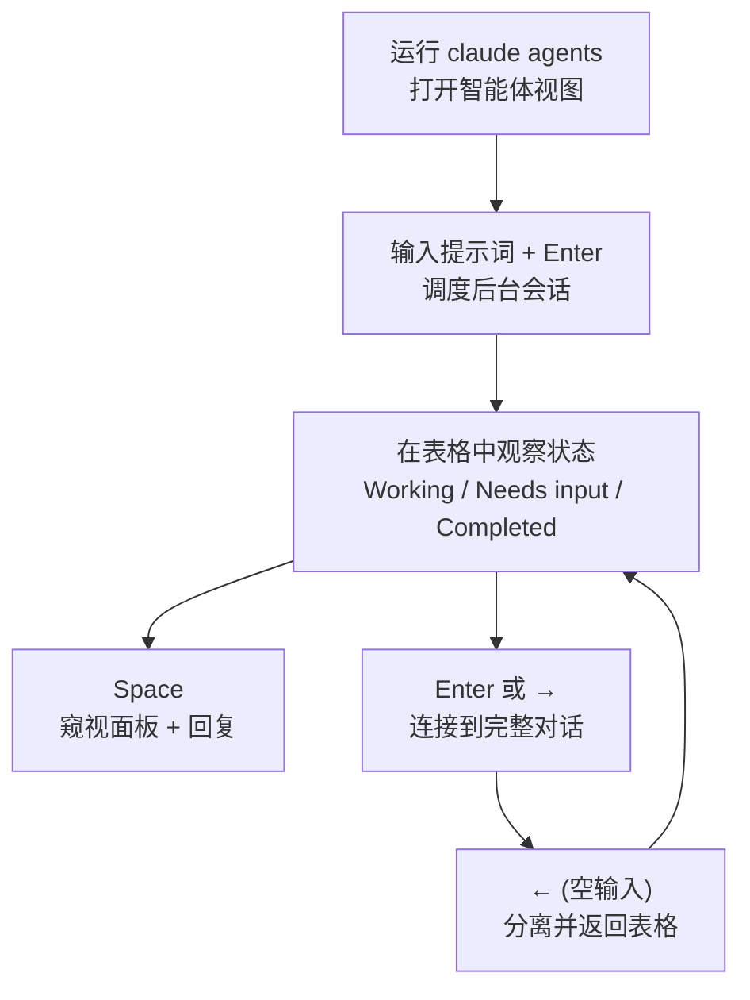

通过 `claude agents` 命令打开的智能体视图 (agent view) 是一个统一的管控界面，让你在同一屏幕上调度、观察多个 Claude Code 会话，并仅介入那些需要你动手的会话。


**一句话总结**: 不必逐一滚动查看转录内容，而是在一张表格中看到所有运行中、等待中和已完成的后台会话，并仅在需要的那一刻介入。


## 什么是智能体视图

智能体视图是一个用于管理 **后台会话 (background session)** 的界面，这些会话不受终端束缚而持续运行。每个后台会话本身就是一个完整的 Claude Code 对话，即使你关闭终端，也会有单独的监督进程继续运行它。因此，你可以把修复 Bug、审查 PR、排查不稳定测试分别作为一行 (row) 抛出去，自己去做别的工作，等某一行在等待输入或产出结果时再回来。

> 智能体视图处于研究预览 (research preview) 阶段，需在 Claude Code v2.1.139 或更高版本上运行。请用 `claude --version` 确认版本。界面和快捷键可能随功能演进而变化。

它与各种并行执行手段的定位整理如下。

| 手段 | 特点 | 适用场景 |
| :--- | :--- | :--- |
| 智能体视图 | 在一张表格中调度并观察多个独立的完整会话 | 并行运行多个互不相关的任务，只回收结果 |
| 子智能体 | 在单个会话内被调用的辅助工作者 | 将单个任务分解为子步骤 |
| 智能体团队 | 互相收发消息的多会话协作 | 需要协调的协作任务 |
| 工作树 | 隔离文件编辑的 git 工作空间 | 在同一检出上无冲突地并行编辑 |

## 它展示什么

打开智能体视图后，它会占据整个终端，并将所有会话按状态分组列出。等待输入的会话和已固定 (pin) 的会话会浮到最上方，每一行显示会话名称、当前活动以及距上次变更的经过时间。

```text
Needs input
  ✻ power-up design     needs input: double jump or wall climb?     1m

Working
  ✽ collision detection Edit src/physics/CollisionSystem.ts          2m
  ✢ playtest level 3    run 12 · all checkpoints cleared          in 4m

Completed
  ✻ title screen        result: menu, options, and credits done      9m
  ∙ sound effects       result: 14 SFX exported to assets/audio       4h
```

### 进展与会话状态

每行最前面的图标通过颜色和动画来表示会话状态。

| 状态 | 图标显示 | 含义 |
| :--- | :--- | :--- |
| Working | 动画 | Claude 正在执行工具或生成响应 |
| Needs input | 黄色 | 正在等待用户对某个具体问题或权限决策作出回应 |
| Idle | 暗淡 | 无事可做，正在等待下一个提示词 |
| Completed | 绿色 | 任务成功结束 |
| Failed | 红色 | 任务因出错而结束 |
| Stopped | 灰色 | 通过 `Ctrl+X` 或 `claude stop` 停止 |

此外，图标的 **形状** 表示底层进程是否存活。`✻`（或动画的 `✽`）表示进程存活并能立即响应；`∙` 表示进程已退出（仍可窥视、回复或连接，Claude 会从中断处恢复）；`✢` 表示某个 `/loop` 会话正在两次迭代之间等待。

每行的一行摘要由 Haiku 系列模型生成，因此你无需打开转录内容就能知道会话在做什么、想要什么、产出了什么。运行中的会话最多每 15 秒刷新一次摘要，并在每个回合结束时再刷新一次。

### 后台任务与 PR 状态

当会话打开一个 PR 时，行的右端会附上类似 `PR #1234` 的标签，在支持超链接的终端中会成为链接。PR 编号会根据其状态显示不同的颜色。

| 颜色 | PR 状态 |
| :--- | :--- |
| 黄色 | 等待检查/审查中，或检查失败 |
| 绿色 | 检查通过 + 无阻塞性审查 |
| 紫色 | 已合并 |
| 灰色 | 草稿或已关闭 |

对大多数任务而言，这一列就是你回收结果的地方。一旦 PR 编号变为绿色，你就可以审查后合并。你还可以像 `! pytest -x` 那样在输入前加上 `!`，将一条 shell 命令作为后台任务调度；此时不会调用模型，仅执行该命令一行，并将最近的输出行显示为状态。

### 子智能体输出

会话所启动的 **子智能体** 或 **智能体团队** 成员不会单独列为一行。它们的产物和进展会合并到父会话那一行的摘要和输出中显示。要查看详情，请窥视该会话或连接进去查看完整对话。

## 使用场景

当你有多个互相独立、Claude 无需你盯着每一步即可推进的任务时，智能体视图就很有用。

- **监控长时间运行的工作**: 把排查不稳定测试这类耗时较长的工作抛出去，在另一个窗口工作，等该行变为需要输入或结果状态时再回来。后台会话即使你关闭终端或 shell，也会因监督进程而继续运行。
- **追踪并行工作**: 同时用三行调度修复 Bug、审查 PR 和排查测试，并一眼比较它们的状态。文件编辑会按会话隔离到 `.claude/worktrees/` 下的 **工作树** 中，各自读取同一个检出，但分别写入。
- **在一个屏幕上管理多个项目**: 默认情况下，所有项目的后台会话都会出现在一张表格中。要缩小到某一个项目，可像 `claude agents --cwd ~/projects/my-app` 那样指定目录。

每个会话会独立消耗你的订阅用量。也就是说，并行运行 10 个智能体会让你的配额消耗速度大约快 10 倍，因此在一次性调度大量会话之前，请留意你的用量上限。

## 访问与操作方式

基本流程是调度 → 观察 → 窥视并回复 → 连接的循环。



### 如何调度

新的后台会话可通过三种途径启动。

```bash
# 1) 打开智能体视图，在底部输入框输入提示词后按 Enter
claude agents

# 2) 从 shell 直接以后台方式启动
claude --bg "investigate the flaky SettingsChangeDetector test"

# 3) 将某个特定子智能体指定为主智能体
claude --agent code-reviewer --bg "address review comments on PR 1234"
```

在智能体视图输入框中输入的提示词每次都会启动一个新会话（不会接续到现有会话）。要将进行中的对话发送到后台，请在会话内执行 `/background` 或别名 `/bg`，或在空输入下按 `←`。

### 窥视与连接

| 操作 | 按键 | 效果 |
| :--- | :--- | :--- |
| 窥视 | `Space` | 在面板中显示所选行的最近输出或待回应的问题。在面板中输入回复后用 `Enter` 发送 |
| 连接 | `Enter` 或 `→` | 进入完整对话。其行为与直接运行 `claude` 完全相同 |
| 分离 | `←` (空输入) | 在保留会话运行的同时返回表格。若有对话框阻挡，使用 `Ctrl+Z` |

连接绝不会停止会话。要从会话内部彻底结束它，请执行 `/stop`。

### 主要快捷键

按 `?` 可在屏幕上查看全部快捷键。仅整理常用项如下。

| 快捷键 | 操作 |
| :--- | :--- |
| `↑` / `↓` | 行间移动 |
| `Enter` | 连接到所选会话（若输入框中有文本则调度） |
| `Space` | 打开/关闭窥视面板 |
| `Shift+Enter` | 调度并立即连接 |
| `Ctrl+S` | 在状态/目录之间切换分组依据 |
| `Ctrl+T` | 固定/取消固定所选会话（空闲时也保持进程存活） |
| `Ctrl+R` | 重命名会话 |
| `Ctrl+X` | 停止会话。2 秒内再次按下则删除 |
| `Esc` | 关闭面板、清空输入或退出 |

> Claude 为会话创建的工作树，在你用 `Ctrl+X` 按两次删除会话时会一并被移除，未提交的变更也会随之丢失。要保留它们，请先推送或提交。

### 从 shell 管理

你也可以不打开智能体视图，直接通过短 ID 进行操作。

```bash
claude agents --json        # 将实时会话以 JSON 数组形式输出
claude attach <id>          # 在此终端连接到会话
claude logs <id>            # 显示会话的最近输出
claude stop <id>            # 停止会话
claude respawn <id>         # 在保留对话的同时重启会话
```

### 如何关闭

要彻底禁用智能体视图和后台智能体，请将 `disableAgentView` 设置为 `true`，或设置 `CLAUDE_CODE_DISABLE_AGENT_VIEW` 环境变量。该设置可放入 `settings.json`。

```json
{
  "worktree": {
    "bgIsolation": "none"
  }
}
```

将上面的 `worktree.bgIsolation` 设为 `"none"` 后，后台会话就不会移动到工作树，而是直接编辑你的工作副本（v2.1.143 或更高版本）。

## 相关文档

- [子智能体](/claude-code/agentic/sub-agents)
- [智能体团队](/claude-code/agentic/agent-teams)

## 参考资料

- [Manage multiple agents with agent view (Claude Code Docs)](https://code.claude.com/docs/en/agent-view)


要让长时间运行的会话保持响应性，请用 `Ctrl+T` 固定它。未固定的会话在结束后约 1 小时内若无人触碰，监督进程会为回收资源而停止其进程，重新连接时会慢半拍才被唤醒。

