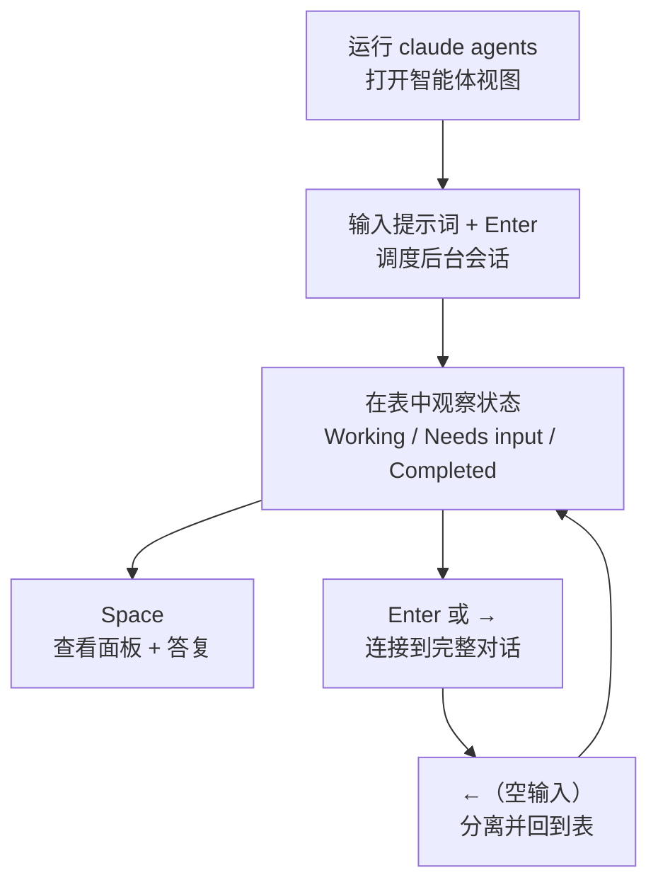

由 `claude agents` 命令打开的智能体视图 (agent view)，是在一个屏幕上调度并观察多个 Claude Code 会话、只对需要人手的会话介入的单一管控界面。


**一句话总结**：不必逐个滚动转录，而是把运行中·等待中·已完成的所有后台会话看成一张表，只在必要的时刻插手。


## 什么是智能体视图

智能体视图是在一个屏幕上管理不受终端束缚、持续运转的**后台会话** (background session) 的界面。每个后台会话本身就是一段完整的 Claude Code 对话，即使关闭终端，独立的监督进程也会继续运行它。因此可以把 Bug 修复、PR 评审、不稳定测试排查各自作为一行 (row) 抛出去，先去做别的事，等某一行等待输入或产出结果时再回来。

> 智能体视图处于研究预览 (research preview) 阶段，需 Claude Code v2.1.139 以上。用 `claude --version` 确认版本。界面与快捷键可能随功能演进而变化。

它与其他并行执行手段的定位如下。

| 手段 | 特点 | 适合的情形 |
| :--- | :--- | :--- |
| 智能体视图 | 在一张表中调度·观察多个独立完整会话 | 并行运转多个互不相关的任务、只回收结果 |
| 子智能体 | 在一个会话内被调用的辅助工作者 | 把单一任务分解为子步骤 |
| 智能体团队 | 相互收发消息的多会话协作 | 需要协调的协作性工作 |
| 工作树 | 隔离文件编辑的 git 工作区 | 在同一检出中无冲突地并行编辑 |

## 它展示什么

打开智能体视图后，它占满整个终端，把所有会话按状态分组列出。等待输入的会话与置顶 (pin) 的会话排在最上方，每行显示会话名称、当前活动与最近变化的经过时间。

```text
Needs input
  ✻ power-up design     needs input: double jump or wall climb?     1m

Working
  ✽ collision detection Edit src/physics/CollisionSystem.ts          2m
  ✢ playtest level 3    run 12 · all checkpoints cleared          in 4m

Completed
  ✻ title screen        result: menu, options, and credits done      9m
  ∙ sound effects       result: 14 SFX exported to assets/audio       4h
```

### 进度与会话状态

每行最前面的图标用颜色与动画表示会话状态。

| 状态 | 图标显示 | 含义 |
| :--- | :--- | :--- |
| Working | 动画 | Claude 正在执行工具或生成回应 |
| Needs input | 黄色 | 正在等待用户回答特定问题或做权限决定 |
| Idle | 暗淡 | 无事可做，等待下一条提示词 |
| Completed | 绿色 | 工作成功结束 |
| Failed | 红色 | 工作因错误终止 |
| Stopped | 灰色 | 被 `Ctrl+X` 或 `claude stop` 停止 |

另外，图标的**形状**表示内部进程是否存活。`✻`（或动画 `✽`）表示进程存活、可即时响应；`∙` 表示进程已退出（仍可查看、答复或连接，Claude 会从中断点恢复）；`✢` 表示 `/loop` 会话正在两次迭代之间等待。

每行的一句话摘要由 Haiku 系模型生成，无需打开转录即可知道会话在做什么、想要什么、产出了什么。工作中的会话最多每 15 秒更新一次摘要，每个回合结束时也会更新。

### 后台任务与 PR 状态

会话开出 PR 后，行的右端会附上 `PR #1234` 这样的标签，在支持超链接的终端中可点击。PR 编号按状态显示不同颜色。

| 颜色 | PR 状态 |
| :--- | :--- |
| 黄色 | 等待检查/评审，或检查失败 |
| 绿色 | 检查通过 + 没有阻塞评审 |
| 紫色 | 已合并 |
| 灰色 | 草稿或已关闭 |

在大多数工作中，这一列就是回收结果的地点。PR 编号变绿后，评审并合并即可。此外还可以在输入前加 `!`（如 `! pytest -x`）把 shell 命令作为后台任务调度 —— 此时不调用模型，只把命令单行执行，最近的输出行作为状态显示。

### 子智能体的输出

会话所孵化的**子智能体**或**智能体团队**队员不会被单独列成行。其产出与进度合并显示在父会话行的摘要与输出中。要查看细节，需查看该会话或连接进去看完整对话。

## 使用场景

智能体视图在存在多个相互独立、Claude 无需用户盯着每一步就能推进的任务时最为有用。

- **监控长时间任务**：把不稳定测试排查这类耗时任务抛出去，到别的窗口工作，等该行变为需要输入或产出结果的状态再回来。得益于监督进程，后台会话即使关闭终端或 shell 也会继续运行。
- **追踪并行任务**：把 Bug 修复·PR 评审·测试排查同时调度成三行，一眼比较状态。文件编辑按会话隔离在 `.claude/worktrees/` 下的**工作树**中，读同一检出但各写各的。
- **一屏管理多个项目**：默认所有项目的后台会话都出现在一张表中。要收窄到某个项目，用 `claude agents --cwd ~/projects/my-app` 指定目录。

每个会话独立消耗订阅用量。也就是说并行跑 10 个智能体，配额会以约 10 倍的速度减少 —— 在一次性大量调度之前请把用量上限放在心上。并行化是用令牌换时间的交易 —— MoAI-ADK 把并行扇出优先用于只读调查·评审、写入工作走顺序执行，除了安全考量，也正是顾及这一成本结构的选择。

## 访问与操作方法

基本流程是调度 → 观察 → 查看并答复 → 连接的循环。


```mermaid
flowchart TD
    A["运行 claude agents<br/>打开智能体视图"] --> B["输入提示词 + Enter<br/>调度后台会话"]
    B --> C["在表中观察状态<br/>Working / Needs input / Completed"]
    C --> D["Space<br/>查看面板 + 答复"]
    C --> E["Enter 或 →<br/>连接到完整对话"]
    E --> F["←（空输入）<br/>分离并回到表"]
    F --> C
```

### 如何调度

新后台会话有三条启动路径。

```bash
# 1) 打开智能体视图，在底部输入框输入提示词后按 Enter
claude agents

# 2) 从 shell 直接以后台启动
claude --bg "investigate the flaky SettingsChangeDetector test"

# 3) 指定特定子智能体作为主智能体
claude --agent code-reviewer --bg "address review comments on PR 1234"
```

在智能体视图输入框输入的提示词每次都启动新会话（不是续发到既有会话）。要把进行中的对话转到后台，在会话内执行 `/background` 或别名 `/bg`，或在空输入下按 `←`。

### 查看与连接

| 操作 | 按键 | 效果 |
| :--- | :--- | :--- |
| 查看 | `Space` | 以面板显示所选行的最近输出或待答问题。在面板中输入答复后按 `Enter` 发送 |
| 连接 | `Enter` 或 `→` | 进入完整对话。与直接运行 `claude` 的行为相同 |
| 分离 | `←`（空输入） | 保持会话继续，回到表。若对话框阻挡则用 `Ctrl+Z` |

连接绝不会停止会话。要在会话内部彻底结束它，执行 `/stop`。

### 主要快捷键

按 `?` 可在屏幕上查看全部快捷键。常用条目整理如下。

| 快捷键 | 操作 |
| :--- | :--- |
| `↑` / `↓` | 移动行 |
| `Enter` | 连接所选会话（输入中有文本时则调度） |
| `Space` | 打开/关闭查看面板 |
| `Shift+Enter` | 调度并立即连接 |
| `Ctrl+S` | 在状态/目录之间切换分组依据 |
| `Ctrl+T` | 置顶/取消置顶所选会话（空闲时也保持进程） |
| `Ctrl+R` | 重命名会话 |
| `Ctrl+X` | 停止会话。2 秒内再按一次则删除 |
| `Esc` | 关闭面板、清空输入或退出 |

> Claude 为会话创建的工作树在用两次 `Ctrl+X` 删除会话时一并移除，未提交的变更也会消失。要保留请先推送或提交。

### 从 shell 管理

也可以不打开智能体视图，用短 ID 直接操作。

```bash
claude agents --json        # 以 JSON 数组输出存活会话
claude attach <id>          # 在本终端连接会话
claude logs <id>            # 显示会话的最近输出
claude stop <id>            # 停止会话
claude respawn <id>         # 保留对话重启会话
```

### 如何关闭

要完全禁用智能体视图与后台智能体，把 `disableAgentView` 设置设为 `true`，或设置环境变量 `CLAUDE_CODE_DISABLE_AGENT_VIEW`。可把配置放进 `settings.json`。

```json
{
  "worktree": {
    "bgIsolation": "none"
  }
}
```

把上面的 `worktree.bgIsolation` 设为 `"none"` 后，后台会话不再迁移到工作树，而是直接编辑工作副本（v2.1.143 以上）。

## 相关文档

- [子智能体](/claude-code/agentic/sub-agents)
- [智能体团队](/claude-code/agentic/agent-teams)

## 参考资料

- [Manage multiple agents with agent view (Claude Code Docs)](https://code.claude.com/docs/en/agent-view)


要让长耗时会话保持响应性，用 `Ctrl+T` 置顶它。未置顶的会话在结束后约 1 小时无人触碰时，监督进程会为回收资源而停止进程，再次连接时会慢一拍才苏醒。

