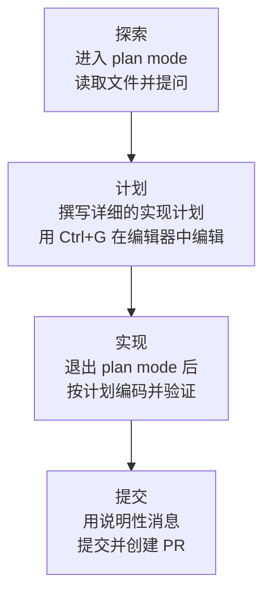

Claude Code 是一款能够直接读取代码、执行命令、做出更改并自主解决问题的智能体型工具，因此如何对它下达指令、如何让它进行验证，决定了结果的质量。


**一句话总结**：清晰地下达指令、先制定计划，并把验证手段交到它手里，Claude Code 就会从一个需要盯着的工具，变成一个可以放手交付的同事。


## 为什么需要最佳实践

Anthropic 官方指南所强调的几乎所有建议，都源于一个约束：**上下文窗口 会很快填满，而越填满性能就越差**（context window fills up fast）。对话中的每一条消息、Claude 读取的每一个文件、每一次命令输出都会在上下文窗口 中累积，一旦填满，Claude 就会“忘记”之前的指令，或者出错增多。因此，最佳实践的本质在于 **节省上下文的同时给出精确的信号**。

## 清晰直接的指令 + 提供上下文

Claude 能够推断意图，但无法读懂你的心思。越是指向具体文件、明示约束、点出应遵循的现有模式，需要的修正轮次就越少。

| 策略 | 模糊的指令 | 推荐的指令 |
|------|------------|----------|
| **限定作业范围** | “给 `foo.py` 加测试” | “为 `foo.py` 编写覆盖登出状态边界情况的测试，但避免使用 mock” |
| **指明出处** | “这个 API 为什么这么奇怪？” | “查看 `ExecutionFactory` 的 git 历史，总结一下这个 API 是怎么来的” |
| **参照现有模式** | “添加一个日历组件” | “看看主屏幕上现有的组件实现来掌握模式。`HotDogWidget.php` 是个好例子。按照那个模式新建一个日历组件” |
| **描述症状** | “修一下登录的 bug” | “有反馈说会话过期后登录失败。检查 `src/auth/` 的令牌刷新流程，先写一个复现该 bug 的失败测试，然后再修复” |

### 提供丰富上下文的方法

- `@` 引用：与其描述代码的位置，不如用 `@路径/文件` 直接引用，这样 Claude 会在响应前读取该文件。
- 粘贴图片：把截图或设计稿直接粘贴到提示词中。
- 提供 URL：给出文档或 API 参考的 URL，并用 `/permissions` 把常用域名加入允许列表。
- 管道输入：像 `cat error.log | claude` 那样直接传入文件内容。


**一句话总结**：同样的作业，只要明示“做什么、在哪个文件、按什么标准”，修正循环就能减半。


## 先探索，再计划，最后才写代码

直接一头扎进编码，可能会写出 **解决了错误问题的代码**（the wrong problem）。推荐采用 plan mode 将探索与执行分离的四阶段流程。

| 阶段 | 模式 | 核心行为 |
|------|------|----------|
| 探索（Explore） | plan mode | 不做更改地读取文件，掌握代码结构 |
| 计划（Plan） | plan mode | 撰写包含待改文件与流程的计划，用 `Ctrl+G` 直接编辑 |
| 实现（Implement） | 默认模式 | 按计划编写代码，运行并修复测试 |
| 提交（Commit） | 默认模式 | 撰写说明性的提交消息，然后创建 PR |

plan mode 很有用，但也有开销。**对于像修正错别字、加一行日志、改变量名这类范围明确而小的作业，不做计划直接下达指令** 更好。当方法不确定、会改动多个文件，或要触碰不熟悉的代码时，计划发挥的价值最大。如果一句话就能说清更改内容，就跳过计划。

## 把验证手段交到它手里

Claude 在作业“看起来做完”时就会停下。没有验证手段，人就成了验证循环本身，必须一个一个地发现所有错误。给它 **一个给出合格／不合格的检查**（a pass or fail），Claude 就会自行运行、读取结果，并反复迭代直到通过。

检查可以是任何能在对话中产生可读信号的东西：测试套件、构建退出码、linter、将夹具与输出做比较的脚本、与设计对照的浏览器截图等等。

按照对检查的强制程度不同，可分为几个层次。

| 方式 | 行为 | 适合的情形 |
|------|------|------------|
| 在单个提示词内 | 在同一条消息中请求运行检查并迭代 | 可立即处理的一般作业 |
| `/goal` 条件 | 由独立评估者每一轮重新确认条件，直至满足为止 | 贯穿整个会话的自动验证 |
| Stop hook | 以脚本运行检查，在通过前阻止本轮结束 | 需要确定性门禁的情形 |
| 验证子智能体 | 由具有全新上下文的模型尝试反驳结果 | 想把作者与评分者分开时 |

关键在于 **让它拿出证据而不是声称成功**。同时收到测试输出、所执行的命令及其返回值、结果截图，比你自己重新验证更快，而且在你没盯着的会话中也能奏效。


**一句话总结**：一个检查即是自主性——“盯着看的会话”与“放手交付的会话”之间的差别，就在于 Claude 是否拥有一个它能自行运行的检查。


## 权限与安全

默认情况下，Claude Code 会对可能改动系统的动作（写文件、Bash 命令、MCP 工具等）请求权限。这样虽安全但繁琐，因此可用以下三种方式减少干扰，同时保留控制权。

- **auto mode**：由独立的分类器模型审查命令，只拦截权限提升、未知基础设施、基于敌对内容的动作等风险。可像 `claude --permission-mode auto -p "fix all lint errors"` 这样使用。
- **权限允许列表**：用 `/permissions` 只允许你确知安全的工具，如 `npm run lint`、`git commit`。
- **沙箱化**：用 `/sandbox` 施加限制文件系统与网络访问的操作系统级隔离。

### 可撤销的行动与不可撤销的行动

安全的核心原则是 **按可逆性划分行动**。

- 编辑文件、运行测试这类 **局部且可撤销的行动可以自由地** 执行。出错时可用 `Esc` 停止，或用 `/rewind`（或连按两次 `Esc`）恢复到之前的状态。
- **难以撤销或会影响共享系统的行动**（强制推送、`rm -rf`、删除表、对外发布等），执行前务必获得用户确认。
- **禁止破坏性的捷径。** 不得为绕开障碍而使用 `--no-verify` 之类跳过验证的标志。跳过检查只是把问题藏起来，并不能解决它。

## 反模式：常见的失败模式

这些是官方指南和日常智能体使用经验中反复出现的失败模式。早些了解能节省时间。

| 反模式 | 症状 | 处方 |
|----------|------|------|
| 大杂烩会话（kitchen sink） | 一项作业 → 无关的问题 → 又回到第一项作业，上下文塞满噪声 | 在无关作业之间用 `/clear` |
| 反复修正（correcting over and over） | 同一个问题修正超过两次，失败的方法污染了上下文 | 失败两次后 `/clear`，再带上所学要点用更具体的提示词重新开始 |
| 过度设计（over-engineering） | 未经请求的抽象层、防御性代码、针对不可能发生情况的测试 | 指示审查子智能体“只报告影响正确性·需求的缺陷” |
| 信任—验证空档（trust-then-verify gap） | 看似合理却漏掉边界情况的实现 | 始终提供验证手段（测试·脚本·截图），无法验证就禁止上线 |
| 无限探索（infinite exploration） | 没有范围的“调查”指令读取数百个文件，耗尽上下文 | 收窄调查范围，或委派给子智能体 |

将三个核心反模式单独点出来如下：

- **过度设计**：审查者被要求找出缺陷时，即便作业本身没问题也会报告点什么。追逐每一条指摘会堆积起不必要的复杂度。只保留所需的最低复杂度。
- **明确而非猜测**：含糊时应当询问而非猜测。对于较大的功能，推荐让 Claude 先用 `AskUserQuestion` 工具进行访谈，然后再编写规格说明。
- **禁止无证据的主张**：要展示通过的测试输出和执行过的命令，而不是“我修好了”。

## 与 MoAI-ADK 工作流的契合

MoAI-ADK 在工作流层面将上述最佳实践制度化。如果说 Claude Code 的建议是一次性的提示词技巧，那么 MoAI-ADK 则把它们固化为 **基于 SPEC 的 Plan-Run-Sync 流水线**。

| Claude Code 最佳实践 | MoAI-ADK 对应 |
|----------------------|---------------|
| 先探索，再计划（plan mode） | `/moai plan` 先撰写 SPEC 文档（需求·计划·验收标准） |
| 提供验证手段（测试·自检） | TRUST 5 质量门禁与 SPEC 验收标准强制执行合格／不合格 |
| 用子智能体委派隔离作业 | manager-spec / manager-develop / manager-docs 等分阶段专属子智能体 |
| 以全新上下文进行对抗式审查 | plan-auditor（计划审计）+ evaluator-active（4 维质量评估） |
| 难以撤销的作业需确认 | GATE-2（计划→实现的用户批准门禁）与基于 Tier 的 PR 路由 |

详情请参阅下面链接的文档。MoAI-ADK 特有的 SPEC 撰写规则与质量标准在相应文档中定义，因此这里只总结契合点。

## 相关文档

- [工作原理](/claude-code/foundations/how-claude-code-works)
- [快速开始](/getting-started/quickstart)
- [TRUST 5 质量框架](/core-concepts/trust-5)

## 参考资料

- [Best practices for Claude Code（官方文档）](https://code.claude.com/docs/en/best-practices)


如果同一个问题你已经修正了超过两次，那么上下文很可能已被失败的方法污染。果断用 `/clear` 重置，带上这期间所学的要点用更具体的提示词重新开始，几乎总是更快。

