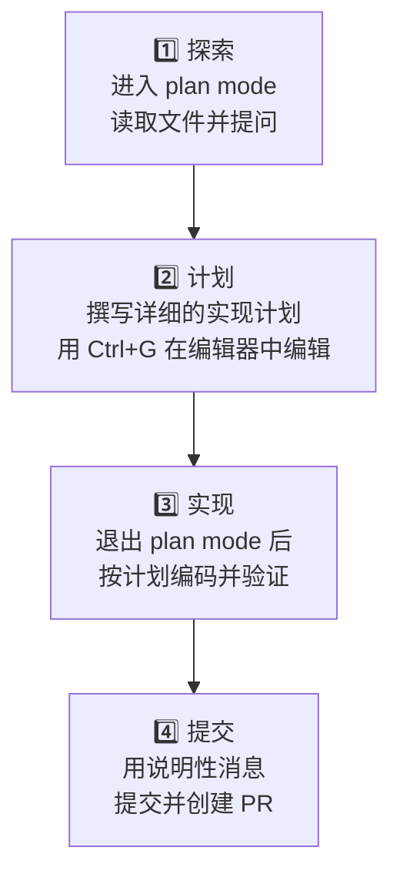

Claude Code 是一款能够直接读取代码、执行命令、做出更改并自主解决问题的智能体型工具。因此，**如何指导它以及如何让它进行验证**，决定了结果的质量。与简单地让 Claude 审查代码不同，合理的指导能够大幅提高生产力。


**核心洞察**：大多数问题的根源只有一个。**上下文窗口会很快填满，而越填满性能就越差。** 所有最佳实践都围绕这个约束进行设计。


## 1. 给 Claude 提供验证方法

Claude 在看到"工作似乎完成"的信号时就会停止。如果没有验证手段，**你就会成为整个验证循环**，必须逐一发现所有错误。

给 Claude 提供能够执行的验证。测试套件、构建命令、linter、或与截图对比的脚本 — 只要是 Claude 能读取并做出反应的信号就行。

| 策略 | 模糊的指令 | 推荐的指令 |
|------|------------|----------|
| **提供验证标准** | `实现 validateEmail 函数` | `写一个 validateEmail 函数。测试用例：user@example.com 返回 true，invalid 返回 false，user@.com 返回 false。实现后运行测试并确认通过` |
| **UI 变更的视觉验证** | `让仪表板看起来更好` | `[附加截图] 按照这个设计来实现。拍摄结果的截图，与原始设计对比，列出差异` |
| **解决根本原因** | `构建失败了` | `构建失败：[错误文本]。找到根本原因并修复。不要隐藏错误，要解决它` |

一旦提供了验证，Claude 会：
1. 执行工作
2. 运行验证
3. 读取结果
4. 重复直到通过

即使你没看着这个会话，它也能正确完成。让它展示证据 — 测试输出、执行的命令和结果、截图。这比你自己重新验证要快。

## 2. 探索 → 计划 → 实现的 4 个阶段

直接冲进编码可能会导致**解决错误问题的代码**。先进行探索和计划。



**各阶段详解**：

1. **探索** (plan mode)：读取文件并提问。禁止修改。
   ```
   在 /moai plan mode 中：
   读取 /src/auth 以理解会话·登录流程。
   也看看如何通过环境变量管理密钥。
   ```

2. **计划**：撰写详细的实现计划。用 `Ctrl+G` 在编辑器中直接修改。

3. **实现**：退出 plan mode 后编写代码。运行测试同时验证与计划是否一致。

4. **提交**：用说明性消息创建 PR。

**提示**：对于范围明确且简单的工作(修正拼写错误、添加一行、重命名变量)，可以跳过计划阶段。计划在**范围不确定或修改多个文件时**最有价值。

## 3. 提供具体的上下文

Claude 能推断意图，但无法读心。**越具体，需要修正的次数就越少。**

| 策略 | 模糊的指令 | 推荐的指令 |
|------|------------|----------|
| **限定范围** | `给 foo.py 添加测试` | `为处理登出状态边界情况的 foo.py 编写测试。不要使用 mock` |
| **指明来源** | `ExecutionFactory API 为什么这么奇怪？` | `查看 ExecutionFactory 的 git 历史并总结这个 API 如何演变的` |
| **参照现有模式** | `添加日历部件` | `学习主屏幕现有部件的实现模式。HotDogWidget.php 是个好例子。按照那个模式实现日历部件` |
| **描述症状** | `修复登录 bug` | `会话过期后登录失败。检查 src/auth 中的令牌刷新流程。先写一个复现 bug 的失败测试，然后修复` |

### 提供丰富上下文的方法

- **使用 @ 引用**：使用 `@路径/文件` 直接引用而不是描述位置，Claude 会在回复前读取
- **粘贴图片**：直接粘贴屏幕截图或设计稿到提示中
- **提供 URL**：给出文档或 API 参考的 URL，用 `/permissions` 把常用域名加入允许列表
- **管道输入**：像 `cat error.log | claude` 这样直接传入文件内容

## 4. 配置环境

小的配置改变能让每个会话都更高效。

### 编写 CLAUDE.md — 核心指南

这是 Claude 在每个会话开始时读取的特殊文件。在其中记录代码风格、工作流程、项目设置。

开始：用 `/init` 命令自动生成，然后进行精化。

**应该包含**：
- Bash 命令(Claude 无法推断的)
- 代码风格规则(与默认值不同的)
- 测试框架和运行方法
- 仓库礼仪(分支名、PR 规则)
- 架构决策(项目特定的事项)

**应该排除**：
- 代码可以表达的内容(用链接代替 API 文档)
- 经常变化的信息

### 权限模式设置

默认值：Claude 对可能修改系统的操作(写文件、Bash 命令、MCP 工具)请求权限。这很安全，但很繁琐。

**Auto mode** (`Shift+Tab`)：分类模型判断危险程度并自动批准。
**权限允许列表**：预先允许 `npm run lint`、`git commit` 这样的安全命令。
**沙箱**：用 OS 级隔离保持边界的同时获得更多自由。

### 用 `/init` 生成 CLAUDE.md

自动分析项目：
- 检测构建系统
- 发现测试框架
- 学习代码模式
- 生成草稿

之后进行编辑以完成。

## 5. 使用 CLI 工具

`gh` (GitHub CLI)、`aws`、`gcloud` 这样的 CLI 上下文效率非常高。

如果安装了 CLI，Claude 会自动使用。否则它会使用 API，但 API 可能速度慢且限制多。

## 6. 连接 MCP 服务器


MCP (Model Context Protocol) — 直接连接外部工具到 Claude。


```bash
claude mcp add --transport http <server-name>
```

可以把问题跟踪器、数据库、监控仪表板连接到 Claude。

## 7. 用 Skills 和 Subagents 扩展

### Skills — 领域知识

在 `.claude/skills/` 中创建 `SKILL.md` 文件以自动加载领域特定指南。

```markdown
---
name: api-conventions
description: 我们服务的 REST API 设计规则
---

- URL 路径：kebab-case
- JSON 属性：camelCase
- 版本：包含在 URL 路径中 (/v1/, /v2/)
```

只在需要时加载，所以不会污染每个会话的上下文。

### Subagents — 隔离的专家

需要读取大量文件或进行深入分析时，委派给 subagent。它在独立的上下文中工作，然后返回摘要。

## 8. 会话管理

### 用 /clear 分离上下文

在大项目上做各种工作时，用 `/clear` 清理之前的上下文并开始新工作能保持性能。

- 完成阶段性工作后
- 当上下文使用量超过 150K 时
- 切换到无关工作时

### 用 Rewind 进行实验

用 `Esc` 键或 `/rewind` 命令返回到之前的状态。保持上下文的同时尝试不同方法。

### 用 Subagents 委派调查

需要大规模探索时，发送 subagent。读取的文件不会污染主会话上下文。

## 9. 并行运行多个代理

只读分析或评审可以在多个会话中并行进行。

**编写者/审查者模式**：
- A 会话(编写者)：实现代码
- B 会话(审查者)：代码审查(独立视角)
- A 会话：应用反馈

或者**测试/代码分离**：
- A 会话：编写测试(TDD)
- B 会话：实现通过测试的代码

## 10. 自动化和扩展

### 非交互模式

```bash
claude -p "提示词" --output-format json
```

把 Claude 集成到 CI 管道、pre-commit 钩子、脚本中。

### 多会话并行执行

同时进行多个 SPEC，或并行转换大量文件。

### 用 /goal 自主完成

```
/goal "所有测试通过且覆盖率达到 85% 以上时"
```

Claude 会自动重复，目标达成时停止。

## 11. 避免常见的失败模式

| 模式 | 问题 | 解决 |
|------|------|------|
| **大杂烩会话** | 无关工作混在一起污染上下文 | 在无关工作之间使用 `/clear` |
| **重复修正** | 同一问题修正超过两次仍然重复 | `/clear` 后用更好的指令重新开始 |
| **过度设计** | 未经请求的抽象、防御性代码 | 检查者无法找到真正的缺陷时停止 |
| **信任-验证缺口** | 看似合理但漏掉边界情况的实现 | 总是提供验证(测试、脚本、截图) |
| **无限探索** | 范围不明的"调查"指令读取数百文件 | 限定调查范围或委派给 subagent |

## 参考

此指南基于 Anthropic 的官方文档 [Best practices for Claude Code](https://code.claude.com/docs/en/best-practices) 编写。
