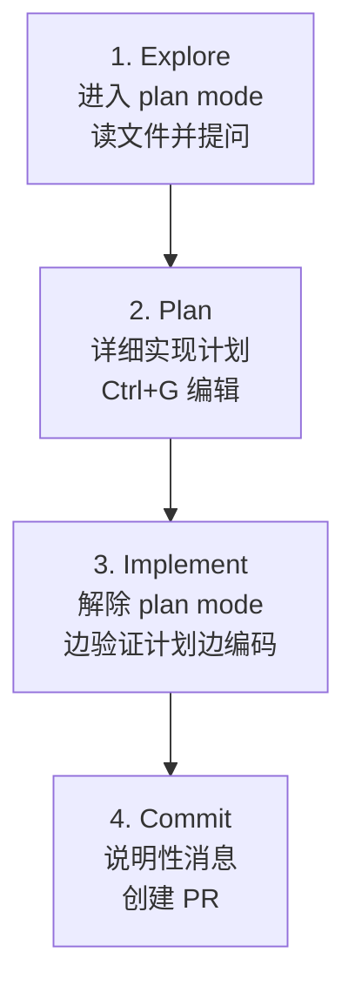

# 最佳实践

Claude Code 是自己读文件、执行命令、直接改代码的智能体。所以结果的质量不取决于模型有多聪明，而取决于**你怎么下指令、怎么让它验证**。

本页的模式最终汇成一处：与其每个回合手动操纵，不如设计出让智能体自己良好运转的循环与环境。


**一句话总结**： 大多数问题根源只有一个。**上下文窗口填得很快，越满回应质量越低、成本越高。** 本页的最佳实践都以这条约束为中心设计。


## 递上验证方法

Claude 一接到"工作似乎完成了"的信号就会停下。没有可供验证的工具，就会沦为**由用户发现所有失误的验证循环**。

所以请把 Claude 能自己执行的验证一起递过去。测试套件、构建命令、linter、截图对比脚本 —— 只要是 Claude 能读取并做出反应的信号都行。

| 策略 | 弱指令 | 推荐指令 |
|------|---------|-----------|
| **提供验证标准** | `实现 validateEmail 函数` | `编写 validateEmail 函数。测试用例： user@example.com 为 true, invalid 为 false, user@.com 为 false。实现后运行测试并确认通过` |
| **UI 变更的视觉验证** | `把仪表盘弄好看点` | `[附截图] 按这个设计实现。截取结果截图并与原稿对比，列出差异` |
| **解决根本原因** | `构建失败了` | `构建失败： [错误文本]。找到根本原因并修复。不要掩盖错误，要解决它` |

递上验证之后，Claude 会自己运转下面的循环。

1. 执行工作
2. 运行验证
3. 读取结果
4. 反复直到通过

无人盯守的会话也能正确走到最后，原因就在这里。完成报告要索要证据。测试输出、执行过的命令与结果、截图就是证据，比亲自重跑更快。**按观察到的结果 (evidence) 而不是"完成了"的主张 (claim) 来判定** —— 这也是 MoAI-ADK 用 SPEC 的验收标准 (AC) 与 TRUST 5 闸门体系化的标准。

### 验证捆在一个回合里跑

验证命令有多个 —— 测试、lint、构建、类型检查 —— 就把它们一次性放进同一个回合。跑一个、报告结果、再跑下一个的串行往返，每次都重复等待与权限确认。一次响应里捆上多个只读验证，N 次往返就缩成一次。

这个模式对 Claude 自己做验证时同样适用。最新版 Claude Code 会在一次响应内并行执行相互独立的只读命令，所以验证越按"一捆"而不是"逐个排队"设计，wall-time 越短。更大的教训是：验证要按**捆 (batch)**设计，而不是按顺序。

## 探索 → 计划 → 实现 → 提交的四阶段

一头扎进编码，可能产出**解决了错误问题的代码**。先做探索与计划。只读回合便宜、实现回合昂贵，所以这个顺序不只是质量问题，也是代币经济问题。


```mermaid
flowchart TD
    A["1. Explore<br/>进入 plan mode<br/>读文件并提问"] --> B["2. Plan<br/>详细实现计划<br/>Ctrl+G 编辑"]
    B --> C["3. Implement<br/>解除 plan mode<br/>边验证计划边编码"]
    C --> D["4. Commit<br/>说明性消息<br/>创建 PR"]
```

逐阶段来看：

1. **探索**（plan mode）： 读文件、提问。禁止变更。
   ```text
   在 plan mode 中：
   阅读 /src/auth，理解会话 · 登录流程。
   也看看密钥是如何用环境变量管理的。
   ```
2. **计划**： 撰写详细的实现计划。可用 `Ctrl+G` 在编辑器里直接修改。
3. **实现**： 解除 plan mode 开始编码。边跑测试边验证是否符合计划。
4. **提交**： 用说明性消息提交并创建 PR。

范围明确又简单的工作（改错字、加一行、改变量名）可以跳过计划阶段。计划在**范围不确定或要改多个文件时**最有效。MoAI-ADK 的 plan→run→sync 生命周期与实现开工批准闸门，就是把这四阶段制度化为 SPEC 工作流的产物。

## 提供具体的上下文

Claude 能推断意图，但不会读心。**越具体，修正次数越少**，修正少了代币也跟着省。

| 策略 | 含糊的指令 | 推荐指令 |
|------|---------|-----------|
| **限定范围** | `给 foo.py 加测试` | `编写覆盖登出状态边界用例的 foo.py 测试。禁止使用 mock` |
| **指明出处** | `ExecutionFactory 的 API 怎么这么怪?` | `查看 ExecutionFactory 的 git 历史，总结这个 API 是如何演化的` |
| **参照模式** | `加个日历小组件` | `学习主屏幕既有小组件的实现模式。HotDogWidget.php 是个好例子。按那个模式实现日历小组件` |
| **描述症状** | `修登录 Bug` | `会话过期后登录失败。检查 src/auth 的令牌刷新流程。先编写重现该 Bug 的失败测试，再修复` |

### 一个回合装满全部交过去

最新的 Opus 级模型（Opus 4.7+、4.8、5）偏好**一个回合 fully-loaded** 地工作。把意图与约束、完成标准、相关文件位置一次装进同一份提示交过去。一小片一小片拆到多个回合的乒乓不只浪费代币，还拉低结果质量 —— 模型每个回合都得从不完整的图景重新建立理解。相关的信息一开始就全说清楚，然后放手让它干。

同样的脉络，**"完成"是什么也要在说明任务的同一个回合里讲明**。不等模型来问、提前递上完成条件，正是"一个回合 fully-loaded"的实践。

### 装载丰富上下文的方法

- **用 @ 引用文件**： 与其描述，不如用 `@路径/文件` 直接指向，Claude 会先读它
- **粘贴图片**： 直接贴上截图或设计稿
- **提供 URL**： 给出文档/API 参考的 URL，用 `/permissions` 把域名加入允许列表
- **管道输入**： 用 `cat error.log | claude` 直接传数据

## 配置环境

小小的配置变更能让每个会话都更高效。把每个会话反复出现的纠正搬进环境 —— 这就是线束工程的开端。

### CLAUDE.md —— 不变规则的家

`CLAUDE.md` 是每次会话启动时 Claude 都会读取的特殊文件。写在这里的应该是**"不说就会做错的不变规则"**。不是代码里读得到的事实，而是项目独有的约定与偏好。用 `/init` 命令自动生成草稿再打磨会很快。`/init` 会分析项目、检测构建系统、找到测试框架、学习代码模式来生成草稿。

**应包含**：

- Bash 命令（Claude 猜不出来的）
- 代码风格规则（与默认值不同的）
- 测试框架与运行方法
- 仓库礼仪（分支名、PR 规则）
- 架构决策（项目独有的特殊性）

**应排除**：

- 代码里读得到的东西（API 文档给链接即可）
- 经常变化的信息

`CLAUDE.md` 每次会话整体加载、消耗代币，越膨胀越需要瘦身。以"没有这条规则会出错吗？"为标准，毫不留情地精简。

### 设置权限模式

默认值是 Claude 每项操作都请求批准。安全但繁琐。

- **Auto mode**（`Shift+Tab`）： 由分类模型判断风险后自动批准。
- **权限允许列表**： 预先放行 `npm run lint`、`git commit` 这类安全命令。
- **沙箱**： 借助 OS 级隔离在保持边界的同时更自由地工作。

子智能体自 v2.1.198 起默认在后台运行，遇到需要权限的工具时提示会浮现在主会话（v2.1.186 起连哪个子智能体在问都会点名）。所以开始长任务之前，把需要的工具预先加进 `settings.json` 允许列表，能大幅减少提示的频率。

### CLI 工具与 MCP 服务器

`gh` (GitHub CLI)、`aws`、`gcloud` 这类 CLI 的上下文效率非常好。装好了 Claude 会自动利用；没有时改走 API，而 API 路径可能更慢、限制更多。

议题跟踪器、数据库、监控看板可以用 MCP (Model Context Protocol) 直接连到 Claude。

```bash
claude mcp add --transport http <server-name>
```

## 用技能与子智能体扩展

### 技能 —— 领域知识

在 `.claude/skills/` 编写 `SKILL.md` 文件，自动加载领域特化的指南。

```markdown
---
name: api-conventions
description: 我们服务的 REST API 设计规则
---

- URL 路径: kebab-case
- JSON 属性: camelCase
- 版本: 包含在 URL 路径中 (/v1/, /v2/)
```

只在需要时加载，不污染每个会话的上下文。

### 子智能体 —— 隔离的专家

需要读大量文件或做深度分析时，委派给子智能体。它在独立上下文中工作后只返回摘要，调查过程的文件读取不占用主会话上下文。子智能体的定义要越写越瘦 —— 定义全文每次 spawn 都进入上下文，赘肉就是每次调用的成本。

子智能体嵌套自 v2.1.219 起默认启用（深度 3），但想保持层级平坦，只要从子智能体定义中去掉 `Agent` 工具就能确实保证。详细结构与设置请参阅[子智能体](/zh/claude-code/agentic/sub-agents)文档。

## 会话管理

### 用 /clear 分隔脉络

在大项目里往返于多项工作时，用 `/clear` 清理旧脉络再开始新工作，性能才能保持。

- 完成阶段性工作之后
- 上下文用量升高的时候
- 切换到无关工作的时候

### 用回退做实验

用 `Esc` 键或 `/rewind` 命令可以回到之前的状态。既保持脉络又能尝试不同方案，让不惧失败的实验成为可能。

### 调查委派给子智能体

需要大规模探索时派出子智能体。读过的文件不会污染主会话上下文。

## 智能体团队与并行执行

同时运行多个智能体的功能很强大，但核心是**分辨什么该并行跑**。

### 并行给调研，顺序给编码

官方指南里有一点观察值得记牢： **大多数编码工作真正可并行的部分比调研少。** 代码相互依赖，一个文件的变更牵连其他文件。所以编码为主的工作默认用顺序子智能体。

反过来，调研与评审非常适合并行。多个智能体各从不同角度调查、交叉验证发现的结构很自然。

- **并行发光的工作**： PR 评审、库调研、bug 原因假设验证、代码库全量扫描
- **顺序更安全的工作**： 要改同一批文件的实现、每步有依赖的变更、单文件日常编辑

### 从 3-5 个开始

使用智能体团队时，官方指南建议从 **3-5 个**开始。意思是别轻易加更多。理由很简单。

- 代币成本随人数线性增长。每个成员在独立上下文里各自消耗。
- 成员越多，通信与协调负担越重，碰到同一批文件的冲突概率也越高。
- 超过一定数量就会出现收益递减。追加的成员不会按比例提升速度。

给每个成员分配 5-6 个任务，既不会引发过多的上下文切换，又能让所有人保持忙碌。专注的 3 个人常常胜过分散的 5 个人。

### 团队、子智能体、工作流 —— 什么场合用哪个

有三种编排原语，按"计划握在谁手里"来区分。

| 原语 | 何时 | 详细文档 |
|------|------|------------|
| **子智能体** | 只需要结果的聚焦工作，编码的默认 | [子智能体](/zh/claude-code/agentic/sub-agents) |
| **智能体团队** | 需要共享发现、相互验证的并行调研 · 评审 | [智能体团队](/zh/claude-code/agentic/agent-teams) |
| **动态工作流** | 单次对话难以协调的几十到上百智能体规模的扇出 | [动态工作流](/zh/claude-code/agentic/workflows) |

### 平坦的层级更安全

子智能体嵌套自 v2.1.219 起默认启用，可以 spawn 到深度 3（用 `CLAUDE_CODE_MAX_SUBAGENT_SPAWN_DEPTH=1` 可以关掉）。但能嵌套不等于嵌套好。层级越深，什么在哪里发生就越难追踪。想保持层级平坦，从子智能体定义的 `tools:` 列表里去掉 `Agent` 工具即可 —— 这是如今唯一可靠的平坦层级保证。MoAI-ADK 把平坦编排作为默认原则，也是同一个脉络。

### 后台是默认，权限提示进主会话

子智能体自 v2.1.198 起默认在后台运行。只有 Claude 立刻需要结果时才放到前台。后台子智能体遇到需要权限的工具时，提示浮现在主会话（v2.1.186+ 会点名是哪个子智能体在问），按 `Esc` 可以只拒绝那一次调用。所以长任务开始前，建议把安全命令预先加进允许列表。

再加一条： spawn 时的 `mode` 参数自 v2.1.213 起**被忽略**。子智能体继承父会话的权限模式，所以想保证只读范围，要靠**工具限制**（从 `tools:` 列表去掉写工具），而不是权限模式。

### 模型每次 spawn 都写明

spawn 子智能体时建议明确传入 `model`。因为子智能体定义的 `model:` 默认值是 `inherit`（继承主会话模型），不写明就可能悄悄跑在与意图不同的模型上。每次 spawn 都写清哪个模型以哪个 effort 运行，也是代币经济学"计划深入做、实现便宜做、验证独立做"原则的实践。


最新的 Opus 级模型（Opus 4.7+、4.8、5）**不会自动 spawn 子智能体**。它们偏好推理而非工具调用，需要扇出时要像"并行调查这些文件"这样明确指示。一个响应能完成的工作，默认不 spawn 子智能体。


## 自动化与规模化

### 非交互模式

```bash
claude -p "提示词" --output-format json
```

把 Claude 集成进 CI 流水线、pre-commit 钩子与脚本。

### 多会话并行执行

同时推进多项工作，或并行转换大批文件。为避免文件编辑重叠，用[工作树](/zh/claude-code/agentic/worktrees)隔离才安全。想关闭动态工作流，设置环境变量 `CLAUDE_CODE_DISABLE_WORKFLOWS=1`。

### 用 /goal 自主完成

```text
/goal "所有测试通过且 coverage 达到 85% 以上时"
```

声明完成条件后 Claude 自动迭代，达成目标即停止。走到这一步，角色就已经从"每回合下指令"换成了"设计循环"。MoAI-ADK 的 `/moai goal` 与 `/moai loop`，是把这一循环与项目的质量工具 · SPEC 生命周期结合起来的扩展。

## 避开常见的失败模式

| 模式 | 问题 | 解决 |
|------|------|------|
| **大杂烩会话** | 无关的工作混在一起污染上下文 | 在无关工作之间用 `/clear` |
| **反复纠正** | 同一个问题改了两次以上还在重复 | `/clear` 后用更好的指令重新开始 |
| **臃肿的 CLAUDE.md** | 指令太长，Claude 忽略一半以上 | 毫不留情地精简。以"没有这条规则会出错吗?"为标准 |
| **只有主张的报告** | 看似合理的实现漏掉边界用例 | 始终提供验证。完成报告索要证据 |
| **无限探索** | 无范围的"帮我调查"读了几百个文件 | 明示范围或委派给子智能体 |
| **滥用并行的编码** | 把真正无法并行的编码丢给团队跑，引发冲突 | 编码默认顺序子智能体。团队 · 工作流留给调研 · 扫描 |

## 相关文档

- [上下文窗口](/zh/claude-code/context-memory/context-window)
- [子智能体](/zh/claude-code/agentic/sub-agents)
- [智能体团队](/zh/claude-code/agentic/agent-teams)
- [动态工作流](/zh/claude-code/agentic/workflows)
- [目标驱动执行 (/goal)](/zh/claude-code/agentic/goal)
- [大型代码库](/zh/claude-code/agentic/large-codebases)

## 参考资料

- [Best practices for Claude Code（官方文档）](https://code.claude.com/docs/en/best-practices)


本页若只带走一条，那就是"递上验证方法"。有可验证的完成条件，循环才能自行运转；循环自行运转，其余所有最佳实践才能发挥威力。

