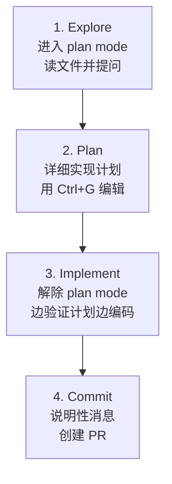

# 最佳实践

Claude Code 是自主读取文件、执行命令、施加变更的智能体型工具。与单纯让它评审代码不同，**如何下达指令、如何让它自我验证**在很大程度上左右结果质量。本页的模式最终汇聚为一种思维方式 —— 与其每回合手动操控，不如设计让智能体能自行良好运转的循环与环境。


**一句话总结**：大多数问题根源只有一个：**上下文窗口填得很快，越满回应质量越低、成本越高。** 所有最佳实践都是围绕这一约束设计的。


## 递上验证方法

Claude 只要接到"工作似乎完成了"的信号就会停下。若没有可供验证的工具，就会沦为**由用户发现所有失误的验证循环**。

请提供 Claude 能自行执行的验证。测试套件、构建命令、linter、截图对比脚本 —— 只要是 Claude 能读取并做出反应的信号都行。

| 策略 | 弱指令 | 推荐指令 |
|------|---------|-----------|
| **提供验证标准** | `实现 validateEmail 函数` | `编写 validateEmail 函数。测试用例：user@example.com 为 true，invalid 为 false，user@.com 为 false。实现后运行测试并确认通过` |
| **UI 变更的视觉验证** | `把仪表盘弄好看点` | `[附截图] 按这个设计实现。截取结果截图并与原稿对比，列出差异` |
| **解决根本原因** | `构建失败了` | `构建失败：[错误文本]。找到并修复根本原因。不要掩盖错误，要解决它` |

提供验证之后，Claude 会自行运转以下循环。

1. 执行工作
2. 运行验证
3. 读取结果
4. 重复直到通过

无人盯守的会话也能正确完成，原因正在于此。请在完成报告中要求证据 —— 测试输出、执行的命令与结果、截图。这比亲自重跑要快。"可验证的完成条件 + 基于证据的判定"也是 MoAI-ADK 通过 SPEC 的验收标准 (AC) 与 TRUST 5 门禁体系化的原则。

## 探索 → 计划 → 实现 → 提交的四阶段

直接扎进编码可能产出**解决了错误问题的代码**。请先做探索与计划。只读回合便宜、实现回合昂贵，这个顺序不仅关乎质量，也是令牌经济问题。


```mermaid
flowchart TD
    A["1. Explore<br/>进入 plan mode<br/>读文件并提问"] --> B["2. Plan<br/>详细实现计划<br/>用 Ctrl+G 编辑"]
    B --> C["3. Implement<br/>解除 plan mode<br/>边验证计划边编码"]
    C --> D["4. Commit<br/>说明性消息<br/>创建 PR"]
```

分阶段来看如下。

1. **探索** (plan mode)：读文件并提问。禁止变更。
   ```text
   在 plan mode 中：
   阅读 /src/auth，理解会话·登录流程。
   顺便看看密钥是如何用环境变量管理的。
   ```
2. **计划**：撰写详细的实现计划。可用 `Ctrl+G` 在编辑器中直接修改。
3. **实现**：解除 plan mode 开始编码。边跑测试边验证是否符合计划。
4. **提交**：以说明性消息提交并创建 PR。

范围明确的简单工作（改错别字、加一行、改变量名）可以跳过计划阶段。计划在**范围不确定或要修改多个文件时**最有效。MoAI-ADK 的 plan→run→sync 生命周期与实现启动批准门禁，正是把这四阶段制度化为 SPEC 工作流的产物。

## 提供具体的上下文

Claude 能推断意图，但不会读心。**越具体，修正次数越少**，修正次数减少的同时也省下令牌。

| 策略 | 含糊的指令 | 推荐的指令 |
|------|---------|-----------|
| **限定范围** | `给 foo.py 加测试` | `编写覆盖登出状态边界用例的 foo.py 测试。禁止使用 mock` |
| **指明出处** | `ExecutionFactory 的 API 怎么这么怪?` | `查看 ExecutionFactory 的 git 历史，总结其 API 如何演化` |
| **参照模式** | `加个日历小组件` | `学习主屏幕既有小组件的实现模式。HotDogWidget.php 是个好例子。按那个模式实现日历小组件` |
| **描述症状** | `修登录 Bug` | `会话过期后登录失败。检查 src/auth 的令牌刷新流程。先编写重现该 Bug 的失败测试再修复` |

### 提供丰富上下文的方法

- **用 @ 引用文件**：与其描述，不如用 `@路径/文件` 直接指向，Claude 会先读它
- **粘贴图片**：直接贴上截图或设计稿
- **提供 URL**：给出文档/API 参考的 URL，并用 `/permissions` 把域名加入允许列表
- **管道输入**：用 `cat error.log | claude` 直接传递数据

## 配置环境

小小的配置变更能让每个会话都更高效。把每个会话反复出现的纠正搬进环境 —— 这就是挽具工程的开端。

### 撰写 CLAUDE.md

这是每次会话启动时 Claude 都会读取的特殊文件。写下代码风格、工作流与项目配置。用 `/init` 命令自动生成草稿后再打磨会很快。`/init` 会分析项目、检测构建系统、寻找测试框架、学习代码模式来生成草稿。

**应包含**：

- Bash 命令（Claude 猜不出来的）
- 代码风格规则（与默认值不同的）
- 测试框架与运行方法
- 仓库礼仪（分支名、PR 规则）
- 架构决策（项目独有的特殊性）

**应排除**：

- 能从代码中读到的东西（API 文档给链接即可）
- 经常变化的信息

CLAUDE.md 每次会话全文加载并消耗令牌，越膨胀越需要瘦身。

### 设置权限模式

默认值是 Claude 对每项操作都请求批准。安全但繁琐。

- **Auto mode**（`Shift+Tab`）：由分类模型判断风险后自动批准。
- **权限允许列表**：预先放行 `npm run lint`、`git commit` 这类安全命令。
- **沙箱**：借助 OS 级隔离在保持边界的同时更自由地工作。

### 善用 CLI 工具

`gh` (GitHub CLI)、`aws`、`gcloud` 这类 CLI 的上下文效率非常好。装好后 Claude 会自动利用；没有时改走 API，而 API 路径可能更慢、限制更多。

### 连接 MCP 服务器

可以用 MCP (Model Context Protocol) 把议题跟踪器、数据库、监控看板直接连到 Claude。

```bash
claude mcp add --transport http <server-name>
```

## 用技能与子智能体扩展

### 技能 —— 领域知识

在 `.claude/skills/` 编写 `SKILL.md` 文件，自动加载领域特化指南。

```markdown
---
name: api-conventions
description: 我们服务的 REST API 设计规则
---

- URL 路径：kebab-case
- JSON 属性：camelCase
- 版本：包含在 URL 路径中（/v1/、/v2/）
```

只在需要时加载，不会污染每个会话的上下文。

### 子智能体 —— 隔离的专家

需要读取大量文件或深度分析时，委派给子智能体。它在独立上下文中工作后只返回摘要，调查过程的文件读取不占用主会话上下文。

## 会话管理

### 用 /clear 分隔脉络

在大项目中往返于多项工作时，用 `/clear` 清理旧脉络再开始新工作，性能才能保持。

- 完成一个阶段性任务后
- 上下文用量超过 150K 时
- 切换到无关工作时

### 用回退做实验

用 `Esc` 键或 `/rewind` 命令可以回到之前的状态。既保持脉络又能尝试不同方案，让不惧失败的实验成为可能。

### 调查委派给子智能体

需要大规模探索时派出子智能体。读过的文件不会污染主会话上下文。

## 并行运行多个智能体

只读分析或评审可以在多个会话中并行进行。

- **Writer/Reviewer 模式**：会话 A (Writer) 实现代码，会话 B (Reviewer) 从独立视角评审，随后会话 A 吸收反馈。把制造方与检查方分离的这一模式，与 MoAI-ADK 用 plan-auditor / sync-auditor 独立审计智能体制度化的原则相同。
- **Test/Code 分离**：会话 A 编写测试 (TDD)，会话 B 实现通过这些测试的代码。

## 自动化与规模化

### 非交互模式

```bash
claude -p "提示词" --output-format json
```

把 Claude 集成进 CI 流水线、pre-commit 钩子与脚本。

### 多会话并行执行

同时推进多个 SPEC，或并行转换大批文件。为避免文件编辑重叠，用[工作树](/claude-code/agentic/worktrees)隔离才安全。

### 用 /goal 自主完成

```text
/goal "所有测试通过且 coverage 达到 85% 以上时"
```

声明完成条件后 Claude 自动迭代，达成目标即停止。走到这一步，角色就从"每回合下指令"转向了"设计循环" —— MoAI-ADK 的 `/moai goal` 与 `/moai loop` 是把这一循环与项目的质量工具·SPEC 生命周期结合起来的扩展。

## 避开常见失败模式

| 模式 | 问题 | 解决 |
|------|------|------|
| **厨房水槽会话** | 不相关的工作混在一起污染上下文 | 在无关工作之间用 `/clear` |
| **反复纠正** | 同一问题改了两次以上仍在重复 | `/clear` 后用更好的指令重新开始 |
| **臃肿的 CLAUDE.md** | 指令太长导致 Claude 忽略一半以上 | 毫不留情地精简。以"没有这条规则会出错吗？"为标准 |
| **信任-验证鸿沟** | 看似合理的实现漏掉边界用例 | 始终提供验证（测试、截图、linter） |
| **无限探索** | 无范围的"帮我调查"读了数百个文件 | 明示范围或委派给子智能体 |

## 相关文档

- [上下文窗口](/claude-code/context-memory/context-window)
- [子智能体](/claude-code/agentic/sub-agents)
- [目标驱动执行 (/goal)](/claude-code/agentic/goal)
- [大型代码库](/claude-code/agentic/large-codebases)

## 参考资料

- [Best practices for Claude Code（官方文档）](https://code.claude.com/docs/en/best-practices)


如果本页只带走一条，那就是"递上验证方法"。有可验证的完成条件，循环才能自行运转；循环自行运转，其余所有最佳实践才能发挥威力。

