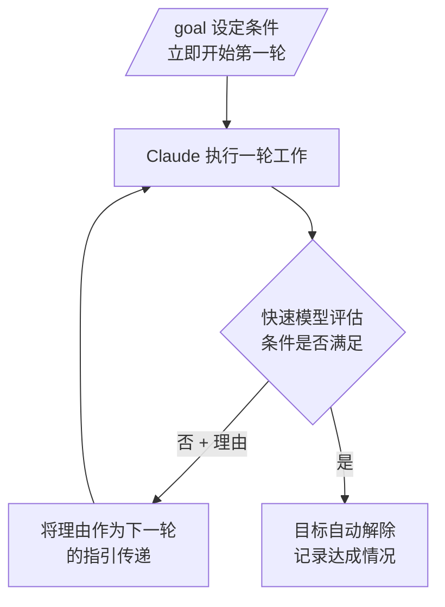

`/goal` 命令是一种自主连续执行机制：只要设定一个可验证的完成条件，Claude Code 就会在每一轮自行推进工作，直到该条件被满足。


**一句话总结**：每一轮结束时由一个快速模型判定"条件是否满足"，若未满足则自动开始下一轮，因此在工作完成之前用户无需再次输入提示。


## /goal 是什么

`/goal` 用于设定一个 **完成条件** (completion condition)，并让 Claude Code 在无需用户额外输入的情况下持续推进，直到该条件成立。每一轮结束时，一个小型快速模型会检查条件是否被满足；若尚未满足，它不会把控制权交还给用户，而是自动开始下一轮。一旦条件被满足，目标会自动解除。

它适用于具有可验证终止状态的大型任务。

- 将某个模块迁移到新 API，直到所有调用处都能编译且测试通过
- 实现一份设计文档，直到所有验收标准成立
- 拆分一个大文件，直到每个文件都降到大小预算以下
- 处理带标签的 issue 积压，直到队列清空

一个会话只能激活一个目标。同一个 `/goal` 命令会根据参数分别负责设定、查看状态和解除。

## 工作原理

`/goal` 是对会话范围内 **基于提示的 Stop hook** (prompt-based Stop hook) 的封装。Claude 每完成一轮，条件以及到目前为止的对话内容就会被传递给所配置的小型快速模型（默认为 Haiku）。模型返回一个是/否判定和一段简短的理由。



评估器不会调用工具或直接读取文件。它仅凭 Claude 在对话中已经 **呈现的内容** (surfaced output) 进行判断。因此像"`test/auth` 中的所有测试通过"这样的条件能很好地工作——因为 Claude 会运行测试，其结果会留在对话记录中。

评估器在会话所使用的同一供应商上运行，评估所耗费的 token 计费在小型快速模型上，相比本轮的成本通常可以忽略不计。

## 如何编写有效的条件

由于评估器仅凭对话中呈现的内容进行判定，你必须把条件写成 Claude 的输出能够 **证明** 的形式。在长时间运行的目标中能够稳定撑住的条件通常具备三个要素。

| 要素 | 说明 | 示例 |
| --- | --- | --- |
| 可测量的终止状态 | 测试结果、构建退出码、文件数量、空队列等 | "所有认证测试通过" |
| 明确的验证方法 | Claude 应如何证明 | "`npm test` exits 0" 或 "`git status` is clean" |
| 需遵守的约束 | 在过程中不得改变的内容 | "no other test file is modified" |

条件最多可以写 **4,000 个字符** (characters)。

为防止目标无限循环，请在条件中加入轮数或时间的上限子句。例如写成 `or stop after 20 turns`，Claude 就会在每一轮报告对该上限的进展，评估器结合对话记录一并判定。

```text
/goal test/auth 中的所有测试通过且 lint 步骤干净，or stop after 20 turns
```

设定目标后，无需单独发送提示，条件本身即作为指引，第一轮立即开始。在目标处于激活状态期间，会显示 `◎ /goal active` 标识，表明目标已经运行了多久。

## 查看状态与解除

### 查看状态

不带参数运行 `/goal` 即可查看当前状态。

```text
/goal
```

如果目标处于激活状态，会显示条件、运行时长、已评估的轮数、当前 token 用量，以及评估器最近一次的理由。即使没有激活的目标，只要本次会话中此前达成过某个目标，也会显示该条件及其耗时、轮数和 token 用量。

### 解除目标

要在条件被满足之前移除激活的目标，运行 `/goal clear`。

```text
/goal clear
```

`stop`、`off`、`reset`、`none`、`cancel` 都可作为 `clear` 的别名。运行开启新对话的 `/clear` 同样会一并移除激活的目标。

### 会话恢复行为

会话结束时仍处于激活状态的目标，在用 `--resume` 或 `--continue` 恢复该会话时会被还原。条件原样延续，但轮数、计时器和 token 用量的基线在恢复时都会重置。已经达成或已解除的目标不会被还原。

### 非交互式执行

`/goal` 在 **无头模式** (headless mode)、桌面应用和远程控制下也能工作。用 `-p` 标志设定目标，会在一次调用中将循环运行至完成。

```bash
claude -p "/goal CHANGELOG.md has an entry for every PR merged this week"
```

要在条件被满足之前中断非交互式目标，请用 `Ctrl+C` 终止进程。

## 与 /moai loop 的比较

`/goal` 与 `/moai loop` 是互补关系，而非竞争关系。从 **由什么来启动下一轮** 来区分会更清晰。

| 区分 | 下一轮何时开始 | 何时结束 |
| --- | --- | --- |
| `/goal` | 上一轮结束时 | 快速模型确认条件被满足时 |
| `/moai loop` (Ralph Engine) | 诊断循环（LSP、AST-grep、测试、覆盖率）发现剩余工作时 | 所有问题解决或达到最大迭代次数 |
| Stop hook | 上一轮结束时 | 由用户的脚本或提示决定 |

主要区别如下。

- **`/moai loop`** 是确定性的、由诊断工具驱动的修复循环。它已经了解项目的质量工具和 SPEC 生命周期，因此适合"把工具指出的一切都修好"。
- **`/goal`** 是针对对话记录的模型评估循环。它不运行命令也不读取文件，而是判定 Claude 已经呈现的内容，因此适合"持续推进，直到这一状态在对话中明确为真"。

## MoAI-ADK 运行注意事项

- `/goal` 只是移除每一轮的 STOP 提示，并不免除编排器通过 `AskUserQuestion` 向用户征询实际决策的义务。
- 即使存在激活的目标，也无法自动绕过从 plan 阶段进入 run 阶段的 GATE-2（用户批准门）。如果进入 run 阶段需要用户批准，仍须先行征询。
- 目标只决定是否继续推进，并不会预先批准强制推送或删除数据表之类难以撤销的操作。

## 要求

- 需要 Claude Code **v2.1.139** 或更高版本。
- 仅在已接受信任对话框的工作区中工作，因为评估器是 hooks 系统的一部分。
- 如果在任何设置层级开启了 `disableAllHooks`，或在管理设置中开启了 `allowManagedHooksOnly`，则无法使用。此时命令不会被悄然忽略，而是会告知原因。

## 相关文档

- [动态工作流](/claude-code/agentic/workflows)
- [/moai loop](/utility-commands/moai-loop)

## 参考资料

- [Keep Claude working toward a goal (`/goal`)](https://code.claude.com/docs/en/goal)


请把条件写成 Claude 的输出能够证明的形式，并始终一并加入诸如 `or stop after N turns` 的上限子句。由于评估器不会直接读取文件，明确一个结果会留在对话记录中的验证方法——例如"`go test ./...` 以 0 退出"，而非"测试通过"——要稳定得多。

