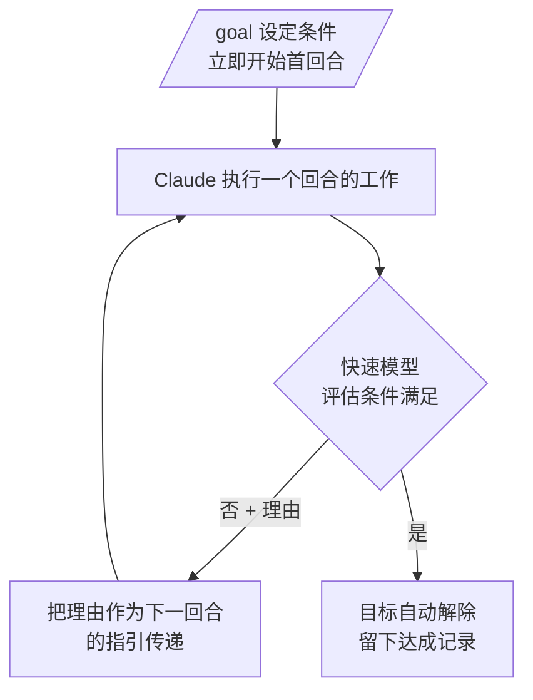

# 目标驱动执行 (/goal)

`/goal` 命令是自主连续执行装置：一次性设定可验证的完成条件后，Claude Code 会在每个回合自行接续工作，直到条件满足。




**一句话总结**：每回合结束时由快速模型判定"条件满足了吗？"，未满足就自动开始下一回合，用户在完成之前无需再次输入提示词。


## 什么是 /goal

`/goal` 设定**完成条件** (completion condition)，让 Claude Code 在条件满足之前无需用户额外输入持续推进工作。每个回合结束后，一个小型快速模型确认条件是否成立；若尚未成立，就不把控制权交还用户，而是自动开始下一回合。条件满足后目标自动解除。

它适合有可验证终止状态的大任务。

- 把模块迁移到新 API，直到所有调用处都能编译且测试通过
- 实现设计文档，直到所有验收标准成立
- 拆分大文件，直到每个文件降到大小预算以下
- 处理带标签的议题积压，直到队列清空

一个会话只能激活一个目标。同一个 `/goal` 命令根据参数分别承担设定、查状态与解除。

## 工作方式

`/goal` 是会话范围的**基于提示的 Stop hook** (prompt-based Stop hook) 的封装。Claude 每完成一个回合，条件与至今为止的对话内容就被传给配置的小型快速模型（默认 **Haiku**）。模型仅凭对话中呈现的内容判定条件是否满足，返回是/否与简短理由。评估者不调用工具、不直接读取文件，只以 Claude 已在对话中展示的内容为依据判断。


```mermaid
flowchart TD
    A[/goal 设定条件<br>立即开始首回合/] --> B[Claude 执行一个回合的工作]
    B --> C{快速模型<br>评估条件满足}
    C -->|否 + 理由| D[把理由作为下一回合<br>的指引传递]
    D --> B
    C -->|是| E[目标自动解除<br>留下达成记录]
```

评估者运行在会话使用的同一提供方上，评估消耗的令牌按小型快速模型计费，相对于本回合成本通常可以忽略。

## 撰写有效条件的方法

评估者仅凭对话中呈现的内容判定，因此条件要写成 Claude 的输出**能够证明**的形态。在长期目标中经得住考验的条件通常具备三个要素。

| 要素 | 说明 | 示例 |
| --- | --- | --- |
| 可度量的终止状态 | 测试结果、构建退出码、文件数量、空队列等 | "所有认证测试通过" |
| 明示的验证方法 | Claude 如何证明 | "`npm test` exits 0" 或 "`git status` is clean" |
| 需遵守的约束 | 路上不能改变的东西 | "no other test file is modified" |

条件最多可写 **4,000 字符** (characters)。

要防止目标无限运转，请在条件中加入回合或时间上限从句。例如写成 `or stop after 20 turns`，Claude 会每回合报告相对该上限的进度，评估者结合对话记录一并判定。

```text
/goal test/auth 的所有测试通过且 lint 阶段干净, or stop after 20 turns
```

设定目标后，无需再发送单独的提示词，条件本身充当指引，首回合立即开始。目标激活期间会显示 `◎ /goal active` 标记，展示目标已运行了多久。

## 查看状态与解除

### 查看状态

不带参数执行 `/goal` 可查看当前状态。

```text
/goal
```

有激活目标时显示条件、运行时间、已评估的回合数、当前令牌用量与评估者最近一次的理由。即便没有激活目标，只要本会话曾达成过目标，也会显示其条件、耗时、回合数与令牌用量。

### 解除目标

要在条件满足之前移除激活目标，执行 `/goal clear`。

```text
/goal clear
```

`stop`、`off`、`reset`、`none`、`cancel` 是 `clear` 的可用别名。执行开启新对话的 `/clear` 也会一并移除激活目标。

### 会话恢复行为

会话结束时仍处于激活状态的目标，在用 `--resume` 或 `--continue` 恢复该会话时会被复原。条件原样延续，但回合数、计时器、令牌用量基线在恢复时全部重置。已达成或已解除的目标不会被复原。

### 非交互执行

`/goal` 在**非交互模式** (headless mode)、桌面应用与远程控制中同样可用。用 `-p` 标志设定目标后，一次调用即可把循环跑到完成。

```bash
claude -p "/goal CHANGELOG.md has an entry for every PR merged this week"
```

要在条件满足之前中断非交互目标，用 `Ctrl+C` 终止进程。

## 与 /moai loop 的比较

`/goal` 与 `/moai loop` 不是竞争而是互补关系。用**由什么启动下一回合**来区分就很清楚。

| 区分 | 下一回合的启动时机 | 终止时机 |
| --- | --- | --- |
| `/goal` | 上一回合结束后 | 快速模型确认条件满足时 |
| `/moai loop` (Ralph Engine) | 诊断周期（LSP·AST-grep·测试·覆盖率）发现剩余工作时 | 所有问题解决或达到最大迭代 |
| Stop hook | 上一回合结束后 | 由用户的脚本或提示决定 |

核心差异如下。

- **`/moai loop`** 是确定性的、由诊断工具主导的修复循环。它已了解项目的质量工具与 SPEC 生命周期，适合"把工具指出的一切都修好"。
- **`/goal`** 是针对对话记录的模型评估循环。它不执行命令、不读文件，只判定 Claude 已呈现的内容，适合"持续到这一状态在对话中显然为真"。

### /moai goal —— 程序化对应物

原生 `/goal` 是只有用户能输入的 TUI 命令，模型或工作流无法代替用户设定目标。MoAI-ADK 用 **`/moai goal`** 填补这一空隙 —— 用 MoAI 自有的 goal 引擎重新实现同样的"声明条件 → 每回合末 Stop-hook 评估 → 满足即解除"语义。声明完成条件后，会话会自主工作直到条件满足或触及回合上限（默认 30），`/moai goal status` 与 `/moai goal clear` 负责查状态与解除。`/moai loop` 是这台 goal 引擎之上的预设 —— 预先填好"直到诊断工具发现的问题队列清空"这一条件的形态。

这种条件声明式循环正是 MoAI-ADK **智能体循环工程**支柱的执行单元。循环运转的记录（多少回合、什么判定、什么失败）作为观察积累，挽具再从这些观察中学习。

## MoAI-ADK 运营时的注意事项

- `/goal` 只是移除每回合的 STOP 提示，并不免除编排器用 `AskUserQuestion` 询问面向用户的实际决策的义务。
- 即使有激活目标，也不能自动绕过从 plan 阶段进入 run 阶段的实现启动批准（用户批准门禁）。run 阶段进入若需用户批准，仍须先询问。
- 目标只决定是否连续推进，不预先批准强制推送或删表这类难以回退的操作。

## 要求

- 需要 Claude Code **v2.1.139** 以上。
- 仅在已接受信任对话框的工作区中工作，因为评估者是 hooks 系统的一部分。
- 任一设置层级开启 `disableAllHooks` 时不可用。
- 组织级托管设置开启 `allowManagedHooksOnly` 时同样不可用。
- 上述条件不满足时，命令不会被静默忽略，而是告知不可用的原因。

## 相关文档

- [动态工作流](/claude-code/agentic/workflows)
- [/moai loop](/utility-commands/moai-loop)

## 参考资料

- [Goal directive (`/goal`) — Claude Code 官方文档](https://code.claude.com/docs/en/goal)


把条件写成 Claude 的输出能够证明的形态，并始终附上 `or stop after N turns` 这样的上限从句。评估者不会亲自读文件，所以比起"测试通过"，写成"`go test ./...` 以 0 退出"这种结果会留在对话记录里的验证方法要稳定得多。

