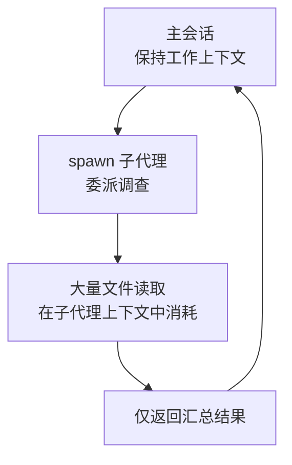

整理在数百万行规模的单一仓库，或拆分为多个包的 monorepo 中高效使用 Claude Code 的方法。


**一句话总结**: 大型代码库 (large codebase) 的核心不在于"读取全部内容"，而在于"只把当前工作触及的部分加载到上下文中"。


## 为什么需要专门的策略

Claude Code 无论规模大小都能工作，但代码库越大，针对小项目调优的默认行为就越容易引发问题。与工作无关的指令和文件读取会塞满上下文窗口 (context window)，浪费 token，最终降低响应质量。

因此，大型代码库的最佳实践 (best practice) 都收敛于一点：**把 Claude 的视野收窄到工作实际触及的区域**。

| 问题 | 收窄手段 |
| --- | --- |
| 单个根 `CLAUDE.md` 承载了所有子系统的规则 | 按目录拆分 `CLAUDE.md` |
| 连不参与工作的包的 `CLAUDE.md` 也被加载 | `claudeMdExcludes` 设置 |
| 生成代码、厂商代码混入搜索结果 | `permissions.deny` 的 `Read` 拒绝规则 |
| 为查找符号定义、调用处而读取大量文件 | 代码智能插件 (LSP) |
| 工作树检出整棵代码树 | `worktree.sparsePaths` 稀疏检出 |

## 决定在哪里启动 Claude

运行 `claude` 的位置，直接决定了文件访问范围以及启动时加载的 `CLAUDE.md` 范围。这是最先要决定的事项。

| 启动位置 | 文件访问 | 启动时加载的 CLAUDE.md | 适用场景 |
| --- | --- | --- | --- |
| 仓库根目录 | 所有文件 | 仅根目录 (下层在读取时按需加载) | 工作跨越多个包或子系统 |
| 子目录 | 仅该子树 | 该目录及所有上级目录 | 工作仅限于某一个包或子系统 |

如果只专注于一个包，仅在该包目录下运行 `claude`，其他包的指令就会被排除在上下文之外。需要注意，`.claude/settings.json` 的项目设置与 `CLAUDE.md` 不同，不会从上级目录继承，只在启动目录加载。

## 上下文管理：只读取需要的部分

在大型代码库中，占用上下文的成本主要有两类：始终加载的指令，以及工作过程中产生的文件读取。两者都需要削减。

### 用按目录的 CLAUDE.md 拆分指令

如果把所有规则都塞进一个根 `CLAUDE.md`，它要么因承载所有子系统的规则而臃肿，要么因过于通用而失去用处。把指令按目录拆分后，Claude 会在仓库全局规则之外，**只加载当前所工作代码的规则**。

```markdown
# packages/api/CLAUDE.md
This package is the REST API server.

- Run tests: `npm test` (uses Vitest)
- Run dev server: `npm run dev` (port 3001)

API routes are in src/routes/. Database queries use Knex in src/db/.
```

在 `packages/api/` 中启动时，根 `CLAUDE.md` 与 `packages/api/CLAUDE.md` 会一起加载，而 `packages/web/` 的指令不会进入上下文。把这些文件提交到仓库，以便团队成员共享。

### 排除无关的 CLAUDE.md

从根目录启动时，子目录的 `CLAUDE.md` 会在读取该处文件的瞬间被加载。对于其他团队的包或遗留代码这类绝不会参与的区域，可以用 `claudeMdExcludes` 直接屏蔽。

```json
{
  "claudeMdExcludes": [
    "**/packages/admin-dashboard/**",
    "**/packages/legacy-*/**"
  ]
}
```

模式以针对绝对路径的通配符 (glob) 进行匹配，因此若要在代码树的任意位置匹配，需以 `**/` 开头。仅供个人使用的话，放在 `.claude/settings.local.json` 即可。但这个列表是静态的，如果你需要每次都修改它（"今天这个包，明天那个包"），那么与其修改排除列表，不如直接在相应的包目录下启动 Claude。

### 屏蔽对生成代码、厂商代码的读取

Claude 的内容搜索默认遵循 `.gitignore`，因此 `node_modules/`、`dist/`、`build/` 无需额外设置就会被排除在搜索结果之外。而对于提交到仓库的厂商 SDK 或生成代码，则用 `permissions.deny` 的 `Read` 拒绝规则来屏蔽。

```json
{
  "permissions": {
    "deny": [
      "Read(./**/dist/**)",
      "Read(./**/*.generated.*)",
      "Read(./vendor/**)"
    ]
  }
}
```

拒绝规则同时覆盖 Claude 的内置文件工具，以及 `cat`、`head`、`grep`、`find` 等可识别的 Bash 文件命令。不过它不会从递归搜索的输出中过滤路径，也无法屏蔽直接打开文件的任意子进程。

## 并行探索：子代理与 Explore

避免把与工作无关的文件堆进上下文的另一种方法，是让探索本身在独立的上下文中进行。在子代理 (sub-agent) 中执行调查，其过程中产生的大量文件读取不会留在主对话里，只有汇总后的结果会返回。



Explore 代理是 Anthropic 内置、专用于只读代码库探索的子代理。当你想了解结构、或查找某个功能位于何处时，与其让主会话亲自读取数十个文件，不如委派给 Explore，从而让主上下文保持干净。

> MoAI-ADK 将这一模式进一步结构化，通过编排让只读调查并行分散到 Explore 或子代理，而由主代理只负责综合。详细的委派策略请参阅 [子代理](/claude-code/agentic/sub-agents) 文档。

## 高效的搜索模式：Glob → Grep → Read

在大型代码库中，搜索顺序本身就左右着 token 效率。从宽泛开始、逐步收窄的渐进式收窄 (progressive narrowing) 是基本原则。

| 步骤 | 工具 | 目的 |
| --- | --- | --- |
| 1 | Glob | 按名称、模式筛选候选文件 |
| 2 | Grep | 按内容收窄匹配文件 (`files_with_matches`) |
| 3 | Grep | 结合上下文行进行精确检查 |
| 4 | Read | 用 `offset`/`limit` 只读取所需区段 |

关键在于：在整体读取文件之前，始终先用搜索定位，然后只对该区段进行局部读取。

### 用代码智能减少文件读取

查找符号的定义或调用处，往往会演变成大量文件读取与 grep 调用。接入代码智能插件 (基于 LSP) 后，Claude 不再扫描代码树，而是直接向语言服务器查询跳转到定义、查找引用、检查类型错误。

```bash
/plugin install typescript-lsp@claude-plugins-official
```

官方市场提供 TypeScript、Python、Go、Rust 等主要语言的插件。每台开发者机器上都需要安装相应语言的语言服务器二进制文件。此功能与 `claudeMdExcludes`、`Read` 拒绝规则配合得很好：前两者把无关内容推出上下文，而代码智能则让 Claude 不再为查找定义而读取剩余区域的文件。

## 收窄工作树范围

`--worktree` 标志会在新的工作树 (worktree) 中启动会话，以便将变更与主检出隔离。默认是整个仓库的检出，但在大型仓库中，可以用 `worktree.sparsePaths` 应用 git 稀疏检出，只把所需目录写入磁盘。

```json
{
  "worktree": {
    "sparsePaths": [".claude", "packages/api", "packages/shared"],
    "symlinkDirectories": ["node_modules"]
  }
}
```

路径与启动目录无关，以仓库根目录为基准。按目录单位列举，而 `package.json` 这类根级文件总是一并检出。这对按子代理隔离工作树尤其有用——每个并行子代理获得的是轻量检出，而非整棵代码树。再搭配 `symlinkDirectories`，就能不复制 `node_modules` 这类大目录，而是用符号链接共享。

## 用渐进式理解与记忆固定项目知识

大型代码库无法一次性理解。把通过探索弄清的结构和规则写入 `CLAUDE.md` 后，这些知识就会固定在上下文中，而无需每个会话重新发现。

- **根 `CLAUDE.md`**: 编码规范、提交约定、仓库布局等处处适用的规则
- **按目录的 `CLAUDE.md`**: 针对该区域技术栈的专门规则 (monorepo 中按包划分，单一代码树中按 `src/db/`、`src/api/` 这类子系统划分)

也有保持 `CLAUDE.md` 最新的实践方法。在拉取请求中像其他文档变更一样一并评审；在主要模型发布之后，重新审视那些为绕过旧模型局限而加入的规则。还可以设置 `Stop` hook，让会话结束时提出 `CLAUDE.md` 的更新建议。

### 处理跨包变更

当变更跨越多个包时——比如同时修改共享类型及其所有调用处——有两点会有帮助。

1. **把整个变更交给一个会话**: 把共享编辑与调用处一并处理，可以让每处编辑的决策依据保持一致，而不必在每个包中重新推导。
2. **编辑前把计划保存为文件**: 先制定计划，再把该计划保存为 markdown 文件。长会话会在中途压缩 (compaction) 上下文，因此即使对话记录消失，已保存的计划仍能保留。

## 相关文档

- [子代理](/claude-code/agentic/sub-agents)
- [上下文窗口](/claude-code/context-memory/context-window)

## 参考资料

- [Set up Claude Code in a monorepo or large codebase](https://code.claude.com/docs/en/large-codebases)


实战技巧：开始新工作时，先确定"这项工作触及哪个目录"，并尽量在该目录下运行 `claude`。仅仅把启动位置选对，就能自动将无关的 `CLAUDE.md` 和文件读取排除出上下文。

