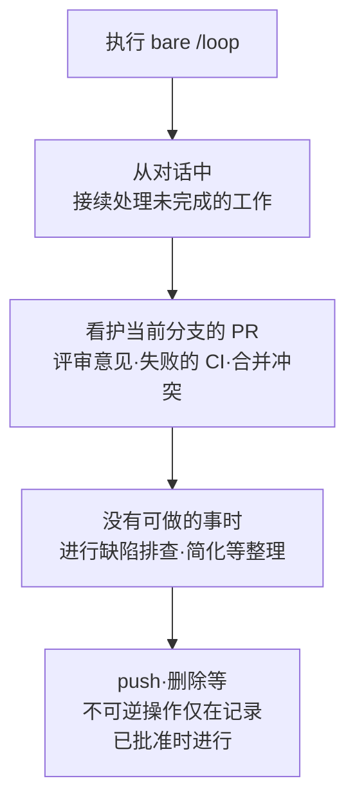

# 定时任务

Claude Code 的定时任务 (scheduled tasks) 让你在同一个会话保持打开期间，按固定周期重新执行提示词。


**一句话总结**: 一种绑定到会话的轻量自动化，把部署轮询、PR 看护、定期检查交给 `/loop` 和 cron 工具，无需每次都人工输入。


定时任务在 Claude Code v2.1.72 及以上版本可用。请用 `claude --version` 确认版本。

## 什么是定时任务

定时任务是一种按固定周期自动重新执行单条提示词的机制。可用于轮询部署是否完成、看护 PR、重新查看耗时较长的构建，或提醒自己稍后要做的事。

最重要的特性是它属于**会话作用域 (session-scoped)**。任务只在当前对话内存活，一旦开启新对话便全部消失。如果用 `--resume` 或 `--continue` 接续打开会话，尚未过期的任务会被恢复。

| 特性 | 行为 |
| --- | --- |
| 运行位置 | 本机（在打开的会话内） |
| 触发时机 | Claude 的回合与回合之间、处于空闲状态时 |
| 生命周期 | 绑定到当前对话，开启新对话时消亡 |
| 恢复 | `--resume` / `--continue` 时仅恢复未过期任务 |
| 最小间隔 | 1 分钟（cron 的 1 分钟粒度） |

该功能是轮询的替代工具。如果需要在事件发生的瞬间作出反应，请用 Channels 代替轮询，让 CI 把失败直接推送到会话；如果想让它每个回合持续工作直到满足条件，请用 `/goal` 代替周期执行。

## 使用场景

定时任务最适合在会话打开期间短促重复的工作。

| 场景 | 示例提示词 | 效果 |
| --- | --- | --- |
| 定期检查 | `/loop 5m check if the deployment finished` | 每 5 分钟确认部署是否完成 |
| 发布跟踪 | `/loop check whether CI passed and address any review comments` | 以自适应间隔跟踪 CI 和评审意见 |
| 报告生成 | `/loop 1h summarize new commits on main` | 按固定周期撰写摘要报告 |
| 一次性提醒 | `remind me at 3pm to push the release branch` | 在指定时刻仅提醒一次后自动删除 |

你也可以在每次迭代时重新执行已打包的工作流。例如，像 `/loop 20m /review-pr 1234` 那样，在提示词的位置传入其他命令即可。

## 创建与管理概览

### 用 /loop 反复执行

`/loop` 是一个内置 **技能 (bundled skill)**，是在保持会话打开的同时反复执行提示词的最快方式。间隔和提示词都是可选的，行为会根据你传入的内容而变化。

| 传入的值 | 示例 | 行为 |
| --- | --- | --- |
| 间隔 + 提示词 | `/loop 5m check the deploy` | 按固定周期执行 |
| 仅提示词 | `/loop check the deploy` | Claude 在每次迭代时自行选择间隔 |
| 仅间隔或什么都不传 | `/loop` | 执行内置维护提示词或 `loop.md` |

传入间隔时，Claude 会将其转换为 cron 表达式并注册任务，同时确认周期和任务 ID。间隔可以像 `30m` 那样放在前面，也可以像 `every 2 hours` 那样放在后面。支持的单位为 `s`（秒）、`m`（分）、`h`（小时）、`d`（天）。由于 cron 是 1 分钟粒度，秒级会被向上取整；像 `7m` 或 `90m` 这样不能整除的间隔会被四舍五入到最接近的单位，随后告知你最终定为何值。

如果省略间隔，Claude 不会使用固定 cron，而是在每次迭代时动态选取 1 分钟到 1 小时之间的延迟。当构建接近完成或 PR 活跃时等待较短，当没有任何待处理事项时等待较长。

```text
/loop check whether CI passed and address any review comments
```

### 内置维护提示词

省略提示词时，Claude 会使用内置维护提示词。每次迭代按以下顺序处理工作。



`bare /loop` 以动态间隔执行此提示词，加上间隔（如 `/loop 15m`）则按固定周期执行。

### 用 loop.md 替换默认提示词

放置一个 `loop.md` 文件，会用你的指令替换内置维护提示词。该文件为 `bare /loop` 定义单一的默认提示词，当你在命令行直接传入提示词时会被忽略。

| 路径 | 范围 |
| --- | --- |
| `.claude/loop.md` | 项目级别。两个文件都存在时优先 |
| `~/.claude/loop.md` | 用户级别。没有项目文件时适用 |

该文件是没有固定结构的普通 Markdown。就像直接输入 `/loop` 提示词那样书写。

```markdown
Check the `release/next` PR. If CI is red, pull the failing job log,
diagnose, and push a minimal fix. If new review comments have arrived,
address each one and resolve the thread. If everything is green and
quiet, say so in one line.
```

对 `loop.md` 的修改从下一次迭代起生效，因此即使循环正在运行也可以打磨指令。超过 25,000 字节的内容会被截断。

### 一次性提醒

只执行一次的提醒，用自然语言描述而非 `/loop`。Claude 会注册一个执行一次后自删的单发任务，并把执行时刻固定到具体的分与时来告知你。

```text
in 45 minutes, check whether the integration tests passed
```

### 查看与取消任务列表

任务的查询和取消同样可以用自然语言请求。在内部，Claude 使用以下 cron 工具。

| 工具 | 用途 |
| --- | --- |
| `CronCreate` | 注册新任务。接收 5 字段 cron 表达式、要执行的提示词，以及重复/单发的标志 |
| `CronList` | 列出所有定时任务及其 ID、计划和提示词 |
| `CronDelete` | 按 ID 取消任务 |

每个任务都有一个可传给 `CronDelete` 的 8 字符 ID，单个会话最多可持有 50 个任务。要停止待执行的 `/loop`，按 `Esc`。用自然语言预定的任务不受 `Esc` 影响，会一直保留到你删除为止。

### 运行机制与限制

调度器每秒检查到期任务并以低优先级入队，预定的提示词在回合与回合之间执行，而非在响应过程中。所有时刻都按本地时区解释，因此 `0 9 * * *` 表示运行 Claude Code 所在地的上午 9 点，而非 UTC。

- **抖动 (jitter)**: 为避免多个会话在同一瞬间冲击 API，会加上一个由任务 ID 派生的确定性偏移。重复任务可能在预定时刻之后最多 30 分钟触发，整点·半点的单发任务可能提前最多 90 秒触发。如果需要精确的时机，请选择 `:00` 或 `:30` 之外的分钟。
- **七天过期 (seven-day expiry)**: 重复任务在创建后 7 天最后触发一次，随后自删。
- **不补偿遗漏**: 若在 Claude 因长请求而繁忙期间预定时刻已过，任务会在变为空闲时仅触发一次，不会按错过的次数进行补偿。

要关闭整个调度器，请设置环境变量 `CLAUDE_CODE_DISABLE_CRON=1`。这会使 cron 工具和 `/loop` 不可用，并让已预定的任务停止触发。

## 与非交互 (headless) 执行的衔接

定时任务只在会话打开且空闲时触发。因此，对于即使机器关机或没有会话也要运行的无人值守自动化，它并不适用。这种情况下应使用单独的持久调度选项。

| 选项 | 运行位置 | 机器需开机 | 需打开会话 |
| --- | --- | --- | --- |
| `/loop` | 本机 | 需要 | 需要 |
| Desktop 定时任务 | 本机 | 需要 | 不需要 |
| Routines (cloud) | Anthropic 云 | 不需要 | 不需要 |
| GitHub Actions | CI | 不需要 | 不需要 |

通过在 CI 流水线或 GitHub Actions 的 `schedule` 触发器中以非交互方式调用 `claude -p`，可以构建不绑定会话的 cron 自动化。归纳起来：会话内的快速轮询用 `/loop`，需要本地文件·工具访问的无人值守工作用 Desktop 定时任务，需要与机器无关地可靠运行的工作用 Routines。

从 MoAI-ADK 的视角看，最佳实践是把 `/loop` 轻量地用于 SPEC 实现过程中的 PR 检查或 CI 状态跟踪，而将定期发布跟踪这类无人值守工作分离到 GitHub Actions 一侧的调度中。

## 相关文档

- [钩子 (Hooks)](/claude-code/extensibility/hooks)
- [目标导向执行 (/goal)](/claude-code/agentic/goal)

## 参考资料

- [Run prompts on a schedule (Claude Code Docs)](https://code.claude.com/docs/en/scheduled-tasks)


固定周期的 `/loop` 会在 7 天后自动过期，因此若需要运行更久，更稳妥的做法是在过期前重新注册，或从一开始就选择 Routines·Desktop 定时任务这类持久调度。

