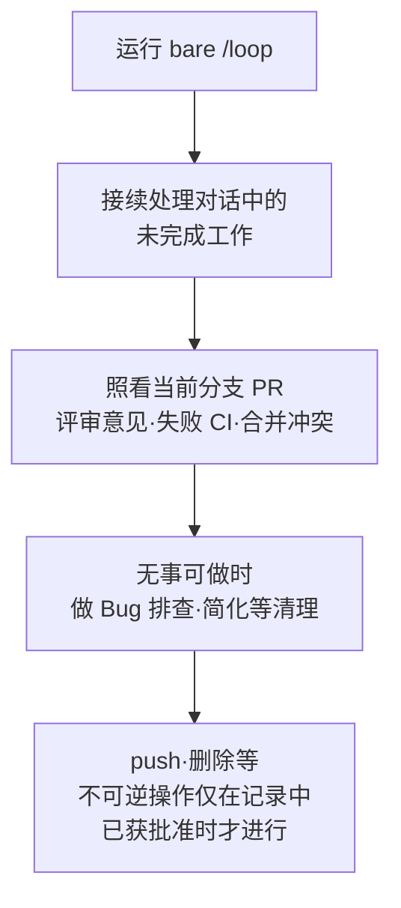

# 定时任务

Claude Code 的定时任务 (scheduled tasks) 是在同一会话保持打开期间、让提示词按既定周期重新执行的功能。


**一句话总结**：把部署轮询、照看 PR、定期巡检交给 `/loop` 与 cron 工具而不必每次人工输入 —— 一种绑定于会话的轻量自动化。


定时任务在 Claude Code **v2.1.72** 以上可用。用 `claude --version` 确认版本。

## 什么是定时任务

定时任务是把一条提示词按固定周期自动重新执行的装置。用于轮询部署是否完成、照看 PR、回头查看耗时的构建，或提醒稍后要做的事。

最重要的性质是**会话范围 (session-scoped)**。任务只在当前对话内存活，开启新对话时全部消失。用 `--resume` 或 `--continue` 续开会话时，尚未过期的任务会被恢复。

| 性质 | 行为 |
| --- | --- |
| 执行位置 | 我的机器（打开的会话内） |
| 触发时机 | Claude 的回合与回合之间、空闲时 |
| 生命周期 | 绑定当前对话，开启新对话即消亡 |
| 恢复 | `--resume` / `--continue` 时仅恢复未过期任务 |
| 最小间隔 | **1 分钟**（cron 以分钟为单位） |
| 最大任务数 | 每会话 50 个 |

这项功能是会话级轻量轮询的替代工具。与其他调度选项比较：

| 选项 | 执行位置 | 最小间隔 | 需要会话 | 必须开机 |
| --- | --- | --- | --- | --- |
| `/loop` | 我的机器 | **1 分钟** | 需要 | 需要 |
| Cloud Routines | Anthropic 云 | 1 小时 | 不需要 | 不需要 |
| Desktop 定时任务 | 我的机器 | 1 分钟 | 不需要 | 需要 |

若需要事件发生时立即反应，就不用轮询而让 Channels 把 CI 失败直接推入会话；若要让它每回合持续工作直到条件满足，就用 `/goal` 而非周期执行。

## 使用场景

定时任务最适合会话打开期间的短周期重复工作。

| 场景 | 示例提示词 | 效果 |
| --- | --- | --- |
| 定期巡检 | `/loop 5m check if the deployment finished` | 每 5 分钟确认部署是否完成 |
| 发布追踪 | `/loop check whether CI passed and address any review comments` | 以自适应间隔追踪 CI 与评审意见 |
| 报告生成 | `/loop 1h summarize new commits on main` | 按固定周期撰写摘要报告 |
| 一次性提醒 | `remind me at 3pm to push the release branch` | 在指定时刻仅提醒一次后自动删除 |

也可以每次迭代都重新执行打包好的工作流。例如像 `/loop 20m /review-pr 1234` 那样在提示词位置传入另一个命令。

## 创建与管理概览

### 用 /loop 重复执行

`/loop` 是保持会话打开、反复执行提示词的最快方式，是一个捆绑**技能** (bundled skill)。间隔与提示词都是可选的，给什么就有不同的行为。

| 给的值 | 示例 | 行为 |
| --- | --- | --- |
| 间隔 + 提示词 | `/loop 5m check the deploy` | 按固定周期执行 |
| 只给提示词 | `/loop check the deploy` | Claude 在每次迭代自行选择间隔 |
| 只给间隔或什么都不给 | `/loop` | 执行内置维护提示词或 `loop.md` |

给出间隔时，Claude 会把该值转换成 cron 表达式登记任务，并确认周期与任务 ID。间隔可以放在前面（如 `30m`），也可以放在后面（如 `every 2 hours`）。支持的单位是 `s`（秒）、`m`（分）、`h`（时）、`d`（天）。cron 以分钟为单位，秒会向上取整；`7m` 或 `90m` 这类不整齐的间隔会四舍五入到最近的单位，并告知最终定为多少。

省略间隔时，Claude 不用固定 cron，而是在每次迭代动态选择 1 分钟到 1 小时之间的延迟。构建快结束或 PR 活跃时等得短，无事可等时等得长。

```text
/loop check whether CI passed and address any review comments
```

### 内置维护提示词

省略提示词时，Claude 使用内置维护提示词。每次迭代按以下顺序处理工作。


```mermaid
flowchart TD
    A["运行 bare /loop"] --> B["接续处理对话中的<br>未完成工作"]
    B --> C["照看当前分支 PR<br>评审意见·失败 CI·合并冲突"]
    C --> D["无事可做时<br>做 Bug 排查·简化等清理"]
    D --> E["push·删除等<br>不可逆操作仅在记录中<br>已获批准时才进行"]
```

`bare /loop` 以动态间隔执行这份提示词，加上间隔（如 `/loop 15m`）则按固定周期执行。

### 用 loop.md 替换默认提示词

放置 `loop.md` 文件即可用自己的指令替换内置维护提示词。该文件定义 `bare /loop` 的单一默认提示词，命令行直接给出提示词时会被忽略。

| 路径 | 范围 |
| --- | --- |
| `.claude/loop.md` | 项目级。两个文件同时存在时优先 |
| `~/.claude/loop.md` | 用户级。项目文件不存在时生效 |

文件是无固定结构的普通 Markdown，像直接输入 `/loop` 提示词那样撰写即可。

```markdown
Check the `release/next` PR. If CI is red, pull the failing job log,
diagnose, and push a minimal fix. If new review comments have arrived,
address each one and resolve the thread. If everything is green and
quiet, say so in one line.
```

对 `loop.md` 的修改从下一次迭代开始生效，因此循环运转中也能打磨指令。超过 25,000 字节的内容会被截断。

### 一次性提醒

只执行一次的提醒不用 `/loop`，而用自然语言描述。Claude 会登记一个执行一次后自我删除的单发任务，并把执行时刻固定到特定的分·时告知您。

```text
in 45 minutes, check whether the integration tests passed
```

### 查看与取消任务列表

任务的查询与取消也用自然语言请求即可。Claude 内部使用以下 cron 工具。

| 工具 | 用途 |
| --- | --- |
| `CronCreate` | 登记新任务。接收 5 字段 cron 表达式、执行提示词、重复/单发标志 |
| `CronList` | 列出所有定时任务及其 ID·日程·提示词 |
| `CronDelete` | 按 ID 取消任务 |

每个任务有可传给 `CronDelete` 的 8 字符 ID，一个会话最多可持有 50 个任务。要停止等待中的 `/loop`，按 `Esc`。用自然语言预约的任务不受 `Esc` 影响，删除之前一直存在。

### 工作方式与约束

调度器每秒检查到期任务并以低优先级入队，被调度的提示词在回合与回合之间执行，而非回应途中。所有时刻按本地时区解读，因此 `0 9 * * *` 指的是 Claude Code 运行所在地的上午 9 点，而非 UTC。

- **抖动 (jitter)**：为避免多个会话在同一瞬间冲击 API，会加上由任务 ID 推导的确定性偏移。重复任务可能比预定时刻最多晚 **30 分钟**触发，一次性任务可能最多提前 **90 秒**触发。需要精确时刻时，选一个不是 `:00` 或 `:30` 的分钟。
- **7 天过期**：重复任务在创建 7 天后最后触发一次，随后**自动删除**。
- **不补跑漏掉的次数**：Claude 忙于长请求期间错过预定时刻时，空闲后只触发一次，不会按错过的次数补跑。

要完全关闭调度器，设置环境变量 `CLAUDE_CODE_DISABLE_CRON=1`。此后 cron 工具与 `/loop` 不可用，已预约的任务也停止触发。

## 与非交互 (headless) 执行的衔接

定时任务只在会话打开且空闲时触发，因此不适合机器关机或无需会话也要运转的无人值守自动化。这类情形使用单独的持久调度选项。

| 选项 | 执行位置 | 需要开机 | 需要打开的会话 |
| --- | --- | --- | --- |
| `/loop` | 我的机器 | 需要 | 需要 |
| Desktop 定时任务 | 我的机器 | 需要 | 不需要 |
| Routines (cloud) | Anthropic 云 | 不需要 | 不需要 |
| GitHub Actions | CI | 不需要 | 不需要 |

在 CI 流水线或 GitHub Actions 的 `schedule` 触发器中非交互调用 `claude -p`，即可构成不绑定会话的 cron 自动化。总结：会话内的快速轮询用 `/loop`，需要本地文件·工具访问的无人任务用 Desktop 定时任务，必须与机器无关地可靠运转的任务用 Routines。

从 MoAI-ADK 的视角看，定时任务是自主执行谱系的一条轴 —— 每回合持续工作直到条件满足的是 `/goal`（以及 MoAI 的 `/moai goal`），按既定周期回头查看的是 `/loop` 的职责。实战中的最佳实践是把 `/loop` 轻量用于 SPEC 实现期间的 PR 巡检或 CI 状态追踪，把定期发布追踪这类无人任务分离到 GitHub Actions 侧调度。也别忘了周期执行的每次迭代都消耗令牌 —— 轮询间隔就是成本旋钮。

## 相关文档

- [钩子 (Hooks)](/claude-code/extensibility/hooks)
- [目标驱动执行 (/goal)](/claude-code/agentic/goal)

## 参考资料

- [Scheduled tasks — Claude Code 官方文档](https://code.claude.com/docs/en/scheduled-tasks)


固定周期的 `/loop` 会在 7 天后自动过期，若需要运转更久，请在过期前重新登记，或从一开始就选择 Routines·Desktop 定时任务这样的持久调度更为稳妥。

