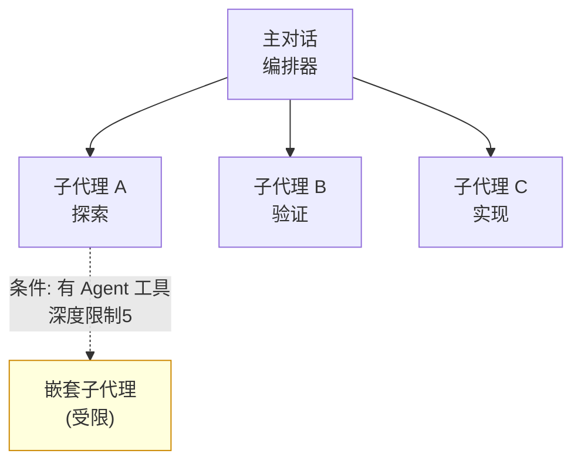

Claude Code 的子代理是一种委派型工作者，它在独立的上下文窗口中处理旁支任务，只把结果摘要返回主对话。


**一句话总结**: 子代理是一种委派型工作者，它在自己专属的上下文中处理探索、验证等旁支任务，只返回摘要，从而让主对话保持干净整洁。



本页是 Claude Code 层面的概念概要。关于 MoAI-ADK 如何组织和委派其 8 个代理目录，以及如何亲手创建代理的实战方法，[代理指南](/advanced/agent-guide) 和 [构建器代理指南](/advanced/builder-agents) 会做深入讲解。


## 什么是子代理

子代理是专门负责某一类特定工作的特化型 AI 工作者。当出现可能让主对话被搜索结果、日志、文件内容淹没的旁支任务时，子代理会在**自己专属的上下文窗口** (own context window) 中处理该任务，只返回结果摘要。

每个子代理都独立拥有以下内容。

| 构成要素 | 说明 |
|-----------|------|
| 系统提示 | 子代理文件正文会直接成为其角色指令 |
| 工具访问权限 | 可通过允许/阻止列表限制可用工具 |
| 独立权限 | 继承主对话的权限，但可施加额外限制 |
| 模型选择 | 可使用 `haiku` 等快速且廉价的模型来降低成本 |

Claude 会查看每个子代理的 `description` 来判断何时进行委派。因此，把描述写得清晰明确正是优质委派的起点。

Claude Code 内置了以下子代理。

| 代理 | 特征 |
|---------|------|
| **Explore** | 只读代码库探索 (Haiku, 迅速)；thoroughness 选项可选 quick/medium/very-thorough |
| **Plan** | 规划模式调研 (只读) |
| **general-purpose** | 全工具访问，既可探索又可修改 |

Explore 和 Plan 会跳过主会话的 CLAUDE.md 和 git status，运行更快更轻。

## 核心约束：子代理不能 spawn 子代理

这是最重要的结构性约束。**子代理不能 spawn 其他子代理** (subagents cannot spawn other subagents)。也就是说，委派只能从主对话向下一层，不会发生无限嵌套。

### v2.1.172 之后：受限嵌套（深度 5 极限）

Claude Code v2.1.172 之后，**条件性子代理嵌套**成为可能。但有设置选项。

| 设置 | 行为 | 使用 |
|------|------|------|
| 子代理定义中包含 `Agent` (frontmatter `tools:` 列表) | 允许嵌套 | 深度最多 5 (硬限制) |
| 省略 `Agent` 工具 | 禁止嵌套 | 仅平面编排 |

这一约束也是 MoAI-ADK 编排设计的根基。**仅编排器（主会话）才能调用子代理**，被调用的代理无法再向他人委派。因此它遵循一种扁平结构：不采用分层式的代理链，而是**由编排器直接调用每一个步骤**。



内置 `Plan` 子代理之所以单独存在，原因也在于此：在规划模式需要上下文时，可以在不绕过该约束的前提下执行调研。

## 后台权限提示（v2.1.186）

当在后台运行子代理时（`background: true`），遇到需要权限的工具时（例如 Bash、WebFetch）：

- **v2.1.186 之前**：自动拒绝（无权限提示）
- **v2.1.186 之后**：**主会话会显示提示**（Esc 可仅拒绝该调用）

因此，在启动长时间后台任务前，最好先把所需工具加入 `settings.json` 的允许列表。

## 何时使用

子代理在以下情形下效果显著。

| 情形 | 效果 |
|------|------|
| 并行探索 | 同时调查多个文件、目录，只汇集摘要 |
| 独立验证 | 在不受主对话偏见影响的独立上下文中核查结果 |
| 上下文隔离 | 将大量日志、搜索结果与主对话隔离开来 |
| 成本控制 | 将简单任务路由到 `haiku` 等快速模型 |

反之，如果是一次响应即可完成的任务，或者是跨多个步骤、**需要共享上下文的任务**，那么不委派、直接在主对话中处理会更合适。

## 定义方法概要

子代理通过带有 YAML 前置元数据的 Markdown 文件来定义。既可以用 `/agents` 命令交互式生成，也可以直接手写文件。

```markdown
---
name: code-reviewer
description: 审查代码品质和最佳实践
tools: Read, Glob, Grep
model: sonnet
---

你是代码审查员。被调用时，你会分析代码并
为代码品质、安全和最佳实践提供具体且可执行的反馈。
```

### 必填字段

- `name` — 子代理名称（委派时参考）
- `description` — 何时应该委派（Claude 仅根据此判断）

### 可选字段

| 字段 | 功能 |
|------|------|
| `tools` | 允许的工具（逗号分隔列表） |
| `disallowedTools` | 阻止的工具（替代允许列表使用） |
| `model` | 模型选择：`sonnet`、`opus`、`haiku`、`fable`，或特定模型 ID；默认 `inherit`（主会话模型） |
| `permissionMode` | 工具权限默认值 (default, plan, acceptEdits, bypass) |
| `maxTurns` | 最大轮数限制 |
| `skills` | 加载的默认技能 |
| `mcpServers` | 连接的 MCP 服务器 |
| `hooks` | 调用的 Hook 事件 |
| `memory` | 内存范围 (user, project, local) |
| `background` | `true` 时在后台运行 |
| `effort` | 推理强度 (low, medium, high, xhigh, max) |
| `isolation: worktree` | 在隔离的仓库副本中工作 |
| `color` | 代理视图中显示的颜色 |
| `initialPrompt` | 首次 spawn 子代理时的提示 |

存储位置决定了适用范围。

| 位置 | 范围 |
|------|------|
| `.claude/agents/` | 当前项目（纳入版本管理以便与团队共享） |
| `~/.claude/agents/` | 我的所有项目 |
| 插件的 `agents/` | 插件被启用的位置 |

### 不能使用 AskUserQuestion

`AskUserQuestion` 这类用户交互工具无法在子代理中使用（非对称边界）。这正是在 MoAI-ADK 中子代理无法直接向用户提问，而是向编排器返回阻塞报告的原因。

## `/fork` — 会话分叉

用 `/fork <directive>` 命令可以分叉当前会话。分叉出的子代理会：

- 继承当前对话内容
- 利用父级的提示缓存
- 朝新方向探索

## 深入请看 MoAI 代理指南

以上就是 Claude Code 层面的子代理概念。关于 MoAI-ADK 如何在这一机制之上运营某种代理目录、如何委派 Plan-Run-Sync 工作流的各个步骤，以及如何为各项目生成领域专家代理，下面的进阶指南会做讲解。

## 相关文档

- [代理指南](/advanced/agent-guide)
- [构建器代理指南](/advanced/builder-agents)

## 参考资料

- [Create custom subagents (Claude Code 官方文档)](https://code.claude.com/docs/en/sub-agents)


创建子代理时，从"何时应委派"的角度具体描述 `description`。Claude 仅根据此描述判断是否委派，所以描述模糊的话，即使工具再好也不会被调用。

