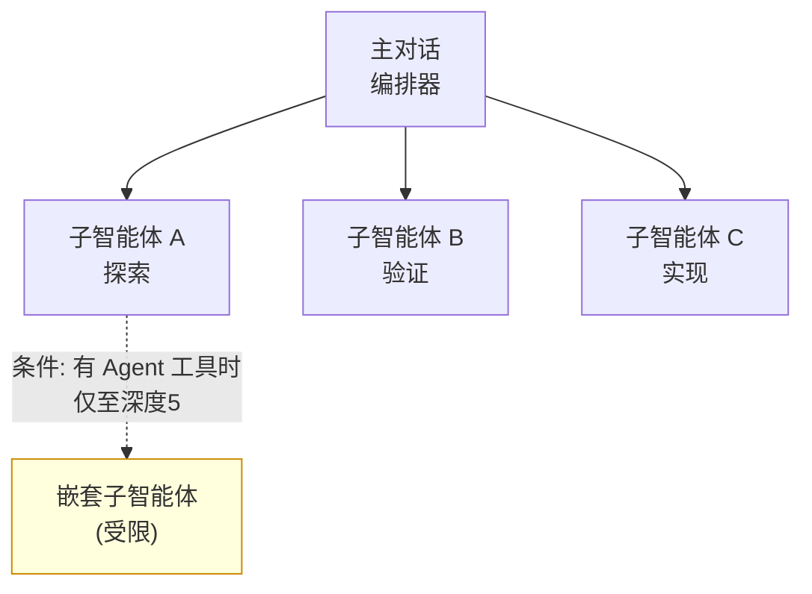

# 子智能体

Claude Code 的子智能体是在独立的上下文窗口中处理旁支任务、只把结果摘要返回主对话的委派工作者。


**一句话总结**：子智能体在自己的上下文中处理探索·验证这类旁支工作、只返回摘要，是让主对话保持干净的委派帮手。



本页是 Claude Code 层面的概念概览。MoAI-ADK 如何构成与委派 11 个智能体目录（10 个 MoAI 自定义 + 1 个 Anthropic 内置 `Explore`），以及亲手创建智能体的实战方法，在[智能体指南](/advanced/agent-guide)与[构建者智能体指南](/advanced/builder-agents)中深入讲解。


## 什么是子智能体

子智能体是专责某类工作的特化 AI 工作者。当出现会让主对话被搜索结果、日志、文件内容淹没的旁支任务时，那项工作由子智能体在**自己的上下文窗口** (own context window) 中处理，只把结果摘要送回。

每个子智能体独立拥有以下要素。

| 组成要素 | 说明 |
|-----------|------|
| 系统提示 | 子智能体文件的正文直接充当角色指令 |
| 工具访问权限 | 可用允许/拦截列表限制可用工具 |
| 独立权限 | 继承主对话权限，并可施加额外限制 |
| 模型选择 | 可选 `haiku` 这类快而便宜的模型降低成本 |

Claude 通过查看各子智能体的 `description` 判断何时委派。因此把说明写清楚，就是良好委派的起点。

Claude Code 包含以下内置子智能体。

| 智能体 | 特点 |
|---------|------|
| **Explore** | 只读代码库探索（Haiku，快速）；可用 thoroughness 选项选择 quick/medium/very-thorough |
| **Plan** | 计划模式调研（只读） |
| **general-purpose** | 可访问所有工具，探索与修改皆可 |

Explore 与 Plan 跳过主会话的 CLAUDE.md 和 git status，运行得更快更轻。

## 核心约束：子智能体不能孵化子智能体

这是最重要的结构性约束。**子智能体不能孵化其他子智能体** (subagents cannot spawn other subagents)。也就是说委派只从主对话下沉一级，不会发生无限嵌套。

### v2.1.172 之后：受限嵌套（深度 5 上限）

自 Claude Code v2.1.172 起，**有条件的子智能体嵌套**成为可能。但存在配置选项。

| 配置 | 行为 | 使用 |
|------|------|------|
| 子智能体定义中含 `Agent`（frontmatter `tools:` 列表） | 允许嵌套 | 最深至深度 5（硬上限） |
| 省略 `Agent` 工具 | 禁止嵌套 | 仅能扁平编排 |

这一约束也是 MoAI-ADK 编排设计的根基。**只有编排器（主会话）能调用子智能体**，被调用的智能体在未触及深度上限时可再向他人委派。因此采用**编排器直接调用每个阶段**的扁平结构，而非层级式智能体链（MoAI 的基本原则）。


```mermaid
flowchart TD
    M[主对话<br/>编排器] --> A[子智能体 A<br/>探索]
    M --> B[子智能体 B<br/>验证]
    M --> C[子智能体 C<br/>实现]
    A -.->|条件: 有 Agent 工具时<br/>仅至深度5| X["嵌套子智能体<br/>(受限)"]
    style X fill:#ffd,stroke:#c80
```

内置 `Plan` 子智能体单独存在的原因也在于此 —— 计划模式需要上下文时，在不绕过这一约束的前提下执行调研。

## 后台权限提示 (v2.1.186)

以后台运行子智能体（`background: true`）时，遇到需要权限的工具（例如 Bash、WebFetch）：

- **v2.1.186 之前**：自动拒绝（无权限提示）
- **v2.1.186 之后**：**提示显示在主会话中**（按 Esc 可仅拒绝该次调用）

因此在启动长时间后台任务之前，最好预先把所需工具加入 `settings.json` 的允许列表。

## 何时使用

子智能体在以下情形效果最大。

| 情形 | 效果 |
|------|------|
| 并行探索 | 同时调查多个文件·目录，只收集摘要 |
| 独立验证 | 不受主对话偏见影响，在独立上下文中核查结果 |
| 上下文隔离 | 把大量日志·搜索结果隔离在主对话之外 |
| 成本控制 | 把简单任务路由到 `haiku` 这类快速模型 |

反之，若是一次回应就能完成的工作，或是跨多个步骤**需要共享上下文的工作**，不委派、在主对话中直接处理更好。

## 定义方法概览

子智能体以带 YAML frontmatter 的 Markdown 文件定义。既可以用 `/agents` 命令交互式创建，也可以直接编写文件。

```markdown
---
name: code-reviewer
description: 评审代码质量与最佳实践
tools: Read, Glob, Grep
model: sonnet
---

你是代码评审员。被调用时分析代码，
就质量·安全·最佳实践给出具体且可执行的反馈。
```

### 必填字段

- `name` —— 子智能体名称（委派时引用）
- `description` —— 说明何时应当委派（Claude 仅凭此判断）

### 可选字段

| 字段 | 功能 |
|------|------|
| `tools` | 允许的工具（逗号分隔列表） |
| `disallowedTools` | 拦截的工具（可代替允许列表使用） |
| `model` | 模型选择：`sonnet`、`opus`、`haiku`、`fable`，或特定模型 ID；默认值 `inherit`（主会话模型） |
| `permissionMode` | 工具权限默认值（default、plan、acceptEdits、bypass） |
| `maxTurns` | 最大回合数限制 |
| `skills` | 要加载的默认技能 |
| `mcpServers` | 要连接的 MCP 服务器 |
| `hooks` | 要调用的 Hook 事件 |
| `memory` | 记忆范围（user、project、local） |
| `background` | 为 `true` 时后台运行 |
| `effort` | 推理强度（low、medium、high、xhigh、max） |
| `isolation: worktree` | 在隔离的仓库副本中工作 |
| `color` | 智能体视图中显示的颜色 |
| `initialPrompt` | 子智能体首次孵化时的提示词 |

存放位置决定适用范围。

| 位置 | 范围 |
|------|------|
| `.claude/agents/` | 当前项目（纳入版本管理与团队共享） |
| `~/.claude/agents/` | 我的所有项目 |
| 插件的 `agents/` | 插件被启用之处 |

### 不能使用 AskUserQuestion

`AskUserQuestion` 这类用户交互工具不能在子智能体中使用（非对称边界）。这就是在 MoAI-ADK 中子智能体不能直接向用户提问、而是向编排器返回 blocker report 的原因。

## `/fork` —— 会话分叉

可用 `/fork <directive>` 命令分叉当前会话。被分叉的子智能体：

- 继承当前对话内容
- 利用父级的提示缓存
- 朝新方向探索

## 深入请看 MoAI 智能体指南

以上是 Claude Code 层面的子智能体概念。MoAI-ADK 在这套机制之上运营**11 个智能体的目录** —— Manager 系列（manager-spec / manager-develop / manager-docs / manager-git / manager-design）负责 plan→run→sync 生命周期，Evaluator 系列（plan-auditor / sync-auditor）负责独立审计，builder-harness 负责生成挽具脚手架，super-advisor 负责高推理咨询，e2e-specialist 负责网页/移动/桌面的 E2E 测试执行，Anthropic 内置的 `Explore` 负责只读探索。计划与审计相互分离 —— 制造者不自我检查 —— 是这份目录的核心设计。为每个智能体声明式地分配契合工作性质的模型与推理深度 (effort)，正是代币经济学"计划要深、实现要省、验证要独立"的原则。详情见下方的深入指南。

## 相关文档

- [智能体指南](/advanced/agent-guide)
- [构建者智能体指南](/advanced/builder-agents)

## 参考资料

- [Create custom subagents（Claude Code 官方文档）](https://code.claude.com/docs/en/sub-agents)


创建子智能体时，请从"何时应当委派"的角度把 `description` 写具体。Claude 仅凭这段说明判断是否委派，说明含糊的话，再好的工具也不会被调用。

