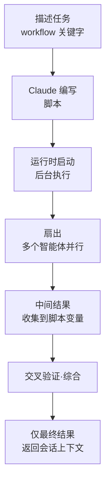

动态工作流 (dynamic workflow) 是 Claude Code 的一种执行原语 (primitive)：由 Claude 亲自编写的 JavaScript 脚本在后台编排数十至数百个子智能体，规模超出单次对话所能协调的范围。


**一句话总结**：如果说子智能体和智能体团队把"计划放在 Claude 的脑子里"，那么动态工作流则把"计划搬进脚本代码里"，一次性运行大规模扇出。


## 什么是动态工作流

动态工作流是一段 **由你描述任务、Claude 直接编写的** (JavaScript 脚本)，运行时会在与对话分离的后台执行这段脚本。由于脚本持有全部循环、分支和中间结果，会话的上下文窗口只会收到最终答案。

关键并非简单地"运行更多智能体"，而是 **把计划搬进代码** (moving the plan into code)。由此可以实现：

- 独立的智能体对彼此的结果进行对抗式 (adversarial) 交叉验证后再汇报
- 从多个角度同时起草同一份计划，再进行比较与评估
- 产出比单次单趟更可靠的结果

> 动态工作流处于研究预览 (research preview) 阶段，需要 Claude Code v2.1.154 或更高版本。所有付费方案均可使用；在 Pro 方案中需在 `/config` 的 Dynamic workflows 项中开启。

## 三种编排原语对比

子智能体、技能和工作流都能执行多步骤任务。区别在于 **由谁掌握计划**。

| 区分 | 子智能体 | 智能体团队 / 技能 | 工作流 |
|------|-------------|-------------------|-----------|
| 本质 | Claude 生成的工作者 | Claude 遵循的指令 | 运行时执行的脚本 |
| 下一步的决策者 | Claude，按回合 | Claude，依据提示词 | 脚本 |
| 中间结果所在位置 | Claude 的上下文窗口 | Claude 的上下文窗口 | 脚本变量 |
| 可复用单元 | 工作者定义 | 指令内容 | 编排本身 |
| 规模 | 每回合少量委派 | 与子智能体相同 | 每次运行数十至数百个智能体 |
| 中断时 | 回合重新开始 | 回合重新开始 | 可在同一会话内恢复 |

在子智能体和技能中，Claude 作为编排者每回合决定生成什么，所有结果都进入 Claude 的上下文。而工作流脚本自身持有这套逻辑，因此 Claude 的上下文只接收最终答案。

## 何时使用

当你需要 **比单次对话所能协调的更多智能体**，或者想把编排本身 **代码化** 为一段可阅读、可重新运行的脚本时，就选择工作流。

| 用途 | 说明 |
|------|------|
| 大规模代码库全量扫描 | 例如：检查 `src/routes/` 下所有 API 端点是否缺失鉴权检查 |
| 大规模迁移 | 例如：独立转换 500 个文件的迁移 |
| 交叉验证型研究 | 需要将多个来源相互比对的研究问题 |
| 多角度计划起草 | 在提交前从多个独立视角起草同一份棘手的计划 |

反过来，**不使用** 的情形也很明确：

- 单次对话即可协调的少量任务 → 直接使用子智能体
- 每一步都需要用户审批的交互式工作 → 工作流在执行期间无法接受输入
- 单文件的日常编辑 → 直接执行

## 工作方式

工作流运行时会在与对话 **分离的隔离环境** (isolated environment) 中执行脚本。中间结果停留在脚本变量里，而非 Claude 的上下文中。由于运行时会追踪每个智能体的结果，因此可以在同一会话内恢复运行。



运行像 `/deep-research` 这样的捆绑工作流，或在提示词的任意处加入 `workflow` 一词，Claude 就会为该任务编写脚本。对于满意的运行结果，可以在 `/workflows` 界面按 `s` 键将其保存为 `/<名称>` 命令以便复用。

```text
# 将一个任务作为工作流运行
Run a workflow to audit every API endpoint under src/routes/ for missing auth checks
```

## 约束与限制

运行时会施加以下约束。

| 约束 | 原因 |
|------|------|
| 执行期间无法接受用户输入 | 只有智能体的权限提示能暂停运行。若需逐步审批，请将每一步拆成独立的工作流 |
| 工作流自身无法直接访问文件系统和 Shell | 读取、写入、命令执行由智能体完成，脚本只负责编排 |
| 同时运行的智能体最多 16 个（CPU 核心较少时更少） | 限制本地资源占用 |
| 每次运行总计 1,000 个智能体 | 防止无限循环 |

此外还需了解以下行为。

- **权限模式** (permission mode)：工作流生成的子智能体无论会话处于何种模式，始终以 `acceptEdits` 运行，文件编辑会被自动批准。不过不在允许列表中的 Shell 命令、网页抓取和 MCP 工具在执行期间可能弹出提示，因此在长任务之前最好把所需命令加入 `settings.json` 的允许列表。
- **恢复** (resume)：若停止后再恢复运行，已完成的智能体会返回缓存结果，只有其余部分实时运行。但这仅在同一个 Claude Code 会话内有效；一旦结束会话，下次会话将从头重新开始。
- **成本** (cost)：单次运行所消耗的 token 可能远多于在对话中处理同一任务，因此在大型运行之前确认一下 `/model` 更为稳妥。

### /deep-research 与 ultracode

| 项目 | 说明 |
|------|------|
| `/deep-research <问题>` | 捆绑工作流。从多个角度扇出网页搜索，对来源进行交叉验证与投票，再返回一份已滤除验证落选主张的带引用报告。需要 WebSearch 工具 |
| `/effort ultracode` | 将 `xhigh` 推理强度与自动工作流编排相结合。开启后，Claude 会为所有实质性任务规划工作流。仅对当前会话生效，新会话中会重置。用 `/effort high` 回到日常工作 |

### 关闭方法

工作流可通过以下任一方式停用；关闭后，捆绑工作流命令、`workflow` 关键字以及 `/effort` 菜单中的 `ultracode` 都会消失。

```json
{
  "disableWorkflows": true
}
```

- 关闭 `/config` 中的 Dynamic workflows 开关（跨会话保留）
- 在 `~/.claude/settings.json` 中设置 `"disableWorkflows": true`
- 设置环境变量 `CLAUDE_CODE_DISABLE_WORKFLOWS=1`
- 面向整个组织时，通过管理设置 (managed settings) 的 `"disableWorkflows": true` 统一应用

## 与 MoAI-ADK 的关系

MoAI-ADK 将动态工作流视为有别于基于 SPEC 的 plan/run/sync 生命周期的 **第三种编排原语**。工作流智能体同样遵循无法直接向用户提问的非对称边界，因此 MoAI 编排器会在启动工作流 **之前** 先收集所有偏好。最佳实践与原语选择指南请参阅下方的相关文档。

## 相关文档

- [子智能体](/claude-code/agentic/sub-agents)
- [智能体团队](/claude-code/agentic/agent-teams)

## 参考资料

- [Orchestrate subagents at scale with dynamic workflows（Claude Code 官方文档）](https://code.claude.com/docs/en/workflows)


大多数编码任务真正可并行的部分都比研究类任务少。建议把编码为主的工作默认设为顺序执行的子智能体，而把动态工作流省着用于代码库全量扫描、大规模迁移这类确实需要大量并行的任务。

