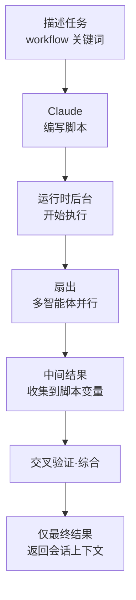

动态工作流 (dynamic workflow) 是 Claude Code 的执行原语 (primitive)：由 Claude 亲自编写的 JavaScript 脚本在后台编排数十至数百个单次对话难以协调的子智能体。


**一句话总结**：如果说子智能体和智能体团队把"计划放在 Claude 的脑子里"，那么动态工作流把"计划搬进脚本代码"，一次性运转大规模扇出。


## 什么是动态工作流

动态工作流是**描述任务后由 Claude 亲自编写的** JavaScript 脚本，运行时在与对话分离的后台执行该脚本。因为循环、分支、中间结果全部由脚本持有，返回会话上下文窗口的只有最终答案。

关键不是单纯"多跑几个智能体"，而是**把计划搬进代码** (moving the plan into code)。由此变得可能的是：

- 独立的智能体们以对抗性 (adversarial) 方式交叉验证彼此的结果后再汇报
- 同一份计划从多个角度同时起草后比较评估
- 产出比单次单趟更可信的结果

> 动态工作流处于研究预览 (research preview) 阶段，需 Claude Code v2.1.154 以上。所有付费套餐均可使用，Pro 套餐需在 `/config` 的 Dynamic workflows 项中开启。

## 三种编排原语的比较

子智能体、技能、工作流都能执行多步骤工作。差别在于**计划握在谁手里**。

| 区分 | 子智能体 | 智能体团队 / 技能 | 工作流 |
|------|-------------|-------------------|-----------|
| 本质 | Claude 创建的工作者 | Claude 遵循的指令 | 运行时执行的脚本 |
| 下一步的决定者 | Claude，按回合 | Claude，按提示词 | 脚本 |
| 中间结果位置 | Claude 上下文窗口 | Claude 上下文窗口 | 脚本变量 |
| 可复用的单元 | 工作者定义 | 指令内容 | 编排本身 |
| 规模 | 每回合少量委派 | 与子智能体相同 | 每次执行数十~数百智能体 |
| 中断时 | 重启回合 | 重启回合 | 可在同一会话内恢复 |

在子智能体与技能中，Claude 作为编排器每回合决定生成什么，所有结果都进入 Claude 的上下文。而工作流脚本自持逻辑，Claude 的上下文只接收最终答案。

## 何时使用

当需要的智能体数量**超过一次对话所能协调的量**，或想把编排本身**代码化**为可阅读、可重跑的脚本时，选择工作流。

| 用途 | 说明 |
|------|------|
| 大型代码库全量扫描 | 例：检查 `src/routes/` 下所有 API 端点是否缺失认证 |
| 大规模迁移 | 例：对 500 个文件做相互独立的转换迁移 |
| 交叉验证调研 | 需要多个来源相互对照的调研问题 |
| 多角度计划草案 | 提交前从多个独立视角为一个难题起草计划 |

反之，**不该使用**的情形也很明确。

- 一次对话就能协调的少量任务 → 直接使用子智能体
- 每步都需用户批准的交互式工作 → 工作流在执行中收不到输入
- 单文件日常编辑 → 直接执行

## 工作方式

工作流运行时在与对话**分离的隔离环境** (isolated environment) 中执行脚本。中间结果停留在脚本变量而非 Claude 的上下文。运行时追踪各智能体的结果，因此可在同一会话内恢复。


```mermaid
flowchart TD
    A[描述任务<br>workflow 关键词] --> B[Claude<br>编写脚本]
    B --> C[运行时后台<br>开始执行]
    C --> D[扇出<br>多智能体并行]
    D --> E[中间结果<br>收集到脚本变量]
    E --> F[交叉验证·综合]
    F --> G[仅最终结果<br>返回会话上下文]
```

执行 `/deep-research` 这类捆绑工作流，或在提示词任意位置放入 `workflow` 一词，Claude 就会为该任务编写脚本。满意的执行结果可在 `/workflows` 界面按 `s` 键保存为 `/<名称>` 命令复用。

```text
# 把一项任务作为工作流执行
Run a workflow to audit every API endpoint under src/routes/ for missing auth checks
```

## 约束与局限

运行时施加以下约束。

| 约束 | 原因 |
|------|------|
| 执行中不可接收用户输入 | 只有智能体权限提示能暂停执行。需分步批准时把每一步做成独立工作流 |
| 工作流自身不可直接访问文件系统·shell | 读·写·命令执行由智能体完成，脚本只负责协调 |
| 并发智能体最多 16 个（CPU 核少则更少） | 限制本地资源占用 |
| 每次执行总计 1,000 个智能体 | 防止无限循环 |

另需了解的行为如下。

- **权限模式** (permission mode)：工作流生成的子智能体无论会话模式如何始终以 `acceptEdits` 运行，文件编辑自动批准。但不在允许列表中的 shell 命令·网页抓取·MCP 工具在执行中可能弹出提示，长任务前最好把所需命令加入 `settings.json` 允许列表。
- **恢复** (resume)：停止后恢复执行时，已结束的智能体返回缓存结果，只有剩余部分实时运行。但仅在同一 Claude Code 会话内有效，会话结束后下个会话须从头开始。
- **成本** (cost)：一次执行可能比用对话处理同一任务消耗多得多的令牌，大规模执行前先确认 `/model` 更稳妥。

### /deep-research 与 ultracode

| 条目 | 说明 |
|------|------|
| `/deep-research <问题>` | 捆绑工作流。多角度扇出网络搜索、交叉验证·投票来源，剔除验证未通过的主张后返回带引用的报告。需要 WebSearch 工具 |
| `/effort ultracode` | `xhigh` 推理强度 + 自动工作流编排的组合。开启后 Claude 对所有实质工作都规划工作流。仅作用于当前会话，新会话重置。用 `/effort high` 回到日常工作 |

### 如何关闭

可用以下任一方式禁用工作流，关闭后捆绑工作流命令、`workflow` 关键词、`/effort` 菜单中的 `ultracode` 都会消失。

```json
{
  "disableWorkflows": true
}
```

- 关闭 `/config` 的 Dynamic workflows 开关（跨会话保持）
- 在 `~/.claude/settings.json` 中设置 `"disableWorkflows": true`
- 设置环境变量 `CLAUDE_CODE_DISABLE_WORKFLOWS=1`
- 组织级用托管设置 (managed settings) 中的 `"disableWorkflows": true` 统一应用

## 与 MoAI-ADK 的关系

MoAI-ADK 把动态工作流认定为区别于 SPEC 驱动 plan/run/sync 生命周期的**第三种编排原语**，并已投入实际流水线 —— sync 阶段的四维质量评估 (sync-audit-4dim) 与 plan 阶段的调研并行扇出 (plan-research-fanout) 都以工作流脚本实现。"把计划搬进脚本代码、把中间结果关在脚本变量里"这一原语性质在代币经济学视角同样迷人：数十个智能体的中间产物完全不占用编排器的上下文。

工作流智能体同样遵守不能直接向用户提问的非对称边界，因此 MoAI 编排器在启动工作流**之前**先收集所有偏好。最佳实践与原语选择指南见下方相关文档。

## 相关文档

- [子智能体](/claude-code/agentic/sub-agents)
- [智能体团队](/claude-code/agentic/agent-teams)

## 参考资料

- [Orchestrate subagents at scale with dynamic workflows（Claude Code 官方文档）](https://code.claude.com/docs/en/workflows)


大多数编码工作真正可并行的部分比调研少。编码类工作的默认值保持为顺序子智能体，把动态工作流省着用在代码库全量扫描·大规模迁移这类真正需要大量并行的任务上。

