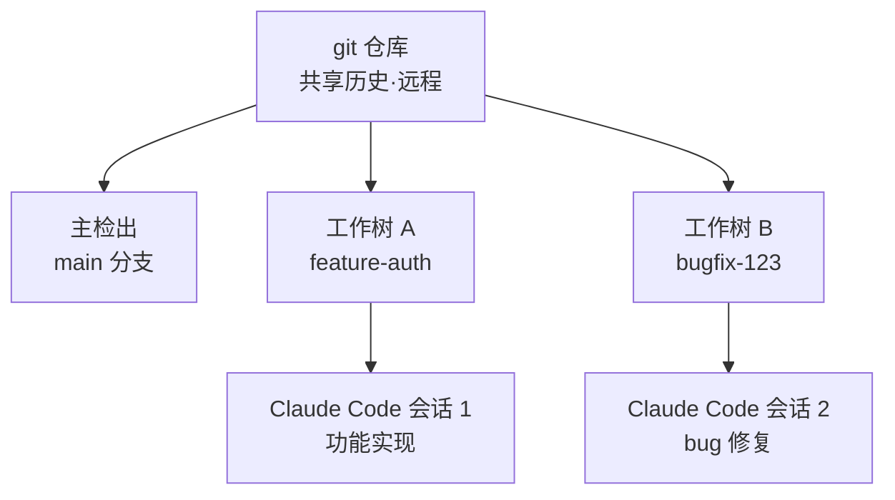

工作树 (worktree) 是从一个 git 仓库中分离出多个工作树的功能，让 Claude Code 的各个会话在不触碰彼此文件的情况下并行工作。


**一句话总结**: 工作树在共享同一个仓库的同时分离了工作目录和分支，从而让你能在一个终端里开发功能、在另一个终端里修复 bug，并行作业且互不冲突。



本页仅起到概览 Claude Code 工作树概念的桥梁作用。关于在 MoAI-ADK 中将工作树实际应用于 SPEC 粒度并行开发的详细方法，请参阅 [Git Worktree 概览](/worktree)、[Git Worktree 完全指南](/worktree/guide)、[Git Worktree 实际使用示例](/worktree/examples)。


## 什么是工作树

git 工作树是一个 **独立的工作目录** (separate working directory)，它拥有自己的文件和分支，同时与主检出共享相同的仓库历史和远程。也就是说，无需整体克隆仓库，你就能额外获得一个独立的工作空间。

| 项目 | 主检出 | 额外工作树 |
|------|--------|-----------|
| 工作目录 | 1 个 | 独立目录 |
| 分支 | 当前分支 | 独立分支 |
| 仓库历史 | 共享 | 共享 |
| 远程 (remote) | 共享 | 共享 |
| 文件编辑隔离 | 基准 | 完全隔离 |

关键在于 **共享与隔离的分离**。历史和远程在同一处统一管理，而文件编辑则按工作树完全分开。

## 并行作业与隔离

让每个 Claude Code 会话在各自的工作树中运行后，一个会话的编辑绝不会触及另一个会话的文件。因此以下这类同时作业变得安全：

- 在终端 A 实现认证功能，同时在终端 B 修复一个无关的 bug
- 同时推进不同分支，而构建/测试不会相互混淆
- 即使一侧的实验失败，另一侧的工作树也不受影响



工作树是在 Claude Code 中并行工作的多种方式之一。如果说工作树 **隔离文件编辑** (isolate file edits)，那么子代理和代理团队则 **协调工作本身** (coordinate the work)。两者可以配合使用，因此你也可以配置子代理，让它们各自在自己的工作树中执行并行编辑。

## Claude Code 中的集成概览

Claude Code 直接负责工作树的创建与清理。在概念层面只点出关键流程，如下所示。

### 在工作树中启动

传入 `--worktree` (或 `-w`) 标志会创建一个隔离的工作树，并在其中启动 Claude。默认在仓库根目录的 `.claude/worktrees/<名称>/` 下创建，并生成一个形如 `worktree-<名称>` 的新分支。

```bash
# 指定名称创建工作树
claude --worktree feature-auth

# 在另一个终端中创建第二个隔离会话
claude --worktree bugfix-123
```

省略名称时，Claude 会自动生成形如 `bright-running-fox` 的名称。会话过程中如果请求“在工作树中工作”，也可以用 `EnterWorktree` tool 来创建工作树。

> 在某个目录中首次使用 `--worktree` 之前，必须先在该目录中运行一次 `claude`，并接受工作区信任 (workspace trust) 对话框。

### 基准分支与忽略文件的复制

| 项目 | 行为 | 备注 |
|------|------|------|
| 基准分支 | 默认从 `origin/HEAD` 分出 | 若没有远程则回退到本地 `HEAD` |
| `worktree.baseRef` | 仅允许 `"fresh"` 或 `"head"` | `"head"` 会连未推送的提交一并带入 |
| PR 基准分支 | `claude --worktree "#1234"` | 创建在 `.claude/worktrees/pr-1234` |
| `.worktreeinclude` | 用 gitignore 语法复制忽略文件 | 将 `.env` 等未跟踪的文件自动复制到新树中 |

在 `.gitignore` 中加入 `.claude/worktrees/`，可让工作树的内容不会作为未跟踪文件出现在主检出中。

### 子代理隔离

子代理也可以各自在自己的工作树中运行，以防止并行编辑冲突。在自定义子代理的 frontmatter 中加入 `isolation: worktree`，即可使其始终被隔离。无任何更改即结束的子代理的临时工作树会被自动移除。

### 清理

退出时的清理方式会因是否有更改而不同。

- 若没有提交、更改或未跟踪文件，工作树和分支会被自动移除。
- 若有更改，Claude 会询问是保留还是移除。
- 非交互式 (`-p`) 运行不会被自动清理，因此请用 `git worktree remove` 自行移除。

对于 SVN、Perforce、Mercurial 等非 git 系统，可以用 `WorktreeCreate` / `WorktreeRemove` hook 自行定义创建与清理逻辑。

## 在 MoAI-ADK 中的深度运用

MoAI-ADK 将这套工作树机制广泛运用于 SPEC 粒度的并行开发和多会话隔离。诸如在哪些场景下应当开启工作树、它如何与会话交接配合等实战内容，已整理在下面 MoAI-ADK 专用指南中，因此本页仅作概念介绍，更深入的内容通过链接引导。

## 相关文档

- [Git Worktree 概览](/worktree)
- [Git Worktree 完全指南](/worktree/guide)
- [Git Worktree 实际使用示例](/worktree/examples)

## 参考资料

- [Run parallel sessions with worktrees (Claude Code 官方文档)](https://code.claude.com/docs/en/worktrees)


如果你是首次引入工作树，请先把 `.claude/worktrees/` 加入 `.gitignore`。这样可以保持主检出干净，让你一眼就能看出哪个更改属于哪棵树。

