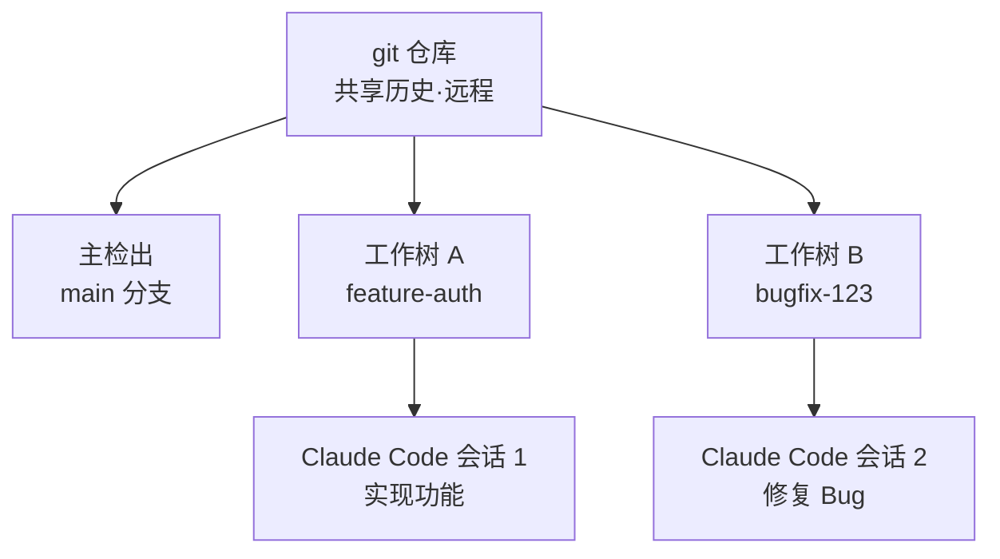

工作树 (worktree) 能在一个 git 仓库里分出多个工作目录，让不同的 Claude Code 会话各改各的文件、互不干扰地并行推进。


**一句话总结**：工作树在共享同一仓库的同时分离工作目录与分支，让一个终端开发功能、另一个终端修 Bug 的并行工作无冲突地成为可能。



本页只充当纵览 Claude Code 工作树概念的桥梁。在 MoAI-ADK 中把工作树实际应用于 SPEC 级并行开发的详细方法，请参考 [Git Worktree 概览](/worktree)、[Git Worktree 完全指南](/worktree/guide)、[Git Worktree 实际使用示例](/worktree/examples)。


## 什么是工作树

git 工作树是**独立的工作目录** (separate working directory)，拥有自己的文件与分支，同时与主检出共享同一份仓库历史与远程。也就是说，无需整仓克隆就多得到一个独立工作空间。

| 区分 | 主检出 | 附加工作树 |
|------|--------------|--------------|
| 工作目录 | 1 个 | 独立目录 |
| 分支 | 当前分支 | 独立分支 |
| 仓库历史 | 共享 | 共享 |
| 远程 (remote) | 共享 | 共享 |
| 文件编辑隔离 | 基准 | 完全隔离 |

核心是**共享与隔离的分离**：历史与远程集中一处共同管理，只有文件编辑按树彻底分开。

## 并行工作与隔离

让每个 Claude Code 会话在自己的工作树中运行，一个会话的编辑就绝不会触及另一个会话的文件。于是以下并行工作变得安全。

- 终端 A 实现认证功能，终端 B 修复另一个 Bug
- 同时推进不同分支，构建/测试互不混杂
- 一边的实验失败也不影响另一边的工作树


```mermaid
flowchart TD
    Repo[git 仓库<br/>共享历史·远程]
    Repo --> Main[主检出<br/>main 分支]
    Repo --> WT1[工作树 A<br/>feature-auth]
    Repo --> WT2[工作树 B<br/>bugfix-123]
    WT1 --> S1[Claude Code 会话 1<br/>实现功能]
    WT2 --> S2[Claude Code 会话 2<br/>修复 Bug]
```

工作树是 Claude Code 多种并行手段之一。工作树负责**隔离文件编辑** (isolate file edits)，而子智能体与智能体团队负责**协调工作本身** (coordinate the work)。两者可以搭配使用，例如让各子智能体在各自的工作树中执行并行编辑。

## 在 Claude Code 中的集成概览

Claude Code 直接处理工作树的创建与清理。在概念层面梳理核心流程如下。

### 从工作树启动

加 `--worktree`（或 `-w`）标志会创建隔离的工作树并在其中启动 Claude。默认在仓库根的 `.claude/worktrees/<名称>/` 下创建，并新建 `worktree-<名称>` 形式的分支。

```bash
# 指定名称创建工作树
claude --worktree feature-auth

# 在另一个终端开第二个隔离会话
claude --worktree bugfix-123

# 让基准分支从本地 HEAD 而非 origin/HEAD 分岔
# （需要在设置中 worktree.baseRef: "head"）
claude --worktree experimental
```

省略名称时 Claude 会自动生成 `bright-running-fox` 这样的名字。会话中途请求"在工作树里工作"，也可以通过 `EnterWorktree` 工具创建工作树。

基准分支默认从 `origin/HEAD` 分岔。若想连未推送的提交一起包含，可用 `worktree.baseRef: "head"` 配置改为从本地 `HEAD` 分岔。

> 在某目录首次使用 `--worktree` 之前，需先在该目录运行一次 `claude` 并接受工作区信任 (workspace trust) 对话框。使用 `-p` 标志可在非交互模式下跳过信任对话框。

### 基准分支与忽略文件复制

| 项目 | 行为 | 备注 |
|------|------|------|
| 基准分支 | 默认从 `origin/HEAD` 分岔 | 可用 `worktree.baseRef: "head"` 配置改为从本地 `HEAD` 分岔 |
| 基于 PR 分岔 | `claude --worktree "#1234"` | 创建到 `.claude/worktrees/pr-1234` 目录 |
| `.worktreeinclude` | 以 gitignore 语法复制被忽略文件 | 把 `.env` 等未被追踪的文件自动复制到新树 |
| 工作区信任 | 首次使用时弹出信任对话框 | 可用 `-p` 标志跳过对话框 |

把 `.claude/worktrees/` 加进 `.gitignore`，工作树内容就不会在主检出中显示为未追踪文件。

### 子智能体隔离

子智能体也可以各自在工作树中运行，避免并行编辑冲突。在自定义子智能体定义的 frontmatter 中加上 `isolation: worktree`，它就始终在工作树中执行。

无变更结束的子智能体的临时工作树会被自动移除。提示词变化时，之前的工作树也会被清理。

### 清理

工作树清理遵循以下标准。

- **干净状态**（无提交·变更·未追踪文件）：工作树与分支自动移除。
- **有变更**：Claude 会询问保留还是移除。
- **提示词变化**：之前创建的临时工作树自动移除。
- **非交互执行**（`-p`）：不自动清理，需用 `git worktree remove` 手动移除。
- **用 `--worktree` 标志创建的工作树**：不会被 `git worktree prune` 之类的工具自动清扫。

把 `.claude/worktrees/` 加进 `.gitignore` 后，工作树目录本身不会显示为未追踪文件，主检出保持干净。

## 在 MoAI-ADK 中的深度运用

MoAI-ADK 把这套工作树机制广泛用于 SPEC 级并行开发与多会话隔离（`/moai plan --worktree`、`moai worktree` CLI）。要同时运转多个智能体循环，各循环的文件编辑必须互不污染，工作树恰好提供这份隔离 —— 可谓循环并行化的物理前提。何时应开启工作树、它与会话交接如何衔接等实战内容整理在下方 MoAI-ADK 专属指南中，本页止于概念介绍，深入内容以链接引导。

## 相关文档

- [Git Worktree 概览](/worktree)
- [Git Worktree 完全指南](/worktree/guide)
- [Git Worktree 实际使用示例](/worktree/examples)

## 参考资料

- [Worktrees — Claude Code 官方文档](https://code.claude.com/docs/en/worktrees)


初次引入工作树时，请先把 `.claude/worktrees/` 加进 `.gitignore`。主检出保持干净，哪些变更属于哪棵树一目了然。

